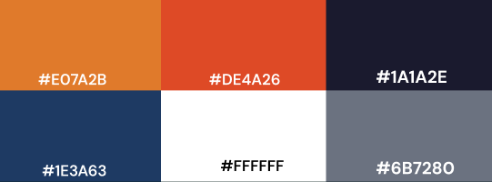
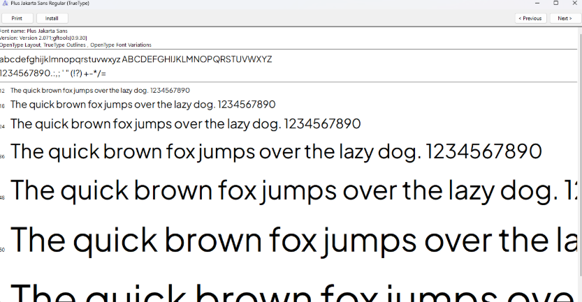
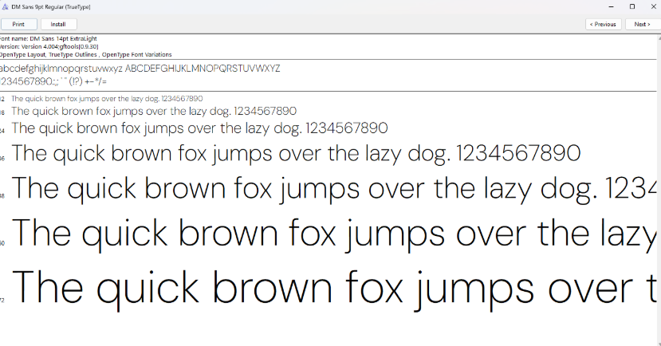
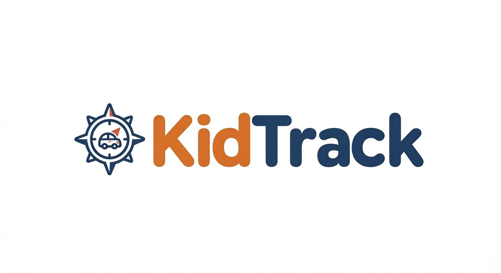
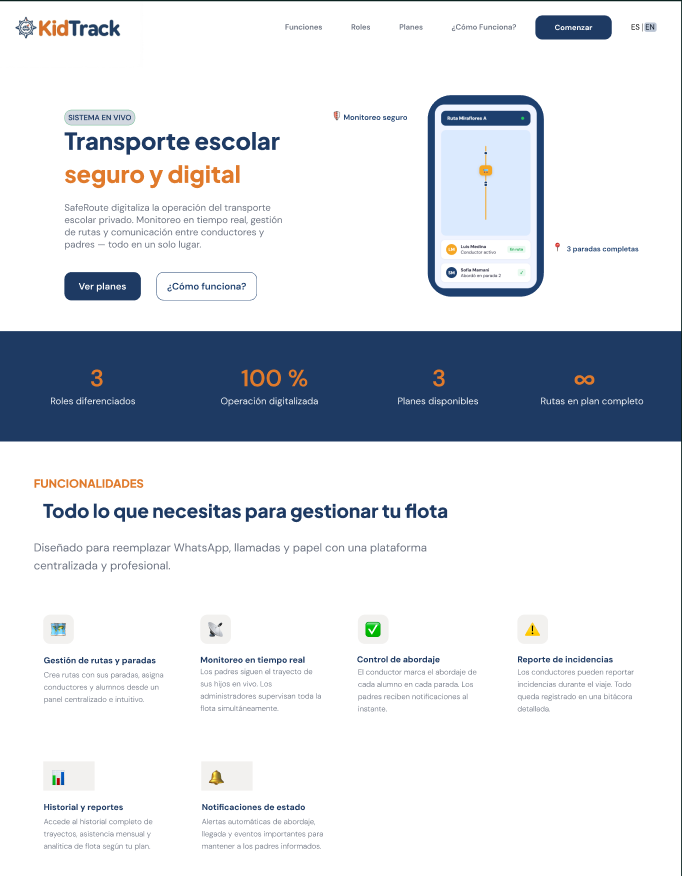
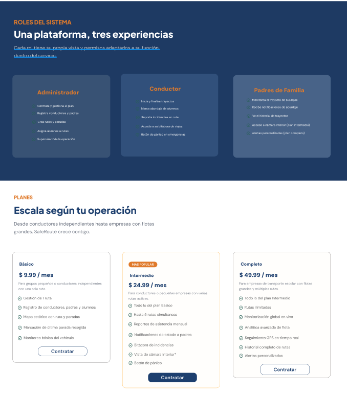
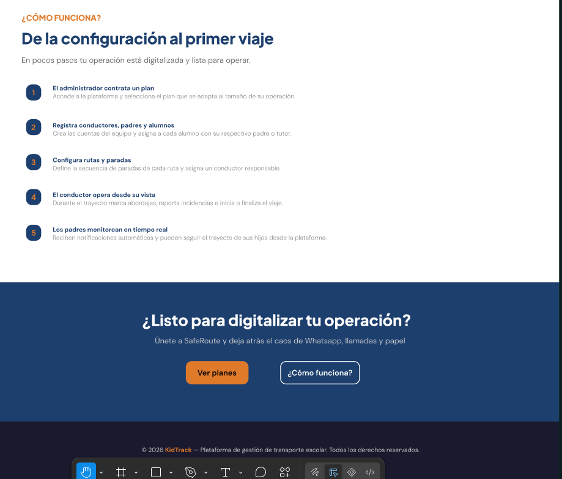

 
Universidad Peruana de Ciencias Aplicadas
 
Facultad de Ingeniería
 
Carrera de Ingeniería de Software
 

**1ASI0729**
 
**Desarrollo de Aplicaciones Open Source**
 
NRC
 
**7800**
 
**Informe de Trabajo Final**
 
Docente
 
**Robles Fernandez, Ivan**
 
Equipo
 
**StackForge**

 

Proyecto
 
**KidTrack**

     

**Integrantes**

<table border="0" style="border-collapse: collapse; border: none; margin: 0 auto;">

 <tr style="border: none;">
    <td style="border: none; text-align: center; padding: 5px 15px;">codigo</td>
    <td style="border: none; text-align: left; padding: 5px 15px;">nombre</td>
  </tr>
<tr style="border: none;">
    <td style="border: none; text-align: center; padding: 5px 15px;">U202424059</td>
    <td style="border: none; text-align: left; padding: 5px 15px;">De la Cruz De los Santos, Mathias Marcelo</td>
  </tr>  
<tr style="border: none;">
    <td style="border: none; text-align: center; padding: 5px 15px;">U202415551</td>
    <td style="border: none; text-align: left; padding: 5px 15px;">Ramirez Ruiz, Nickolas</td>
  </tr>
    <tr style="border: none;">
    <td style="border: none; text-align: center; padding: 5px 15px;"> codigo </td>
    <td style="border: none; text-align: left; padding: 5px 15px;">nombre</td>
  </tr>
  <tr style="border: none;">
    <td style="border: none; text-align: center; padding: 5px 15px;">U20221A390</td>
    <td style="border: none; text-align: left; padding: 5px 15px;">Su Caletti Eddo</td>
  </tr>
 
 
</table>

            

**Período 202620**
 

**Setiembre, 2026**
       

---

## Registro de Versiones del Informe

## Project Report Collaboration Insights

### Sprint 1
### Sprint 2
### Sprint 3
### Sprint 4

## Tabla de contenidos

- [Registro de Versiones del Informe](#registro-de-versiones-del-informe)
- [Project Report Collaboration Insights](#project-report-collaboration-insights)
    - [Sprint 1](#sprint-1)
    - [Sprint 2](#sprint-2)
    - [Sprint 3](#sprint-3)
    - [Sprint 4](#sprint-4)
- [Student Outcome](#student-outcome)
- [Capítulo I: Introducción](#capítulo-i-introducción)
    - [1.1. Startup Profile](#11-startup-profile)
        - [1.1.1. Descripción de la Startup](#111-descripción-de-la-startup)
        - [1.1.2. Perfiles de integrantes del equipo](#112-perfiles-de-integrantes-del-equipo)
    - [1.2. Solution Profile](#12-solution-profile)
        - [1.2.1 Antecedentes y problemática](#121-antecedentes-y-problemática)
        - [1.2.2 Lean UX Process](#122-lean-ux-process)
            - [1.2.2.1. Lean UX Problem Statements](#1221-lean-ux-problem-statements)
            - [1.2.2.2. Lean UX Assumptions](#1222-lean-ux-assumptions)
            - [1.2.2.3. Lean UX Hypothesis Statements](#1223-lean-ux-hypothesis-statements)
            - [1.2.2.4. Lean UX Canvas](#1224-lean-ux-canvas)
    - [1.3. Segmentos objetivo](#13-segmentos-objetivo)
- [Capítulo II: Requirements Elicitation & Analysis](#capítulo-ii-requirements-elicitation--analysis)
    - [2.1. Competidores](#21-competidores)
        - [Identificación de Competidores](#identificación-de-competidores)
            - [Life360](#life360)
            - [Find My Kids](#find-my-kids)
            - [OnTrack School](#ontrack-school)
        - [2.1.1 Análisis Competitivo - Landscape](#211-análisis-competitivo---landscape)
        - [2.1.2 Estrategias y tácticas frente a competidores](#212-estrategias-y-tácticas-frente-a-competidores)
    - [2.2. Entrevistas](#22-entrevistas)
        - [2.2.1. Diseño de entrevistas](#221-diseño-de-entrevistas)
        - [2.2.2. Registro de entrevistas](#222-registro-de-entrevistas)
        - [2.2.3. Análisis de entrevistas](#223-análisis-de-entrevistas)
    - [2.3. Needfinding](#23-needfinding)
        - [2.3.1. User Personas](#231-user-personas)
        - [2.3.2. User Task Matrix](#232-user-task-matrix)
        - [2.3.3. User Journey Mapping](#233-user-journey-mapping)
        - [2.3.4. Empathy Mapping](#234-empathy-mapping)
    - [2.4. Big Picture Event Storming](#24-big-picture-event-storming)
    - [2.5. Ubiquitous Language](#25-ubiquitous-language)
- [Capítulo III: Requirements Specification](#capítulo-iii-requirements-specification)
    - [3.1. User Stories](#31-user-stories)
    - [3.2. Impact Mapping](#32-impact-mapping)
    - [3.3. Product Backlog](#33-product-backlog)
- [Capítulo IV: Product Design](#capítulo-iv-product-design)
    - [4.1. Style Guidelines](#41-style-guidelines)
        - [4.1.1. General Style Guidelines](#411-general-style-guidelines)
            - [Colores](#colores)
            - [Tipografía](#tipografía)
            - [Branding](#branding)
            - [Espaciado](#espaciado)
            - [Dimensiones para el tono de comunicación y lenguaje aplicado](#dimensiones-para-el-tono-de-comunicación-y-lenguaje-aplicado)
            - [Elementos de diseño](#elementos-de-diseño)
            - [Principios de diseño](#principios-de-diseño)
        - [4.1.2. Web Style Guidelines](#412-web-style-guidelines)
    - [4.2. Information Architecture](#42-information-architecture)
        - [4.2.1. Organization Systems](#421-organization-systems)
        - [4.2.2. Labeling Systems](#422-labeling-systems)
        - [4.2.3. SEO Tags and Meta Tags](#423-seo-tags-and-meta-tags)
        - [4.2.4. Searching Systems](#424-searching-systems)
        - [4.2.5. Navigation Systems](#425-navigation-systems)
    - [4.3. Landing Page UI Design](#43-landing-page-ui-design)
        - [4.3.1. Landing Page Wireframe](#431-landing-page-wireframe)
        - [4.3.2. Landing Page Mock-up](#432-landing-page-mock-up)
    - [4.4. Web Applications UX/UI Design](#44-web-applications-uxui-design)
        - [4.4.1. Web Applications Wireframes](#441-web-applications-wireframes)
        - [4.4.2. Web Applications Wireflow Diagrams](#442-web-applications-wireflow-diagrams)
        - [4.4.3. Web Applications Mock-ups](#443-web-applications-mock-ups)
        - [4.4.4. Web Applications User Flow Diagrams](#444-web-applications-user-flow-diagrams)
    - [4.5. Web Applications Prototyping](#45-web-applications-prototyping)
    - [4.6. Domain-Driven Software Architecture](#46-domain-driven-software-architecture)
        - [4.6.1. Design-Level Event Storming](#461-design-level-event-storming)
        - [4.6.2. Software Architecture Context Diagram](#462-software-architecture-context-diagram)
        - [4.6.3. Software Architecture Container Diagrams](#463-software-architecture-container-diagrams)
        - [4.6.4. Software Architecture Components Diagrams](#464-software-architecture-components-diagrams)
    - [4.7. Software Object-Oriented Design](#47-software-object-oriented-design)
        - [4.7.1. Class Diagrams](#471-class-diagrams)
    - [4.8. Database Design](#48-database-design)
        - [4.8.1. Database Diagrams](#481-database-diagrams)
- [Capítulo V: Product Implementation, Validation & Deployment](#capítulo-v-product-implementation-validation--deployment)
    - [5.1. Software Configuration Management](#51-software-configuration-management)
        - [5.1.1. Software Development Environment Configuration](#511-software-development-environment-configuration)
        - [5.1.2. Source Code Management](#512-source-code-management)
        - [5.1.3. Source Code Style Guide & Conventions](#513-source-code-style-guide--conventions)
        - [5.1.4. Software Deployment Configuration](#514-software-deployment-configuration)
    - [5.2. Landing Page, Services & Applications Implementation](#52-landing-page-services--applications-implementation)
        - [5.2.1. Sprint 1](#521-sprint-1)
        - [5.2.2. Sprint 2](#522-sprint-2)
        - [5.2.3. Sprint 3](#523-sprint-3)
        - [5.2.4. Sprint 4](#sprint--4)
    - [5.3. Validation Interviews](#53-validation-interviews)
        - [5.3.1. Diseño de Entrevistas](#531-diseño-de-entrevistas)
        - [5.3.2. Registro de Entrevistas](#532-registro-de-entrevistas)
        - [5.3.3. Evaluaciones según heurísticas](#533-evaluaciones-segun-heuristicas)
    - [5.4 Video About-the-Product](#54-video-about-the-product)
- [Conclusiones](#conclusiones)
- [Recomendaciones](#recomendaciones)
- [Video About-the-Team](#video-about-the-team)
- [Bibliografía](#bibliografía)
- [Anexos](#anexos)

---
## Student Outcome

## Capítulo I: Introducción

### 1.1. Startup Profile
#### 1.1.1. Descripción de la Startup
StackForge es una startup tecnológica formada por estudiantes de Ingeniería de Software de la Universidad Peruana de Ciencias Aplicadas (UPC),
enfocada en crear soluciones digitales para problemas reales en sectores con poca presencia tecnológica,
y nace de la convicción de que la seguridad de los niños en su traslado escolar no debería depender de llamadas,
mensajes de WhatsApp o anotaciones en papel, por lo que su propuesta de valor se materializa en KidTrack,
una plataforma web de movilidad institucional inteligente que digitaliza y optimiza la gestión del transporte escolar,
permitiendo a cualquier organización del rubro ya sea un grupo de padres que comparte una movilidad,
un conductor independiente o una pequeña empresa centralizar en un solo lugar la administración de sus rutas, conductores, alumnos y comunicación.
#### 1.1.2. Perfiles de integrantes del equipo

|                   Foto                    | Apellidos y Nombres    |    Código    | Carrera                | Resumen                                                                                                                                                                                                                                                                                                                                                                                 |
|:-----------------------------------------:|:-----------------------|:------------:| :--------------------- |:----------------------------------------------------------------------------------------------------------------------------------------------------------------------------------------------------------------------------------------------------------------------------------------------------------------------------------------------------------------------------------------|
|         | nombre el integrante   | [codigo] | Ingeniería de Software | descripcion                                                                                                                                                                                                                                                                                                                                                                             |
|        | Eddo Su Caletti  | [U20221A390] | Ingeniería de Software | Soy Eddo Su Caletti, tengo 22 años y soy estudiante de la carrera de Ingeniería de Software. A lo largo de mi formación he desarrollado un gran interés por la tecnología y la programación. Me considero una persona organizada y dedicada, apasionada por la fotografía y por disfrutar de momentos de calidad en familia.                                    |
|  | Ramirez Ruiz, Nickolas | [U202415551] | Ingeniería de Software | Soy Nickolas Ramirez Ruiz, estudiante del sexto ciclo de la carrera de Ingeniería de Software. A lo largo de mi formación académica he adquirido conocimientos en programación, principalmente utilizando el lenguaje Java. Me considero una persona organizada, comprometida y con un enfoque proactivo, siempre buscando cumplir con mis responsabilidades antes del tiempo previsto. |
|                | nombre el integrante   |   [codigo]   | Ingeniería de Software | descripcion                                                                                                                                                                                                                                                                                                                                                                             |
|    | nombre el integrante   | [codigo] | Ingeniería de Software | descripcion                                                                                      |

### 1.2. Solution Profile

#### 1.2.1 Antecedentes y problemática

Who (¿Quiénes son los afectados?)
Existen dos grupos claramente afectados por esta problemática. Por un lado, los padres o apoderados de niños en edad inicial, kínder y primaria que contratan un servicio de transporte escolar privado, pero que no tienen forma de saber en tiempo real cómo va el traslado de sus hijos. Por otro lado, están los conductores ya sea independientes o vinculados a pequeñas empresas del rubro que deben coordinar rutas y alumnos sin contar con ninguna herramienta digital de apoyo.

What (¿Cuál es el problema?)
En el Perú, el transporte escolar privado sigue operando de manera mayormente artesanal, sin ningún tipo de respaldo tecnológico. Padres y conductores se comunican a través de medios informales como llamadas o grupos de WhatsApp, lo que trae consigo desorden, información que se pierde y una sensación permanente de duda en los padres sobre si sus hijos están realmente seguros. A esto se suma que los conductores y quienes administran el servicio no cuentan con ningún sistema para registrar asistencia, organizar rutas, dejar constancia de incidencias o mantener un historial de cada recorrido.

Where (¿Dónde ocurre?)
Este problema se concentra sobre todo en las zonas urbanas de Lima Metropolitana, donde el transporte escolar privado tiene alta demanda pero opera de forma dispersa y muchas veces informal. Aun así, la misma situación puede replicarse en cualquier otra ciudad peruana que tenga muchos colegios privados sin flota vehicular propia.

When (¿Cuándo ocurre?)
El problema se repite todos los días durante los horarios de ingreso y salida del colegio, generalmente entre las 6:00 a.m. y 8:30 a.m., y luego entre las 12:30 p.m. y 5:00 p.m. Justamente en esas franjas horarias es cuando más se nota la falta de información en tiempo real, lo que eleva la ansiedad de los padres y la presión sobre los conductores.

Why (¿Por qué es un problema?)
No contar con digitalización trae consecuencias concretas: los padres no tienen certeza de si su hijo subió al vehículo, si llegó al colegio o si algo ocurrió durante el camino. Los conductores, por su parte, incurren en errores como saltarse paradas u olvidar recoger a algún alumno, y no tienen un canal ordenado para avisar retrasos. Además, quienes administran el servicio terminan invirtiendo tiempo valioso en coordinar manualmente tareas que podrían automatizarse, sin tener registros históricos que les permitan optimizar la operación.

How (¿Cómo se manifiesta?)
Esto se traduce en un flujo constante de llamadas y mensajes de los padres hacia el conductor durante el trayecto, listas de alumnos anotadas en papel u hojas de cálculo que nadie más puede consultar, ninguna forma de dejar constancia de incidencias, imposibilidad de comprobar si se respetaron las paradas programadas, y falta total de trazabilidad sobre qué estudiantes efectivamente abordaron el vehículo en cada viaje.

How much (¿Cuál es la magnitud?)
Aunque no existen cifras exactas ni actualizadas que dimensionen con precisión el mercado del transporte escolar privado en el país, algunos indicadores del sector educativo y de transporte ayudan a entender la magnitud del problema.

De acuerdo con el Censo Educativo 2022-2023 elaborado por el Ministerio de Educación (MINEDU, 2023), Lima Metropolitana alberga cerca de 1.9 millones de estudiantes repartidos en aproximadamente 7,602 instituciones educativas, de las cuales el 74% pertenecen al sector privado. Esta fuerte presencia de colegios privados hace que un número considerable de familias dependa de terceros para el traslado escolar, ya que son pocas las instituciones que cuentan con transporte propio.

El panorama se complica aún más si se considera que, según la Autoridad de Transporte Urbano para Lima y Callao (ATU, 2024), el número de movilidades escolares con autorización formal cayó un 25% en tan solo un año lo que apunta a un crecimiento de la informalidad en el sector y, por tanto, a menos mecanismos de supervisión sobre el servicio que reciben los menores.

En cuanto a seguridad, la Superintendencia de Transporte Terrestre de Personas, Carga y Mercancías (SUTRAN, 2024) desarrolló campañas de sensibilización dirigidas a más de 47,000 escolares, lo que confirma que este tema sigue siendo una prioridad para las autoridades competentes. Sin embargo, no hay data pública desagregada sobre incidentes puntuales registrados en este sector entre 2022 y 2025.

**Figura 1** Distribución de estudiantes de nivel Inicial y Primaria matriculados en colegios privados dentro de zonas urbanas del Perú

_Nota._ Elaborado a partir de los datos del Censo Educativo 2022 (p. 12), Ministerio de Educación, 2023.

#### 1.2.2 Lean UX Process

##### 1.2.2.1. Lean UX Problem Statements

En nuestro país, la gran mayoría de servicios de movilidad escolar funciona todavía de manera artesanal: los conductores y las familias se coordinan a través de llamadas, chats de WhatsApp y anotaciones sueltas en cuadernos o papeles. Esta forma de trabajar termina afectando tanto la tranquilidad de los padres como la capacidad operativa de los transportistas, 
comprometiendo la calidad y seguridad del servicio en general.

Al analizar este ecosistema identificamos un punto crítico que lo atraviesa por completo: de un lado,
las familias no tienen ninguna forma de conocer en qué momento del recorrido se encuentra su hijo; 
del otro, los transportistas no cuentan con ningún sistema digital que les permita organizar sus rutas, controlar a los estudiantes o dejar constancia de incidentes de manera ordenada. 
Lo interesante es que ambas carencias están profundamente conectadas: los padres necesitan poder ver el trayecto, pero son justamente los transportistas quienes no tienen las herramientas para ofrecerles esa visibilidad.

Esto nos lleva a plantearnos la siguiente pregunta central: 
¿de qué forma podríamos construir una solución que le dé al transportista escolar el control digital de su operación diaria, y que al mismo tiempo brinde a los padres de familia la tranquilidad de saber, en todo momento, cómo va el traslado de sus hijos?
##### 1.2.2.2. Lean UX Assumptions
Siguiendo lo planteado en la tercera edición de *Lean UX*, los requisitos de un producto no deben asumirse como verdades absolutas, sino tratarse como supuestos que aún necesitan comprobación. Bajo ese principio, en StackForge no limitamos nuestros assumptions únicamente a las categorías clásicas de negocio y usuario, sino que los desglosamos en cinco bloques que se desprenden directamente de la primera parte del Lean UX Canvas, los cuales el equipo debe dejar explícitos antes de pasar a construir hipótesis y validarlas.

**Business Problem Assumptions**

- Suponemos que el servicio de movilidad escolar privada en Lima Metropolitana se maneja en su mayoría a través de llamadas, WhatsApp y anotaciones manuales, lo que trae como consecuencia escasa visibilidad, fallos operativos y desconfianza hacia el servicio.
- Suponemos que no poder rastrear el traslado escolar impacta a la vez a los padres que buscan tranquilidad y a los transportistas, que necesitan mayor orden en su día a día.
- Suponemos que hay una oportunidad comercial clara si KidTrack logra unir la necesidad de seguridad de las familias con la necesidad de digitalización de los transportistas.

**Business Outcome Assumptions**

- Suponemos que KidTrack tendrá viabilidad si los administradores logran completar el registro de toda su operación dentro de los primeros 15 días de uso.
- Suponemos que mantener suscriptores dependerá de que la plataforma demuestre, en la práctica, ahorro de tiempo, menos errores y mayor confianza para las familias.
- Suponemos que contar con planes Básico, Intermedio y Completo nos permitirá atender tanto a pequeños grupos de padres organizados como a empresas de transporte escolar con flotas más grandes.

**User Assumptions**

- Suponemos que nuestros usuarios principales son, por un lado, padres con hijos en el nivel inicial y primaria que ya contratan transporte escolar privado, y por otro, transportistas independientes o dueños de pequeñas empresas del rubro.
- Suponemos que cualquiera de estos dos perfiles puede convertirse en Administrador cuando necesite registrar usuarios, conductores, hijos, rutas o asignaciones dentro del sistema.
- Suponemos que los padres accederán a KidTrack principalmente en los horarios de entrada y salida del colegio, mientras que los transportistas la usarán durante toda su jornada de trabajo.

**User Outcome and Benefit Assumptions**

- Suponemos que lo que buscan los padres es disminuir la incertidumbre durante el traslado sin tener que estar llamando o escribiéndole constantemente al conductor.
- Suponemos que los transportistas buscan aligerar la carga de coordinación manual, evitar errores al momento de recoger alumnos y transmitir una imagen más profesional frente a las familias.
- Suponemos que los administradores buscan tener toda la operación centralizada en un solo lugar, dejando atrás el uso de herramientas dispersas.

**Solution Assumptions**

- Suponemos que un panel donde se administren usuarios, hijos, conductores y rutas ayudará a poner en orden la operación del transporte escolar.
- Suponemos que funciones como el checklist de abordaje, la visualización de paradas, el historial de viajes y el reporte de incidencias son indispensables para generar valor desde el primer lanzamiento del MVP.
- Suponemos que el rastreo GPS en tiempo real y futuras integraciones con IoT pueden ser el diferencial de los planes más avanzados, una vez que los usuarios ya perciban el valor de la solución base.
- Suponemos que la interfaz debe sentirse limpia, ágil, accesible, disponible en dos idiomas y fácil de entender, sin importar el nivel de familiaridad tecnológica de quien la use.
##### 1.2.2.3. Lean UX Hypothesis Statements
Hipótesis 1: "Creemos que los padres de familia lograrán sentir menos incertidumbre durante el traslado escolar gracias a una vista donde puedan ver el estado del trayecto, el registro de abordaje de cada alumno y la ubicación de las paradas.
Sabremos que esto se cumple cuando, durante las primeras 4 semanas de uso, al menos el 70% de los padres activos revise el estado del trayecto como mínimo una vez al día."

Hipótesis 2: "Creemos que los transportistas podrán operar sus rutas con menos errores y menor carga de trabajo gracias a una interfaz sencilla que les permita marcar abordajes, dar seguimiento a las paradas y reportar incidencias durante el viaje.
Sabremos que esto se cumple cuando, durante las primeras 4 semanas de operación, el 80% de los trayectos registrados tenga el checklist de abordaje completado."

Hipótesis 3: "Creemos que los administradores podrán centralizar la gestión de su servicio a través de un panel único donde registren usuarios, conductores, hijos, asignaciones y rutas.
Sabremos que esto se cumple cuando, dentro de los primeros 15 días tras el onboarding, al menos el 75% de los administradores haya registrado la totalidad de sus usuarios y rutas."

Hipótesis 4: "Creemos que los administradores subirán de nivel de suscripción al notar que las funciones de los planes superiores reducen de forma notable el tiempo que dedican a coordinar el servicio.
Sabremos que esto se cumple cuando, dentro de los primeros 3 meses de uso, al menos el 20% de los administradores en planes Básico o Intermedio migre a un plan superior."
##### 1.2.2.4. Lean UX Canvas
| Sección | Contenido                                                                                                                                                                                                                                                                                                                                                                                                                                                                                                                                                              |
| :--- |:-----------------------------------------------------------------------------------------------------------------------------------------------------------------------------------------------------------------------------------------------------------------------------------------------------------------------------------------------------------------------------------------------------------------------------------------------------------------------------------------------------------------------------------------------------------------------|
| 1. Business Problem | En el Perú, el transporte escolar privado sigue funcionando de forma tradicional y sin ningún apoyo tecnológico. Los padres no tienen manera de saber cómo va el trayecto de sus hijos, y los transportistas organizan su operación a través de llamadas, WhatsApp y hojas sueltas, lo que se traduce en errores, poca eficiencia y un servicio que no genera confianza.                                                                                                                                                                                               |
| 2. Business Outcomes | Que el 75% de los administradores complete el registro de su operación dentro de los primeros 15 días. Retener al 80% de los suscriptores activos durante los primeros 3 meses. Alcanzar un 20% de upgrade del plan Básico al Intermedio dentro de los primeros 3 meses de uso.                                                                                                                                                                                                                                                                                        |
| 3. Users | Los segmentos que usan KidTrack son, por un lado, los padres de familia con hijos en nivel inicial y primaria que ya cuentan con un servicio de transporte escolar contratado, y por otro, los transportistas escolares conductores independientes o responsables de pequeñas empresas que operan dicho servicio. Cualquiera de ambos perfiles puede además tomar el rol de Administrador dentro de la plataforma.                                                                                                                                                    |
| 4. User Outcomes & Benefits | Los padres buscan bajar su nivel de incertidumbre respecto al trayecto de sus hijos, pudiendo revisar el estado del viaje sin necesidad de contactar al conductor. Los transportistas buscan digitalizar la gestión de rutas, alumnos e incidencias, disminuyendo errores operativos y transmitiendo una imagen más profesional ante las familias. Quienes cumplen el rol de administrador buscan reunir toda la operación en un solo panel, dejando atrás la coordinación manual y el uso de herramientas dispersas.                                                  |
| 5. Solution Ideas | Un panel de administración para usuarios, conductores, hijos y rutas. Un checklist digital de abordaje que completa el conductor. Una vista de paradas y estado del trayecto pensada para los padres. Registro de incidencias por cada ruta. Historial de trayectos organizado por comunidad de ruta. Seguimiento GPS en tiempo real (disponible en el plan Completo). Posibilidad de integrar sensores IoT más adelante.                                                                                                                                              |
| 6. Hypotheses | Durante las primeras 4 semanas, el 70% de los padres revisa el estado del trayecto al menos una vez al día. Durante las primeras 4 semanas, el 80% de los trayectos registrados tiene el checklist de abordaje completo gracias a una interfaz operativa simple. Dentro de los primeros 15 días, el 75% de los administradores completa el registro de su operación usando el panel único de gestión. Dentro de los primeros 3 meses, el 20% de los administradores en planes Básico o Intermedio hace upgrade al notar el valor de las funciones superiores. |
| 7. What's the most important thing we need to learn first? | ¿Realmente el administrador del servicio percibe en KidTrack un valor lo bastante grande como para dejar de lado sus métodos informales actuales y pagar una suscripción mensual?                                                                                                                                                                                                                                                                                                                                                                                      |
| 8. What's the least amount of work we need to do to learn the next most important thing? | Entrevistar entre 3 y 5 administradores de servicios de transporte escolar (ya sea padres representantes o transportistas independientes) para conocer qué tan dispuestos están al cambio y qué funciones consideran indispensables antes de construir el MVP.                                                                                                                                                                                                                                                                                                         |
### 1.3. Segmentos objetivo
KidTrack está pensado para dos segmentos que forman parte del ecosistema del transporte escolar privado en Lima Metropolitana.

- **Segmento 1: Padres de Familia**

  Este primer segmento agrupa a padres o apoderados con hijos en el nivel inicial o primaria que ya cuentan con un servicio de transporte escolar privado contratado. Son personas que han puesto en manos de un tercero el traslado de sus hijos, pero que durante el recorrido no reciben ningún tipo de información organizada sobre cómo va el viaje. No se trata de un segmento definido por un nivel socioeconómico particular, sino por dos condiciones puntuales: tener hijos en edad escolar que usan transporte privado y contar con acceso a internet desde algún dispositivo con navegador. Lo que principalmente los motiva a usar KidTrack es poder reducir esa sensación de no saber si su hijo abordó con seguridad, en qué punto del trayecto se encuentra o si pasó algo fuera de lo normal durante el viaje. Para tener una idea del tamaño de este segmento, el Censo Educativo 2022-2023 señala que Lima Metropolitana cuenta con cerca de 1.9 millones de estudiantes repartidos en aproximadamente 7,602 instituciones educativas, de las cuales el 74% pertenece al sector privado (Ministerio de Educación, 2023). Esa alta cantidad de colegios privados hace que buena parte de las familias limeñas termine dependiendo de servicios externos de transporte, ya que son pocas las instituciones que tienen flota propia.

- **Segmento 2: Transportistas Escolares**

  El segundo segmento reúne a las personas o entidades responsables de operar el servicio de transporte escolar privado, y dentro de él conviven tres perfiles distintos. Está, en primer lugar, el conductor independiente que ofrece el servicio por su cuenta. Luego está el conductor contratado para manejar una movilidad organizada entre varias familias. Y finalmente, los responsables de pequeñas empresas de transporte escolar que administran una flota de vehículos y conductores a su cargo. Aunque son perfiles diferentes entre sí, comparten un mismo problema de fondo: todos trabajan sin herramientas digitales especializadas y recurren a métodos manuales e informales para gestionar una actividad que compromete directamente la seguridad de menores de edad. La importancia de este segmento queda reflejada en que las movilidades escolares autorizadas en Lima cayeron un 25% en apenas un año, lo cual apunta a un aumento de la informalidad en el sector y, con ella, a menos mecanismos de control sobre el servicio que reciben los niños (Autoridad de Transporte Urbano para Lima y Callao, 2024). A esto se suma que, en 2024, la Superintendencia de Transporte Terrestre de Personas, Carga y Mercancías realizó campañas de sensibilización dirigidas a más de 47,000 escolares, lo que reafirma que la seguridad en este rubro sigue siendo un tema que preocupa a las autoridades (SUTRAN, 2024). Por todo esto, lo que impulsa a este segmento a usar KidTrack es principalmente digitalizar y profesionalizar su forma de trabajar, reducir errores en la gestión de rutas y alumnos, y ofrecer a las familias que atienden un servicio más confiable y transparente.

---
## Capítulo II: Requirements Elicitation & Analysis

### 2.1. Competidores
#### Identificación de Competidores
#### 2.1.1 Análisis Competitivo - Landscape
#### 2.1.2 Estrategias y tácticas frente a competidores

### 2.2. Entrevistas
#### 2.2.1. Diseño de entrevistas
#### 2.2.2. Registro de entrevistas
#### 2.2.3. Análisis de entrevistas

### 2.3. Needfinding
#### 2.3.1. User Personas
En esta sección se presentan los arquetipos de usuario diseñados para representar los segmentos objetivo de **KidTrack**: el conductor de transporte escolar independiente y el padre de familia/apoderado.

La elaboración de estas fichas es el resultado de una síntesis detallada entre el análisis de la competencia y el proceso de Needfinding. Se han identificado características críticas como la alta dependencia de herramientas informales (como grupos de WhatsApp y llamadas telefónicas durante la conducción), la ansiedad generada en los padres por la incertidumbre del tráfico en Lima y la necesidad operativa de profesionalizar y digitalizar un sector mayoritariamente no estructurado.

#### Persona 1: Drivers

---
#### Persona 2: Parents

#### 2.3.2. User Task Matrix
En esta sección se presenta la matriz de tareas de usuario, la cual consolida las actividades fundamentales que tanto el conductor (Arturo Núñez) como el padre de familia (Fernando Nery) ejecutan para asegurar un traslado escolar exitoso.

Es importante destacar que estas tareas representan necesidades y procesos intrínsecos del servicio que existen independientemente de la presencia de una solución de software; el objetivo de **KidTrack** es optimizar y digitalizar estas interacciones para reducir la carga operativa, las distracciones al volante y la incertidumbre.

| Tarea (*User Task*) | Conductor - Frecuencia | Conductor - Importancia | Padre - Frecuencia | Padre - Importancia |
| :--- | :---: | :---: | :---: | :---: |
| Verificar lista de asistencia de alumnos | Alta | Alta | N/A | N/A |
| Identificar alumnos en el punto de recojo | Alta | Alta | N/A | N/A |
| Confirmar el abordaje seguro del alumno | Alta | Crítica | Alta | Crítica |
| Gestionar comunicación entre conductores y padres | Alta | Alta | Alta | Alta |
| Notificar retrasos o imprevistos en la ruta | Media | Alta | Alta | Crítica |
| Monitorear el progreso del trayecto | Media | Media | Alta | Alta |
| Confirmar llegada al destino final | Alta | Crítica | Alta | Crítica |
| Registrar la entrega del alumno al responsable | Alta | Crítica | Alta | Crítica |
| Coordinar cambios de último momento en el servicio | Baja | Media | Baja | Alta |
| Reportar incidencias de seguridad o salud | Baja | Crítica | Baja | Crítica |
| Consultar el estado actual del servicio | Media | Media | Alta | Alta |
| Revisar historial de trayectos realizados | Baja | Media | Media | Media |
| Organizar y optimizar rutas y paradas | Alta | Alta | N/A | N/A |

---

#### Análisis y Explicación de la Matriz

Tras el análisis de la matriz, se desprenden las siguientes conclusiones clave sobre el comportamiento y necesidades de los segmentos:

* **Coincidencias en Tareas Críticas:** Existe una convergencia total en las tareas de *"Confirmar abordaje"*, *"Confirmar llegada"* y *"Registrar entrega"*. Para ambos segmentos, estas acciones representan la columna vertebral de la confianza en el servicio, manteniendo una importancia **Crítica** debido a que involucran directamente la seguridad e integridad del menor.
* **Diferencias de Rol:** La carga operativa de planificación y ejecución (verificación de listas y organización de rutas) recae exclusivamente en el conductor. Por el contrario, el padre de familia se enfoca en tareas de supervisión pasiva como *"Monitorear el progreso"*, la cual mantiene una frecuencia alta debido a la ansiedad constante que genera la congestión vehicular en la ciudad.
* **Gestión de Incidencias:** Se observa que tareas como *"Reportar incidencias"* tienen una frecuencia baja, pero su importancia es **Crítica**. Esto valida la necesidad de que **KidTrack** ofrezca canales de notificación prioritarios e instantáneos que garanticen que, ante un imprevisto, la información fluya sin errores ni demoras.
* **Fricción en la Comunicación:** La tarea de *"Notificar retrasos"* es de frecuencia media para el conductor pero de importancia crítica para el padre, lo que resalta el mayor punto de fricción actual: la necesidad de información automatizada en tiempo real para reducir el estrés parental sin distraer al conductor mientras maneja.

#### 2.3.3. User Journey Mapping

En esta sección se presentan los **User Journey Maps** en versión *As-Is* correspondientes a los dos segmentos objetivo definidos previamente: el conductor de transporte escolar independiente (**Arturo Núñez**) y el padre de familia/apoderado (**Fernando Nery**). 

El propósito de este mapeo es comprender a fondo la experiencia actual del servicio de transporte escolar en Lima, identificando emociones, fricciones operativas, puntos críticos de comunicación y oportunidades de mejora antes de la implementación de **KidTrack**. A continuación, se detallan los mapas del viaje del usuario vinculando sus objetivos y puntos de dolor con cada etapa del proceso tradicional.

---
#### User Journey Map 1: Drivers

---
#### User Journey Map 2: Parents

#### 2.3.4. Empathy Mapping
En esta sección se presenta el análisis de empatía realizado para nuestros segmentos objetivo, buscando responder a las preguntas fundamentales del marco de trabajo: *¿Con quién estamos empatizando?*, *¿Qué necesita hacer?*, *¿Qué ve?*, *¿Qué dice?*, *¿Qué hace?*, *¿Qué oye?*, *¿Qué piensa y siente?*, e identificando claramente sus dolores (*Pains*) y ganancias (*Gains*).

---

#### Segmento Objetivo 1: Drivers

---

#### Segmento Objetivo 2: Parents

### 2.4. Big Picture Event Storming

En esta sección, se presenta el desarrollo y los resultados de la sesión de **Big Picture Event Storming** realizada por el equipo para el proyecto **KidTrack**. Este proceso consistió en una sesión colaborativa de modelado dirigida al dominio, donde el equipo se enfocó en comprender el ecosistema del negocio de movilidad escolar de manera integral.

A través de esta dinámica, se logró plasmar los eventos significativos y sus interrelaciones, construyendo una primera aproximación visual de alto nivel que explora el *landscape* completo del negocio.

---

URL: [https://miro.com/welcomeonboard/...](https://miro.com/welcomeonboard/MjI5THNDVXhqMFl5d0hzRCtkWHhiNDdBZ0JVQWlNaFBkd0JzcWNWUmVWcEJsamdpVmhxT0N5ZDFlMjcrZi9HZUZIZ1pZd3htOEtrZzl0bmFzd3c1VVAwMHNTcS9JOFYvQjYyR3VNVG5KNEZPM3k5SWliRnlURDViNkFYTTRvWkRnbHpza3F6REdEcmNpNEFOMmJXWXBBPT0hdjE=?share_link_id=830546571837)

### 2.5. Ubiquitous Language

En esta sección se presenta el glosario de términos de negocio utilizados dentro del dominio del sistema **KidTrack**. La definición de este Lenguaje Ubicuo asegura una comunicación clara y sin ambigüedades entre los miembros del equipo de desarrollo, los interesados del proyecto y los usuarios del sistema.

| Term (English) | Equivalente en Español | Definición |
| :--- | :--- | :--- |
| **Administrator** | Administrador | Persona o entidad responsable de la gestión operativa del servicio de movilidad escolar. Administra usuarios, rutas, vehículos, estudiantes y suscripciones. |
| **Driver** | Conductor | Responsable de operar la unidad de transporte escolar y ejecutar el viaje diario. Registra eventos como inicio de trayecto, abordaje, incidencias y cierre de ruta. |
| **Parent / Guardian** | Padre de familia / Tutor / Apoderado | Usuario final que monitorea el recorrido del estudiante, recibe notificaciones y valida la seguridad del servicio. |
| **Student** | Estudiante / Alumno | Beneficiario del servicio de transporte escolar. Su estado de abordaje, traslado y entrega representa el núcleo operativo del sistema. |
| **Visitor** | Visitante | Usuario no registrado que accede a la Landing Page para conocer el servicio, consultar precios o solicitar una demostración. |
| **Subscription** | Suscripción | Acuerdo comercial que habilita el acceso a la plataforma **KidTrack** según un plan contratado y vigente. |
| **Plan** | Plan | Oferta comercial (*Basic*, *Intermediate*, *Premium*) que determina funcionalidades, límites operativos y capacidad de uso del sistema. |
| **Billing Cycle** | Ciclo de facturación | Periodo de tiempo en el que se cobra y renueva la suscripción del cliente (mensual o anual). |
| **Payment** | Pago | Transacción económica realizada por el Administrador para activar o renovar una suscripción. |
| **Invoice** | Factura / Comprobante | Documento emitido luego de un pago exitoso como constancia de la transacción realizada. |
| **Route** | Ruta | Definición logística que incluye origen, destino, paradas y secuencia del recorrido escolar. |
| **Stop** | Parada | Punto físico autorizado donde el vehículo recoge o entrega estudiantes. |
| **Checkpoint** | Punto de control | Referencia geográfica dentro de la ruta utilizada para validar avance y calcular tiempos estimados. |
| **Trip / Journey** | Viaje / Trayecto | Ejecución en tiempo real de una ruta programada en una fecha y horario determinados. |
| **Scheduled Trip** | Viaje programado | Viaje previamente configurado para una fecha, conductor, vehículo y ruta específica. |
| **Boarding** | Abordaje | Acción física y registro digital del momento en que el estudiante sube al vehículo. |
| **Boarding Status** | Estado de abordaje | Estado operativo del estudiante durante el viaje (*Boarded*, *Absent*, *Delivered*, *Pending*). |
| **Absence** | Ausencia | Evento registrado cuando el estudiante no aborda la unidad en la parada correspondiente. |
| **Delivery** | Entrega | Confirmación de que el estudiante fue dejado de forma segura en el destino autorizado. |
| **Vehicle** | Vehículo / Unidad | Medio de transporte asignado a rutas específicas dentro de la operación escolar. |
| **Fleet** | Flota | Conjunto de vehículos administrados por una misma organización o administrador. |
| **Driver Assignment** | Asignación de conductor | Acción mediante la cual un conductor queda vinculado a una ruta o viaje programado. |
| **Vehicle Assignment** | Asignación de vehículo | Acción mediante la cual una unidad queda vinculada a una ruta o viaje programado. |
| **Manifest** | Manifiesto | Lista oficial de estudiantes asignados a una ruta o grupo para control operativo y asistencia. |
| **Group** | Grupo | Conjunto de estudiantes relacionados a una ruta, zona o servicio común. |
| **Live Tracking** | Monitoreo en tiempo real | Visualización dinámica de la ubicación actual del vehículo durante el viaje. |
| **ETA (Estimated Time of Arrival)** | Tiempo estimado de llegada | Predicción del tiempo restante para llegar a una parada o destino. |
| **Incident** | Incidente | Evento no planificado reportado durante el trayecto, como retrasos, tráfico, avería o emergencia. |
| **Delay** | Retraso | Desviación del horario esperado del viaje respecto a la planificación original. |
| **Emergency Alert** | Alerta de emergencia | Notificación prioritaria generada ante una situación crítica que requiere atención inmediata. |
| **Notification** | Notificación | Comunicación automática enviada al usuario sobre eventos relevantes del servicio. |
| **Push Notification** | Notificación push | Mensaje inmediato enviado al dispositivo móvil del usuario. |
| **Announcement** | Comunicado | Mensaje masivo emitido por la administración hacia padres o usuarios registrados. |
| **Dashboard** | Panel de control | Vista de gestión donde el Administrador monitorea operaciones, métricas y configuraciones. |
| **Attendance** | Asistencia | Registro histórico de abordajes y ausencias del estudiante. |
| **Attendance Report** | Reporte de asistencia | Resumen periódico del historial de presencia de estudiantes en el servicio. |
| **Trip History** | Historial de viajes | Registro consolidado de trayectos ejecutados anteriormente. |
| **Security Validation** | Validación de seguridad | Confirmación de identidad o permisos para acceder a funciones sensibles del servicio. |
| **Account Provisioning** | Habilitación de cuenta | Proceso de creación y activación de acceso para un usuario del sistema. |
| **Role** | Rol | Perfil funcional del usuario dentro del negocio (*Administrator*, *Driver*, *Parent*). |
| **Capacity Limit** | Límite de capacidad | Restricción operativa determinada por el plan contratado, como número de rutas o conductores permitidos. |
| **Renewal** | Renovación | Extensión de una suscripción al completar un nuevo pago. |
| **Suspension** | Suspensión | Estado en el que se restringe el acceso al sistema por falta de pago o incumplimiento. |
| **Landing Page** | Página informativa principal | Sitio web orientado a captación comercial donde se presenta la propuesta de valor del servicio **KidTrack**. |
| **Demo Request** | Solicitud de demostración | Petición comercial realizada por un visitante interesado en conocer el producto. |
| **Pricing** | Precios / Tarifario | Información pública de costos y beneficios asociados a cada plan disponible. |
| **Trust Signal** | Señal de confianza | Elemento comercial que incrementa credibilidad, como testimonios, alianzas o certificaciones. |

## Capítulo III: Requirements Specification

### 3.1. User Stories
### 3.2. Impact Mapping
### 3.3. Product Backlog

## Capítulo IV: Product Design

### 4.1. Style Guidelines
#### 4.1.1. General Style Guidelines
El diseño de **KidTrack** se fundamenta en decisiones visuales estratégicas destinadas a proyectar seguridad, fiabilidad y modernidad. El objetivo principal es construir una experiencia de usuario que genere confianza inmediata, tanto en los padres de familia que buscan tranquilidad como en los transportistas que necesitan eficiencia.
##### Colores

La selección cromática de **KidTrack** no es meramente estética; responde a una psicología del color aplicada a la seguridad y el entorno escolar, garantizando accesibilidad y jerarquía visual. Cada tono desempeña una función específica en la interfaz:

* **Naranja / Anaranjado (`#E07A2B`):** Identidad tipográfica principal ("Kid"). Aporta vitalidad, calidez, energía y una conexión visual amigable con el entorno escolar. Funciona como punto focal de acento en la interfaz.
* **Naranja Rojizo (`#DE4A26`):** Tono de acento secundario (utilizado en detalles gráficos como el banderín/sombrerito del vehículo). Se reserva para alertas, notificaciones destacadas y botones de llamado a la acción (*CTA*).
* **Azul Oscuro Fondo (`#1A1A2E`):** Tono de fondo nocturno y contraste profundo. Se emplea en bloques de encabezados, secciones principales oscuras, pie de página (*footer*) y tarjetas de contraste de alto nivel.
* **Azul Marino (`#1E3A63`):** Identidad tipográfica ("Track") e ícono del timón/brújula. Transmite autoridad, seriedad, seguridad corporativa y estabilidad tecnológica. Se emplea en títulos principales, componentes de navegación y elementos estructurales clave.
* **Blanco (`#FFFFFF`):** Fondo principal, tarjetas elevadas y líneas interiores de contraste. Proporciona espacios limpios, máxima legibilidad y descansos visuales que reducen la fatiga en la navegación.
* **Gris Neutro (`#6B7280`):** Utilizado para el texto de cuerpo, descripciones, bordes sutiles y párrafos largos sobre fondos claros, ofreciendo excelente legibilidad.

##### Tipografía
Se seleccionó la tipografía **“Plus Jakarta Sans”** como fuente principal para los títulos de la plataforma de **KidTrack** por su estilo geométrico moderno y su capacidad para captar la atención del usuario con un toque tecnológico pero amigable. Se utiliza en pesos altos para asegurar que los encabezados sean visualmente impactantes, sólidos y de fácil lectura.

Asimismo, se optó por la tipografía **“DM Sans”** como fuente secundaria para los textos de cuerpo y navegación por su diseño extremadamente legible, limpio y neutro. Su apariencia estética y claridad garantizan una experiencia de uso accesible y agradable, reduciendo la fatiga visual del usuario al leer información detallada sobre funciones, rutas o planes.

En cuanto al tamaño, se utiliza jerárquicamente en toda la aplicación para resaltar títulos principales, botones de acción y texto de soporte. Los tamaños más grandes en los encabezados guían al usuario rápidamente por los puntos clave del mensaje, mientras que los más pequeños en los párrafos aseguran la comprensión y la eficiencia en la lectura de detalles secundarios.
##### Branding
El branding de **KidTrack** está diseñado para reflejar simplicidad, confianza y profesionalismo. El logo y los íconos adoptan un enfoque minimalista, con líneas claras y formas simples que comunican el propósito de seguridad y eficiencia de la plataforma. El diseño incluye una identidad tipográfica sólida acompañada de un ícono característico que integra la forma de un timón/brújula junto con la silueta de un vehículo escolar, simbolizando protección, dirección y monitoreo constante. Esta propuesta mantiene una apariencia limpia y fácilmente reconocible, tanto en entornos web como móviles.

##### Espaciado
El diseño de **KidTrack** utiliza una estrategia de espacios en blanco diseñada para transmitir orden y claridad, factores críticos en una herramienta de seguridad y transporte escolar. En lugar de saturar la vista, aprovechamos márgenes amplios en los laterales de cada sección para que el usuario pueda diferenciar rápidamente entre los módulos de padres, conductores y colegios. El contenido se mantiene estructurado mediante el uso de Flexbox y CSS Grid, lo que evita que la información se disperse y mantiene una jerarquía visual equilibrada que facilita la lectura de las características del servicio. Además, los rellenos (*padding*) en elementos como las tarjetas de planes, alertas y funciones garantizan una distribución adecuada del contenido.
##### Dimensiones para el tono de comunicación y lenguaje aplicado
En **KidTrack**, definimos cuidadosamente el tono de nuestra comunicación para alinearlo con la misión de la plataforma: garantizar la seguridad y la tranquilidad en el transporte escolar para padres, conductores e instituciones educativas. Nuestro tono de voz busca proyectar confianza y control, combinando una comunicación clara, directa y altamente profesional.

Optamos por un tono formal pero empático, que permita a los padres de familia sentirse seguros al interactuar con funciones críticas como el monitoreo en vivo o las notificaciones de abordaje. Queremos que cada interacción refleje eficiencia para fomentar la puntualidad y el orden, pero también serenidad, asegurando que los usuarios sientan que el bienestar de los estudiantes es nuestra prioridad absoluta. Este equilibrio nos permite inspirar autoridad en la gestión logística, al tiempo que proyectamos cercanía y compromiso con la comunidad escolar.

Además, se han considerado los siguientes aspectos clave en el diseño de **KidTrack**:

* **Consistencia:** La coherencia visual y textual es fundamental para brindar una experiencia confiable. Todos los elementos, desde los mensajes de estado de los viajes hasta las etiquetas de los botones, mantienen una línea comunicativa uniforme. Esto facilita que los usuarios se familiaricen rápidamente con el sistema, algo vital en una operación diaria que requiere precisión.
* **Navegación:** La estructura ha sido pensada para ser lógica y sin fricciones. Los usuarios pueden acceder rápidamente a la información relevante según su rol, ya sea para verificar una ruta en tiempo real o reportar una incidencia. Los menús son minimalistas para evitar confusiones y optimizar el tiempo de respuesta en entornos dinámicos.
* **Accesibilidad:** La plataforma está optimizada para ser inclusiva y funcional en diversos contextos. Mediante el uso de etiquetas claras y un diseño responsivo, aseguramos que la información sea legible tanto para un administrador en una oficina como para un padre que revisa el celular en movimiento, garantizando una experiencia de uso fluida para todos.

##### Elementos de diseño
Además de los lineamientos generales sobre colores, tipografía y branding, en el diseño visual de **KidTrack** se han aplicado de manera consciente diversos elementos fundamentales del diseño gráfico que enriquecen la experiencia del usuario y refuerzan la identidad de seguridad de la plataforma.

* **Líneas:** Utilizadas sutilmente para separar secciones y delimitar las tarjetas de planes, roles y alertas, lo que organiza visualmente la interfaz y guía la lectura sin saturar al usuario.
* **Color:** Cumple un rol fundamental no solo en la identidad, sino en la comunicación funcional. La paleta incluye el azul marino para transmitir autoridad, el naranja anaranjado para la acción y dinamismo, el naranja rojizo para acentos/alertas y el verde para confirmaciones, seleccionados por su capacidad para transmitir estados de seguridad y éxito operativo.
* **Tamaño:** Se utiliza jerárquicamente para resaltar títulos, botones y texto de soporte. Los tamaños más grandes en los encabezados captan la atención en puntos clave como el panel principal, mientras que los más pequeños se emplean para detalles secundarios en las tarjetas de características, mejorando la comprensión y la eficiencia.
* **Textura:** Limpia y moderna, gracias al uso de fondos suaves y superficies blancas que aportan una sensación de amplitud tecnológica sin distraer de las funciones de monitoreo.
* **Espacio:** Se han implementado márgenes amplios y rellenos generosos entre secciones, lo que permite una interfaz despejada y cómoda para padres y conductores.
* **Brillo (*Value*):** Se aplican contrastes claros que diferencian los botones de acción del fondo, guiando al usuario de forma intuitiva hacia la interacción deseada.
* **Formas:** Se ha optado por geometrías amigables con bordes redondeados en botones, paneles y tarjetas. Estos acabados suavizados no solo mejoran la estética profesional, sino que también transmiten una imagen de accesibilidad y cercanía, alineándose con una herramienta diseñada para el cuidado y protección escolar.

##### Principios de diseño
* **Contraste:** Se emplea para asegurar que los elementos críticos, como los llamados a la acción (CTA) o las etiquetas de "Unidad en trayecto", sean claramente visibles y resalten sobre los fondos neutros. Este principio es fundamental para la accesibilidad visual, permitiendo que tanto padres como conductores identifiquen los puntos de interacción más importantes de la plataforma de manera inmediata.
* **Repetición:** La repetición de colores corporativos (Naranja `#E07A2B`, Naranja Rojizo `#DE4A26`, Azul Oscuro Fondo `#1A1A2E` y Azul Marino `#1E3A63`), junto con una iconografía coherente de timones, vehículos y mapas, refuerza la familiaridad y la consistencia del sistema visual. Al utilizar componentes recurrentes en toda la plataforma, los usuarios comprenden rápidamente la función de cada sección, lo que reduce la curva de aprendizaje al interactuar con las herramientas de seguimiento.
* **Alineación:** Contribuye a la profesionalidad y solidez del diseño. La estructura de la página, los listados de roles y las tarjetas de datos mantienen una disposición coherente lograda mediante el uso de Flexbox y CSS Grid. Esta organización clara facilita una navegación intuitiva, transmitiendo el orden necesario para una plataforma de gestión logística escolar.
* **Proximidad:** Agrupa de manera lógica los elementos relacionados, como los íconos de las funciones con sus respectivas descripciones o los beneficios específicos para cada rol. Al mantener los elementos vinculados cerca entre sí, se mejora significativamente la lectura y la comprensión de cada bloque de información, permitiendo que el usuario asocie rápidamente las soluciones de **KidTrack** con sus necesidades específicas.

Estos elementos y principios no se aplican de forma aislada, sino como parte integral de un sistema visual que busca ser funcional, estético y coherente con la misión de **KidTrack**: digitalizar y dar seguridad al transporte escolar a través de una experiencia clara, confiable y eficiente.

#### 4.1.2. Web Style Guidelines

El diseño web de **KidTrack** está optimizado para proporcionar una experiencia de usuario fluida y profesional, centrada en la legibilidad y la facilidad de navegación. Se emplean estructuras de contenedores flexibles que permiten que el contenido se organice de manera clara, utilizando amplios espacios en blanco para evitar la saturación visual y garantizar la accesibilidad de la información crítica sobre seguridad. Los elementos visuales, como tarjetas de planes y secciones de roles, mantienen proporciones equilibradas para guiar la vista del usuario de forma jerárquica.

En cuanto a la interactividad, la plataforma utiliza una lógica de componentes claramente identificables. Los botones de acción (*CTAs*) emplean colores contrastantes y estados visuales (como *hover* y *active*) que ofrecen una retroalimentación inmediata, reforzando la confianza del usuario al interactuar con el sistema.

La navegación se apoya en transiciones suaves y menús persistentes que aseguran que las herramientas principales, como el sistema de internacionalización (*i18n*), estén siempre al alcance del usuario, facilitando un flujo de trabajo intuitivo y eficiente dentro de la *landing page*.

### 4.2. Information Architecture
#### 4.2.1. Organization Systems
---
En el sistema **KidTrack**, se emplea la organización jerárquica (*visual hierarchy*) para destacar información crítica, como el mapa de monitoreo en tiempo real, las alertas de emergencia y las notificaciones de abordaje de los alumnos en los *dashboards* principales. Esta jerarquía visual permite que tanto padres como conductores identifiquen de forma inmediata los datos más relevantes según el contexto operativo, relegando datos secundarios del perfil a niveles inferiores.

Asimismo, se aplica una organización secuencial (*step-by-step*) en procesos que requieren una guía estructurada. En la *landing page*, este sistema se evidencia en la sección "¿Cómo funciona?", donde se orienta al visitante a través de los pasos clave para la adopción del servicio. En la *Web Application*, este esquema se utilizará para el flujo de registro de paradas y asistencia que el conductor debe seguir durante su ruta, asegurando una progresión lógica que minimice errores de registro.

Respecto a los esquemas de categorización, no se utilizan organizaciones alfabéticas o matriciales complejas. En su lugar, se emplea una organización cronológica para la visualización de datos históricos, permitiendo que los padres de familia revisen los registros pasados de asistencias y llegadas de sus hijos de manera ordenada por fecha y hora. Además, el contenido se clasifica según audiencia, segmentando las interfaces y funcionalidades de acuerdo con los dos *User Personas* identificados: **Conductores**, enfocados en la gestión de ruta y paradas, y **Padres de Familia**, orientados al monitoreo y recepción de avisos de seguridad.

#### 4.2.2. Labeling Systems
El sistema de etiquetado de **KidTrack** ha sido desarrollado bajo un criterio de funcionalidad operativa, buscando que cada término actúe como una señal clara que reduzca el esfuerzo cognitivo de los usuarios. Se han seleccionado etiquetas descriptivas que permiten una navegación intuitiva tanto en el proceso de descubrimiento (*Landing Page*) como en el uso crítico de la aplicación (*Web Application*).

##### Landing Page
* **Funciones:** Agrupa las capacidades técnicas y herramientas de gestión de la plataforma.
* **Roles:** Define los accesos y beneficios específicos para los dos perfiles del sistema.
* **Planes:** Estructura la oferta comercial basándose en la escala de la flota de transporte.
* **¿Cómo funciona?:** Etiqueta de apoyo que resuelve dudas sobre la implementación del servicio.
* **Comenzar:** Botón de acción principal diseñado para motivar la conversión inmediata.

##### Aplicación Web – Conductores
* **Mis Rutas:** Vista principal donde se gestionan los trayectos diarios asignados.
* **Lista de Alumnos:** Relación detallada de estudiantes por paradas, optimizando el tiempo de recogida.
* **Estado de Abordaje:** Sistema de etiquetas rápidas (*"Abordado"*, *"Ausente"*, *"En espera"*) que permite al conductor registrar la asistencia con un solo toque.
* **Iniciar Ruta:** Etiqueta de alta visibilidad que dispara el envío de alertas GPS a los padres.
* **Botón de Incidencia:** Acceso directo para reportar eventos imprevistos (tráfico, accidentes) de forma estandarizada.

##### Aplicación Web – Padres de Familia
* **Monitoreo:** Sección central que integra el mapa en tiempo real y la ubicación de la unidad.
* **Historial de Viajes:** Registro cronológico de las horas de recogida y entrega de sus hijos.
* **Alertas:** Centro de notificaciones sobre la proximidad del bus o confirmaciones de llegada.
* **Datos del Bus:** Información transparente sobre el vehículo y el conductor asignado para generar confianza.

#### 4.2.3. SEO Tags and Meta Tags

1. Landing Page

**Charset**

`<meta charset="UTF-8" />`

Esta línea establece la codificación universal de caracteres. Su función es garantizar que el navegador interprete correctamente los textos del sistema i18n, asegurando que tildes, la letra "ñ" y símbolos especiales se visualicen sin errores en español e inglés, evitando una mala experiencia de lectura.

**Viewport (Responsive)**

`<meta name="viewport" content="width=device-width, initial-scale=1.0"/>`

Controla el escalado de la página en diferentes dispositivos. Su función es hacer que la landing sea responsiva, ajustando el ancho del contenido al tamaño de la pantalla. Esto es vital para que los padres de familia visualicen la información de manera legible desde sus smartphones.

**Title (SEO)**

`<title>KidTrack — Transporte Escolar Seguro</title>`

Define el título que aparece en la pestaña del navegador y en los resultados de búsqueda. Su función es proporcionar una identificación inmediata de la marca y su propósito principal, siendo un factor crítico para el posicionamiento orgánico.

**Meta Description (SEO)**

`<meta name="description" content="Plataforma integral para el monitoreo en tiempo real, control de asistencia y comunicación segura entre conductores y padres de familia.">`

Provee un resumen conciso del contenido del sitio. Su función es aparecer como el fragmento de texto (snippet) en Google, atrayendo a los usuarios al explicar claramente cómo KidTrack resuelve la inseguridad en el transporte escolar.

**Meta Keywords (SEO)**

`<meta name="keywords" content="transporte escolar, monitoreo GPS, seguridad, KidTrack, logística escolar, app bilingüe">`

Especifica palabras clave relevantes para la temática de la página. Su función es ayudar a los algoritmos de indexación a clasificar el sitio dentro del nicho de tecnología de transporte y seguridad educativa.

**Meta Author**

`<meta name="author" content="KidTrack Team">`

Identifica formalmente a los creadores de la plataforma. Su función es atribuir la autoría del proyecto al equipo de KidTrack, vinculando el desarrollo técnico con el startup responsable.

**Meta Copyright**

`<meta name="copyright" content="KidTrack 2026">`

Esta línea establece legalmente la propiedad intelectual de la página. Su función es indicar la titularidad de los derechos de autor y el año de vigencia, protegiendo el contenido y diseño del sitio.

**Meta Robots**

`<meta name="robots" content="index, follow">`

Instruye a los motores de búsqueda sobre cómo tratar el sitio. Su función es permitir que los "robots" incluyan la página en sus índices y sigan los enlaces internos, lo cual es fundamental para el crecimiento del tráfico hacia la plataforma.

**Meta Language**

`<html lang="es">`

Declara el idioma principal de la estructura del sitio. Su función es informar a los navegadores y buscadores que el texto base está en español, mejorando la segmentación del público objetivo.

#### 4.2.4. Searching Systems

En esta sección se describen los mecanismos de asistencia y recuperación de información diseñados para **KidTrack**. El objetivo primordial es evitar la desorientación del usuario ante el flujo constante de datos logísticos, garantizando que la información sobre rutas y alumnos sea accesible de manera inmediata.

##### Vista del Conductor / Dueño de Unidad

1. **Medios de ayuda para la búsqueda de datos**
   * **Barra de búsqueda operativa:** Ubicada en los módulos de "Rutas" y "Lista de Alumnos" para acceso rápido.
   * **Autocompletado inteligente:** Sugiere nombres de alumnos o puntos de parada conforme el conductor escribe, facilitando la operación en dispositivos móviles.
   * **Mensajes contextuales:** En caso de no hallar un registro, el sistema ofrece opciones como *"¿Desea registrar un nuevo alumno en esta parada?"*.
   * **Búsqueda por proximidad:** Sugerencia automática de la siguiente parada basada en la ubicación GPS actual.

2. **Filtros y opciones**
   * **Por Nombre del Alumno:** Localización directa de la ficha de contacto y datos de emergencia.
   * **Por Estado de Asistencia:** Filtrado rápido de alumnos *"Abordados"*, *"Pendientes"* o *"Ausentes"*.
   * **Por Punto de Parada:** Visualización de todos los estudiantes vinculados a un hito específico de la ruta.
   * **Por Turno:** Filtrado entre rutas de *"Recojo"* (mañana) y *"Retorno"* (tarde).

3. **Visualización de resultados**
   * **Tarjetas de Alumno (Cards):** Incluyen foto, nombre, grado y una etiqueta de estado de alta visibilidad.
   * **Indicadores de Color:**
     * **Naranja (`#E07A2B`):** Alumno en espera.
     * **Verde (`#22C55E`):** Alumno ya abordó la unidad.
     * **Naranja Rojizo (`#DE4A26`):** Alumno reportado como ausente.
   * **Acciones rápidas:** Botones directos para *"Marcar Asistencia"*, *"Llamar a Apoderado"* o *"Reportar Incidencia"*.

##### Vista del Padre de Familia

1. **Medios de ayuda para la búsqueda de datos**
   * **Buscador de historial:** Permite localizar eventos específicos dentro de la bitácora de viajes del alumno.
   * **Sugerencias por fecha:** Calendario interactivo para seleccionar días específicos de consulta.
   * **Acceso directo a Unidad:** Buscador para identificar los datos del bus asignado mediante la placa o nombre del conductor.

2. **Filtros y opciones**
   * **Por Fecha:** Consulta de registros de asistencia de días o meses anteriores.
   * **Por Tipo de Evento:** Filtrado entre *"Notificaciones de Proximidad"*, *"Confirmación de Abordaje"* y *"Llegada al Destino"*.
   * **Por Estado del Viaje:** Filtrado entre rutas *"Completadas"*, *"En curso"* o *"Canceladas"*.

3. **Visualización de resultados**
   * **Timeline de Eventos:** Lista cronológica detallada con la hora exacta de cada suceso.
   * **Mapa de Resultados:** Al buscar un historial, se muestra el trazado que siguió la unidad en esa fecha específica.
   * **Colores de Estado:**
     * **Check Verde (`#22C55E`):** Evento completado con éxito.
     * **Reloj Naranja (`#E07A2B`):** Retraso reportado en el punto de entrega.
     * **Círculo Rojo (`#DE4A26`):** Registro de inasistencia justificada.

#### 4.2.5. Navigation Systems
La navegación en **KidTrack** ha sido diseñada para ser intuitiva y guiada mediante componentes de interfaz que permiten a los usuarios gestionar la seguridad del transporte de forma fluida y sin fricciones. En la *landing page*, se utiliza un sistema de desplazamiento vertical (*smooth scroll*) que permite explorar de forma narrativa los beneficios, los roles de usuario y los planes de suscripción, guiando al visitante estratégicamente hacia los llamados a la acción (*CTAs*) para el contacto. Esta navegación se apoya en una barra superior persistente (*Sticky Nav*) que incluye un selector de idioma (*i18n*), permitiendo cambiar el contexto lingüístico en cualquier punto del recorrido.

Dentro de la aplicación web, la navegación principal se organiza mediante una barra lateral fija (*Sidebar*) que otorga acceso inmediato a las secciones críticas: Monitoreo en Tiempo Real, Lista de Alumnos, Historial de Rutas, Alertas de Seguridad y Configuración de Perfil. Este diseño permite que, por ejemplo, un conductor pueda alternar entre su hoja de ruta y el reporte de incidencias con un solo toque, manteniendo siempre la visibilidad del estado del viaje.

La experiencia de navegación también se adapta dinámicamente según el tipo de usuario. Los Padres de Familia acceden a una vista simplificada centrada en el mapa y las notificaciones de sus hijos, mientras que los Conductores disponen de controles operativos más robustos. El uso de pestañas (*tabs*) y botones de acción rápida dentro de cada módulo asegura que el usuario pueda ejecutar tareas específicas, como marcar la asistencia o llamar a un apoderado, sin perder el contexto de la ruta activa, garantizando un flujo de trabajo coherente con la naturaleza crítica del servicio.

### 4.3. Landing Page UI Design
#### 4.3.1. Landing Page Wireframe
#### 4.3.2. Landing Page Mock-up

### 4.4. Web Applications UX/UI Design
#### 4.4.1. Web Applications Wireframes
#### 4.4.2. Web Applications Wireflow Diagrams
#### 4.4.3. Web Applications Mock-ups
#### 4.4.4. Web Applications User Flow Diagrams

### 4.5. Web Applications Prototyping

### 4.6. Domain-Driven Software Architecture
#### 4.6.1. Design-Level Event Storming
#### 4.6.2. Software Architecture Context Diagram
#### 4.6.3. Software Architecture Container Diagrams
#### 4.6.4. Software Architecture Components Diagrams

### 4.7. Software Object-Oriented Design
#### 4.7.1. Class Diagrams

### 4.8. Database Design
#### 4.8.1. Database Diagrams

## Capítulo V: Product Implementation, Validation & Deployment

### 5.1. Software Configuration Management
#### 5.1.1. Software Development Environment Configuration
#### 5.1.2. Source Code Management
#### 5.1.3. Source Code Style Guide & Conventions
#### 5.1.4. Software Deployment Configuration

### 5.2. Landing Page, Services & Applications Implementation
### 5.2.1. Sprint 1
##### 5.2.1.1. Sprint Planning 1
##### 5.2.1.2. Aspect Leaders and Collaborators
##### 5.2.1.3. Sprint Backlog 1
##### 5.2.1.4. Development Evidence for Sprint Review
##### 5.2.1.5. Execution Evidence for Sprint Review
##### 5.2.1.6. Services Documentation Evidence for Sprint Review
##### 5.2.1.7. Software Deployment Evidence for Sprint Review
##### 5.2.1.8. Team Collaboration Insights during Sprint

### 5.2.2. Sprint 2
##### 5.2.2.1. Sprint Planning 2
##### 5.2.2.2. Aspect Leaders and Collaborators
##### 5.2.2.3. Sprint Backlog 2
##### 5.2.2.4. Development Evidence for Sprint Review
##### 5.2.2.5. Execution Evidence for Sprint Review
##### 5.2.2.6. Services Documentation Evidence for Sprint Review
##### 5.2.2.7. Software Deployment Evidence for Sprint Review
##### 5.2.2.8. Team Collaboration Insights during Sprint

### 5.2.3. Sprint 3
##### 5.2.3.1. Sprint Planning 3
##### 5.2.3.2. Aspect Leaders and Collaborators
##### 5.2.3.3. Sprint Backlog 3
##### 5.2.3.4. Development Evidence for Sprint Review
##### 5.2.3.5. Execution Evidence for Sprint Review
##### 5.2.3.6. Services Documentation Evidence for Sprint Review
##### 5.2.3.7. Software Deployment Evidence for Sprint Review
##### 5.2.3.8. Team Collaboration Insights during Sprint

### 5.2.4. Sprint 4
##### 5.2.4.1. Sprint Planning 4
##### 5.2.4.2. Aspect Leaders and Collaborators
##### 5.2.4.3. Sprint Backlog 4
##### 5.2.4.4. Development Evidence for Sprint Review
##### 5.2.4.5. Execution Evidence for Sprint Review
##### 5.2.4.6. Services Documentation Evidence for Sprint Review
##### 5.2.4.7. Software Deployment Evidence for Sprint Review
##### 5.2.4.8. Team Collaboration Insights during Sprint

### 5.3. Validation Interviews
#### 5.3.1. Diseño de Entrevistas
#### 5.3.2. Registro de Entrevistas
#### 5.3.3. Evaluaciones según heurísticas

### 5.4 Video About-the-Product

## Conclusiones

## Recomendaciones

## Video About-the-Team

## Bibliografía
- Ministerio de Educación. (2023). _Resultados del Censo Educativo 2022_. ESCALE. Recuperado el 9 de abril de 2026, de https://escale.minedu.gob.pe/documents/10156/9345030/PPT_Censo_Educativo_2023_final.pdf
- Superintendencia de Transporte Terrestre de Personas, Carga y Mercancías. (2024). _Sutran (MTC) sensibilizó a más de 47 000 escolares sobre seguridad vial_. Gob.pe. Recuperado el 9 de abril de 2026, de https://www.gob.pe/institucion/sutran/noticias/1255228-sutran-mtc-sensibilizo-a-mas-de-47-000-escolares-sobre-seguridad-vial-en-lo-que-va-del-2025

## Anexos
