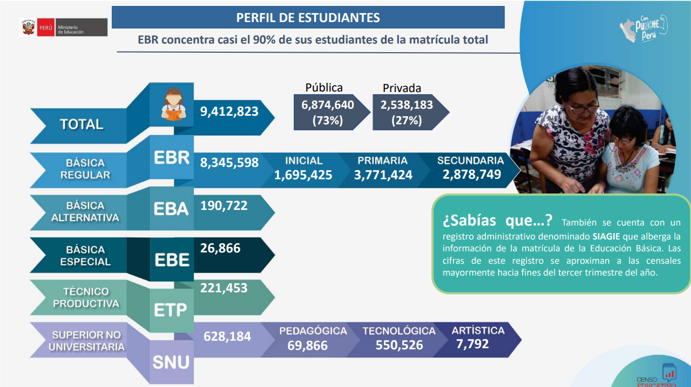

 
Universidad Peruana de Ciencias Aplicadas
 
Facultad de Ingeniería
 
Carrera de Ingeniería de Software
 

**1ASI0729**
 
**Desarrollo de Aplicaciones Open Source**
 
NRC
 
**7800**
 
**Informe de Trabajo Final**
 
Docente
 
**Robles Fernandez, Ivan**
 
Equipo
 
**StackForge**

 

Proyecto
 
**KidTrack**

     

**Integrantes**

<table border="0" style="border-collapse: collapse; border: none; margin: 0 auto;">

 <tr style="border: none;">
    <td style="border: none; text-align: center; padding: 5px 15px;">codigo</td>
    <td style="border: none; text-align: left; padding: 5px 15px;">nombre</td>
  </tr>
<tr style="border: none;">
    <td style="border: none; text-align: center; padding: 5px 15px;">U202424059</td>
    <td style="border: none; text-align: left; padding: 5px 15px;">De la Cruz De los Santos, Mathias Marcelo</td>
  </tr>  
<tr style="border: none;">
    <td style="border: none; text-align: center; padding: 5px 15px;">U202415551</td>
    <td style="border: none; text-align: left; padding: 5px 15px;">Ramirez Ruiz, Nickolas</td>
  </tr>
    <tr style="border: none;">
    <td style="border: none; text-align: center; padding: 5px 15px;"> codigo </td>
    <td style="border: none; text-align: left; padding: 5px 15px;">nombre</td>
  </tr>
  <tr style="border: none;">
    <td style="border: none; text-align: center; padding: 5px 15px;">codigo</td>
    <td style="border: none; text-align: left; padding: 5px 15px;">nombre</td>
  </tr>
 
 
</table>

            

**Período 202620**
 

**Setiembre, 2026**
       

---

## Registro de Versiones del Informe

## Project Report Collaboration Insights

### Sprint 1
### Sprint 2
### Sprint 3
### Sprint 4

## Tabla de contenidos

- [Registro de Versiones del Informe](#registro-de-versiones-del-informe)
- [Project Report Collaboration Insights](#project-report-collaboration-insights)
    - [Sprint 1](#sprint-1)
    - [Sprint 2](#sprint-2)
    - [Sprint 3](#sprint-3)
    - [Sprint 4](#sprint-4)
- [Student Outcome](#student-outcome)
- [Capítulo I: Introducción](#capítulo-i-introducción)
    - [1.1. Startup Profile](#11-startup-profile)
        - [1.1.1. Descripción de la Startup](#111-descripción-de-la-startup)
        - [1.1.2. Perfiles de integrantes del equipo](#112-perfiles-de-integrantes-del-equipo)
    - [1.2. Solution Profile](#12-solution-profile)
        - [1.2.1 Antecedentes y problemática](#121-antecedentes-y-problemática)
        - [1.2.2 Lean UX Process](#122-lean-ux-process)
            - [1.2.2.1. Lean UX Problem Statements](#1221-lean-ux-problem-statements)
            - [1.2.2.2. Lean UX Assumptions](#1222-lean-ux-assumptions)
            - [1.2.2.3. Lean UX Hypothesis Statements](#1223-lean-ux-hypothesis-statements)
            - [1.2.2.4. Lean UX Canvas](#1224-lean-ux-canvas)
    - [1.3. Segmentos objetivo](#13-segmentos-objetivo)
- [Capítulo II: Requirements Elicitation & Analysis](#capítulo-ii-requirements-elicitation--analysis)
    - [2.1. Competidores](#21-competidores)
        - [Identificación de Competidores](#identificación-de-competidores)
            - [Life360](#life360)
            - [Find My Kids](#find-my-kids)
            - [OnTrack School](#ontrack-school)
        - [2.1.1 Análisis Competitivo - Landscape](#211-análisis-competitivo---landscape)
        - [2.1.2 Estrategias y tácticas frente a competidores](#212-estrategias-y-tácticas-frente-a-competidores)
    - [2.2. Entrevistas](#22-entrevistas)
        - [2.2.1. Diseño de entrevistas](#221-diseño-de-entrevistas)
        - [2.2.2. Registro de entrevistas](#222-registro-de-entrevistas)
        - [2.2.3. Análisis de entrevistas](#223-análisis-de-entrevistas)
    - [2.3. Needfinding](#23-needfinding)
        - [2.3.1. User Personas](#231-user-personas)
        - [2.3.2. User Task Matrix](#232-user-task-matrix)
        - [2.3.3. User Journey Mapping](#233-user-journey-mapping)
        - [2.3.4. Empathy Mapping](#234-empathy-mapping)
    - [2.4. Big Picture Event Storming](#24-big-picture-event-storming)
    - [2.5. Ubiquitous Language](#25-ubiquitous-language)
- [Capítulo III: Requirements Specification](#capítulo-iii-requirements-specification)
    - [3.1. User Stories](#31-user-stories)
    - [3.2. Impact Mapping](#32-impact-mapping)
    - [3.3. Product Backlog](#33-product-backlog)
- [Product Backlog - SafeRoute](#product-backlog-saferoute)
- [Capítulo IV: Product Design](#capítulo-iv-product-design)
    - [4.1. Style Guidelines](#41-style-guidelines)
        - [4.1.1. General Style Guidelines](#411-general-style-guidelines)
            - [Colores](#colores)
            - [Tipografía](#tipografía)
            - [Branding](#branding)
            - [Espaciado](#espaciado)
            - [Dimensiones para el tono de comunicación y lenguaje aplicado](#dimensiones-para-el-tono-de-comunicación-y-lenguaje-aplicado)
            - [Elementos de diseño](#elementos-de-diseño)
            - [Principios de diseño](#principios-de-diseño)
        - [4.1.2. Web Style Guidelines](#412-web-style-guidelines)
    - [4.2. Information Architecture](#42-information-architecture)
        - [4.2.1. Organization Systems](#421-organization-systems)
        - [4.2.2. Labeling Systems](#422-labeling-systems)
        - [4.2.3. SEO Tags and Meta Tags](#423-seo-tags-and-meta-tags)
        - [4.2.4. Searching Systems](#424-searching-systems)
        - [4.2.5. Navigation Systems](#425-navigation-systems)
    - [4.3. Landing Page UI Design](#43-landing-page-ui-design)
        - [4.3.1. Landing Page Wireframe](#431-landing-page-wireframe)
        - [4.3.2. Landing Page Mock-up](#432-landing-page-mock-up)
    - [4.4. Web Applications UX/UI Design](#44-web-applications-uxui-design)
        - [4.4.1. Web Applications Wireframes](#441-web-applications-wireframes)
        - [4.4.2. Web Applications Wireflow Diagrams](#442-web-applications-wireflow-diagrams)
        - [4.4.3. Web Applications Mock-ups](#443-web-applications-mock-ups)
        - [4.4.4. Web Applications User Flow Diagrams](#444-web-applications-user-flow-diagrams)
    - [4.5. Web Applications Prototyping](#45-web-applications-prototyping)
    - [4.6. Domain-Driven Software Architecture](#46-domain-driven-software-architecture)
        - [4.6.1. Design-Level Event Storming](#461-design-level-event-storming)
        - [4.6.2. Software Architecture Context Diagram](#462-software-architecture-context-diagram)
        - [4.6.3. Software Architecture Container Diagrams](#463-software-architecture-container-diagrams)
        - [4.6.4. Software Architecture Components Diagrams](#464-software-architecture-components-diagrams)
    - [4.7. Software Object-Oriented Design](#47-software-object-oriented-design)
        - [4.7.1. Class Diagrams](#471-class-diagrams)
    - [4.8. Database Design](#48-database-design)
        - [4.8.1. Database Diagrams](#481-database-diagrams)
- [Capítulo V: Product Implementation, Validation & Deployment](#capítulo-v-product-implementation-validation--deployment)
    - [5.1. Software Configuration Management](#51-software-configuration-management)
        - [5.1.1. Software Development Environment Configuration](#511-software-development-environment-configuration)
        - [5.1.2. Source Code Management](#512-source-code-management)
        - [5.1.3. Source Code Style Guide & Conventions](#513-source-code-style-guide--conventions)
        - [5.1.4. Software Deployment Configuration](#514-software-deployment-configuration)
    - [5.2. Landing Page, Services & Applications Implementation](#52-landing-page-services--applications-implementation)
        - [5.2.1. Sprint 1](#521-sprint-1)
        - [5.2.2. Sprint 2](#522-sprint-2)
        - [5.2.3. Sprint 3](#523-sprint-3)
        - [5.2.4. Sprint 4](#sprint--4)
    - [5.3. Validation Interviews](#53-validation-interviews)
        - [5.3.1. Diseño de Entrevistas](#531-diseño-de-entrevistas)
        - [5.3.2. Registro de Entrevistas](#532-registro-de-entrevistas)
        - [5.3.3. Evaluaciones según heurísticas](#533-evaluaciones-segun-heuristicas)
    - [5.4 Video About-the-Product](#54-video-about-the-product)
- [Conclusiones](#conclusiones)
- [Recomendaciones](#recomendaciones)
- [Video About-the-Team](#video-about-the-team)
- [Bibliografía](#bibliografía)
- [Anexos](#anexos)

---
## Student Outcome

## Capítulo I: Introducción

### 1.1. Startup Profile
#### 1.1.1. Descripción de la Startup
StackForge es una startup tecnológica formada por estudiantes de Ingeniería de Software de la Universidad Peruana de Ciencias Aplicadas (UPC),
enfocada en crear soluciones digitales para problemas reales en sectores con poca presencia tecnológica,
y nace de la convicción de que la seguridad de los niños en su traslado escolar no debería depender de llamadas,
mensajes de WhatsApp o anotaciones en papel, por lo que su propuesta de valor se materializa en KidTrack,
una plataforma web de movilidad institucional inteligente que digitaliza y optimiza la gestión del transporte escolar,
permitiendo a cualquier organización del rubro ya sea un grupo de padres que comparte una movilidad,
un conductor independiente o una pequeña empresa centralizar en un solo lugar la administración de sus rutas, conductores, alumnos y comunicación.
#### 1.1.2. Perfiles de integrantes del equipo

|                   Foto                    | Apellidos y Nombres    |    Código    | Carrera                | Resumen                                                                                                                                                                                                                                                                                                                                                                                 |
|:-----------------------------------------:|:-----------------------|:------------:| :--------------------- |:----------------------------------------------------------------------------------------------------------------------------------------------------------------------------------------------------------------------------------------------------------------------------------------------------------------------------------------------------------------------------------------|
|         | nombre el integrante   | [codigo] | Ingeniería de Software | descripcion                                                                                                                                                                                                                                                                                                                                                                             |
|        | nombre el integrante   | [codigo] | Ingeniería de Software | descripcion                                    |
|  | Ramirez Ruiz, Nickolas | [U202415551] | Ingeniería de Software | Soy Nickolas Ramirez Ruiz, estudiante del sexto ciclo de la carrera de Ingeniería de Software. A lo largo de mi formación académica he adquirido conocimientos en programación, principalmente utilizando el lenguaje Java. Me considero una persona organizada, comprometida y con un enfoque proactivo, siempre buscando cumplir con mis responsabilidades antes del tiempo previsto. |
|                | nombre el integrante   |   [codigo]   | Ingeniería de Software | descripcion                                                                                                                                                                                                                                                                                                                                                                             |
|    | nombre el integrante   | [codigo] | Ingeniería de Software | descripcion                                                                                      |

### 1.2. Solution Profile

#### 1.2.1 Antecedentes y problemática

Who (¿Quiénes son los afectados?)
Existen dos grupos claramente afectados por esta problemática. Por un lado, los padres o apoderados de niños en edad inicial, kínder y primaria que contratan un servicio de transporte escolar privado, pero que no tienen forma de saber en tiempo real cómo va el traslado de sus hijos. Por otro lado, están los conductores ya sea independientes o vinculados a pequeñas empresas del rubro que deben coordinar rutas y alumnos sin contar con ninguna herramienta digital de apoyo.

What (¿Cuál es el problema?)
En el Perú, el transporte escolar privado sigue operando de manera mayormente artesanal, sin ningún tipo de respaldo tecnológico. Padres y conductores se comunican a través de medios informales como llamadas o grupos de WhatsApp, lo que trae consigo desorden, información que se pierde y una sensación permanente de duda en los padres sobre si sus hijos están realmente seguros. A esto se suma que los conductores y quienes administran el servicio no cuentan con ningún sistema para registrar asistencia, organizar rutas, dejar constancia de incidencias o mantener un historial de cada recorrido.

Where (¿Dónde ocurre?)
Este problema se concentra sobre todo en las zonas urbanas de Lima Metropolitana, donde el transporte escolar privado tiene alta demanda pero opera de forma dispersa y muchas veces informal. Aun así, la misma situación puede replicarse en cualquier otra ciudad peruana que tenga muchos colegios privados sin flota vehicular propia.

When (¿Cuándo ocurre?)
El problema se repite todos los días durante los horarios de ingreso y salida del colegio, generalmente entre las 6:00 a.m. y 8:30 a.m., y luego entre las 12:30 p.m. y 5:00 p.m. Justamente en esas franjas horarias es cuando más se nota la falta de información en tiempo real, lo que eleva la ansiedad de los padres y la presión sobre los conductores.

Why (¿Por qué es un problema?)
No contar con digitalización trae consecuencias concretas: los padres no tienen certeza de si su hijo subió al vehículo, si llegó al colegio o si algo ocurrió durante el camino. Los conductores, por su parte, incurren en errores como saltarse paradas u olvidar recoger a algún alumno, y no tienen un canal ordenado para avisar retrasos. Además, quienes administran el servicio terminan invirtiendo tiempo valioso en coordinar manualmente tareas que podrían automatizarse, sin tener registros históricos que les permitan optimizar la operación.

How (¿Cómo se manifiesta?)
Esto se traduce en un flujo constante de llamadas y mensajes de los padres hacia el conductor durante el trayecto, listas de alumnos anotadas en papel u hojas de cálculo que nadie más puede consultar, ninguna forma de dejar constancia de incidencias, imposibilidad de comprobar si se respetaron las paradas programadas, y falta total de trazabilidad sobre qué estudiantes efectivamente abordaron el vehículo en cada viaje.

How much (¿Cuál es la magnitud?)
Aunque no existen cifras exactas ni actualizadas que dimensionen con precisión el mercado del transporte escolar privado en el país, algunos indicadores del sector educativo y de transporte ayudan a entender la magnitud del problema.

De acuerdo con el Censo Educativo 2022-2023 elaborado por el Ministerio de Educación (MINEDU, 2023), Lima Metropolitana alberga cerca de 1.9 millones de estudiantes repartidos en aproximadamente 7,602 instituciones educativas, de las cuales el 74% pertenecen al sector privado. Esta fuerte presencia de colegios privados hace que un número considerable de familias dependa de terceros para el traslado escolar, ya que son pocas las instituciones que cuentan con transporte propio.

El panorama se complica aún más si se considera que, según la Autoridad de Transporte Urbano para Lima y Callao (ATU, 2024), el número de movilidades escolares con autorización formal cayó un 25% en tan solo un año lo que apunta a un crecimiento de la informalidad en el sector y, por tanto, a menos mecanismos de supervisión sobre el servicio que reciben los menores.

En cuanto a seguridad, la Superintendencia de Transporte Terrestre de Personas, Carga y Mercancías (SUTRAN, 2024) desarrolló campañas de sensibilización dirigidas a más de 47,000 escolares, lo que confirma que este tema sigue siendo una prioridad para las autoridades competentes. Sin embargo, no hay data pública desagregada sobre incidentes puntuales registrados en este sector entre 2022 y 2025.

**Figura 1** Distribución de estudiantes de nivel Inicial y Primaria matriculados en colegios privados dentro de zonas urbanas del Perú

_Nota._ Elaborado a partir de los datos del Censo Educativo 2022 (p. 12), Ministerio de Educación, 2023.

#### 1.2.2 Lean UX Process

##### 1.2.2.1. Lean UX Problem Statements

En nuestro país, la gran mayoría de servicios de movilidad escolar funciona todavía de manera artesanal: los conductores y las familias se coordinan a través de llamadas, chats de WhatsApp y anotaciones sueltas en cuadernos o papeles. Esta forma de trabajar termina afectando tanto la tranquilidad de los padres como la capacidad operativa de los transportistas, 
comprometiendo la calidad y seguridad del servicio en general.

Al analizar este ecosistema identificamos un punto crítico que lo atraviesa por completo: de un lado,
las familias no tienen ninguna forma de conocer en qué momento del recorrido se encuentra su hijo; 
del otro, los transportistas no cuentan con ningún sistema digital que les permita organizar sus rutas, controlar a los estudiantes o dejar constancia de incidentes de manera ordenada. 
Lo interesante es que ambas carencias están profundamente conectadas: los padres necesitan poder ver el trayecto, pero son justamente los transportistas quienes no tienen las herramientas para ofrecerles esa visibilidad.

Esto nos lleva a plantearnos la siguiente pregunta central: 
¿de qué forma podríamos construir una solución que le dé al transportista escolar el control digital de su operación diaria, y que al mismo tiempo brinde a los padres de familia la tranquilidad de saber, en todo momento, cómo va el traslado de sus hijos?
##### 1.2.2.2. Lean UX Assumptions
##### 1.2.2.3. Lean UX Hypothesis Statements
##### 1.2.2.4. Lean UX Canvas

### 1.3. Segmentos objetivo

## Capítulo II: Requirements Elicitation & Analysis

### 2.1. Competidores
#### Identificación de Competidores
#### 2.1.1 Análisis Competitivo - Landscape
#### 2.1.2 Estrategias y tácticas frente a competidores

### 2.2. Entrevistas
#### 2.2.1. Diseño de entrevistas
#### 2.2.2. Registro de entrevistas
#### 2.2.3. Análisis de entrevistas

### 2.3. Needfinding
#### 2.3.1. User Personas
#### 2.3.2. User Task Matrix
#### 2.3.3. User Journey Mapping
#### 2.3.4. Empathy Mapping

### 2.4. Big Picture Event Storming

### 2.5. Ubiquitous Language

## Capítulo III: Requirements Specification

### 3.1. User Stories
### 3.2. Impact Mapping
### 3.3. Product Backlog

## Capítulo IV: Product Design

### 4.1. Style Guidelines
#### 4.1.1. General Style Guidelines
##### Colores
##### Tipografía
##### Branding
##### Espaciado
##### Dimensiones para el tono de comunicación y lenguaje aplicado
##### Elementos de diseño
##### Principios de diseño
#### 4.1.2. Web Style Guidelines

### 4.2. Information Architecture
#### 4.2.1. Organization Systems
#### 4.2.2. Labeling Systems
#### 4.2.3. SEO Tags and Meta Tags
#### 4.2.4. Searching Systems
#### 4.2.5. Navigation Systems

### 4.3. Landing Page UI Design
#### 4.3.1. Landing Page Wireframe
#### 4.3.2. Landing Page Mock-up

### 4.4. Web Applications UX/UI Design
#### 4.4.1. Web Applications Wireframes
#### 4.4.2. Web Applications Wireflow Diagrams
#### 4.4.3. Web Applications Mock-ups
#### 4.4.4. Web Applications User Flow Diagrams

### 4.5. Web Applications Prototyping

### 4.6. Domain-Driven Software Architecture
#### 4.6.1. Design-Level Event Storming
#### 4.6.2. Software Architecture Context Diagram
#### 4.6.3. Software Architecture Container Diagrams
#### 4.6.4. Software Architecture Components Diagrams

### 4.7. Software Object-Oriented Design
#### 4.7.1. Class Diagrams

### 4.8. Database Design
#### 4.8.1. Database Diagrams

## Capítulo V: Product Implementation, Validation & Deployment

### 5.1. Software Configuration Management
#### 5.1.1. Software Development Environment Configuration
#### 5.1.2. Source Code Management
#### 5.1.3. Source Code Style Guide & Conventions
#### 5.1.4. Software Deployment Configuration

### 5.2. Landing Page, Services & Applications Implementation
### 5.2.1. Sprint 1
##### 5.2.1.1. Sprint Planning 1
##### 5.2.1.2. Aspect Leaders and Collaborators
##### 5.2.1.3. Sprint Backlog 1
##### 5.2.1.4. Development Evidence for Sprint Review
##### 5.2.1.5. Execution Evidence for Sprint Review
##### 5.2.1.6. Services Documentation Evidence for Sprint Review
##### 5.2.1.7. Software Deployment Evidence for Sprint Review
##### 5.2.1.8. Team Collaboration Insights during Sprint

### 5.2.2. Sprint 2
##### 5.2.2.1. Sprint Planning 2
##### 5.2.2.2. Aspect Leaders and Collaborators
##### 5.2.2.3. Sprint Backlog 2
##### 5.2.2.4. Development Evidence for Sprint Review
##### 5.2.2.5. Execution Evidence for Sprint Review
##### 5.2.2.6. Services Documentation Evidence for Sprint Review
##### 5.2.2.7. Software Deployment Evidence for Sprint Review
##### 5.2.2.8. Team Collaboration Insights during Sprint

### 5.2.3. Sprint 3
##### 5.2.3.1. Sprint Planning 3
##### 5.2.3.2. Aspect Leaders and Collaborators
##### 5.2.3.3. Sprint Backlog 3
##### 5.2.3.4. Development Evidence for Sprint Review
##### 5.2.3.5. Execution Evidence for Sprint Review
##### 5.2.3.6. Services Documentation Evidence for Sprint Review
##### 5.2.3.7. Software Deployment Evidence for Sprint Review
##### 5.2.3.8. Team Collaboration Insights during Sprint

### 5.2.4. Sprint 4
##### 5.2.4.1. Sprint Planning 4
##### 5.2.4.2. Aspect Leaders and Collaborators
##### 5.2.4.3. Sprint Backlog 4
##### 5.2.4.4. Development Evidence for Sprint Review
##### 5.2.4.5. Execution Evidence for Sprint Review
##### 5.2.4.6. Services Documentation Evidence for Sprint Review
##### 5.2.4.7. Software Deployment Evidence for Sprint Review
##### 5.2.4.8. Team Collaboration Insights during Sprint

### 5.3. Validation Interviews
#### 5.3.1. Diseño de Entrevistas
#### 5.3.2. Registro de Entrevistas
#### 5.3.3. Evaluaciones según heurísticas

### 5.4 Video About-the-Product

## Conclusiones

## Recomendaciones

## Video About-the-Team

## Bibliografía
- Ministerio de Educación. (2023). _Resultados del Censo Educativo 2022_. ESCALE. Recuperado el 9 de abril de 2026, de https://escale.minedu.gob.pe/documents/10156/9345030/PPT_Censo_Educativo_2023_final.pdf
## Anexos
