

 
Universidad Peruana de Ciencias Aplicadas
 
Facultad de Ingeniería
 
Carrera de Ingeniería de Software
 

**1ASI0729**
 
**Desarrollo de Aplicaciones Open Source**
 
NRC
 
**7800**
 
**Informe AV1**
 
Docente
 
**Robles Fernandez, Ivan**
 
Equipo
 
**StackForge**

 

Proyecto
 
**KidTrack**

   

**Integrantes**

<table border="0" style="border-collapse: collapse; border: none; margin: 0 auto;">

 <tr style="border: none;">
    <td style="border: none; text-align: center; padding: 5px 15px;">U201914367</td>
    <td style="border: none; text-align: left; padding: 5px 15px;">Chamorro Acero, Salvador Edward</td>
  </tr>
<tr style="border: none;">
    <td style="border: none; text-align: center; padding: 5px 15px;">U202424059</td>
    <td style="border: none; text-align: left; padding: 5px 15px;">De la Cruz De los Santos, Mathias Marcelo</td>
  </tr>  
<tr style="border: none;">
    <td style="border: none; text-align: center; padding: 5px 15px;">U202415551</td>
    <td style="border: none; text-align: left; padding: 5px 15px;">Ramirez Ruiz, Nickolas</td>
  </tr>
    <tr style="border: none;">
    <td style="border: none; text-align: center; padding: 5px 15px;">U202316852</td>
    <td style="border: none; text-align: left; padding: 5px 15px;">Ortega Quintana, Jose Zacarias</td>
  </tr>
  <tr style="border: none;">
    <td style="border: none; text-align: center; padding: 5px 15px;">U20221A390</td>
    <td style="border: none; text-align: left; padding: 5px 15px;">Su Caletti Eddo</td>
  </tr>
 
 
</table>

      

**Período 202620**
 

**Setiembre, 2026**
       

   
   

---

## Registro de Versiones del Informe

| Avance | Fecha      | Autor                                                                                                                                                         | Descripción de Modificación                                                                                                                                                                                                                                                                                                |
| :----- | :--------- | :------------------------------------------------------------------------------------------------------------------------------------------------------------ | :----------------------------------------------------------------------------------------------------------------------------------------------------------------------------------------------------------------------------------------------------------------------------------------------------------------------------------------------------------------------------------------------------------------------------------------------------------------------------------------------------------------------------------------------------------------------------------------------------------------------------------------------------------------------------------------------------------------------------------------------------------------------------------------------------------------------------------------------------------------------------------------------------------------------------------------------------------------------------------------------------------------------------------- |
| AV1    | 17/09/2026 | De La Cruz De Los Santos, Mathias Marcelo; Ortega Quintana, Jose Zacarias; Su Caletti Eddo; Ramirez Ruiz, Nickolas; Chamorro Acero, Salvador Edward | Se desarrolló el Sprint Review correspondiente a la Semana 4, incluyendo la elaboración del Final Project Documentation Report, la presentación del Final Project Keynote y el reporte individual de desempeño de los integrantes. A nivel de implementación, se desarrolló y desplegó la primera versión del Landing Page. El informe incorpora la carátula, registro de versiones, insights de colaboración, student outcome, y los capítulos I al V, abarcando desde la introducción, levantamiento y especificación de requerimientos, diseño del producto, hasta la implementación, validación y despliegue. Además, se documenta la gestión de configuración del software, el entorno de desarrollo, control de código fuente, convenciones de estilo y configuración de despliegue. Finalmente, se incluye la evidencia completa del Sprint 1: planificación, backlog, desarrollo, ejecución, documentación de servicios, despliegue y análisis de la colaboración del equipo, junto con conclusiones, bibliografía y anexos. |

   
   
   
   
---
## Project Report Collaboration Insights

El equipo ha utilizado un flujo de trabajo en github: [https://github.com/upc-pre-202620-1asi0729-7800-stackforge/kidtrack-report](https://github.com/upc-pre-202620-1asi0729-7800-stackforge/kidtrack-report/tree/develop)

### Sprint 1

## AV1:
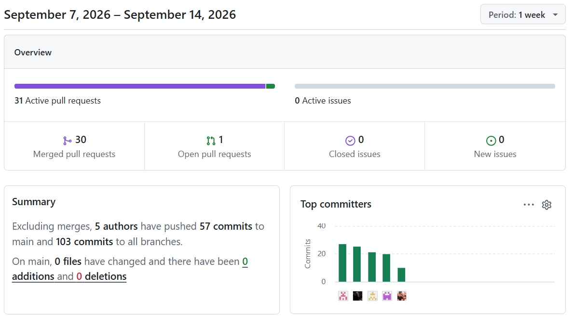
## Landing Page:
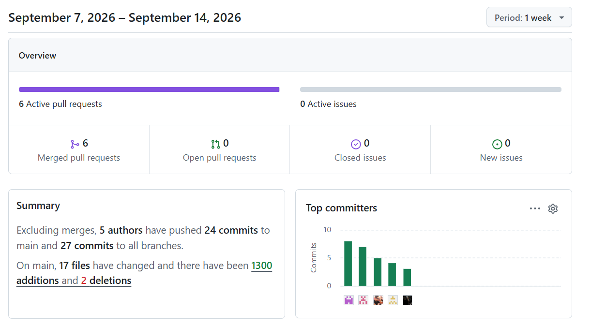

  
   
   
   
---
## Tabla de contenidos

- [Registro de Versiones del Informe](#registro-de-versiones-del-informe)
- [Project Report Collaboration Insights](#project-report-collaboration-insights)
    - [Sprint 1](#sprint-1)
    - [Sprint 2](#sprint-2)
- [Student Outcome](#student-outcome)
- [Capítulo I: Introducción](#capítulo-i-introducción)
    - [1.1. Startup Profile](#11-startup-profile)
        - [1.1.1. Descripción de la Startup](#111-descripción-de-la-startup)
        - [1.1.2. Perfiles de integrantes del equipo](#112-perfiles-de-integrantes-del-equipo)
    - [1.2. Solution Profile](#12-solution-profile)
        - [1.2.1 Antecedentes y problemática](#121-antecedentes-y-problemática)
        - [1.2.2 Lean UX Process](#122-lean-ux-process)
            - [1.2.2.1. Lean UX Problem Statements](#1221-lean-ux-problem-statements)
            - [1.2.2.2. Lean UX Assumptions](#1222-lean-ux-assumptions)
            - [1.2.2.3. Lean UX Hypothesis Statements](#1223-lean-ux-hypothesis-statements)
            - [1.2.2.4. Lean UX Canvas](#1224-lean-ux-canvas)
    - [1.3. Segmentos objetivo](#13-segmentos-objetivo)
- [Capítulo II: Requirements Elicitation & Analysis](#capítulo-ii-requirements-elicitation--analysis)
    - [2.1. Competidores](#21-competidores)
        - [Identificación de Competidores](#identificación-de-competidores)
            - [OnTrack School](#onTrack-school)
            - [SafeRoute Parent](#safesoute-parent)
            - [BusRight](#busright)
        - [2.1.1 Análisis Competitivo - Landscape](#211-análisis-competitivo---landscape)
        - [2.1.2 Estrategias y tácticas frente a competidores](#212-estrategias-y-tácticas-frente-a-competidores)
    - [2.2. Entrevistas](#22-entrevistas)
        - [2.2.1. Diseño de entrevistas](#221-diseño-de-entrevistas)
        - [2.2.2. Registro de entrevistas](#222-registro-de-entrevistas)
        - [2.2.3. Análisis de entrevistas](#223-análisis-de-entrevistas)
    - [2.3. Needfinding](#23-needfinding)
        - [2.3.1. User Personas](#231-user-personas)
        - [2.3.2. User Task Matrix](#232-user-task-matrix)
        - [2.3.3. User Journey Mapping](#233-user-journey-mapping)
        - [2.3.4. Empathy Mapping](#234-empathy-mapping)
    - [2.4. Big Picture Event Storming](#24-big-picture-event-storming)
    - [2.5. Ubiquitous Language](#25-ubiquitous-language)
- [Capítulo III: Requirements Specification](#capítulo-iii-requirements-specification)
    - [3.1. User Stories](#31-user-stories)
    - [3.2. Impact Mapping](#32-impact-mapping)
    - [3.3. Product Backlog](#33-product-backlog)
- [Capítulo IV: Product Design](#capítulo-iv-product-design)
    - [4.1. Style Guidelines](#41-style-guidelines)
        - [4.1.1. General Style Guidelines](#411-general-style-guidelines)
            - [Colores](#colores)
            - [Tipografía](#tipografía)
            - [Branding](#branding)
            - [Espaciado](#espaciado)
            - [Dimensiones para el tono de comunicación y lenguaje aplicado](#dimensiones-para-el-tono-de-comunicación-y-lenguaje-aplicado)
            - [Elementos de diseño](#elementos-de-diseño)
            - [Principios de diseño](#principios-de-diseño)
        - [4.1.2. Web Style Guidelines](#412-web-style-guidelines)
    - [4.2. Information Architecture](#42-information-architecture)
        - [4.2.1. Organization Systems](#421-organization-systems)
        - [4.2.2. Labeling Systems](#422-labeling-systems)
        - [4.2.3. SEO Tags and Meta Tags](#423-seo-tags-and-meta-tags)
        - [4.2.4. Searching Systems](#424-searching-systems)
        - [4.2.5. Navigation Systems](#425-navigation-systems)
    - [4.3. Landing Page UI Design](#43-landing-page-ui-design)
        - [4.3.1. Landing Page Wireframe](#431-landing-page-wireframe)
        - [4.3.2. Landing Page Mock-up](#432-landing-page-mock-up)
    - [4.4. Web Applications UX/UI Design](#44-web-applications-uxui-design)
        - [4.4.1. Web Applications Wireframes](#441-web-applications-wireframes)
        - [4.4.2. Web Applications Wireflow Diagrams](#442-web-applications-wireflow-diagrams)
        - [4.4.3. Web Applications Mock-ups](#443-web-applications-mock-ups)
        - [4.4.4. Web Applications User Flow Diagrams](#444-web-applications-user-flow-diagrams)
    - [4.5. Web Applications Prototyping](#45-web-applications-prototyping)
    - [4.6. Domain-Driven Software Architecture](#46-domain-driven-software-architecture)
        - [4.6.1. Design-Level Event Storming](#461-design-level-event-storming)
        - [4.6.2. Software Architecture Context Diagram](#462-software-architecture-context-diagram)
        - [4.6.3. Software Architecture Container Diagrams](#463-software-architecture-container-diagrams)
        - [4.6.4. Software Architecture Components Diagrams](#464-software-architecture-components-diagrams)
    - [4.7. Software Object-Oriented Design](#47-software-object-oriented-design)
        - [4.7.1. Class Diagrams](#471-class-diagrams)
    - [4.8. Database Design](#48-database-design)
        - [4.8.1. Database Diagrams](#481-database-diagrams)
- [Capítulo V: Product Implementation, Validation & Deployment](#capítulo-v-product-implementation-validation--deployment)
    - [5.1. Software Configuration Management](#51-software-configuration-management)
        - [5.1.1. Software Development Environment Configuration](#511-software-development-environment-configuration)
        - [5.1.2. Source Code Management](#512-source-code-management)
        - [5.1.3. Source Code Style Guide & Conventions](#513-source-code-style-guide--conventions)
        - [5.1.4. Software Deployment Configuration](#514-software-deployment-configuration)
    - [5.2. Landing Page, Services & Applications Implementation](#52-landing-page-services--applications-implementation)
        - [5.2.1. Sprint 1](#521-sprint-1)
        - [5.2.2. Sprint 2](#522-sprint-2)
        - [5.2.3. Sprint 3](#523-sprint-3)
        - [5.2.4. Sprint 4](#sprint--4)
    - [5.3. Validation Interviews](#53-validation-interviews)
        - [5.3.1. Diseño de Entrevistas](#531-diseño-de-entrevistas)
        - [5.3.2. Registro de Entrevistas](#532-registro-de-entrevistas)
        - [5.3.3. Evaluaciones según heurísticas](#533-evaluaciones-segun-heuristicas)
    - [5.4 Video About-the-Product](#54-video-about-the-product)
- [Conclusiones](#conclusiones)
- [Recomendaciones](#recomendaciones)
- [Video About-the-Team](#video-about-the-team)
- [Bibliografía](#bibliografía)
- [Anexos](#anexos)

---
## Student Outcome

**ABET – EAC - Student Outcome 3:**  Capacidad de comunicarse efectivamente con un rango de audiencias

<table>
 <tr>
    <th colspan="2">Criterio Específico</th>
    <th colspan="10">Acciones Realizadas</td>
    <th colspan="2">Conclusiones</td>
 </tr>
 <tr>
    <td colspan="2">Comunica oralmente con efectividad a diferentes rangos de audiencia.
    </th>
    <td colspan="10">
    <b>Chamorro Acero, Salvador Edward</b> Durante el desarrollo de esta primera entrega se sostuvo una comunicacion constante mediante reuniones y trabajo en conjunto para poder lograr los objetivos de manera satisfactoria.  AV1:  
    <b>De la Cruz De los Santos, Mathias Marcelo</b>  AV1: Mantuve comunicación constante con el equipo durante el desarrollo de este primer avance, coordinando la distribución del trabajo en ramas de Git entre los integrantes y validando junto a ellos los cambios de branding y contenido antes de integrarlos al repositorio.  
    <b>Ramirez Ruiz, Nickolas</b>  AV1: Lideré la presentación oral del proyecto, exponiendo los objetivos generales y estructurando los avances del equipo de manera clara y articulada, transmitiendo las ideas clave con un lenguaje técnico y adaptado a la audiencia.    
    <b>Ortega Quintana, Jose Zacarias</b>  AV1:En el desarrollo de la primera entrega se consolidó comunicación clara y precisa acerca de los objetivos del trabajo, se mantuvo una comunicación constante referente a algunos problemas o cruces que podría suceder.  
    <b>Su Caletti, Eddo</b>  AV1:Trabaje de manera grupal y coordinadamente con mis compañeros, manteniendo comunicación constante y clara con ellos.  
    <td colspan="2">
    AV1: Durante el AV1, el equipo logró establecer un entorno colaborativo mediante reuniones donde todos los integrantes participaron y aportaron para el correcto desarrollo del proyecto.</td>
 </tr>
 <tr>
    <td colspan="2">Comunica por escrito con efectividad a diferentes rangos de audiencia.
    </th>
    <td colspan="10">
    <b>Chamorro Acero, Salvador Edward</b> Realice mi aporte en el proyecto mediante el desarrollo del capitulo 2 donde se realizo el analisis de los segmentos objetivos y en el capitulo 5 donde se desarrollo el marco de trabajo utilizado para el proyecto.  AV1:  
    <b>De la Cruz De los Santos, Mathias Marcelo</b>  AV1: Redacté y adapté las secciones Landing Page UI Design,Web Applications UX/UI Design: wireframes, wireflow diagrams, mock-ups y user flow diagrams, Web Applications Prototyping y Domain-Driven Software Architecture: Event Storming, diagrama de contexto, de contenedores y de componentes del informe. Además, lideré el rebranding de la landing page de  KidTrack (paleta de colores, logotipo y textos) y coordiné la división del código de la landing entre los integrantes del equipo mediante ramas de Git.  
    <b>Ramirez Ruiz, Nickolas</b>  AV1: Redacté las secciones de Solution Profile (Lean UX Process, Problem Statements, Assumptions, Hypothesis y Canvas), Diagramas de Clases y Diseño de Base de Datos. Asimismo, colaboré en la estructuración de las entrevistas del proyecto, apoyé en la elaboración del contenido para la landing page y en la preparación de la presentación ejecutiva (PPT).  
    <b>Ortega Quintana, Jose Zacarias</b>  AV1:Redacté todo el bloque del capítulo 3 ( User Stories.Impact Mapping,Product Backlog). También tuve colaboración en los Class Diagrams,Database Design y Database Diagrams. Finalmente aporté en parte de la elaboración de la landing page y el capítulo 5 sobre la configuración, despliego de software y sprint.  
    <b>Su Caletti, Eddo</b>  AV1: Elaboré la segunda  mitad del capítulo 2 además de participar en la elaboración de las entrevistas de nuestro segmento en el capitulo 4 me encargue de la primera parte de este ademas de ayudar en la participacion en la landing y en el ppt.  <b> </b> 
    <td colspan="2"> AV1: Durante el AV1, el equipo logró plasmar la estructura desarrollada en el informa donde cada integrantes colaboro activamente lo que concluyo en un informe completo junto a una landing page funcional.</td>
 </tr>

  </table>

## Capítulo I: Introducción

### 1.1. Startup Profile
#### 1.1.1. Descripción de la Startup
StackForge es una startup tecnológica formada por estudiantes de Ingeniería de Software de la Universidad Peruana de Ciencias Aplicadas (UPC),
enfocada en crear soluciones digitales para problemas reales en sectores con poca presencia tecnológica,
y nace de la convicción de que la seguridad de los niños en su traslado escolar no debería depender de llamadas,
mensajes de WhatsApp o anotaciones en papel, por lo que su propuesta de valor se materializa en KidTrack,
una plataforma web de movilidad institucional inteligente que digitaliza y optimiza la gestión del transporte escolar,
permitiendo a cualquier organización del rubro ya sea un grupo de padres que comparte una movilidad,
un conductor independiente o una pequeña empresa centralizar en un solo lugar la administración de sus rutas, conductores, alumnos y comunicación.
#### 1.1.2. Perfiles de integrantes del equipo

|                   Foto                    | Apellidos y Nombres    |    Código    | Carrera                | Resumen                                                                                                                                                                                                                                                                                                                                                                                 |
|:-----------------------------------------:|:-----------------------|:------------:| :--------------------- |:----------------------------------------------------------------------------------------------------------------------------------------------------------------------------------------------------------------------------------------------------------------------------------------------------------------------------------------------------------------------------------------|
|         | Chamorro Acero, Salvador Edward   | u201914367 | Ingeniería de Software | Estudiante de la carrera de ingenieria de software y entusiasta de la tecnologia. Poseo conocimientos en distintos lenguajes de programacion y tecnologias como python c++, git, js y me considero capaz de trabajar bajo presion y en equipo. |
|        | De la Cruz De los Santos, Mathías Marcelo | [U202424059] | Ingeniería de Software |Soy estudiante de la carrera de Ingeniería de Software y actualmente me encuentro cursando el 5to ciclo de la carrera en la Universidad Peruana de Ciencias Aplicadas. Me considero un fanático de la programación, del fútbol y de los videojuegos. Considero que puedo aportar al equipo y al proyecto mis conocimientos técnicos, además de considerarme una persona disciplinada, responsable y que valora el trabajo en equipo. |
|  | Ramirez Ruiz, Nickolas | [U202415551] | Ingeniería de Software | Soy Nickolas Ramirez Ruiz, estudiante del sexto ciclo de la carrera de Ingeniería de Software. A lo largo de mi formación académica he adquirido conocimientos en programación, principalmente utilizando el lenguaje Java. Me considero una persona organizada, comprometida y con un enfoque proactivo, siempre buscando cumplir con mis responsabilidades antes del tiempo previsto. |
|                | Ortega Quintana, José Zacarías.  |   [U202316852]   | Ingeniería de Software | Soy José Ortega, tengo 21 años y soy un estudiante de Ingeniería de Software. Tengo interés en la creatividad, creación y el funcionamiento de ciertas cosas o ciclos. Espero ser de ayuda a mi equipo y podamos llevar al proyecto de forma dedicada y apasionada.|
|    | Su Caletti, Eddo  | [U20221A390] | Ingeniería de Software |Soy Eddo Su Caletti, tengo 22 años y soy estudiante de la carrera de Ingeniería de Software. A lo largo de mi formación he desarrollado un gran interés por la tecnología y la programación. Me considero una persona organizada y dedicada, apasionada por la fotografía y por disfrutar de momentos de calidad en familia.                                                                          |

### 1.2. Solution Profile

#### 1.2.1 Antecedentes y problemática

Who (¿Quiénes son los afectados?)
Existen dos grupos claramente afectados por esta problemática. Por un lado, los padres o apoderados de niños en edad inicial, kínder y primaria que contratan un servicio de transporte escolar privado, pero que no tienen forma de saber en tiempo real cómo va el traslado de sus hijos. Por otro lado, están los conductores ya sea independientes o vinculados a pequeñas empresas del rubro que deben coordinar rutas y alumnos sin contar con ninguna herramienta digital de apoyo.

What (¿Cuál es el problema?)
En el Perú, el transporte escolar privado sigue operando de manera mayormente artesanal, sin ningún tipo de respaldo tecnológico. Padres y conductores se comunican a través de medios informales como llamadas o grupos de WhatsApp, lo que trae consigo desorden, información que se pierde y una sensación permanente de duda en los padres sobre si sus hijos están realmente seguros. A esto se suma que los conductores y quienes administran el servicio no cuentan con ningún sistema para registrar asistencia, organizar rutas, dejar constancia de incidencias o mantener un historial de cada recorrido.

Where (¿Dónde ocurre?)
Este problema se concentra sobre todo en las zonas urbanas de Lima Metropolitana, donde el transporte escolar privado tiene alta demanda pero opera de forma dispersa y muchas veces informal. Aun así, la misma situación puede replicarse en cualquier otra ciudad peruana que tenga muchos colegios privados sin flota vehicular propia.

When (¿Cuándo ocurre?)
El problema se repite todos los días durante los horarios de ingreso y salida del colegio, generalmente entre las 6:00 a.m. y 8:30 a.m., y luego entre las 12:30 p.m. y 5:00 p.m. Justamente en esas franjas horarias es cuando más se nota la falta de información en tiempo real, lo que eleva la ansiedad de los padres y la presión sobre los conductores.

Why (¿Por qué es un problema?)
No contar con digitalización trae consecuencias concretas: los padres no tienen certeza de si su hijo subió al vehículo, si llegó al colegio o si algo ocurrió durante el camino. Los conductores, por su parte, incurren en errores como saltarse paradas u olvidar recoger a algún alumno, y no tienen un canal ordenado para avisar retrasos. Además, quienes administran el servicio terminan invirtiendo tiempo valioso en coordinar manualmente tareas que podrían automatizarse, sin tener registros históricos que les permitan optimizar la operación.

How (¿Cómo se manifiesta?)
Esto se traduce en un flujo constante de llamadas y mensajes de los padres hacia el conductor durante el trayecto, listas de alumnos anotadas en papel u hojas de cálculo que nadie más puede consultar, ninguna forma de dejar constancia de incidencias, imposibilidad de comprobar si se respetaron las paradas programadas, y falta total de trazabilidad sobre qué estudiantes efectivamente abordaron el vehículo en cada viaje.

How much (¿Cuál es la magnitud?)
Aunque no existen cifras exactas ni actualizadas que dimensionen con precisión el mercado del transporte escolar privado en el país, algunos indicadores del sector educativo y de transporte ayudan a entender la magnitud del problema.

De acuerdo con el Censo Educativo 2022-2023 elaborado por el Ministerio de Educación (MINEDU, 2023), Lima Metropolitana alberga cerca de 1.9 millones de estudiantes repartidos en aproximadamente 7,602 instituciones educativas, de las cuales el 74% pertenecen al sector privado. Esta fuerte presencia de colegios privados hace que un número considerable de familias dependa de terceros para el traslado escolar, ya que son pocas las instituciones que cuentan con transporte propio.

El panorama se complica aún más si se considera que, según la Autoridad de Transporte Urbano para Lima y Callao (ATU, 2024), el número de movilidades escolares con autorización formal cayó un 25% en tan solo un año lo que apunta a un crecimiento de la informalidad en el sector y, por tanto, a menos mecanismos de supervisión sobre el servicio que reciben los menores.

En cuanto a seguridad, la Superintendencia de Transporte Terrestre de Personas, Carga y Mercancías (SUTRAN, 2024) desarrolló campañas de sensibilización dirigidas a más de 47,000 escolares, lo que confirma que este tema sigue siendo una prioridad para las autoridades competentes. Sin embargo, no hay data pública desagregada sobre incidentes puntuales registrados en este sector entre 2022 y 2025.

**Figura 1** Distribución de estudiantes de nivel Inicial y Primaria matriculados en colegios privados dentro de zonas urbanas del Perú
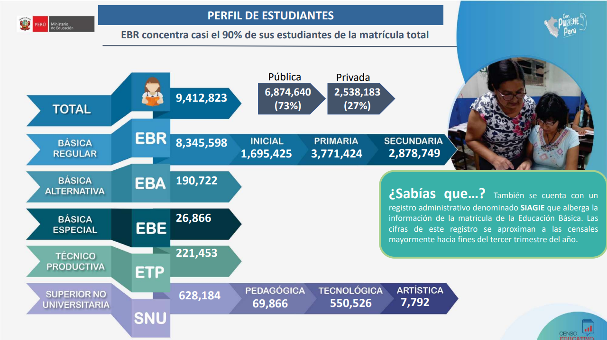
_Nota._ Elaborado a partir de los datos del Censo Educativo 2022 (p. 12), Ministerio de Educación, 2023.

#### 1.2.2 Lean UX Process

##### 1.2.2.1. Lean UX Problem Statements

En nuestro país, la gran mayoría de servicios de movilidad escolar funciona todavía de manera artesanal: los conductores y las familias se coordinan a través de llamadas, chats de WhatsApp y anotaciones sueltas en cuadernos o papeles. Esta forma de trabajar termina afectando tanto la tranquilidad de los padres como la capacidad operativa de los transportistas, 
comprometiendo la calidad y seguridad del servicio en general.

Al analizar este ecosistema identificamos un punto crítico que lo atraviesa por completo: de un lado,
las familias no tienen ninguna forma de conocer en qué momento del recorrido se encuentra su hijo; 
del otro, los transportistas no cuentan con ningún sistema digital que les permita organizar sus rutas, controlar a los estudiantes o dejar constancia de incidentes de manera ordenada. 
Lo interesante es que ambas carencias están profundamente conectadas: los padres necesitan poder ver el trayecto, pero son justamente los transportistas quienes no tienen las herramientas para ofrecerles esa visibilidad.

Esto nos lleva a plantearnos la siguiente pregunta central: 
¿de qué forma podríamos construir una solución que le dé al transportista escolar el control digital de su operación diaria, y que al mismo tiempo brinde a los padres de familia la tranquilidad de saber, en todo momento, cómo va el traslado de sus hijos?
##### 1.2.2.2. Lean UX Assumptions
Siguiendo lo planteado en la tercera edición de *Lean UX*, los requisitos de un producto no deben asumirse como verdades absolutas, sino tratarse como supuestos que aún necesitan comprobación. Bajo ese principio, en StackForge no limitamos nuestros assumptions únicamente a las categorías clásicas de negocio y usuario, sino que los desglosamos en cinco bloques que se desprenden directamente de la primera parte del Lean UX Canvas, los cuales el equipo debe dejar explícitos antes de pasar a construir hipótesis y validarlas.

**Business Problem Assumptions**

- Suponemos que el servicio de movilidad escolar privada en Lima Metropolitana se maneja en su mayoría a través de llamadas, WhatsApp y anotaciones manuales, lo que trae como consecuencia escasa visibilidad, fallos operativos y desconfianza hacia el servicio.
- Suponemos que no poder rastrear el traslado escolar impacta a la vez a los padres que buscan tranquilidad y a los transportistas, que necesitan mayor orden en su día a día.
- Suponemos que hay una oportunidad comercial clara si KidTrack logra unir la necesidad de seguridad de las familias con la necesidad de digitalización de los transportistas.

**Business Outcome Assumptions**

- Suponemos que KidTrack tendrá viabilidad si los administradores logran completar el registro de toda su operación dentro de los primeros 15 días de uso.
- Suponemos que mantener suscriptores dependerá de que la plataforma demuestre, en la práctica, ahorro de tiempo, menos errores y mayor confianza para las familias.
- Suponemos que contar con planes Básico, Intermedio y Completo nos permitirá atender tanto a pequeños grupos de padres organizados como a empresas de transporte escolar con flotas más grandes.

**User Assumptions**

- Suponemos que nuestros usuarios principales son, por un lado, padres con hijos en el nivel inicial y primaria que ya contratan transporte escolar privado, y por otro, transportistas independientes o dueños de pequeñas empresas del rubro.
- Suponemos que cualquiera de estos dos perfiles puede convertirse en Administrador cuando necesite registrar usuarios, conductores, hijos, rutas o asignaciones dentro del sistema.
- Suponemos que los padres accederán a KidTrack principalmente en los horarios de entrada y salida del colegio, mientras que los transportistas la usarán durante toda su jornada de trabajo.

**User Outcome and Benefit Assumptions**

- Suponemos que lo que buscan los padres es disminuir la incertidumbre durante el traslado sin tener que estar llamando o escribiéndole constantemente al conductor.
- Suponemos que los transportistas buscan aligerar la carga de coordinación manual, evitar errores al momento de recoger alumnos y transmitir una imagen más profesional frente a las familias.
- Suponemos que los administradores buscan tener toda la operación centralizada en un solo lugar, dejando atrás el uso de herramientas dispersas.

**Solution Assumptions**

- Suponemos que un panel donde se administren usuarios, hijos, conductores y rutas ayudará a poner en orden la operación del transporte escolar.
- Suponemos que funciones como el checklist de abordaje, la visualización de paradas, el historial de viajes y el reporte de incidencias son indispensables para generar valor desde el primer lanzamiento del MVP.
- Suponemos que el rastreo GPS en tiempo real y futuras integraciones con IoT pueden ser el diferencial de los planes más avanzados, una vez que los usuarios ya perciban el valor de la solución base.
- Suponemos que la interfaz debe sentirse limpia, ágil, accesible, disponible en dos idiomas y fácil de entender, sin importar el nivel de familiaridad tecnológica de quien la use.
##### 1.2.2.3. Lean UX Hypothesis Statements
Hipótesis 1: "Creemos que los padres de familia lograrán sentir menos incertidumbre durante el traslado escolar gracias a una vista donde puedan ver el estado del trayecto, el registro de abordaje de cada alumno y la ubicación de las paradas.
Sabremos que esto se cumple cuando, durante las primeras 4 semanas de uso, al menos el 70% de los padres activos revise el estado del trayecto como mínimo una vez al día."

Hipótesis 2: "Creemos que los transportistas podrán operar sus rutas con menos errores y menor carga de trabajo gracias a una interfaz sencilla que les permita marcar abordajes, dar seguimiento a las paradas y reportar incidencias durante el viaje.
Sabremos que esto se cumple cuando, durante las primeras 4 semanas de operación, el 80% de los trayectos registrados tenga el checklist de abordaje completado."

Hipótesis 3: "Creemos que los administradores podrán centralizar la gestión de su servicio a través de un panel único donde registren usuarios, conductores, hijos, asignaciones y rutas.
Sabremos que esto se cumple cuando, dentro de los primeros 15 días tras el onboarding, al menos el 75% de los administradores haya registrado la totalidad de sus usuarios y rutas."

Hipótesis 4: "Creemos que los administradores subirán de nivel de suscripción al notar que las funciones de los planes superiores reducen de forma notable el tiempo que dedican a coordinar el servicio.
Sabremos que esto se cumple cuando, dentro de los primeros 3 meses de uso, al menos el 20% de los administradores en planes Básico o Intermedio migre a un plan superior."
##### 1.2.2.4. Lean UX Canvas
| Sección | Contenido                                                                                                                                                                                                                                                                                                                                                                                                                                                                                                                                                              |
| :--- |:-----------------------------------------------------------------------------------------------------------------------------------------------------------------------------------------------------------------------------------------------------------------------------------------------------------------------------------------------------------------------------------------------------------------------------------------------------------------------------------------------------------------------------------------------------------------------|
| 1. Business Problem | En el Perú, el transporte escolar privado sigue funcionando de forma tradicional y sin ningún apoyo tecnológico. Los padres no tienen manera de saber cómo va el trayecto de sus hijos, y los transportistas organizan su operación a través de llamadas, WhatsApp y hojas sueltas, lo que se traduce en errores, poca eficiencia y un servicio que no genera confianza.                                                                                                                                                                                               |
| 2. Business Outcomes | Que el 75% de los administradores complete el registro de su operación dentro de los primeros 15 días. Retener al 80% de los suscriptores activos durante los primeros 3 meses. Alcanzar un 20% de upgrade del plan Básico al Intermedio dentro de los primeros 3 meses de uso.                                                                                                                                                                                                                                                                                        |
| 3. Users | Los segmentos que usan KidTrack son, por un lado, los padres de familia con hijos en nivel inicial y primaria que ya cuentan con un servicio de transporte escolar contratado, y por otro, los transportistas escolares conductores independientes o responsables de pequeñas empresas que operan dicho servicio. Cualquiera de ambos perfiles puede además tomar el rol de Administrador dentro de la plataforma.                                                                                                                                                    |
| 4. User Outcomes & Benefits | Los padres buscan bajar su nivel de incertidumbre respecto al trayecto de sus hijos, pudiendo revisar el estado del viaje sin necesidad de contactar al conductor. Los transportistas buscan digitalizar la gestión de rutas, alumnos e incidencias, disminuyendo errores operativos y transmitiendo una imagen más profesional ante las familias. Quienes cumplen el rol de administrador buscan reunir toda la operación en un solo panel, dejando atrás la coordinación manual y el uso de herramientas dispersas.                                                  |
| 5. Solution Ideas | Un panel de administración para usuarios, conductores, hijos y rutas. Un checklist digital de abordaje que completa el conductor. Una vista de paradas y estado del trayecto pensada para los padres. Registro de incidencias por cada ruta. Historial de trayectos organizado por comunidad de ruta. Seguimiento GPS en tiempo real (disponible en el plan Completo). Posibilidad de integrar sensores IoT más adelante.                                                                                                                                              |
| 6. Hypotheses | Durante las primeras 4 semanas, el 70% de los padres revisa el estado del trayecto al menos una vez al día. Durante las primeras 4 semanas, el 80% de los trayectos registrados tiene el checklist de abordaje completo gracias a una interfaz operativa simple. Dentro de los primeros 15 días, el 75% de los administradores completa el registro de su operación usando el panel único de gestión. Dentro de los primeros 3 meses, el 20% de los administradores en planes Básico o Intermedio hace upgrade al notar el valor de las funciones superiores. |
| 7. What's the most important thing we need to learn first? | ¿Realmente el administrador del servicio percibe en KidTrack un valor lo bastante grande como para dejar de lado sus métodos informales actuales y pagar una suscripción mensual?                                                                                                                                                                                                                                                                                                                                                                                      |
| 8. What's the least amount of work we need to do to learn the next most important thing? | Entrevistar entre 3 y 5 administradores de servicios de transporte escolar (ya sea padres representantes o transportistas independientes) para conocer qué tan dispuestos están al cambio y qué funciones consideran indispensables antes de construir el MVP.                                                                                                                                                                                                                                                                                                         |
### 1.3. Segmentos objetivo
KidTrack está pensado para dos segmentos que forman parte del ecosistema del transporte escolar privado en Lima Metropolitana.

- **Segmento 1: Padres de Familia**

  Este primer segmento agrupa a padres o apoderados con hijos en el nivel inicial o primaria que ya cuentan con un servicio de transporte escolar privado contratado. Son personas que han puesto en manos de un tercero el traslado de sus hijos, pero que durante el recorrido no reciben ningún tipo de información organizada sobre cómo va el viaje. No se trata de un segmento definido por un nivel socioeconómico particular, sino por dos condiciones puntuales: tener hijos en edad escolar que usan transporte privado y contar con acceso a internet desde algún dispositivo con navegador. Lo que principalmente los motiva a usar KidTrack es poder reducir esa sensación de no saber si su hijo abordó con seguridad, en qué punto del trayecto se encuentra o si pasó algo fuera de lo normal durante el viaje. Para tener una idea del tamaño de este segmento, el Censo Educativo 2022-2023 señala que Lima Metropolitana cuenta con cerca de 1.9 millones de estudiantes repartidos en aproximadamente 7,602 instituciones educativas, de las cuales el 74% pertenece al sector privado (Ministerio de Educación, 2023). Esa alta cantidad de colegios privados hace que buena parte de las familias limeñas termine dependiendo de servicios externos de transporte, ya que son pocas las instituciones que tienen flota propia de transporte.

- **Segmento 2: Transportistas Escolares**

  El segundo segmento reúne a las personas o entidades responsables de operar el servicio de transporte escolar privado, y dentro de él conviven tres perfiles distintos. Está, en primer lugar, el conductor independiente que ofrece el servicio por su cuenta. Luego está el conductor contratado para manejar una movilidad organizada entre varias familias. Y finalmente, los responsables de pequeñas empresas de transporte escolar que administran una flota de vehículos y conductores a su cargo. Aunque son perfiles diferentes entre sí, comparten un mismo problema de fondo: todos trabajan sin herramientas digitales especializadas y recurren a métodos manuales e informales para gestionar una actividad que compromete directamente la seguridad de menores de edad. La importancia de este segmento queda reflejada en que las movilidades escolares autorizadas en Lima cayeron un 25% en apenas un año, lo cual apunta a un aumento de la informalidad en el sector y, con ella, a menos mecanismos de control sobre el servicio que reciben los niños (Autoridad de Transporte Urbano para Lima y Callao, 2024). A esto se suma que, en 2024, la Superintendencia de Transporte Terrestre de Personas, Carga y Mercancías realizó campañas de sensibilización dirigidas a más de 47,000 escolares, lo que reafirma que la seguridad en este rubro sigue siendo un tema que preocupa a las autoridades (SUTRAN, 2024). Por todo esto, lo que impulsa a este segmento a usar KidTrack es principalmente digitalizar y profesionalizar su forma de trabajar, reducir errores en la gestión de rutas y alumnos, y ofrecer a las familias que atienden un servicio más confiable y transparente.

---
## Capítulo II: Requirements Elicitation & Analysis

### 2.1. Competidores

En esta sección se realizará la identificación de los principales competidores con modelos de negocio similares.

#### 2.1.1 Análisis Competitivo

<table>
  <tr>
    <th colspan="22">Análisis del Panorama Competitivo</th>
  </tr>

  <tr>
    <td colspan="1"><strong>¿Por qué llevar a cabo el análisis?</strong></td>
    <td colspan="17">
      Este análisis nos permite conocer las características, ventajas y
      limitaciones de las principales soluciones de transporte escolar
      existentes en el mercado. También ayuda a identificar oportunidades
      de diferenciación y áreas de mejora para KidTrack.
    </td>
  </tr>

  <tr>
   <td colspan="2"></td>
   <td>
    <strong>KidTrack</strong> 
    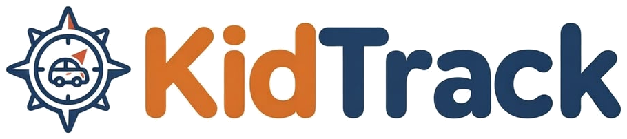
   </td>
   <td>
    <strong>OnTrack School</strong> 
    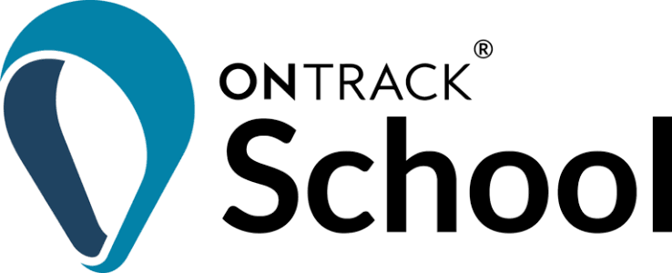
   </td>
   <td>
    <strong>SafeRoute Parent</strong> 
    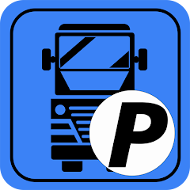
   </td>
   <td>
    <strong>BusRight</strong> 
    
   </td>
  </tr>
  <!-- Perfil -->
  <tr>
    <td rowspan="2"><strong>Perfil</strong></td>
    <td><strong>Overview</strong></td>
    <td> Plataforma de monitoreo y gestion de transporte escolar</td>
    <td>
      Plataforma de gestión de transporte escolar para colegios y empresas de transporte.
    </td>
    <td>
      Plataforma de monitoreo y seguridad del transporte escolar enfocada principalmente en padres de familia.
    </td>
    <td>
      Plataforma integral para la gestión y optimización del transporte escolar enfocados en colegios locales.
    </td>
  </tr>

  <tr>
    <td><strong>Ventaja Competitiva</strong></td>
    <td>Roles especificos tanto para el padre como para el conductor y herramientas para la gestion de los viajes escolares</td>
    <td>
      Integra la gestión del transporte, seguimiento en tiempo real,
      control de acceso y otros servicios escolares en una sola plataforma.
    </td>
    <td>
      Enfoque en seguridad, seguimiento en tiempo real, alertas
      y tranquilidad para los padres durante el traslado.
    </td>
    <td>
      Combina planificación de rutas, GPS, gestión de estudiantes,
      conductores y comunicación con los padres.
    </td>
  </tr>

  <!-- Perfil de Marketing -->
  <tr>
    <td rowspan="2"><strong>Perfil de Marketing</strong></td>
    <td><strong>Mercado Objetivo</strong></td>
    <td>Padres de familia y conductores de movilidad escolar</td>
    <td>
      Colegios, instituciones educativas y empresas de
      transporte escolar.
    </td>
    <td>
      Padres de familia, colegios y operadores de
      transporte escolar.
    </td>
    <td>
      Distritos escolares, departamentos de transporte y
      grandes operadores de transporte estudiantil.
    </td>
  </tr>

  <tr>
    <td><strong>Estrategias de Marketing</strong></td>
    <td>Variedad de herramientas y seguridad para la correcta gestion de viajes escolaes </td>
    <td>
      Marketing B2B dirigido a instituciones educativas mediante
      demostraciones, presencia digital y casos de éxito.
    </td>
    <td>
      Marketing enfocado en seguridad, tranquilidad de los padres,
      seguimiento en tiempo real y protección de los estudiantes.
    </td>
    <td>
      Marketing B2B orientado a eficiencia operativa, reducción de
      costos, seguridad y optimización de rutas.
    </td>
  </tr>

  <!-- Perfil de Producto -->
  <tr>
    <td rowspan="3"><strong>Perfil de Producto</strong></td>
    <td><strong>Productos y Servicios</strong></td>
    <td>Plataforma web, dashboard,GPS</td>
    <td>
      Gestión de rutas, GPS, alumnos, vehículos, conductores,
      notificaciones y control de acceso.
    </td>
    <td>
      Seguimiento GPS, ETA, alertas, geocercas, monitoreo del
      conductor y comunicación con padres.
    </td>
    <td>
      Planificación de rutas, GPS, gestión de estudiantes,
      navegación para conductores, notificaciones y seguimiento.
    </td>
  </tr>

  <tr>
    <td><strong>Precios y Costos</strong></td>
    <td>Suscripcion mensual de entre $.9.99 y $.49.99</td>
    <td>
      Precios personalizados según los servicios y características contratados por cada institución.
    </td>
    <td>
      Aplicación gratuita para padres. 
    </td>
    <td>
      Precios personalizados según el tamaño y las necesidades de cada organización.
    </td>
  </tr>

  <tr>
    <td><strong>Canales de Distribución (Web y/o Móvil)</strong></td>
    <td> Plataforma web</td>
    <td>
      Plataforma web y aplicaciones móviles.
    </td>
    <td>
      Aplicación móvil.
    </td>
    <td>
      Plataforma web y aplicacion móvil.
    </td>
  </tr>

  <!-- Análisis SWOT -->
  <tr>
    <td rowspan="4"><strong>Análisis SWOT</strong></td>
    <td><strong>Fortalezas</strong></td>
    <td>Sistema enfocado en seguimiento de viajes, control de viajes, agendas, comunicación y gestión</td>
    <td>
      Amplia propuesta de valor, integración con servicios escolares y presencia en el mercado latinoamericano.
    </td>
    <td>
      Fuerte enfoque en seguridad con monitoreo avanzado en tiempo real.
    </td>
    <td>
      Plataforma completa con optimización de rutas,
      gestión operativa y herramientas de seguridad.
    </td>
  </tr>

  <tr>
    <td><strong>Debilidades</strong></td>
    <td>Modelo de negocio nuevo en un mercado con mucha incertidumbre</td>
    <td>
      Puede resultar complejo para pequeños operadores y depende principalmente de instituciones educativas.
    </td>
    <td>
      Se concentra principalmente en monitoreo y seguridad, con menor énfasis en la gestión integral del transporte.
    </td>
    <td>
      Está orientado principalmente a organizaciones grandes y al mercado estadounidense.
    </td>
  </tr>

  <tr>
    <td><strong>Oportunidades</strong></td>
    <td>Operar en un mercado donde aun no se ha desarrollado a profundidad un modelo de negocio similar</td>
    <td>
      Posibilidad de expandirse en Latinoamérica y ofrecer más servicios
      para empresas de transporte escolar.
    </td>
    <td>
      Capacidad de incorporar eficientes funcionalidades de gestión de rutas para alumnos y conductores.
    </td>
    <td>
      Capacidad de expandirse hacia nuevos mercados mediante la incorporacion de inteligencia artificial.
    </td>
  </tr>

  <tr>
    <td><strong>Amenazas</strong></td>
    <td>Se proyecta trabajar en un mercado donde la informalidad esta establecida y el modelo de negocio aun no es lo suficientemente atractivo.</td>
    <td>
      Nuevas plataformas SaaS, soluciones locales de transporte y sistemas GPS de menor costo.
    </td>
    <td>
      Competidores que integren monitoreo, gestión, pagos
      y comunicación en una sola plataforma.
    </td>
    <td>
      Ofertas en aumento de software enfocados en colegios.
    </td>
  </tr>
</table>

    
#### 2.1.2. Estrategias y tácticas frente a competidores

En base al analisis competitivo realizado, se plantearan las siguientes estrategias y tácticas para hacer frente a nuestros competidores:

#### Enfoque en la especialización del problema

- KidTrack se enfocará específicamente en el transporte escolar, incorporando herramientas diseñadas para las necesidades de este sector, como el control de abordaje, la administración de rutas y el registro de incidencias.
- De esta manera, la plataforma busca atender aspectos operativos y de seguridad que normalmente no son considerados por las aplicaciones convencionales de geolocalización.

#### Estrategia de digitalización del sector no estructurado

- La solución estará dirigida principalmente a transportistas independientes que actualmente gestionan sus servicios mediante WhatsApp, llamadas telefónicas y procesos manuales.
- KidTrack ofrecerá una plataforma sencilla y fácil de utilizar, permitiendo digitalizar estas actividades sin requerir conocimientos técnicos avanzados ni procesos complejos de implementación.

#### Diferenciación mediante simplicidad y accesibilidad

- Se priorizará una experiencia simple, intuitiva y de bajo costo, diferenciándose de plataformas corporativas más complejas, como OnTrack School.
- La interfaz estará diseñada especialmente para reducir las tareas administrativas del conductor y facilitar su uso durante la operación diaria.

#### Estrategia de confianza y seguridad para los padres

- KidTrack buscará disminuir la incertidumbre de los padres mediante notificaciones automáticas sobre el abordaje, seguimiento del recorrido y alertas en tiempo real.
- Esto permitirá reemplazar la comunicación informal y dispersa por un sistema organizado que proporcione información clara, oportuna y confiable sobre el traslado de los estudiantes.

#### Estrategia de crecimiento progresivo y escalabilidad

- La plataforma contará con planes escalonados, como Básico, Intermedio y Completo, que podrán adaptarse al crecimiento de la cantidad de estudiantes o vehículos administrados por cada cliente.
- Este modelo permitirá facilitar la incorporación de nuevos usuarios mediante una opción inicial de bajo costo, con la posibilidad de ampliar los servicios conforme aumenten sus necesidades.

#### Estrategia de posicionamiento local

- Inicialmente, KidTrack estará orientado a las dinámicas operativas y características geográficas de Lima Metropolitana, buscando comprender las necesidades específicas del transporte escolar en este mercado.
- Una vez consolidada la solución a nivel local, se podrá evaluar su expansión progresiva hacia otras ciudades del Perú.

#### Estrategia de preparación tecnológica a futuro

- La arquitectura de KidTrack estará diseñada considerando futuras integraciones con tecnologías IoT, como sensores, cámaras y otros dispositivos de monitoreo.

### 2.2. Entrevistas

#### 2.2.1 Diseño de entrevistas

En esta sección se han definido una cierta cantidad de preguntas para nuestros segmentos objetivos, con la finalidad de obtener información cualitativa como opiniones o descripciones. Esta información nos será de gran ayuda en el desarrollo de nuestra solución. 

**Preguntas Generales**

- ¿Cuál es su nombre?
- ¿Qué edad tiene?
- ¿En qué distrito vive?
- Vamos relacionandonos un poco mas al tema tecnologico ¿Cuál es la herramienta tecnologica que mas usa? Entre PC y/o Celular, especificar si es Windows, Mac, Android o Iphone.
- ¿Podrías contarme un poco sobre tu entorno familiar? Por ejemplo, si vives con una familia o tienes hijos.

**Preguntas para segmento Objetivo 1: Conductor**
- ¿En qué distrito o zona sueles trabajar?
- ¿Trabajas de manera independiente o con una empresa u otro grupo de personas?
- Cuéntame como es un día de trabajo, desde que empieza el día hasta que termina.
- ¿Cómo armas y organizas actualmente tus recorridos? ¿Qué herramientas usas (cuaderno, WhatsApp, bloc de notas)?
- ¿Qué fue lo más difícil de organizar en tus rutas el último mes?
- ¿Cómo te comunicas con los padres de familia? 
- Cuéntame de la última vez que un estudiante no fue al colegio. ¿Cómo te enteraste y que hiciste al respecto?
- ¿Con qué frecuencia te avisan si lo estudiantes van a demorar en salir o no te avisan? ¿Qué pasó la última vez que sucedió algo así?
- Cuéntame de la última vez que hubo un retraso o cambio de ruta. ¿Qué hiciste y cómo avisaste a los padres?
- ¿Los padres de familia tienen acceso a la ubicación en tiempo real? ¿Qué herramienta usas?
- ¿Alguna vez perdiste tiempo, dinero o un cliente por un problema de coordinación? Cuéntame que sucedió
- ¿Has pagado alguna vez por una herramienta o servicio para tu trabajo? ¿Cuál y cuánto?

**Preguntas para segmento Objetivo 2: Padre de Familia**
- ¿Desde hace cuánto tiempo empezaste a utilizar el servicio de transporte escolar?
- ¿Optas por usarlo cada año y durante todo el año o con qué frecuencia lo contratas?
- Cuéntame cómo es un día normal en cuanto al traslado o diferentes traslados de tu hijo, desde que sale de casa hasta que regresa.
- ¿Cómo elegiste al conductor o servicio actual? ¿Qué otras opciones evaluaste o descartaste?
- ¿Cuánto pagas al mes por el servicio?
- ¿Alguna vez cambiaste de transporte? Es decir, si optaste por no usar transporte escolar ¿Qué pasó para que lo hicieras?
- ¿Estas informado acerca de las rutas que toma el transporte escolar y los diferentes puntos de recojo de los otros estudiantes?
- Cuéntame de la última vez que sentiste preocupación o no supiste dónde estaba tu hijo/a. ¿Qué ocurrió y qué hiciste?
- ¿Cómo te enteras de que llegó al colegio o a casa? ¿A quién le escribes o llamas?
- ¿Qué pasa cuando el conductor se retrasa o cambia la hora de recojo y como te enteras? Cuéntame acerca de la última vez que sucedió algo así
- ¿Tienes acceso a la ubicación en tiempo real? ¿Qué herramienta usas?
- Cuéntame acerca de la última vez que tuviste algún problema con el conductor por falta de comunicación. ¿Qué sucedió? ¿Cómo se solucionó?

#### 2.2.2. Registro de entrevistas

#### Entrevista 1: 

| Campo                          | Detalle                                                                                                                                                                                         |
| :----------------------------- | :---------------------------------------------------------------------------------------------------------------------------------------------------------------------------------------------- |
| **Nombre y Apellidos**         |        Eduardo Martinez                                                                                                                                                                             |
| **Edad**                       |                                                                                 28 años                                                                        |
| **Distrito / Zona de trabajo** |                                                                                                Surco                                |
| **Segmento**                   |         Conductor                                                                                                                         |
| **Inicio en video**            |              00:00                                                                                                                                                                      |
| **Fin de video**               |              8:13                                                                                                                                                                              |
|     **Duración**                   |             8:13 min                                                             -                                                                                                              |
| **URL del video**              | [Entrevista 1 ](https://upcedupe-my.sharepoint.com/:v:/g/personal/u201914367_upc_edu_pe/IQDXAma4S1rEQY8IfSRseXYiARoG6SFULg33qLhhr5iSrHc?e=4llkew&nav=eyJyZWZlcnJhbEluZm8iOnsicmVmZXJyYWxBcHAiOiJTdHJlYW1XZWJBcHAiLCJyZWZlcnJhbFZpZXciOiJTaGFyZURpYWxvZy1MaW5rIiwicmVmZXJyYWxBcHBQbGF0Zm9ybSI6IldlYiIsInJlZmVycmFsTW9kZSI6InZpZXcifX0%3D) |

#### Screenshot

  

### Resumen Descriptivo de la Entrevista

#### Características Objetivas y Entorno

Eduardo Martinez tiene 28 años y vive en Surco. Es un conductor joven que se desenvuelve en un entorno urbano y que, por su edad, está bastante familiarizado con el uso de herramientas digitales. Aunque todavía no tiene hijos ni una familia propia, muestra una actitud responsable frente al servicio y procura que cada traslado se realice de forma segura y sin inconvenientes.

#### Herramientas, Tecnología y Canales de Interacción

Actualmente utiliza herramientas informales para operar:

- WhatsApp como canal de comunicación con los padres de familia
- Google Maps para navegación y rutas alternas
- Smartphone como dispositivo principal de trabajo

El uso del teléfono móvil es la herramienta principal por lo que se evidencia familiaridad con aplicaciones digitales de uso cotidiano.

#### Características Subjetivas y Personalidad

Eduardo presenta un perfil joven, práctico y responsable. Se muestra cómodo utilizando tecnología y está abierto a utilizar herramientas que puedan facilitar su trabajo.
También demuestra preocupación por hacer bien su trabajo y porque los traslados se realicen de manera segura. 

#### Pain Points Detectados

- Dificultad para comunicarse con clientes que tienen poco tiempo disponible.
- Espera de respuestas para poder confirmar o coordinar determinados detalles.
- Exceso de mensajes o llamadas durante el servicio.
- Posibles distracciones al tener que revisar constantemente el celular.
- Confusiones cuando la información no está organizada o llega de manera separada.
- Presión por asegurarse de que todo salga correctamente durante el recorrido.
- Necesidad de mantener la seguridad sin descuidar la comunicación con los clientes.

#### Oportunidades Identificadas

- Implementar una comunicación más rápida y organizada entre conductores y clientes.
- Automatizar confirmaciones y avisos para reducir mensajes innecesarios.
- Permitir que los clientes confirmen información sin necesidad de comunicarse constantemente con el conductor.
- Gestionar horarios, rutas, datos y avisos importantes en una sola plataforma.
- Crear alertas simples que permitan al conductor conocer información importante sin distraerse.
- Reducir la dependencia de mensajes y llamadas para realizar coordinaciones básicas.
---

#### Entrevista 2: 

| Campo                          | Detalle                                                                                                                                                                                         |
| :----------------------------- | :---------------------------------------------------------------------------------------------------------------------------------------------------------------------------------------------- |
| **Nombre y Apellidos**         |   Jairo Douglas Lanchi                                                                                                                                                                                  |
| **Edad**                       |   28                                                                                                                                                     |
| **Distrito / Zona de trabajo** |   Comas                                                                                                                              |
| **Segmento**                   |   Conductor                                                                                                                               |
| **Inicio en video**            |           8:13                                                                                                                                                                          |
| **Fin de video**               |           18:44                                                                                                                                                                               |
|     **Duración**                   |    10:31 min                                                                                                                                                                                     |
| **URL del video**              | [Entrevista 2 ](https://upcedupe-my.sharepoint.com/:v:/g/personal/u201914367_upc_edu_pe/IQDXAma4S1rEQY8IfSRseXYiARoG6SFULg33qLhhr5iSrHc?e=4llkew&nav=eyJyZWZlcnJhbEluZm8iOnsicmVmZXJyYWxBcHAiOiJTdHJlYW1XZWJBcHAiLCJyZWZlcnJhbFZpZXciOiJTaGFyZURpYWxvZy1MaW5rIiwicmVmZXJyYWxBcHBQbGF0Zm9ybSI6IldlYiIsInJlZmVycmFsTW9kZSI6InZpZXcifX0%3D) |

#### Screenshot

 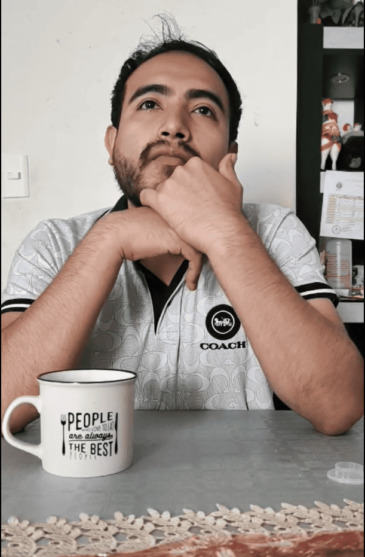 

#### Resumen Descriptivo de la Entrevista

#### Características Objetivas y Entorno
Jairo Douglas tiene 28 años de edad, trabaja como conductor privado para un colegio y por sus tardes libres se dedica al taxeo. Actualmente solo vive con su pareja y sin hijos. Por el momento se guia bastante por las rutas debido a sus años de experiencia pero si ubica que necesita una herramienta externa para manejar bien sus horarios, disponibilidad y ser más organizado

#### Herramientas, Tecnología y Canales de Interacción

- WhatsApp como canal de comunicación con los padres
- Smartphone como dispositivo principal de trabajo para anotar la lista de alumnos
-Lista de alumnos basado a mano
-Uso de Google Maps 

#### Características Subjetivas y Personalidad

- No requiere mucho de mapas pero si saber la situación de las rutas(tráfico,etc)
- Prefiere una herramienta externa rápida
- Es muy aficionado a la tecnología junto con su pareja
- Tiene días atareados ya que se dedica completamente al servicio de su vhículo

#### Pain Points Detectados

- No cuenta con una manera rápida de contactar a los padres sin detener el vehículo
- Estar al tanto de la lista de alumnos
- Falta de información sobre el estado de las rutas
- Pérdida de tiempo de que le cancelen la ruta o el servicio por demora

#### Oportunidades Identificadas

- Ve un potencial válido en la propuesta mostrada
- Quiere poder ver con facilidad los accidentes o incidentes en las rutas
- Quiere listar a los alumnos de manera rápida y eficaz
- Le emociona una solución tecnológica 

#### Validación del Arquetipo

Se puede validar que el entrevistado cumple perfectamente con el arquetipo conductor y sirve perfectamente para moldear las user personas que Kidtrack necesita.
#### Entrevista 3: 

| Campo                          | Detalle                                                                                                                                                                                         |
| :----------------------------- | :---------------------------------------------------------------------------------------------------------------------------------------------------------------------------------------------- |
| **Nombre y Apellidos**         |                         Carla Peláez                                                                                                                                                            |
| **Edad**                       | 38 años                                                                                                                                                         |
| **Distrito / Zona de trabajo** | Santiago de Surco, Lima                                                                                                                                |
| **Segmento**                   | Padre de familia                                                                                                                                  |
| **Inicio en video**            |          18:44                                                                                                                                                                            |
| **Fin de video**               |     23:30                                                                                                                                                                                       |
|     **Duración**                   |               04:46 min                                                                                                                                                                      |
| **URL del video**              | [Entrevista 3](https://upcedupe-my.sharepoint.com/:v:/g/personal/u201914367_upc_edu_pe/IQDXAma4S1rEQY8IfSRseXYiARoG6SFULg33qLhhr5iSrHc?e=4llkew&nav=eyJyZWZlcnJhbEluZm8iOnsicmVmZXJyYWxBcHAiOiJTdHJlYW1XZWJBcHAiLCJyZWZlcnJhbFZpZXciOiJTaGFyZURpYWxvZy1MaW5rIiwicmVmZXJyYWxBcHBQbGF0Zm9ybSI6IldlYiIsInJlZmVycmFsTW9kZSI6InZpZXcifX0%3D) |

#### Screenshot

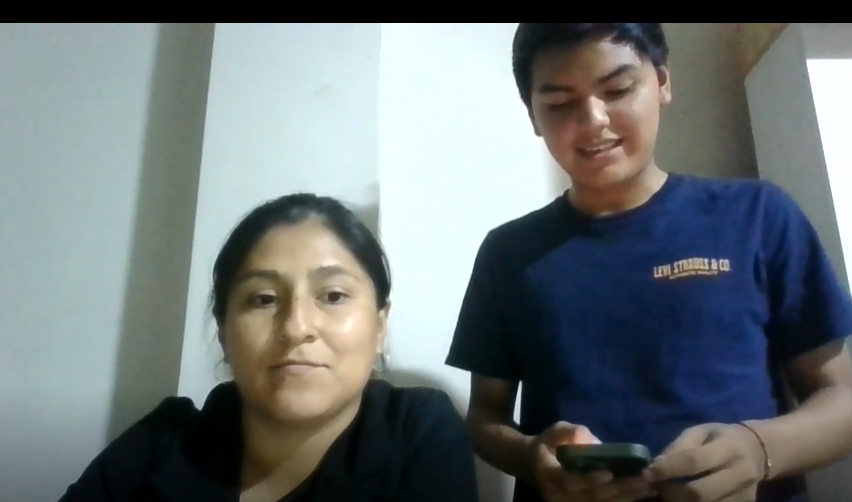

---

#### Resumen Descriptivo de la Entrevista

#### Características Objetivas y Entorno

Carla Peláez es una madre de familia de 38 años residente en el distrito de Santiago de Surco. Vive con su esposo y sus cuatro hijos, de los cuales dos utilizan actualmente servicio de transporte escolar. Representa a familias urbanas con alta responsabilidad logística diaria, donde el traslado escolar cumple un rol clave para compatibilizar horarios familiares, laborales y educativos.

El transporte escolar forma parte importante de su rutina diaria, ya que permite asegurar la asistencia puntual de sus hijos al centro educativo.

#### Herramientas, Tecnología y Canales de Interacción

Actualmente utiliza herramientas informales para operar:

- WhatsApp como canal de comunicación con los conductores
- Smartphone como dispositivo principal de trabajo

El uso del teléfono móvil es la herramienta principal por lo que se evidencia familiaridad con aplicaciones digitales de uso cotidiano.

#### Características Subjetivas y Personalidad

A partir de sus respuestas, se identifica un perfil:

- Protector y orientado al bienestar familiar
- Preventivo frente a riesgos externos
- Receptivo a herramientas digitales útiles
- Sensible a la falta de información
- Altamente motivado por la seguridad de sus hijos

#### Pain Points Detectados

Durante la entrevista se identificaron preocupaciones relevantes:

- Angustia cuando la movilidad se retrasa
- Ansiedad cuando no llega la confirmación del colegio
- Falta de visibilidad en tiempo real durante el trayecto
- Dependencia de terceros para validar información
- Percepción de inseguridad en el contexto actual de transporte urbano
- Menor confianza cuando la movilidad no pertenece directamente al colegio

Estos puntos reflejan una necesidad clara de trazabilidad, confianza y comunicación inmediata.

#### Oportunidades Identificadas

Carla mostró alta aceptación hacia una plataforma digital que le permita:

- Ver la ruta del vehículo en tiempo real
- Conocer si ocurrió algún inconveniente durante el trayecto
- Recibir confirmación automática de llegada
- Saber la ubicación permanente de sus hijos
- Reducir ansiedad e incertidumbre diaria
- Incrementar confianza en el servicio contratado

Para Carla, el atributo más importante para sentirse tranquila es:

“Saber en dónde está en todo momento”.

#### Validación del Arquetipo

Los datos recolectados en esta entrevista validan los supuestos definidos para el segmento Padre de Familia dentro del proyecto KidTrack. Se confirma que este segmento prioriza:

- Seguridad del estudiante
- Monitoreo en tiempo real
- Alertas automáticas
- Comunicación confiable
- Reducción de ansiedad durante el traslado escolar

Asimismo, respalda los objetivos del Impact Mapping relacionados con generar tranquilidad, confianza y visibilidad operacional para las familias usuarias.
---

#### Entrevista 4: 

| Campo                          | Detalle                                                                                                                                                                                         |
| :----------------------------- | :---------------------------------------------------------------------------------------------------------------------------------------------------------------------------------------------- |
| **Nombre y Apellidos**         |   Edgar Alfonso Su Llaque                                                                                                                                                |
| **Edad**                       |          56                                                                                                                                             |
| **Distrito / Zona de trabajo** |                Santiago de Surco                                                                                                                 |
| **Segmento**                   |           Padre de familia                                                                                                                       |
| **Inicio en video**            |             23:30                                                                                                                                                                        |
| **Fin de video**               |              29:27                                                                                                                                                                             |
|     **Duración**                   |                5:57 min                                                5:57                                                                                                                         |
| **URL del video**              | [Entrevista 4](https://upcedupe-my.sharepoint.com/:v:/g/personal/u201914367_upc_edu_pe/IQDXAma4S1rEQY8IfSRseXYiARoG6SFULg33qLhhr5iSrHc?e=4llkew&nav=eyJyZWZlcnJhbEluZm8iOnsicmVmZXJyYWxBcHAiOiJTdHJlYW1XZWJBcHAiLCJyZWZlcnJhbFZpZXciOiJTaGFyZURpYWxvZy1MaW5rIiwicmVmZXJyYWxBcHBQbGF0Zm9ybSI6IldlYiIsInJlZmVycmFsTW9kZSI6InZpZXcifX0%3D) |

#### Screenshot

 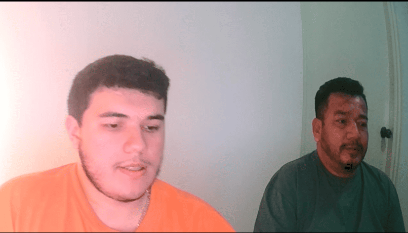 

### Resumen Descriptivo de la Entrevista

El entrevistado es **Edgar Alfonso Su**, de 56 años, residente en el distrito de Santiago de Surco. Tiene un hijo de 10 años que asiste al colegio y utiliza el servicio de movilidad escolar privada de lunes a viernes. Por las mañanas, Edgar prepara al menor con su lonchera y baja a la recepción de su edificio para entregarlo a la van. Su mayor dolor es la incertidumbre durante el trayecto: no sabe dónde está la unidad en tiempo real, teme por accidentes viales o demoras y debe asumir que todo salió bien si no recibe llamadas de emergencia en un lapso de 30 a 40 minutos. Considera indispensable y lógico contar con una herramienta similar a las apps de taxi (Uber, Yango) para monitorear el recorrido y tener la confirmación de llegada a salvo.

---

### Características Objetivas y Entorno

* **Nombre completo:** Edgar Alfonso Su
* **Edad:** 56 años
* **Lugar donde vive:** Santiago de Surco, Lima (vive en departamento en edificio)
* **Situación familiar:** Divorciado, un hijo menor de 10 años y una mascota
* **Contexto de la actividad:** Rutina diaria de lunes a viernes; prepara la lonchera en la mañana, baja a recepción a esperar el transporte y coordina la recepción por la tarde
* **Recursos y condiciones del servicio:** Contrató a una transportista recomendada durante la matrícula del colegio tras verificar personalmente la unidad, la capacidad de pasajeros y la tarifa mensual

---

### Herramientas, Tecnología y Canales de Interacción

* **Dispositivos:** Celular inteligente (smartphone), utilizado continuamente durante el día
* **Aplicaciones y plataformas:** Uber, Yango, aplicaciones bancarias y de pagos móviles
* **Canales de comunicación:** Llamadas telefónicas y WhatsApp/mensajería directa con la conductora; avisos del colegio ante faltas
* **Uso digital:** Acostumbrado a resolver trámites cotidianos, pagos y transporte mediante aplicaciones móviles sin necesidad de efectivo

---

### Características Subjetivas y Personalidad

* **Prioridades:** Puntualidad estricta y seguridad física del menor
* **Preocupaciones:** Posibilidad de siniestros viales y demoras que no le sean notificadas a tiempo
* **Sensación de control:** Manifiesta desasosiego al admitir que una vez que el niño sube a la movilidad, la situación «escapa de sus manos»
* **Hábito ante la falta de noticias:** Adopta la regla pasiva de que «la ausencia de llamadas en 30-40 minutos equivale a que llegó bien»
* **Toma de decisiones:** Evalúa recomendaciones escolares formales, revisión visual de la unidad y estado legal de la misma antes de elegir el servicio

---

### Pain Points Detectados

* **Falta de visibilidad del trayecto:** No tiene ningún medio para saber la ubicación geográfica del vehículo en tiempo real.
* **Incertidumbre y zozobra:** No saber si un retraso se debe al tráfico habitual o a un incidente grave genera angustia.
* **Avisos reactivos:** El transportista comunica cambios de ruta o retrasos con poca anticipación o recién al llegar al punto de recojo.
* **Temor por el estado de las unidades:** Desconfianza hacia movilidades escolares antiguas que circulan sin revisiones técnicas óptimas ni SOAT vigente.

---

### Oportunidades Identificadas

* **Trazabilidad GPS en vivo:** Mapa interactivo con la ruta en tiempo real del vehículo, replicando el modelo de Uber/Yango.
* **Notificaciones de estado automáticas:** Alertas push al momento de salida, recojo en casa y entrega efectiva en la puerta del colegio.
* **Transparencia y ficha técnica:** Visualización directa dentro del perfil del chofer de SOAT, revisiones técnicas y capacidad autorizada de la van.
* **Alertas preventivas de demora:** Avisos automáticos si la unidad presenta más de 10 o 15 minutos de retraso por congestión vehicular.

---

### Validación del Arquetipo

El entrevistado valida de forma directa el arquetipo de **Padre de Familia Usuario de Movilidad Escolar**:
* Depende operativamente del transporte escolar diario por comodidad y tiempos.
* Posee familiaridad y destreza con smartphones y apps de geolocalización.
* Sufre la falta de información como una fuente continua de estrés matutino y vespertino.
* Demuestra alta disposición e interés hacia la adopción de una solución digital que brinde monitoreo y confirmaciones automáticas de llegada.

---

#### Entrevista 5: 

| Campo                          | Detalle          |
| :----------------------------- |:-----------------|
| **Nombre y Apellidos**         | Maximo Quevedo   |
| **Edad**                       | 28 años          |
| **Distrito / Zona de trabajo** | Lima             |
| **Segmento**                   | Padre de Familia |
| **Inicio en video**            |       29:27           |
| **Fin de video**               |        37:29           |
|     **Duración**                   |      8:02 min            |
| **URL del video**              |       [Entrevista 5](https://upcedupe-my.sharepoint.com/:v:/g/personal/u201914367_upc_edu_pe/IQDXAma4S1rEQY8IfSRseXYiARoG6SFULg33qLhhr5iSrHc?e=4llkew&nav=eyJyZWZlcnJhbEluZm8iOnsicmVmZXJyYWxBcHAiOiJTdHJlYW1XZWJBcHAiLCJyZWZlcnJhbFZpZXciOiJTaGFyZURpYWxvZy1MaW5rIiwicmVmZXJyYWxBcHBQbGF0Zm9ybSI6IldlYiIsInJlZmVycmFsTW9kZSI6InZpZXcifX0%3D)           |

#### Screenshot

 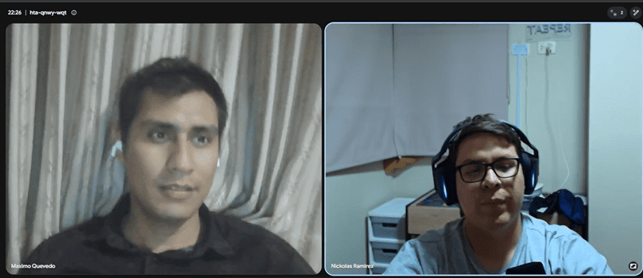 

#### Resumen Descriptivo de la Entrevista
Entrevista de validación de usuario realizada por Nickolas Ramírez a Máximo Quevedo, padre de familia residente en Lima, orientada a identificar necesidades, puntos de fricción y disposición de adopción de una plataforma móvil para el monitoreo y gestión de movilidad escolar privada.

#### Características Objetivas y Entorno
* **Hijo a cargo:** Padre de un niño de 7 años en edad escolar.
* **Ubicación y desplazamientos:** Reside y transita en Lima; utiliza arterias congestionadas como la Av. Javier Prado.
* **Tiempos de traslado:** Llevar al menor al colegio y luego dirigirse al centro de trabajo le tomaba cerca de 1 hora de trayecto; contratar movilidad escolar reduce su traslado directo a ~40 minutos.
* **Entorno laboral:** Trabajo de oficina analítico que demanda alta concentración (elaboración de reportes exhaustivos, informes y análisis de costos).

#### Herramientas, Tecnología y Canales de Interacción
* **Canales actuales:** Coordinación mediante WhatsApp y llamadas telefónicas tradicionales tanto con el transportista como con el colegio.
* **Referentes tecnológicos:** Familiarizado con el uso habitual de aplicaciones bancarias y financieras para supervisión y trazabilidad de transacciones.
* **Preferencia de interacción:** Notificaciones push en segundo plano (estilo alertas transaccionales), descartando la necesidad de supervisar activamente una pantalla con mapa en vivo durante la jornada laboral.

#### Características Subjetivas y Personalidad
* **Perfil:** Analítico, pragmático, enfocado en la eficiencia de tiempos y altamente receptivo a soluciones tecnológicas modernas.
* **Postura frente a la innovación:** Considera indispensable la modernización digital en la era actual; afirma que descartaría a prestadores de servicio que rehúsen adaptarse.
* **Factores emocionales:** Prioriza la tranquilidad y la certidumbre; experimenta angustia ante la falta de comunicación sobre el paradero o bienestar del menor.

#### Pain Points Detectados
* **Falta de visibilidad y trazabilidad en tiempo real:** Desconocimiento de la hora exacta de llegada o aproximación a la vivienda.
* **Ausencia de comunicación ante contingencias:** Ante un retraso de 20 minutos por congestión vehicular, no obtuvo respuesta ni del conductor ni de la dirección escolar, provocando preocupación por accidentes o incidentes de seguridad.
* **Desorganización financiera:** Cobros y acuerdos coordinados por mensajería informal sujetos a confusiones, desfases de montos y carencia de un historial consolidado.
* **Fricción al reportar novedades:** La notificación manual por chat para avisar que el alumno no asistirá demanda tiempo y está expuesta a omisiones o lecturas tardías del conductor.

#### Oportunidades Identificadas
* **Alertas automáticas de hitos clave:** Notificaciones instantáneas y pasivas de eventos relevantes ("menor a bordo", "llegada confirmada al colegio").
* **Módulo centralizado de pagos e historial:** Registro ordenado y auditable de cobros mensuales, acuerdos tarifarios y fechas de pago en la misma interfaz.
* **Botón de ausencia en un clic:** Mecanismo anticipado (ej. la noche previa) para registrar inasistencias sin requerir redacción de mensajes ni generar paradas innecesarias.
* **Contactos de emergencia delegados:** Configuración de usuarios secundarios autorizados para recibir avisos y alertas cuando el tutor principal se encuentre inubicable.

#### Validación del Arquetipo
* **Arquetipo validado:** *Padre profesional urbano, optimizador de tiempo y dependiente de canales digitales*.
* **Fit producto-usuario:** Validación alta y explícita; el usuario confirma que cambiaría de transportista si este se negara a implementar un sistema de monitoreo digital y respaldaría una solución que sustituya la informalidad de la mensajería tradicional.
---

### 2.2.3. Análisis de entrevistas

### Segmento Objetivo 1: Conductores de Transporte Escolar

Este análisis se realizó a partir de una muestra de las 3 entrevistas válidas del segmento de padres de familia, por lo que los porcentajes presentados nos ayudaran a construir un perfil sólido del segundo segmento objetivo.

#### Características Objetivas del Segmento

| **Característica** | **Resultado** | **Sustento** |
| ------------------------------------ | ---- | -------------------------------------------------------------- |
| Adulto joven | 100% | Eduardo tiene 28 años |
| Reside en una zona urbana | 100% | Vive en Surco |
| Pertenece al segmento de conductores | 100% | Se desempeña como conductor |
| Familiarizado con la tecnología | 100% | Se desenvuelve con facilidad utilizando herramientas digitales |
| No tiene hijos actualmente | 100% | No cuenta con hijos ni familia propia |
| Mantiene una actitud responsable | 100% | Procura que los traslados se realicen de forma segura |

#### Hallazgo

El conductor entrevistado representa un perfil joven y familiarizado con la tecnología, por lo que utilizar una herramienta digital no representa una dificultad importante para él. El principal reto se encuentra en la comunicación con los clientes, especialmente cuando estos están ocupados y no pueden responder de inmediato.

Esto evidencia una oportunidad para hacer más simples las coordinaciones y reducir la cantidad de interacciones que el conductor debe atender mientras se encuentra trabajando.

#### Uso de Tecnología y Herramientas Actuales

| **Herramienta / Canal** | **Porcentaje** |
| ------------------------------------------- | ---- |
| Teléfono móvil como dispositivo principal | 100% |
| Aplicaciones de navegación | 100% |
| Mensajería instantánea | 100% |
| Herramientas digitales para sus actividades | 100% |
| Comunicación directa con clientes | 100% |

Actualmente, la tecnología forma parte de la rutina del conductor y sirve principalmente como apoyo para la navegación y comunicación. Sin embargo, cuando algunas coordinaciones dependen de respuestas constantes de los clientes, el proceso puede hacerse más lento y generar interrupciones durante el servicio.

#### Principales Problemas Detectados (Pain Points)

| **Problema identificado** | **Porcentaje** |
| ------------------------------------------------- | ---- |
| Dificultad para comunicarse con clientes ocupados | 100% |
| Espera de respuestas para realizar coordinaciones | 100% |
| Necesidad de revisar mensajes durante el servicio | 100% |
| Posibles distracciones durante la conducción | 100% |
| Información poco organizada | 100% |
| Preocupación por mantener la seguridad | 100% |

La principal dificultad encontrada está relacionada con la comunicación. Aunque Jesús está familiarizado con la tecnología, depender de mensajes y respuestas en tiempo real puede complicar algunas coordinaciones y generar distracciones mientras realiza el recorrido.

#### Necesidades Funcionales Prioritarias

| **Necesidad mencionada** | **Porcentaje** |
| --------------------------------------- | ---- |
| Comunicación rápida con los clientes | 100% |
| Confirmaciones automáticas | 100% |
| Información clara y organizada | 100% |
| Reducir la necesidad de revisar el celular | 100% |
| Acceso rápido a información importante | 100% |
| Herramienta sencilla desde el celular | 100% |
| Funciones relacionadas con la seguridad | 100% |

El conductor necesita una solución que le permita manejar las coordinaciones de manera rápida y con la menor cantidad de interrupciones posible. Funciones como confirmaciones automáticas, avisos y mensajes predeterminados podrían ayudar a que el servicio sea más ordenado y fluido.

#### Características Subjetivas del Segmento

| **Rasgo detectado** | **Porcentaje** |
| -------------------------------------------------- | ---- |
| Familiaridad con la tecnología | 100% |
| Disposición a utilizar soluciones digitales útiles | 100% |
| Preocupación por la seguridad | 100% |
| Responsabilidad con los pasajeros | 100% |
| Valora una comunicación clara y rápida | 100% |
| Busca evitar complicaciones | 100% |
| Perfil práctico | 100% |

El perfil identificado corresponde a un conductor joven, práctico y cómodo utilizando tecnología. Su interés no estaría simplemente en usar una nueva herramienta, sino en encontrar una solución que realmente le ayude a realizar su trabajo de forma más sencilla y organizada.

#### Conclusion del segmento
A partir de esta primera entrevista, se puede observar que el conductor busca principalmente seguridad, comunicación clara y facilidad para realizar su trabajo. Nuestra solución sera útil ya que ayudara a simplificar las coordinaciones con los clientes, reducira las distracciones y permitira gestionar la información importante de manera rápida y sencilla.

### Segmento Objetivo 2: Padres de Familia

Este análisis se realizó a partir de una muestra de las 3 entrevistas válidas del segmento de padres de familia, por lo que los porcentajes presentados nos ayudaran a construir un perfil sólido del segundo segmento objetivo.

#### Características Objetivas del Segmento

| **Característica** | **Resultado** | **Sustento** |
| -------------------------------------- | ---- | -------------------------------------------------------------- |
| Edad Adulta (50 a 60 años) | 100% | Edgar tiene 56 años y pertenece al segmento de padres de familia |
| Reside en una zona urbana | 100% | Vive en Santiago de Surco |
| Tiene responsabilidades familiares | 100% | Su perfil corresponde al de un padre de familia |
| Uso de servicio de transporte escolar | 100% | No siempre usa el transporte escolar pero siempre alguna modalidad de transporte |
| Contexto cotidiano | 100% | Desarrolla su vida diaria con constantes actividades familiares |

#### Hallazgo

El entrevistado representa a un padre de familia que busca desenvolverse de manera práctica frente a las responsabilidades del día a día. Su perfil permite entender mejor las necesidades que pueden aparecer al momento de organizar actividades familiares y tomar decisiones relacionadas con la seguridad y bienestar de sus hijos.

#### Uso de Tecnología y Herramientas Actuales

| **Herramienta / Canal** | **Resultado** |
| -------------------------------------------------- | ---- |
| Teléfono celular | 100% |
| Comunicación mediante canales digitales | 100% |
| Uso de herramientas tecnológicas en actividades cotidianas | 100% |
| Comunicación directa para coordinar actividades | 100% |

Actualmente, la tecnología forma parte de la rutina de los padres de familia y puede ser utilizada como apoyo para facilitar la comunicación, organización y seguimiento de diferentes actividades.

#### Principales Problemas Detectados (Pain Points)

| **Problema identificado** | **Resultado** |
| ----------------------------------------------- | ---- |
| Preocupación por la seguridad de los hijos | 100% |
| Necesidad de contar con información clara | 100% |
| Dependencia de la comunicación para conocer el estado de una actividad | 100% |
| Incertidumbre cuando no existe información suficiente | 100% |
| Necesidad de mayor tranquilidad durante las actividades familiares | 100% |

El principal paint point identificado está relacionado con la incertidumbre. Para un padre de familia, no contar con información suficiente puede generar preocupación, especialmente cuando se trata de actividades relacionadas con sus hijos.

#### Necesidades Funcionales Prioritarias

| **Necesidad mencionada** | **Resultado** |
| --------------------------------------- | ---- |
| Contar con información actualizada y la ubicación en tiempo real del transporte | 100% |
| Tener mayor visibilidad sobre las actividades | 100% |
| Recibir información de manera sencilla | 100% |
| Poder comunicarse fácilmente cuando sea necesario | 100% |
| Contar con una herramienta práctica desde el celular | 100% |
| Obtener mayor tranquilidad y confianza | 100% |

Se buscara reducir la incertidumbre mediante el monitoreo a tiempo real y la fidelidad de la informacion que el padre recibe.

#### Características Subjetivas del Segmento

| **Rasgo detectado** | **Resultado** |
| ------------------------------------------ | ---- |
| Preocupación por el bienestar familiar | 100% |
| Interés por soluciones prácticas | 100% |
| Valora la información clara | 100% |
| Busca sentirse más tranquilo y seguro | 100% |
| Disposición hacia herramientas digitales útiles | 100% |
| Perfil orientado a la familia | 100% |

El entrevistado refleja un perfil principalmente familiar y practico,por lo que nuestra plataforma tendría mayor valor si es fácil de entender, rápida de utilizar.

### Conclusión del Segmento

A partir de esta primera entrevista, se puede observar que el padre de familia busca principalmente seguridad, información real y tranquilidad. Nuestra solucion planteada jugara un papel importante siempre que simplifique el proceso y no se agreguen más complicaciones.

### 2.3. Needfinding
#### 2.3.1. User Personas
En esta sección se presentan los arquetipos de usuario diseñados para representar los segmentos objetivo de **KidTrack**: el conductor de transporte escolar independiente y el padre de familia/apoderado.

La elaboración de estas fichas es el resultado de una síntesis detallada entre el análisis de la competencia y el proceso de Needfinding. Se han identificado características críticas como la alta dependencia de herramientas informales (como grupos de WhatsApp y llamadas telefónicas durante la conducción), la ansiedad generada en los padres por la incertidumbre del tráfico en Lima y la necesidad operativa de profesionalizar y digitalizar un sector mayoritariamente no estructurado.

#### Persona 1: Drivers

---
#### Persona 2: Parents

---

#### 2.3.2. User Task Matrix
En esta sección se presenta la matriz de tareas de usuario, la cual consolida las actividades fundamentales que tanto el conductor (Arturo Núñez) como el padre de familia (Fernando Nery) ejecutan para asegurar un traslado escolar exitoso.

Es importante destacar que estas tareas representan necesidades y procesos intrínsecos del servicio que existen independientemente de la presencia de una solución de software; el objetivo de **KidTrack** es optimizar y digitalizar estas interacciones para reducir la carga operativa, las distracciones al volante y la incertidumbre.

| Tarea (*User Task*) | Conductor - Frecuencia | Conductor - Importancia | Padre - Frecuencia | Padre - Importancia |
| :--- | :---: | :---: | :---: | :---: |
| Verificar lista de asistencia de alumnos | Alta | Alta | N/A | N/A |
| Identificar alumnos en el punto de recojo | Alta | Alta | N/A | N/A |
| Confirmar el abordaje seguro del alumno | Alta | Crítica | Alta | Crítica |
| Gestionar comunicación entre conductores y padres | Alta | Alta | Alta | Alta |
| Notificar retrasos o imprevistos en la ruta | Media | Alta | Alta | Crítica |
| Monitorear el progreso del trayecto | Media | Media | Alta | Alta |
| Confirmar llegada al destino final | Alta | Crítica | Alta | Crítica |
| Registrar la entrega del alumno al responsable | Alta | Crítica | Alta | Crítica |
| Coordinar cambios de último momento en el servicio | Baja | Media | Baja | Alta |
| Reportar incidencias de seguridad o salud | Baja | Crítica | Baja | Crítica |
| Consultar el estado actual del servicio | Media | Media | Alta | Alta |
| Revisar historial de trayectos realizados | Baja | Media | Media | Media |
| Organizar y optimizar rutas y paradas | Alta | Alta | N/A | N/A |

---

#### Análisis y Explicación de la Matriz

Tras el análisis de la matriz, se desprenden las siguientes conclusiones clave sobre el comportamiento y necesidades de los segmentos:

* **Coincidencias en Tareas Críticas:** Existe una convergencia total en las tareas de *"Confirmar abordaje"*, *"Confirmar llegada"* y *"Registrar entrega"*. Para ambos segmentos, estas acciones representan la columna vertebral de la confianza en el servicio, manteniendo una importancia **Crítica** debido a que involucran directamente la seguridad e integridad del menor.
* **Diferencias de Rol:** La carga operativa de planificación y ejecución (verificación de listas y organización de rutas) recae exclusivamente en el conductor. Por el contrario, el padre de familia se enfoca en tareas de supervisión pasiva como *"Monitorear el progreso"*, la cual mantiene una frecuencia alta debido a la ansiedad constante que genera la congestión vehicular en la ciudad.
* **Gestión de Incidencias:** Se observa que tareas como *"Reportar incidencias"* tienen una frecuencia baja, pero su importancia es **Crítica**. Esto valida la necesidad de que **KidTrack** ofrezca canales de notificación prioritarios e instantáneos que garanticen que, ante un imprevisto, la información fluya sin errores ni demoras.
* **Fricción en la Comunicación:** La tarea de *"Notificar retrasos"* es de frecuencia media para el conductor pero de importancia crítica para el padre, lo que resalta el mayor punto de fricción actual: la necesidad de información automatizada en tiempo real para reducir el estrés parental sin distraer al conductor mientras maneja.

#### 2.3.3. User Journey Mapping

En esta sección se presentan los **User Journey Maps** en versión *As-Is* correspondientes a los dos segmentos objetivo definidos previamente: el conductor de transporte escolar independiente (**Arturo Núñez**) y el padre de familia/apoderado (**Fernando Nery**). 

El propósito de este mapeo es comprender a fondo la experiencia actual del servicio de transporte escolar en Lima, identificando emociones, fricciones operativas, puntos críticos de comunicación y oportunidades de mejora antes de la implementación de **KidTrack**. A continuación, se detallan los mapas del viaje del usuario vinculando sus objetivos y puntos de dolor con cada etapa del proceso tradicional.

---
#### User Journey Map 1: Drivers

---
#### User Journey Map 2: Parents

#### 2.3.4. Empathy Mapping
En esta sección se presenta el análisis de empatía realizado para nuestros segmentos objetivo, buscando responder a las preguntas fundamentales del marco de trabajo: *¿Con quién estamos empatizando?*, *¿Qué necesita hacer?*, *¿Qué ve?*, *¿Qué dice?*, *¿Qué hace?*, *¿Qué oye?*, *¿Qué piensa y siente?*, e identificando claramente sus dolores (*Pains*) y ganancias (*Gains*).

---

#### Segmento Objetivo 1: Drivers

---

#### Segmento Objetivo 2: Parents

### 2.4. Big Picture Event Storming

En esta sección, se presenta el desarrollo y los resultados de la sesión de **Big Picture Event Storming** realizada por el equipo para el proyecto **KidTrack**. Este proceso consistió en una sesión colaborativa de modelado dirigida al dominio, donde el equipo se enfocó en comprender el ecosistema del negocio de movilidad escolar de manera integral.

A través de esta dinámica, se logró plasmar los eventos significativos y sus interrelaciones, construyendo una primera aproximación visual de alto nivel que explora el *landscape* completo del negocio.

---

URL: [https://miro.com/welcomeonboard/...](https://miro.com/welcomeonboard/YUlZT1h3RFF1ZWV0bEJJdWFNUkEzWmZBODdEdVZFYmRyRzZ6dHZmRm8xYnZ4aHNJTWpNZms1dEUwSmhtb1FaUE5oTE01TGcwU1FvUGVlbThKanJERFBLM1BidzZEQmUvZXZrOWcvYTlIcDI0MWZmcktoVTBkZUgrRndQMGM1QTlBS2NFMDFkcUNFSnM0d3FEN050ekl3PT0hdjE=?share_link_id=361339190464)

### 2.5. Ubiquitous Language

En esta sección se presenta el glosario de términos de negocio utilizados dentro del dominio del sistema **KidTrack**. La definición de este Lenguaje Ubicuo asegura una comunicación clara y sin ambigüedades entre los miembros del equipo de desarrollo, los interesados del proyecto y los usuarios del sistema.

| Term (English) | Equivalente en Español | Definición |
| :--- | :--- | :--- |
| **Administrator** | Administrador | Persona o entidad responsable de la gestión operativa del servicio de movilidad escolar. Administra usuarios, rutas, vehículos, estudiantes y suscripciones. |
| **Driver** | Conductor | Responsable de operar la unidad de transporte escolar y ejecutar el viaje diario. Registra eventos como inicio de trayecto, abordaje, incidencias y cierre de ruta. |
| **Parent / Guardian** | Padre de familia / Tutor / Apoderado | Usuario final que monitorea el recorrido del estudiante, recibe notificaciones y valida la seguridad del servicio. |
| **Student** | Estudiante / Alumno | Beneficiario del servicio de transporte escolar. Su estado de abordaje, traslado y entrega representa el núcleo operativo del sistema. |
| **Visitor** | Visitante | Usuario no registrado que accede a la Landing Page para conocer el servicio, consultar precios o solicitar una demostración. |
| **Subscription** | Suscripción | Acuerdo comercial que habilita el acceso a la plataforma **KidTrack** según un plan contratado y vigente. |
| **Plan** | Plan | Oferta comercial (*Basic*, *Intermediate*, *Premium*) que determina funcionalidades, límites operativos y capacidad de uso del sistema. |
| **Billing Cycle** | Ciclo de facturación | Periodo de tiempo en el que se cobra y renueva la suscripción del cliente (mensual o anual). |
| **Payment** | Pago | Transacción económica realizada por el Administrador para activar o renovar una suscripción. |
| **Invoice** | Factura / Comprobante | Documento emitido luego de un pago exitoso como constancia de la transacción realizada. |
| **Route** | Ruta | Definición logística que incluye origen, destino, paradas y secuencia del recorrido escolar. |
| **Stop** | Parada | Punto físico autorizado donde el vehículo recoge o entrega estudiantes. |
| **Checkpoint** | Punto de control | Referencia geográfica dentro de la ruta utilizada para validar avance y calcular tiempos estimados. |
| **Trip / Journey** | Viaje / Trayecto | Ejecución en tiempo real de una ruta programada en una fecha y horario determinados. |
| **Scheduled Trip** | Viaje programado | Viaje previamente configurado para una fecha, conductor, vehículo y ruta específica. |
| **Boarding** | Abordaje | Acción física y registro digital del momento en que el estudiante sube al vehículo. |
| **Boarding Status** | Estado de abordaje | Estado operativo del estudiante durante el viaje (*Boarded*, *Absent*, *Delivered*, *Pending*). |
| **Absence** | Ausencia | Evento registrado cuando el estudiante no aborda la unidad en la parada correspondiente. |
| **Delivery** | Entrega | Confirmación de que el estudiante fue dejado de forma segura en el destino autorizado. |
| **Vehicle** | Vehículo / Unidad | Medio de transporte asignado a rutas específicas dentro de la operación escolar. |
| **Fleet** | Flota | Conjunto de vehículos administrados por una misma organización o administrador. |
| **Driver Assignment** | Asignación de conductor | Acción mediante la cual un conductor queda vinculado a una ruta o viaje programado. |
| **Vehicle Assignment** | Asignación de vehículo | Acción mediante la cual una unidad queda vinculada a una ruta o viaje programado. |
| **Manifest** | Manifiesto | Lista oficial de estudiantes asignados a una ruta o grupo para control operativo y asistencia. |
| **Group** | Grupo | Conjunto de estudiantes relacionados a una ruta, zona o servicio común. |
| **Live Tracking** | Monitoreo en tiempo real | Visualización dinámica de la ubicación actual del vehículo durante el viaje. |
| **ETA (Estimated Time of Arrival)** | Tiempo estimado de llegada | Predicción del tiempo restante para llegar a una parada o destino. |
| **Incident** | Incidente | Evento no planificado reportado durante el trayecto, como retrasos, tráfico, avería o emergencia. |
| **Delay** | Retraso | Desviación del horario esperado del viaje respecto a la planificación original. |
| **Emergency Alert** | Alerta de emergencia | Notificación prioritaria generada ante una situación crítica que requiere atención inmediata. |
| **Notification** | Notificación | Comunicación automática enviada al usuario sobre eventos relevantes del servicio. |
| **Push Notification** | Notificación push | Mensaje inmediato enviado al dispositivo móvil del usuario. |
| **Announcement** | Comunicado | Mensaje masivo emitido por la administración hacia padres o usuarios registrados. |
| **Dashboard** | Panel de control | Vista de gestión donde el Administrador monitorea operaciones, métricas y configuraciones. |
| **Attendance** | Asistencia | Registro histórico de abordajes y ausencias del estudiante. |
| **Attendance Report** | Reporte de asistencia | Resumen periódico del historial de presencia de estudiantes en el servicio. |
| **Trip History** | Historial de viajes | Registro consolidado de trayectos ejecutados anteriormente. |
| **Security Validation** | Validación de seguridad | Confirmación de identidad o permisos para acceder a funciones sensibles del servicio. |
| **Account Provisioning** | Habilitación de cuenta | Proceso de creación y activación de acceso para un usuario del sistema. |
| **Role** | Rol | Perfil funcional del usuario dentro del negocio (*Administrator*, *Driver*, *Parent*). |
| **Capacity Limit** | Límite de capacidad | Restricción operativa determinada por el plan contratado, como número de rutas o conductores permitidos. |
| **Renewal** | Renovación | Extensión de una suscripción al completar un nuevo pago. |
| **Suspension** | Suspensión | Estado en el que se restringe el acceso al sistema por falta de pago o incumplimiento. |
| **Landing Page** | Página informativa principal | Sitio web orientado a captación comercial donde se presenta la propuesta de valor del servicio **KidTrack**. |
| **Demo Request** | Solicitud de demostración | Petición comercial realizada por un visitante interesado en conocer el producto. |
| **Pricing** | Precios / Tarifario | Información pública de costos y beneficios asociados a cada plan disponible. |
| **Trust Signal** | Señal de confianza | Elemento comercial que incrementa credibilidad, como testimonios, alianzas o certificaciones. |

## Capítulo III: Requirements Specification

### 3.1. User Stories

### 3.1. User Stories

Las siguientes historias describen los requisitos propuestos para KidTrack. Incluyen las funciones de administración, operación de viajes, seguimiento familiar y presentación del servicio, junto con las capacidades técnicas necesarias para desarrollarlas. Cada historia conserva un identificador que permite relacionarla con el Product Backlog. Los criterios de aceptación indican el comportamiento esperado; su inclusión no constituye evidencia de implementación.

Las Technical Stories se presentan primero. Cada historia incluye tres escenarios en formato Gherkin, orientados a resultados verificables.

| Epic / ID | Título | Descripción | Escenarios de Aceptación (Gherkin) | Relacionado con |
| :--- | :--- | :--- | :--- | :--- |
| **E5** | **Technical Foundation** | Servicios y mecanismos técnicos que sostienen el funcionamiento de la plataforma. | N/A | N/A |
| TS1 | Implementación JWT Authentication | Como desarrollador, deseo implementar la emisión y validación de tokens JWT, para controlar el acceso autenticado a los servicios de KidTrack. | **S1:** **Given** un usuario con credenciales correctas, **When** el usuario inicia sesión, **Then** la API entrega un token JWT válido.   **S2:** **Given** un token vigente con los permisos requeridos, **When** el cliente consulta un recurso protegido existente, **Then** la API responde con 200 OK.   **S3:** **Given** un token expirado, **When** el cliente solicita un recurso protegido, **Then** la API rechaza la solicitud con 401 Unauthorized. | E5 |
| TS2 | Integración Leaflet Maps | Como desarrollador, deseo integrar Leaflet en las vistas de seguimiento, para representar las rutas y las ubicaciones recibidas del vehículo. | **S1:** **Given** una ruta con coordenadas válidas, **When** la aplicación carga el mapa, **Then** se representan el recorrido y sus paradas.   **S2:** **Given** un viaje en seguimiento, **When** la aplicación recibe una nueva ubicación válida, **Then** el marcador del vehículo refleja esa posición.   **S3:** **Given** que el proveedor de teselas no responde, **When** la aplicación intenta cargar el mapa base, **Then** se informa de la indisponibilidad del servicio cartográfico. | E5 |
| TS3 | Persistencia de Tracking GPS | Como desarrollador, deseo persistir las ubicaciones GPS de los viajes, para permitir la consulta posterior de su trayectoria. | **S1:** **Given** un viaje activo y coordenadas válidas, **When** la API recibe una actualización, **Then** registra la latitud, longitud y momento de la medición asociados al viaje.   **S2:** **Given** un viaje con ubicaciones almacenadas y una consulta autorizada, **When** se solicita su historial, **Then** la API devuelve los registros ordenados cronológicamente.   **S3:** **Given** coordenadas fuera de los rangos permitidos, **When** la API procesa la solicitud, **Then** rechaza el registro e informa del error de validación. | E5 |
| TS4 | Configuración Swagger/OpenAPI | Como desarrollador, deseo disponer de documentación interactiva OpenAPI, para consultar y probar las operaciones REST de KidTrack. | **S1:** **Given** el servicio disponible, **When** el desarrollador accede a la dirección configurada de Swagger UI, **Then** consulta las operaciones y sus contratos documentados.   **S2:** **Given** una operación documentada y los permisos necesarios, **When** el desarrollador ejecuta una solicitud válida, **Then** obtiene la respuesta prevista por el contrato.   **S3:** **Given** Swagger UI previamente cargado y la API sin disponibilidad, **When** el desarrollador ejecuta una solicitud, **Then** la interfaz informa del fallo de conexión. | E5 |
| TS5 | Soporte i18n de la Landing Page | Como desarrollador, deseo configurar los recursos de traducción de la Landing Page, para presentar su contenido en inglés y español. | **S1:** **Given** el contenido presentado en inglés, **When** el visitante selecciona español, **Then** la aplicación utiliza las traducciones correspondientes.   **S2:** **Given** una preferencia de idioma guardada, **When** el visitante vuelve a cargar la página, **Then** se conserva el idioma seleccionado.   **S3:** **Given** una clave sin traducción en el idioma seleccionado, **When** la aplicación resuelve su contenido, **Then** utiliza la traducción de respaldo en inglés. | E5 |
| TS6 | Implementación HTTPS/SSL | Como desarrollador, deseo configurar HTTPS con un certificado válido, para proteger la transmisión de información entre los clientes y los servicios. | **S1:** **Given** el sitio publicado, **When** una persona accede mediante HTTP, **Then** es redirigida a su dirección HTTPS.   **S2:** **Given** un formulario que transmite credenciales, **When** el cliente envía la solicitud, **Then** utiliza una conexión HTTPS con certificado válido.   **S3:** **Given** una conexión TLS no válida, **When** el cliente intenta transmitir datos sensibles, **Then** la comunicación no continúa por un canal HTTP como alternativa. | E5 |
| TS7 | API: Obtener Alumnos | Como desarrollador, deseo consultar estudiantes por ruta mediante la API, para integrar sus datos en clientes autorizados. | **S1:** **Given** un administrador autenticado y una ruta de su organización, **When** solicita sus estudiantes, **Then** la API devuelve la lista correspondiente en JSON.   **S2:** **Given** un estudiante perteneciente al ámbito autorizado, **When** el cliente consulta su identificador, **Then** la API entrega los datos de ese estudiante.   **S3:** **Given** un token expirado, **When** el cliente solicita información de estudiantes, **Then** la API responde con 401 Unauthorized. | E5 |
| **E1** | **Gestión Administrativa** | Administración de planes, participantes, rutas y supervisión del servicio. | N/A | N/A |
| US1 | Contratar Plan | Como administrador, deseo seleccionar el plan de mi organización, para disponer de la capacidad que requiere el servicio de transporte. | **S1:** **Given** una organización que solicita el Plan Completo, **When** el pago queda confirmado, **Then** se aplican los límites correspondientes al plan contratado.   **S2:** **Given** un administrador que ha seleccionado un plan y todavía no ha confirmado el pago, **When** cancela la contratación, **Then** el sistema mantiene el plan actual de la organización y no inicia el cobro.  **S3:** **Given** un pago rechazado por fondos insuficientes, **When** el administrador intenta contratar el plan, **Then** se informa del rechazo y se mantiene la suscripción anterior. | E1 |
| US2 | Registro de Conductores | Como administrador, deseo registrar cuentas de conductores, para asignarles responsabilidades dentro de la operación. | **S1:** **Given** datos válidos de un conductor, **When** el administrador confirma su registro, **Then** se crea el perfil asociado a la organización.   **S2:** **Given** una licencia presentada para revisión, **When** el responsable autorizado aprueba su validación, **Then** el registro refleja el estado Verificado.   **S3:** **Given** un DNI ya registrado en el ámbito donde debe ser único, **When** el administrador intenta crear otro registro, **Then** el sistema informa de la duplicidad y no lo guarda. | E1 |
| US3 | Registro de Padres | Como administrador, deseo incorporar a los padres de familia, para habilitar su acceso al seguimiento de sus hijos. | **S1:** **Given** un correo válido, **When** el administrador registra al padre, **Then** se envía la invitación de acceso.   **S2:** **Given** un padre asociado a un estudiante, **When** se confirma la vinculación, **Then** puede consultar el seguimiento autorizado de ese estudiante.   **S3:** **Given** una dirección de correo con formato incorrecto, **When** el administrador solicita el registro, **Then** el sistema informa del error y no envía la invitación. | E1 |
| US4 | Alta de Alumnos | Como administrador, deseo dar de alta a los estudiantes, para incorporarlos a los recorridos del servicio. | **S1:** **Given** los datos obligatorios de un estudiante, **When** el administrador confirma el alta, **Then** el estudiante queda registrado y pendiente de asignación.   **S2:** **Given** una fotografía válida del estudiante, **When** el administrador la guarda, **Then** la imagen aparece en su carné digital.   **S3:** **Given** datos obligatorios incompletos, **When** el administrador intenta registrar al estudiante, **Then** el sistema identifica la información faltante y no completa el alta. | E1 |
| US5 | Creación de Rutas | Como administrador, deseo definir rutas y paradas, para organizar recorridos con tiempos de traslado adecuados. | **S1:** **Given** un origen y un destino válidos, **When** el administrador solicita el trazado, **Then** el sistema presenta el recorrido y su duración estimada.   **S2:** **Given** nuevas paradas incorporadas a una ruta, **When** el administrador solicita optimizar el recorrido, **Then** el sistema propone un orden calculado para las paradas.   **S3:** **Given** puntos para los que el servicio de rutas no encuentra un trayecto transitable, **When** se solicita el trazado, **Then** se informa de que no existe un recorrido disponible. | E1 |
| US6 | Asignación de Conductores a Rutas | Como administrador, deseo asignar conductores a las rutas, para distribuir la responsabilidad de cada recorrido. | **S1:** **Given** un conductor disponible, **When** el administrador lo asigna a una ruta, **Then** la asignación queda registrada y el conductor recibe un aviso.   **S2:** **Given** una asignación existente, **When** el administrador cambia la unidad asociada, **Then** los usuarios autorizados consultan la asignación actualizada.   **S3:** **Given** un conductor con una asignación incompatible en el mismo horario, **When** el administrador intenta asignarlo, **Then** el sistema informa de su falta de disponibilidad y evita el conflicto. | E1 |
| US7 | Analítica de Flota | Como administrador, deseo consultar indicadores de la flota, para evaluar el rendimiento del servicio. | **S1:** **Given** una organización con Plan Completo y registros de combustible, **When** el administrador consulta la analítica, **Then** obtiene el consumo correspondiente a los datos disponibles.   **S2:** **Given** una organización con acceso a analítica, pero sin registros de combustible, **When** el administrador consulta el consumo de la flota,  **Then** el sistema informa que no existen datos disponibles y no presenta valores calculados.   **S3:** **Given** una organización con Plan Básico sin acceso a analítica, **When** el administrador solicita estos reportes, **Then** el sistema informa de la restricción y del plan requerido. | E1 |
| US8 | Gestión de Notificaciones | Como administrador, deseo distribuir avisos generales, para comunicar a las familias los eventos que afectan al servicio. | **S1:** **Given** un comunicado válido, **When** el administrador confirma su envío general, **Then** el sistema envía notificaciones push a los padres destinatarios que tienen habilitado ese canal.   **S2:** **Given** un aviso con fecha y hora de envío, **When** llega el momento programado, **Then** el sistema ejecuta su distribución.   **S3:** **Given** un comunicado sin contenido, **When** el administrador solicita enviarlo, **Then** el sistema rechaza el envío e indica que debe completar el mensaje. | E1 |
| US9 | Auditoría de Logs | Como administrador, deseo consultar los registros técnicos del sistema, para investigar errores reportados. | **S1:** **Given** un fallo registrado, **When** el administrador autorizado consulta los logs, **Then** identifica el momento del evento y el usuario asociado cuando corresponde.   **S2:** **Given** un conjunto de registros autorizado, **When** el administrador solicita exportarlo, **Then** obtiene un archivo CSV con la información seleccionada.   **S3:** **Given** una cuenta sin permisos de auditoría, **When** intenta consultar los logs, **Then** el sistema deniega el acceso. | E1 |
| **E2** | **Operación del Conductor** | Funciones que acompañan al conductor durante la ejecución de los viajes. | N/A | N/A |
| US10 | Inicio de Trayecto | Como conductor, deseo iniciar el viaje asignado, para comunicar a las familias que el traslado está en marcha. | **S1:** **Given** un viaje preparado y asignado al conductor, **When** el conductor confirma su inicio, **Then** el viaje pasa al estado En camino.   **S2:** **Given** permiso de ubicación y GPS disponible, **When** el conductor inicia el viaje, **Then** comienza el envío de las coordenadas del vehículo.   **S3:** **Given** un conductor sin conexión con el servidor, **When** solicita iniciar el viaje, **Then** el sistema informa que no pudo confirmar el inicio y no muestra el viaje como iniciado. | E2 |
| US11 | Marcación de Abordaje | Como conductor, deseo registrar el abordaje de los estudiantes, para mantener actualizada la asistencia del viaje. | **S1:** **Given** un estudiante asignado a la parada del viaje, **When** el conductor confirma su abordaje, **Then** se registra la asistencia y se genera el aviso para su padre.   **S2:** **Given** un código QR válido de un estudiante asignado, **When** el conductor lo escanea, **Then** el sistema registra el abordaje sin duplicar una asistencia existente.   **S3:** **Given** un estudiante que no corresponde a la parada, **When** el conductor intenta registrar su abordaje, **Then** el sistema informa de la incompatibilidad y no confirma el registro. | E2 |
| US12 | Reporte de Incidencias | Como conductor, deseo reportar incidencias del recorrido, para que el administrador pueda coordinar una respuesta. | **S1:** **Given** un retraso por congestión y datos suficientes para estimarlo, **When** el conductor reporta la incidencia, **Then** el sistema actualiza la hora estimada de llegada que consultan los padres.   **S2:** **Given** una avería mecánica y una central de auxilio configurada, **When** el conductor registra el incidente, **Then** el sistema envía el aviso a esa central.   **S3:** **Given** una incidencia sin ubicación GPS disponible, **When** el conductor prepara el reporte, **Then** el sistema permite indicar manualmente dónde ocurrió. | E2 |
| US13 | Botón de Pánico | Como conductor, deseo activar una alerta SOS, para comunicar una situación de emergencia. | **S1:** **Given** una situación de peligro, **When** el conductor mantiene activada la solicitud SOS durante tres segundos, **Then** el sistema envía la alerta con la ubicación disponible y su hora de registro.   **S2:** **Given** una situación de emergencia con conexión al servidor, pero sin ubicación GPS disponible, **When** el conductor activa la alerta SOS,  **Then** el sistema registra y envía la alerta con la identificación del conductor y la hora del evento, indicando que la ubicación no está disponible.   **S3:** **Given** una activación accidental aún pendiente de envío, **When** el conductor la cancela dentro de los dos segundos del periodo de confirmación, **Then** el sistema descarta la alerta. | E2 |
| US14 | Finalización de Viaje | Como conductor, deseo finalizar el viaje, para dejar constancia de que el recorrido ha concluido. | **S1:** **Given** un recorrido sin estudiantes pendientes de entrega, **When** el conductor confirma su finalización, **Then** el viaje queda cerrado y se detiene el envío de ubicación.   **S2:** **Given** estudiantes que continúan registrados a bordo, **When** el conductor solicita finalizar el viaje, **Then** el sistema advierte la situación e impide cerrarlo hasta resolverla.   **S3:** **Given**  un viaje en curso,**When** el servidor rechaza la solicitud de finalización, **Then** el sistema informa que el viaje no pudo cerrarse y permite volver a intentarlo, sin mostrarlo como finalizado.| E2 |
| US15 | Bitácora de Viajes | Como conductor, deseo consultar mi bitácora, para revisar los viajes que he realizado. | **S1:** **Given** viajes con ubicaciones registradas, **When** el conductor consulta una fecha y selecciona un viaje, **Then** obtiene su recorrido en el mapa.   **S2:** **Given** viajes registrados durante una semana, **When** el conductor solicita el resumen semanal, **Then** el sistema presenta la duración acumulada de esos viajes.   **S3:** **Given** un conductor sin viajes previos, **When** consulta su historial, **Then** el sistema informa de que todavía no hay registros. | E2 |
| US16 | Navegación Integrada | Como conductor, deseo abrir una herramienta externa de navegación, para recibir indicaciones durante el recorrido. | **S1:** **Given** un viaje iniciado con destino definido, **When** el conductor solicita navegar, **Then** el sistema abre la aplicación externa con ese destino.   **S2:** **Given** una integración que permite recibir actualizaciones del servicio de navegación, **When** el proveedor informa de una variación del tiempo de llegada, **Then** KidTrack actualiza la estimación del viaje.   **S3:** **Given** que la aplicación de mapas requerida no está instalada, **When** el conductor intenta abrirla, **Then** el sistema informa de ello y ofrece el enlace de instalación. | E2 |
| **E3** | **Monitoreo de Padres de Familia** | Seguimiento del traslado y consulta de información de los estudiantes. | N/A | N/A |
| US17 | Rastreo en Tiempo Real | Como padre, deseo consultar la ubicación del vehículo en el mapa, para conocer el avance del traslado de mi hijo. | **S1:** **Given** un viaje activo con actualizaciones de ubicación, **When** el padre consulta el seguimiento, **Then** el marcador representa las posiciones recibidas.   **S2:** **Given** una parada asociada al estudiante y una ubicación válida, **When** el padre consulta el detalle, **Then** el sistema muestra la distancia a la parada en kilómetros.   **S3:** **Given** un viaje finalizado, **When** el padre consulta el seguimiento, **Then** el sistema indica que el servicio ha concluido. | E3 |
| US18 | Alerta de Proximidad | Como padre, deseo recibir avisos de cercanía del vehículo, para acompañar a mi hijo a la parada a tiempo. | **S1:** **Given** un padre con notificaciones habilitadas, **When** el vehículo entra en un radio de 500 metros de su parada, **Then** el sistema envía el aviso de proximidad.   **S2:** **Given** una llegada estimada de dos minutos y un dispositivo compatible con vibración habilitada, **When** se cumple el umbral configurado, **Then** el aviso activa la vibración del dispositivo.   **S3:** **Given** notificaciones deshabilitadas, **When** se detecta la llegada del vehículo, **Then** el evento queda registrado sin emitir una notificación al dispositivo. | E3 |
| US19 | Confirmación de Llegada | Como padre, deseo recibir la confirmación de entrega de mi hijo, para conocer cuándo llega a su destino. | **S1:** **Given** un viaje de ida al colegio, **When** el conductor confirma la entrega individual del estudiante, **Then** su padre recibe la confirmación de llegada.   **S2:** **Given** un viaje de retorno, **When** el conductor registra la entrega del estudiante en su destino, **Then** el padre recibe el aviso Hijo entregado.   **S3:** **Given** una estimación de llegada vigente, **When** el retraso supera veinte minutos respecto de ella, **Then** el sistema genera una alerta de demora. | E3 |
| US20 | Acceso a Cámara | Como padre, deseo consultar la cámara interior del vehículo, para observar las condiciones del traslado de mi hijo. | **S1:** **Given** un padre autorizado con Plan Intermedio y una cámara disponible, **When** solicita acceder a la transmisión del viaje, **Then** el sistema presenta el video en vivo.   **S2:** **Given** una cámara compatible con visión infrarroja, **When** disminuye la iluminación por debajo del umbral del dispositivo, **Then** la cámara activa el modo nocturno.   **S3:** **Given** una interrupción de la conexión de video, **When** el padre consulta la transmisión, **Then** el sistema informa de la pérdida de señal y no presenta una imagen detenida como video en vivo. | E3 |
| US21 | Historial de Asistencia | Como padre, deseo revisar la asistencia mensual de mi hijo, para conocer los días en que utilizó el transporte. | **S1:** **Given** registros de asistencia del estudiante, **When** el padre consulta un mes, **Then** el sistema presenta los días y sus estados de asistencia.   **S2:** **Given** una ausencia que admite justificación, **When** el padre registra la justificación requerida, **Then** el sistema identifica esa ausencia como Justificado.   **S3:** **Given** un mes futuro sin registros, **When** el padre intenta consultar su asistencia, **Then** el sistema informa de que el periodo aún no cuenta con datos. | E3 |
| US22 | Perfil del Estudiante | Como padre, deseo mantener actualizada la información médica de mi hijo, para que el conductor conozca las precauciones necesarias. | **S1:** **Given** el perfil de un estudiante vinculado al padre, **When** el padre guarda una alergia, **Then** el conductor asignado puede consultar esa advertencia.   **S2:** **Given** una fotografía válida del estudiante, **When** el padre actualiza la imagen, **Then** las vistas autorizadas muestran la nueva fotografía.   **S3:** **Given** un dato obligatorio vacío, **When** el padre intenta guardar el perfil, **Then** el sistema informa del campo faltante y conserva los datos previamente registrados. | E3 |
| **E4** | **Landing Page (Visitantes)** | Presentación comercial, información del servicio y experiencia de los visitantes. | N/A | N/A |
| US23 | Visualización de Hero | Como visitante, deseo conocer la propuesta de valor de KidTrack, para comprender qué ofrece el servicio. | **S1:** **Given** una visita a la página principal, **When** el visitante consulta su presentación, **Then** identifica a KidTrack y comprende su propuesta de seguridad en el transporte escolar.   **S2:** **Given** un visitante interesado en comenzar, **When** solicita registrarse desde la presentación, **Then** el sitio lo dirige al registro.   **S3:** **Given** una dirección interna inexistente, **When** el visitante intenta acceder, **Then** el sitio presenta una página de recurso no encontrado con una opción para volver al inicio. | E4 |
| US24 | Navegación de Funciones | Como visitante, deseo explorar las funcionalidades de KidTrack, para conocer las capacidades del servicio. | **S1:** **Given** la información de funcionalidades disponible, **When** el visitante consulta esa sección, **Then** identifica las capacidades de monitoreo y gestión descritas.   **S2:** **Given** una funcionalidad con información ampliada, **When** el visitante solicita su detalle mediante ratón, teclado o interacción táctil, **Then** puede consultar la descripción completa.   **S3:** **Given** una pantalla de tamaño reducido, **When** el visitante consulta las funcionalidades, **Then** el contenido se reorganiza sin ocultar información necesaria. | E4 |
| US25 | Detalle de Roles | Como visitante, deseo conocer los beneficios de cada perfil, para identificar cómo utilizaría el servicio. | **S1:** **Given** el perfil Padre seleccionado, **When** el visitante consulta su información, **Then** observa las vistas de referencia y los beneficios del seguimiento familiar.   **S2:** **Given** el perfil Conductor seleccionado, **When** el visitante consulta su información, **Then** conoce las funciones asociadas a la operación de rutas.   **S3:** **Given** una primera consulta sin selección de perfil, **When** el visitante accede a la sección, **Then** se presenta inicialmente la información del administrador. | E4 |
| US26 | Consulta de Precios | Como visitante, deseo comparar los precios de los planes, para evaluar cuál se ajusta a mi presupuesto. | **S1:** **Given** una modalidad anual disponible con un descuento publicado del 20 %, **When** el visitante consulta esa modalidad, **Then** el precio refleja dicho descuento sobre la tarifa mensual equivalente.   **S2:** **Given** precios definidos en moneda local, **When** el visitante consulta la oferta para Perú, **Then** los importes se identifican en soles peruanos (PEN).   **S3:** **Given** un plan que todavía no está disponible, **When** el visitante consulta su información, **Then** se identifica como Próximamente y no permite iniciar su contratación. | E4 |
| US27 | Selección de Idioma | Como visitante, deseo elegir entre inglés y español, para consultar el sitio en el idioma que comprendo mejor. | **S1:** **Given** el sitio presentado en español, **When** el visitante selecciona English, **Then** el contenido propio del sitio se presenta en inglés.   **S2:** **Given** una primera visita sin preferencia guardada, **When** el visitante accede a la página, **Then** el sitio utiliza inglés como idioma predeterminado.   **S3:** **Given** una preferencia guardada de un idioma no soportado, **When** el visitante vuelve a acceder, **Then** el sitio utiliza inglés como idioma de respaldo. | E4 |
| US28 | Testimonios Reales | Como visitante, deseo consultar experiencias de usuarios reales, para evaluar la confianza que transmite KidTrack. | **S1:** **Given** testimonios autorizados y publicados, **When** el visitante consulta la sección, **Then** puede leer las opiniones y consultar las imágenes cuya publicación fue autorizada.   **S2:** **Given** valoraciones verificadas disponibles, **When** el visitante consulta la calificación general, **Then** el sitio presenta el promedio calculado y la cantidad de valoraciones que lo sustentan.   **S3:** **Given** una visita sin conexión y testimonios previamente almacenados, **When** el visitante consulta la sección, **Then** el sitio presenta la copia disponible e indica que puede no estar actualizada. | E4 |
| US29 | Formulario de Contacto | Como visitante, deseo enviar una consulta comercial, para recibir información o una cotización del servicio. | **S1:** **Given** los datos obligatorios completos y válidos, **When** el visitante envía su consulta, **Then** el sistema confirma la recepción después de que el servidor la acepta.   **S2:** **Given** campos obligatorios incompletos, **When** el visitante intenta enviar el formulario, **Then** el sitio identifica los errores mediante mensajes de texto y evita el envío.   **S3:** **Given** una solicitud que no supera la validación antiautomatización, **When** se intenta enviar el formulario, **Then** el sistema rechaza la solicitud. | E4 |
| US30 | Suscripción al Newsletter | Como visitante, deseo suscribirme con mi correo, para recibir contenidos sobre seguridad en el transporte escolar. | **S1:** **Given** un correo válido y consentimiento registrado, **When** el visitante confirma la suscripción, **Then** el sistema registra el correo y envía el mensaje de bienvenida.   **S2:** **Given** la información de privacidad disponible, **When** el visitante acepta la suscripción y completa los datos válidos, **Then** puede confirmar su solicitud.   **S3:** **Given** un correo que ya está suscrito, **When** el visitante repite la solicitud, **Then** el sistema informa de la suscripción existente y no crea un registro duplicado. | E4 |
| US31 | Visualización de Partners | Como visitante, deseo identificar a las organizaciones aliadas, para conocer quiénes respaldan o colaboran con el servicio. | **S1:** **Given** alianzas verificadas y autorización para publicar sus marcas, **When** el visitante consulta la sección, **Then** identifica las organizaciones participantes.   **S2:** **Given** una organización aliada con un enlace publicado, **When** el visitante solicita más información, **Then** accede al sitio oficial correspondiente.   **S3:** **Given** una imagen de marca que no carga, **When** el visitante consulta la sección, **Then** el nombre de la organización permanece disponible como texto. | E4 |
| US32 | Preguntas Frecuentes (FAQ) | Como visitante, deseo consultar respuestas a preguntas frecuentes, para resolver dudas sin recurrir inicialmente al soporte. | **S1:** **Given** preguntas publicadas, **When** el visitante selecciona una, **Then** puede consultar su respuesta.   **S2:** **Given** una consulta como precio, **When** el visitante utiliza la búsqueda de preguntas, **Then** obtiene las coincidencias relacionadas.   **S3:** **Given** una duda sin respuesta entre los resultados, **When** el visitante consulta las opciones de ayuda, **Then** encuentra una vía de contacto directo. | E4 |
| US33 | Diseño Adaptable e i18n | Como visitante, deseo leer el contenido traducido desde mi celular, para comprenderlo sin cortes ni pérdida de información. | **S1:** **Given** una traducción que ocupa más espacio, **When** el visitante consulta el sitio en un dispositivo móvil, **Then** el contenido se ajusta y permanece legible.   **S2:** **Given** el sitio abierto en un teléfono, **When** el visitante cambia la orientación, **Then** la navegación se adapta conservando el idioma seleccionado.   **S3:** **Given** un tamaño de fuente ampliado, **When** el contenido supera el espacio inicial, **Then** el diseño permite leer el texto completo sin recortar información necesaria. | E4 |
| US34 | Metadatos SEO e i18n | Como visitante, deseo que la información pública del sitio esté disponible en mi idioma para buscadores y vistas previas, para reconocer el servicio antes de abrirlo. | **S1:** **Given** la versión española publicada, **When** se consulta su documento HTML, **Then** contiene título, descripción e identificación de idioma coherentes con KidTrack en español.   **S2:** **Given** la versión inglesa publicada, **When** se consulta su documento HTML, **Then** contiene metadatos equivalentes en inglés y referencias a las versiones de idioma disponibles.   **S3:** **Given** una herramienta de vista previa compatible con los metadatos publicados, **When** procesa una URL de idioma, **Then** obtiene el título y la descripción correspondientes a esa versión. | E4 |
| US35 | Verificación de SSL | Como visitante, deseo acceder a KidTrack mediante una conexión segura, para proteger los datos que envío al sitio. | **S1:** **Given** la dirección pública del sitio, **When** el visitante accede, **Then** la conexión utiliza HTTPS con un certificado válido.   **S2:** **Given** un formulario disponible, **When** el visitante envía sus datos, **Then** la solicitud se transmite mediante HTTPS.   **S3:** **Given** un certificado vencido o no válido, **When** el navegador intenta establecer la conexión, **Then** informa del problema de seguridad antes de permitir continuar según su política. | E4 |
| US36 | Política de Cookies i18n | Como visitante, deseo decidir sobre el uso de cookies opcionales, para controlar mis preferencias de privacidad. | **S1:** **Given** una primera visita con cookies opcionales configuradas, **When** el visitante consulta el aviso, **Then** puede aceptar todas, rechazar las opcionales o configurar su elección antes de que estas se activen.   **S2:** **Given** el sitio presentado en inglés, **When** el visitante consulta el aviso de cookies, **Then** las explicaciones y opciones se presentan en ese idioma.   **S3:** **Given** el rechazo de las cookies opcionales, **When** el visitante continúa navegando, **Then** solo se utilizan las cookies necesarias para el funcionamiento del servicio. | E4 |

#### Fundamentación de la lectura QR en US11

US11 contempla el registro del abordaje de los estudiantes para mantener actualizada la asistencia de cada viaje. Como mecanismo adicional, el equipo propone incorporar la lectura de códigos QR asociados a los estudiantes.

La selección de esta tecnología constituye una decisión técnica del equipo; no se presenta como una solicitud explícita de los entrevistados ni como una funcionalidad ya implementada. Su inclusión mantiene el objetivo de la historia y complementa el registro manual de abordaje.

**Hipótesis técnica:** utilizar un código QR para identificar al estudiante podría reducir el tiempo de registro frente a la selección manual, manteniendo las validaciones de asignación al viaje y evitando asistencias duplicadas.

### 3.2. Impact Mapping

El Impact Mapping de KidTrack relaciona los objetivos del negocio con los cambios de comportamiento esperados en sus usuarios y las funciones que pueden favorecerlos. Se consideran las personas definidas en el capítulo II: Arturo Núñez, conductor independiente, y Fernando Nery, padre de familia. 

### Impact Mapping 1: Arturo Nuñez
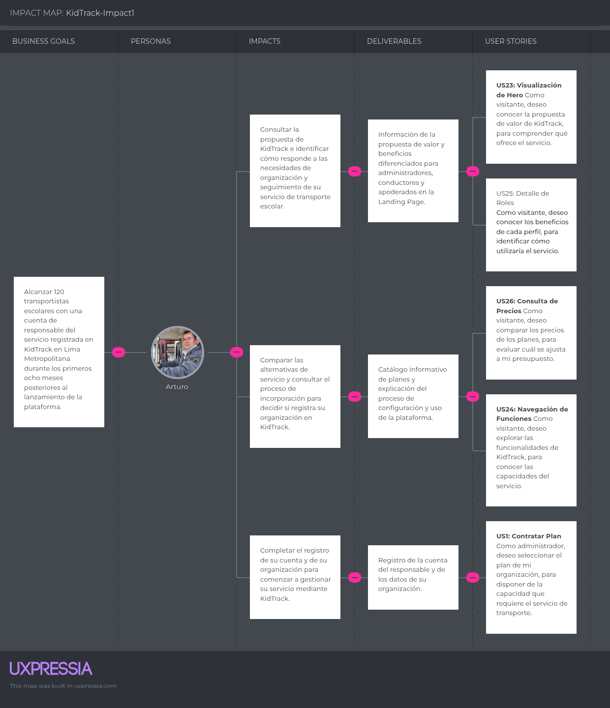

### Impact Mapping 2: Fernando Nery
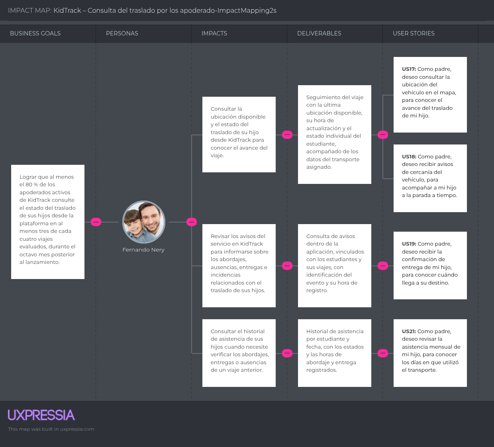

### 3.3. Product Backlog

El Product Backlog de KidTrack reúne las historias funcionales y técnicas de las user stories.

| Orden | Tipo | ID | Título | Descripción | Story Points |
| ---: | :--- | :--- | :--- | :--- | ---: |
| 1 | US | US23 | Visualización de Hero | Como visitante, deseo conocer la propuesta de valor de KidTrack, para comprender qué ofrece el servicio. | 2 |
| 2 | US | US24 | Navegación de Funciones | Como visitante, deseo explorar las funcionalidades de KidTrack, para conocer las capacidades del servicio. | 3 |
| 3 | US | US25 | Detalle de Roles | Como visitante, deseo conocer los beneficios de cada perfil, para identificar cómo utilizaría el servicio. | 3 |
| 4 | US | US26 | Consulta de Precios | Como visitante, deseo comparar los precios de los planes, para evaluar cuál se ajusta a mi presupuesto. | 3 |
| 5 | US | US29 | Formulario de Contacto | Como visitante, deseo enviar una consulta comercial, para recibir información o una cotización del servicio. | 3 |
| 6 | US | US28 | Testimonios Reales | Como visitante, deseo consultar experiencias de usuarios reales, para evaluar la confianza que transmite KidTrack. | 2 |
| 7 | US | US27 | Selección de Idioma | Como visitante, deseo elegir entre inglés y español, para consultar el sitio en el idioma que comprendo mejor. | 3 |
| 8 | US | US33 | Diseño Adaptable e i18n | Como visitante, deseo leer el contenido traducido desde mi celular, para comprenderlo sin cortes ni pérdida de información. | 2 |
| 9 | US | US34 | Metadatos SEO e i18n | Como visitante, deseo que la información pública del sitio esté disponible en mi idioma para buscadores y vistas previas, para reconocer el servicio antes de abrirlo. | 3 |
| 10 | US | US35 | Verificación de SSL | Como visitante, deseo acceder a KidTrack mediante una conexión segura, para proteger los datos que envío al sitio. | 5 |
| 11 | US | US36 | Política de Cookies i18n | Como visitante, deseo decidir sobre el uso de cookies opcionales, para controlar mis preferencias de privacidad. | 5 |
| 12 | US | US30 | Suscripción al Newsletter | Como visitante, deseo suscribirme con mi correo, para recibir contenidos sobre seguridad en el transporte escolar. | 3 |
| 13 | US | US31 | Visualización de Partners | Como visitante, deseo identificar a las organizaciones aliadas, para conocer quiénes respaldan o colaboran con el servicio. | 2 |
| 14 | US | US32 | Preguntas Frecuentes (FAQ) | Como visitante, deseo consultar respuestas a preguntas frecuentes, para resolver dudas sin recurrir inicialmente al soporte. | 2 |
| 15 | TS | TS5 | Soporte i18n de la Landing Page | Como desarrollador, deseo configurar los recursos de traducción de la Landing Page, para presentar su contenido en inglés y español. | 5 |
| 16 | TS | TS6 | Implementación HTTPS/SSL | Como desarrollador, deseo configurar HTTPS con un certificado válido, para proteger la transmisión de información entre los clientes y los servicios. | 3 |
| 17 | TS | TS2 | Integración Leaflet Maps | Como desarrollador, deseo integrar Leaflet en las vistas de seguimiento, para representar las rutas y las ubicaciones recibidas del vehículo. | 5 |
| 18 | US | US1 | Contratar Plan | Como administrador, deseo seleccionar el plan de mi organización, para disponer de la capacidad que requiere el servicio de transporte. | 5 |
| 19 | US | US2 | Registro de Conductores | Como administrador, deseo registrar cuentas de conductores, para asignarles responsabilidades dentro de la operación. | 3 |
| 20 | US | US4 | Alta de Alumnos | Como administrador, deseo dar de alta a los estudiantes, para incorporarlos a los recorridos del servicio. | 5 |
| 21 | US | US3 | Registro de Padres | Como administrador, deseo incorporar a los padres de familia, para habilitar su acceso al seguimiento de sus hijos. | 3 |
| 22 | TS | TS1 | Implementación JWT Authentication | Como desarrollador, deseo implementar la emisión y validación de tokens JWT, para controlar el acceso autenticado a los servicios de KidTrack. | 5 |
| 23 | TS | TS8 | API: Obtener Alumnos | Como desarrollador, deseo consultar estudiantes por ruta mediante la API, para integrar sus datos en clientes autorizados. | 3 |
| 24 | US | US5 | Creación de Rutas | Como administrador, deseo definir rutas y paradas, para organizar recorridos con tiempos de traslado adecuados. | 8 |
| 25 | US | US6 | Asignación de Conductores a Rutas | Como administrador, deseo asignar conductores a las rutas, para distribuir la responsabilidad de cada recorrido. | 3 |
| 26 | TS | TS3 | Persistencia de Tracking GPS | Como desarrollador, deseo persistir las ubicaciones GPS de los viajes, para permitir la consulta posterior de su trayectoria. | 5 |
| 27 | US | US10 | Inicio de Trayecto | Como conductor, deseo iniciar el viaje asignado, para comunicar a las familias que el traslado está en marcha. | 3 |
| 28 | US | US11 | Marcación de Abordaje | Como conductor, deseo registrar el abordaje de los estudiantes, para mantener actualizada la asistencia del viaje. | 5 |
| 29 | US | US17 | Rastreo en Tiempo Real | Como padre, deseo consultar la ubicación del vehículo en el mapa, para conocer el avance del traslado de mi hijo. | 8 |
| 30 | US | US18 | Alerta de Proximidad | Como padre, deseo recibir avisos de cercanía del vehículo, para acompañar a mi hijo a la parada a tiempo. | 5 |
| 31 | US | US19 | Confirmación de Llegada | Como padre, deseo recibir la confirmación de entrega de mi hijo, para conocer cuándo llega a su destino. | 3 |
| 32 | US | US14 | Finalización de Viaje | Como conductor, deseo finalizar el viaje, para dejar constancia de que el recorrido ha concluido. | 2 |
| 33 | US | US12 | Reporte de Incidencias | Como conductor, deseo reportar incidencias del recorrido, para que el administrador pueda coordinar una respuesta. | 5 |
| 34 | US | US16 | Navegación Integrada | Como conductor, deseo abrir una herramienta externa de navegación, para recibir indicaciones durante el recorrido. | 3 |
| 36 | US | US7 | Analítica de Flota | Como administrador, deseo consultar indicadores de la flota, para evaluar el rendimiento del servicio. | 8 |
| 37 | US | US21 | Historial de Asistencia | Como padre, deseo revisar la asistencia mensual de mi hijo, para conocer los días en que utilizó el transporte. | 5 |
| 38 | US | US15 | Bitácora de Viajes | Como conductor, deseo consultar mi bitácora, para revisar los viajes que he realizado. | 3 |
| 39 | US | US22 | Perfil del Estudiante | Como padre, deseo mantener actualizada la información médica de mi hijo, para que el conductor conozca las precauciones necesarias. | 5 |
| 40 | US | US13 | Botón de Pánico | Como conductor, deseo activar una alerta SOS, para comunicar una situación de emergencia. | 8 |
| 41 | US | US20 | Acceso a Cámara | Como padre, deseo consultar la cámara interior del vehículo, para observar las condiciones del traslado de mi hijo. | 5 |
| 42 | US | US8 | Gestión de Notificaciones | Como administrador, deseo distribuir avisos generales, para comunicar a las familias los eventos que afectan al servicio. | 5 |
| 43 | US | US9 | Auditoría de Logs | Como administrador, deseo consultar los registros técnicos del sistema, para investigar errores reportados. | 5 |
| 44 | TS | TS4 | Configuración Swagger/OpenAPI | Como desarrollador, deseo disponer de documentación interactiva OpenAPI, para consultar y probar las operaciones REST de KidTrack. | 3 |

**Herramienta y evidencia del Product Backlog**

Se propone utilizar Trello, una de las herramientas permitidas por la guía. Cada historia se registra como una tarjeta con ID, título, descripción, puntos, épica y criterios de aceptación. Las tarjetas se ordenan de arriba hacia abajo según la tabla, sin agrupar el orden principal por épicas. Las etiquetas pueden identificar la épica y el tipo de historia.

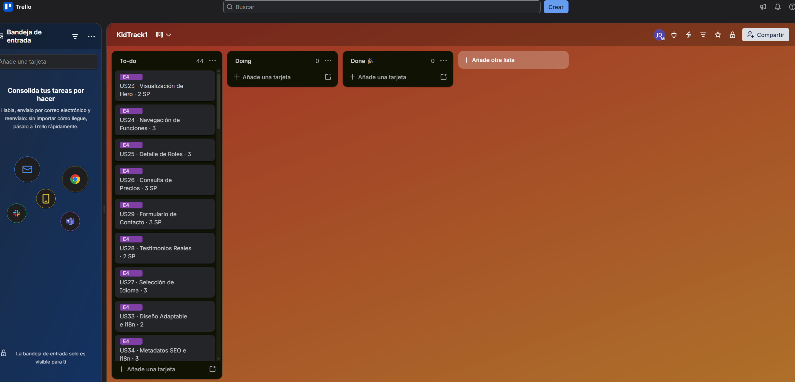
**URL:**
[Trello](https://trello.com/invite/b/6aa6150f039a9de0cf4575d4/ATTIcf439e2a70fe8889977fa57f906d2f0aF7057E64/kidtrack1)

## Capítulo IV: Product Design

### 4.1. Style Guidelines
#### 4.1.1. General Style Guidelines
El diseño de **KidTrack** se fundamenta en decisiones visuales estratégicas destinadas a proyectar seguridad, confiabilidad y modernidad. El objetivo principal es construir una experiencia de usuario que genere confianza inmediata, tanto en los padres de familia que buscan tranquilidad como en los transportistas que necesitan eficiencia en su gestión diaria.
##### Colores

La selección cromática de KidTrack responde a una psicología del color aplicada a la seguridad y al entorno escolar, garantizando accesibilidad, contraste y jerarquía visual. Cada tono desempeña una función específica dentro de la interfaz:

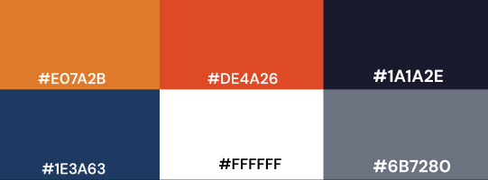

* **Naranja / Anaranjado (`#E07A2B`):** Identidad tipográfica principal ("Kid"). Aporta vitalidad, calidez, energía y una conexión visual amigable con el entorno escolar. Funciona como punto focal de acento en la interfaz.
* **Naranja Rojizo (`#DE4A26`):** Tono de acento secundario (utilizado en detalles gráficos como el indicador del vehículo). Se reserva para alertas, notificaciones destacadas y botones de llamado a la acción (*Call to Action* - CTA).
* **Azul Oscuro Fondo (`#1A1A2E`):** Tono de fondo nocturno y contraste profundo. Se emplea en bloques de encabezados, secciones principales oscuras, pie de página (*footer*) y tarjetas de contraste de alto nivel.
* **Azul Marino (`#1E3A63`):** Identidad tipográfica ("Track") e ícono del timón/brújula. Transmite autoridad, seriedad, seguridad corporativa y estabilidad tecnológica. Se emplea en títulos principales, componentes de navegación y elementos estructurales clave.
* **Verde Éxito (`#22C55E`):** Estado de confirmación e hito completado. Reservado para estados positivos como "Alumno Abordado", "Ruta Finalizada" o eventos exitosos en la bitácora.
* **Blanco (`#FFFFFF`):** Fondo principal, tarjetas elevadas y líneas interiores de contraste. Proporciona espacios limpios, máxima legibilidad y descansos visuales que reducen la fatiga en la navegación.
* **Gris Neutro (`#6B7280`):** Utilizado para el texto de cuerpo, descripciones, bordes sutiles y párrafos sobre fondos claros, ofreciendo excelente legibilidad.

##### Tipografía
 **Tipografía Principal ("Plus Jakarta Sans"):** Seleccionada para los títulos y encabezados de la plataforma por su estilo geométrico moderno y su capacidad para captar la atención del usuario con un toque tecnológico y accesible. Se utiliza en pesos *Bold* y *Semi-Bold* para asegurar que los encabezados sean visualmente impactantes y de fácil lectura.* **Tipografía Principal ("Plus Jakarta Sans"):** Seleccionada para los títulos y encabezados de la plataforma por su estilo geométrico moderno y su capacidad para captar la atención del usuario con un toque tecnológico y accesible. Se utiliza en pesos *Bold* y *Semi-Bold* para asegurar que los encabezados sean visualmente impactantes y de fácil lectura.

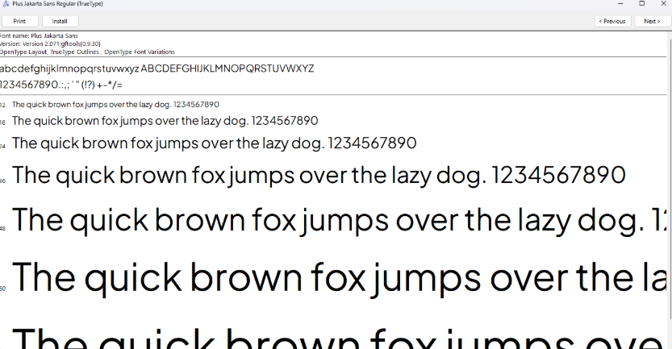

**Tipografía Secundaria ("DM Sans"):** Elegida para los textos de cuerpo, descripciones y componentes de navegación debido a su diseño legible, limpio y neutro. Garantiza una experiencia accesible, reduciendo la fatiga visual al leer información detallada sobre funciones, rutas o datos del alumno.

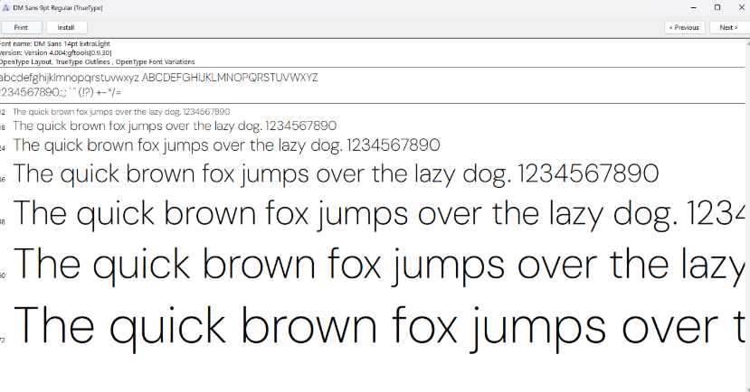

 **Jerarquía de Tamaños:** Se utiliza de forma consistente en toda la aplicación para resaltar títulos principales, botones de acción y texto de soporte. Los tamaños superiores en los encabezados guían al usuario rápidamente por los puntos clave, mientras que los tamaños reducidos en los párrafos aseguran la comprensión eficiente de detalles secundarios.
##### Branding
La marca de **KidTrack** refleja simplicidad, confianza y profesionalismo. El logotipo y los íconos adoptan un enfoque minimalista con líneas claras que comunican el propósito de seguridad de la plataforma. La identidad integra una propuesta tipográfica sólida acompañada de un isotipo característico que fusiona la forma de un timón/brújula con la silueta de un vehículo escolar, simbolizando protección, dirección y monitoreo constante. Esta propuesta mantiene una apariencia limpia y reconocible tanto en entornos web como móviles.
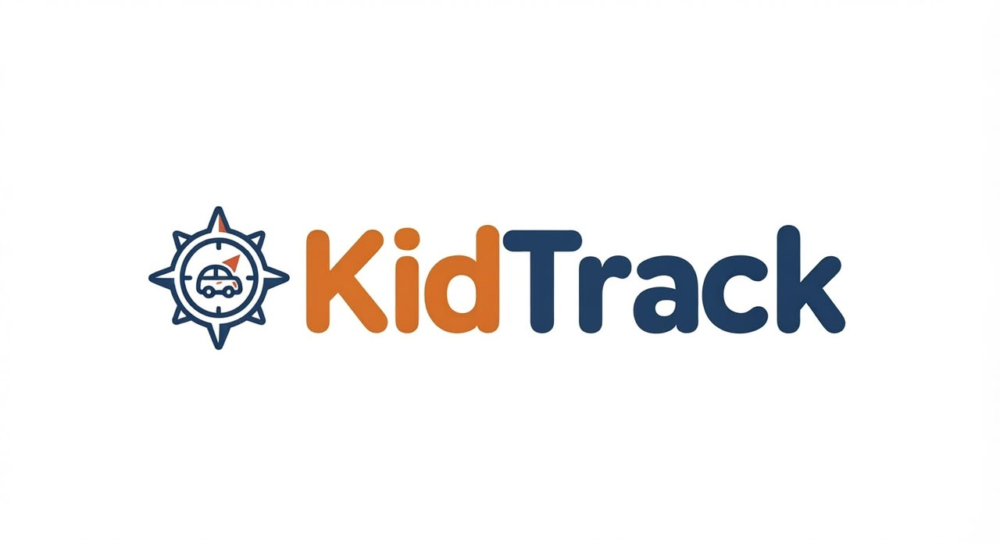

##### Espaciado
El diseño de **KidTrack** utiliza una estrategia de espacios en blanco diseñada para transmitir orden y claridad, factores críticos en una herramienta de seguridad y transporte escolar. En lugar de saturar la vista, aprovechamos márgenes amplios en los laterales de cada sección para que el usuario pueda diferenciar rápidamente entre los módulos de padres, conductores y colegios. El contenido se mantiene estructurado mediante el uso de Flexbox y CSS Grid, lo que evita que la información se disperse y mantiene una jerarquía visual equilibrada que facilita la lectura de las características del servicio. Además, los rellenos (*padding*) en elementos como las tarjetas de planes, alertas y funciones garantizan una distribución adecuada del contenido.
##### Dimensiones para el tono de comunicación y lenguaje aplicado
El tono de voz en KidTrack está alineado con la misión de la plataforma: garantizar la seguridad y la tranquilidad en el transporte escolar. Se combina una comunicación clara, directa y highly profesional con un enfoque empático. 

* **Formal pero Empático:** Permite que los padres de familia se sientan seguros al interactuar con funciones críticas como el monitoreo en vivo o las notificaciones de abordaje.
* **Eficiente y Sereno:** Refleja puntualidad y orden en la gestión logística, asegurando que los usuarios perciban que el bienestar de los estudiantes es la prioridad absoluta.
* **Consistencia:** Todos los mensajes de estado, etiquetas y textos del sistema mantienen una línea comunicativa uniforme, acelerando la curva de aprendizaje.
* **Navegación Intuitiva:** Menús minimalistas y estructurados por rol para optimizar el tiempo de respuesta en entornos dinámicos.
* **Accesibilidad:** Diseñado con etiquetas claras y maquetación *responsive* para garantizar lectura adecuada en ordenadores de escritorio y dispositivos móviles en movimiento.

##### Elementos de diseño
* **Líneas:** Utilizadas de manera sutil para delimitar tarjetas de planes, módulos de roles y centros de alertas.
* **Color:** Aplicado con intencionalidad funcional para transmitir autoridad (Azul Marino), acción/dinamismo (Naranja), alertas (Naranja Rojizo) y confirmaciones (Verde).
* **Tamaño:** Escalar de manera jerárquica para enfocar la atención en el panel principal y desglosar especificaciones secundarias.
* **Textura:** Superficies suaves, limpias y fondos blancos elevados que aportan modernidad y amplitud.
* **Espacio:** Márgenes y rellenos generosos que evitan la saturación cognitiva.
* **Brillo / Contraste (*Value*):** Contrastes calculados entre elementos interactivos y fondos para guiar la interacción de manera intuitiva.
* **Formas:** Geometrías con bordes redondeados en botones, paneles y tarjetas, transmitiendo cercanía, accesibilidad y cuidado escolar.

##### Principios de diseño
* **Contraste:** Garantiza la visibilidad de elementos críticos (botones CTA, estado "Unidad en trayecto") sobre fondos neutros.
* **Repetición:** Uso sistemático de la paleta corporativa y de una iconografía coherente (timones, vehículos, mapas) para reforzar la identidad del sistema.
* **Alineación:** Disposición estructurada en rejillas (Grid/Flexbox) que aporta solidez, profesionalismo y orden.
* **Proximidad:** Agrupación lógica de elementos vinculados (íconos con descripciones, beneficios por rol) para facilitar la lectura rápida.
#### 4.1.2. Web Style Guidelines

El diseño web de KidTrack está optimizado para proporcionar una experiencia de usuario fluida y profesional. La estructura flexible organiza el contenido con claridad, empleando espacios en blanco estratégicos para evitar la saturación visual y priorizar la información crítica de seguridad. Las tarjetas de planes y secciones de roles mantienen proporciones equilibradas para guiarnos jerárquicamente.

En términos de interactividad, los botones de acción (*CTA*) destacan por el uso de colores contrastantes y estados visuales explícitos (*hover*, *focus* y *active*) que ofrecen retroalimentación inmediata. La navegación se apoya en transiciones suaves y una barra superior persistente (*Sticky Navigation*) que mantiene siempre accesible el selector de idiomas mediante el sistema de internacionalización (i18n).

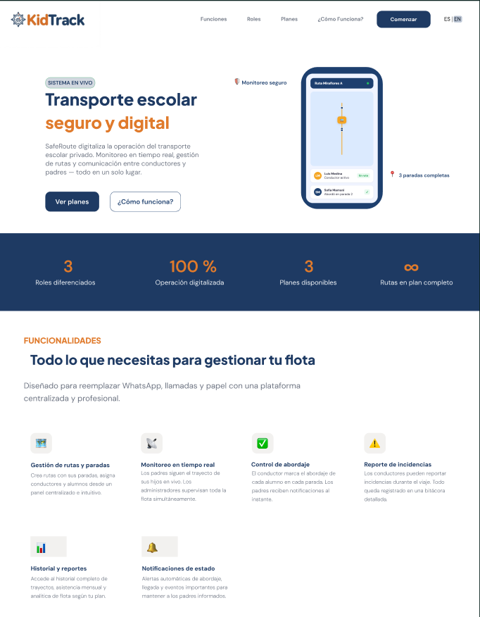
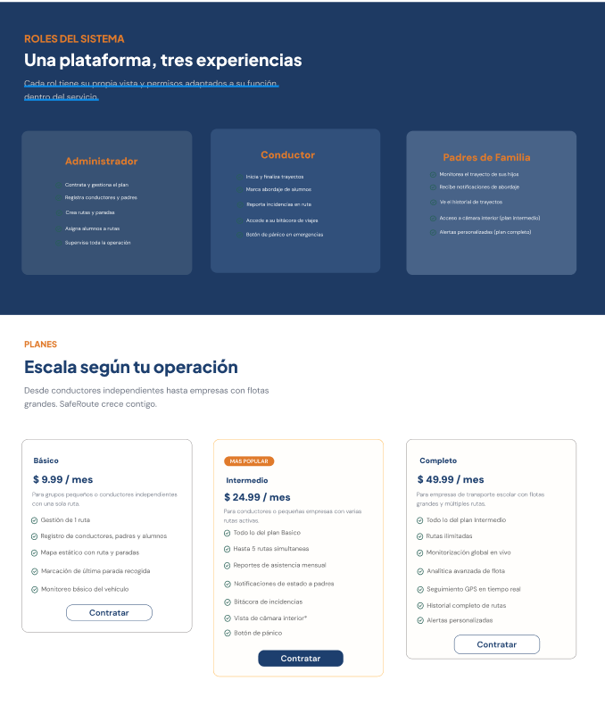
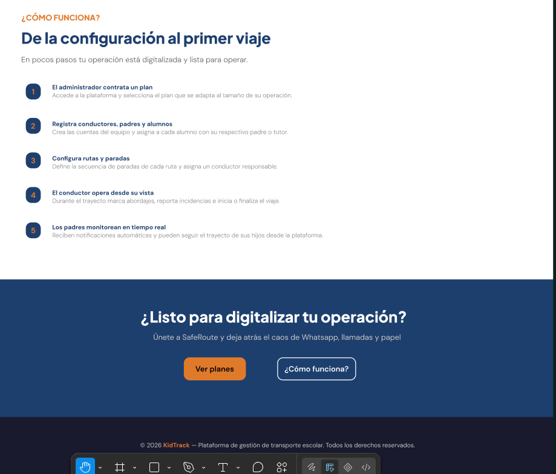

---
### 4.2. Information Architecture
#### 4.2.1. Organization Systems
---
* **Organización Jerárquica:** Se prioriza la información de mayor valor operativo, como el mapa de monitoreo en tiempo real, las alertas de emergencia y los estados de abordaje, relegando detalles secundarios del perfil a niveles inferiores.
* **Organización Secuencial (Paso a paso):** Aplicada en flujos estructurados. En la *Landing Page*, se aprecia en la sección *"¿Cómo funciona?"*; en la *Aplicación Web*, guía el registro progresivo de paradas y asistencia por parte del conductor.
* **Organización Cronológica:** Empleada en la bitácora e historial de viajes, permitiendo a los padres revisar asistencias y horarios de llegada ordenados temporalmente.
* **Organización por Audiencia:** Segmentación clara de interfaces según el rol del usuario: **Conductores** (enfocados en la gestión operativa de rutas) y **Padres de Familia** (orientados al seguimiento en vivo y recepción de notificaciones).

#### 4.2.2. Labeling Systems
El sistema de etiquetado de **KidTrack** ha sido desarrollado bajo un criterio de funcionalidad operativa, buscando que cada término actúe como una señal clara que reduzca el esfuerzo cognitivo de los usuarios. Se han seleccionado etiquetas descriptivas que permiten una navegación intuitiva tanto en el proceso de descubrimiento (*Landing Page*) como en el uso crítico de la aplicación (*Web Application*).

##### Landing Page
* **Funciones:** Agrupa las capacidades técnicas y herramientas de la plataforma.
* **Roles:** Define los accesos y beneficios específicos para cada perfil.
* **Planes:** Estructura la oferta comercial según la escala de la flota.
* **¿Cómo funciona?:** Guía explicativa sobre la adopción del servicio.
* **Comenzar:** Llamado a la acción principal para el registro o contacto.

##### Aplicación Web – Conductores
* **Mis Rutas:** Gestión de trayectos diarios asignados.
* **Lista de Alumnos:** Relación de estudiantes organizados por paradas.
* **Estado de Abordaje:** Etiquetas de registro rápido (*"Abordado"*, *"Ausente"*, *"En espera"*).
* **Iniciar Ruta:** Botón de alta visibilidad que activa el rastreo GPS.
* **Reportar Incidencia:** Acceso directo para registrar eventos imprevistos (tráfico, desviaciones, averías).

##### Aplicación Web – Padres de Familia
* **Monitoreo:** Centro de control con el mapa en tiempo real y la posición del vehículo.
* **Historial de Viajes:** Registro cronológico de horas de recogida y entrega.
* **Alertas:** Notificaciones de proximidad y confirmaciones de abordaje.
* **Datos del Bus:** Información transparente sobre el vehículo y el conductor asignado.

#### 4.2.3. SEO Tags and Meta Tags

1. Landing Page

**Charset**

<!-- Codificación de Caracteres -->
<meta charset="UTF-8" />

Esta línea establece la codificación universal de caracteres. Su función es garantizar que el navegador interprete correctamente los textos del sistema i18n, asegurando que tildes, la letra "ñ" y símbolos especiales se visualicen sin errores en español e inglés, evitando una mala experiencia de lectura.

**Viewport (Responsive)**
<!-- Ventana Gráfica Responsiva -->
<meta name="viewport" content="width=device-width, initial-scale=1.0" />

Controla el escalado de la página en diferentes dispositivos. Su función es hacer que la landing sea responsiva, ajustando el ancho del contenido al tamaño de la pantalla. Esto es vital para que los padres de familia visualicen la información de manera legible desde sus smartphones.

**Title (SEO)**
<!-- Título SEO Principal -->
<title>KidTrack — Transporte Escolar Seguro</title>

Define el título que aparece en la pestaña del navegador y en los resultados de búsqueda. Su función es proporcionar una identificación inmediata de la marca y su propósito principal, siendo un factor crítico para el posicionamiento orgánico.

**Meta Description (SEO)**
<!-- Meta Descripción -->
<meta name="description" content="Plataforma integral para el monitoreo en tiempo real, control de asistencia y comunicación segura entre conductores y padres de familia." />

Provee un resumen conciso del contenido del sitio. Su función es aparecer como el fragmento de texto (snippet) en Google, atrayendo a los usuarios al explicar claramente cómo KidTrack resuelve la inseguridad en el transporte escolar.

**Meta Keywords (SEO)**
<!-- Palabras Clave -->
<meta name="keywords" content="transporte escolar, monitoreo GPS, seguridad escolar, KidTrack, logística escolar, app bilingüe" />

Especifica palabras clave relevantes para la temática de la página. Su función es ayudar a los algoritmos de indexación a clasificar el sitio dentro del nicho de tecnología de transporte y seguridad educativa.

**Meta Author**
<!-- Autoría y Propiedad Intelectual -->
<meta name="author" content="KidTrack Team" />
<meta name="copyright" content="KidTrack 2026" />

Identifica formalmente a los creadores de la plataforma. Su función es atribuir la autoría del proyecto al equipo de KidTrack, vinculando el desarrollo técnico con el startup responsable.

**Meta Copyright**

`<meta name="copyright" content="KidTrack 2026">`

Esta línea establece legalmente la propiedad intelectual de la página. Su función es indicar la titularidad de los derechos de autor y el año de vigencia, protegiendo el contenido y diseño del sitio.

**Meta Robots**
<!-- Indexación para Buscadores -->
<meta name="robots" content="index, follow" />

Instruye a los motores de búsqueda sobre cómo tratar el sitio. Su función es permitir que los "robots" incluyan la página en sus índices y sigan los enlaces internos, lo cual es fundamental para el crecimiento del tráfico hacia la plataforma.

**Meta Language**
<!-- Idioma Principal del Documento -->
<html lang="es">

Declara el idioma principal de la estructura del sitio. Su función es informar a los navegadores y buscadores que el texto base está en español, mejorando la segmentación del público objetivo.

#### 4.2.4. Searching Systems

En esta sección se describen los mecanismos de asistencia y recuperación de información diseñados para **KidTrack**. El objetivo primordial es evitar la desorientación del usuario ante el flujo constante de datos logísticos, garantizando que la información sobre rutas y alumnos sea accesible de manera inmediata.

##### Vista del Conductor / Dueño de Unidad

* **Barra de búsqueda operativa:** Disponible en "Rutas" y "Lista de Alumnos".
  * **Autocompletado inteligente:** Sugiere nombres de estudiantes o paradas al escribir.
  * **Búsqueda por proximidad:** Prioriza las paradas siguientes según la posición GPS.
  * **Mensajes contextuales:** Asistencia paso a paso ante búsquedas sin resultados.
* **Filtros Disponibles:** Por nombre del alumno, estado de asistencia (*Abordado*, *Pendiente*, *Ausente*), punto de parada y turno (*Mañana* / *Tarde*).
* **Visualización de Resultados:** Tarjetas con fotografía, grado, indicadores cromáticos de estado y botones de acción rápida (*Marcar Asistencia*, *Llamar Apoderado*, *Reportar Incidencia*).

##### Vista del Padre de Familia

* **Medios de Ayuda:**
  * **Buscador de historial:** Localización de eventos específicos en la bitácora.
  * **Calendario interactivo:** Selección de fechas específicas de consulta.
  * **Buscador de unidad:** Consulta rápida por placa o datos del conductor.
* **Filtros Disponibles:** Por fecha, tipo de evento (*Proximidad*, *Abordaje*, *Llegada*) y estado del viaje (*Completado*, *En curso*, *Cancelado*).
* **Visualización de Resultados:** *Timeline* cronológico con marcas horarias, mapa con el recorrido trazado e indicadores cromáticos de estado (Verde: *Completado*, Naranja: *Retraso*, Naranja Rojizo: *Inasistencia/Incidencia*).

#### 4.2.5. Navigation Systems
La navegación en la **Landing Page** utiliza un desplazamiento vertical fluido (*Smooth Scroll*) acompañado de una barra superior fija (*Sticky Navigation*) con selector bilingüe (i18n).

Dentro de la **Aplicación Web**, la estructura se basa en un menú lateral fijo (*Sidebar*) que brinda acceso directo a las secciones clave (*Monitoreo*, *Lista de Alumnos*, *Historial*, *Alertas* y *Configuración*). El diseño adapta dinámicamente sus controles al perfil del usuario, empleando pestañas (*tabs*) y accesos directos para ejecutar acciones operativas sin abandonar el contexto del mapa o la ruta activa.

### 4.3. Landing Page UI Design

#### 4.3.1. Landing Page Wireframe

A continuación, se presentan los wireframes de las principales secciones de la landing page. Cada imagen ilustra el diseño propuesto para las diferentes funcionalidades, flujos de navegación y elementos de interacción de la plataforma.
 
**Principios Aplicados**
 
- **Jerarquía visual clara:** Los contenidos se ordenan priorizando la información de confianza en el Hero Section (Seguridad y Gestión). Se guía al usuario progresivamente a través de las estadísticas de impacto, los beneficios específicos para padres y conductores, la tabla comparativa de planes y, finalmente, el tutorial operativo.
- **Consistencia visual:** Se mantuvieron patrones uniformes utilizando la tipografía Plus Jakarta Sans para títulos impactantes y DM Sans para la legibilidad del cuerpo. Se aplicó la paleta institucional (azul marino para seguridad y ámbar para alertas) de manera coherente en todos los componentes.
- **Contraste y accesibilidad:** Se garantizó un contraste elevado entre el texto y los fondos para facilitar la lectura en condiciones de luz exterior (común para conductores y padres en ruta). Los botones de acción cuentan con estados visuales claros para confirmar la interacción del usuario.
- **Optimización para dispositivos móviles:** Los wireframes y el diseño final contemplan una navegación móvil dedicada. Se implementó un menú lateral (sidebar) activado por un botón hamburguesa para ahorrar espacio, se ajustaron las cuadrículas (grids) a una sola columna para evitar el desplazamiento horizontal y se optimizaron las áreas de contacto en botones para una interacción táctil precisa.
- **Diseño inclusivo:** La estructura es totalmente compatible con el sistema i18n, permitiendo que el diseño se adapte dinámicamente al largo de las palabras en español e inglés. Además, se aseguró que la navegación sea lógica y accesible mediante teclado y lectores de pantalla, facilitando el uso para cualquier tipo de usuario.

##### Versión Desktop Web Browser:
 
En esta primera sección se presenta la pantalla Home de la landing page, donde se observa el encabezado principal con la propuesta de valor y el acceso al sistema de internacionalización (i18n). Se aprecia un botón call-to-action principal diseñado para captar el interés de los padres de familia y conductores independientes.
 
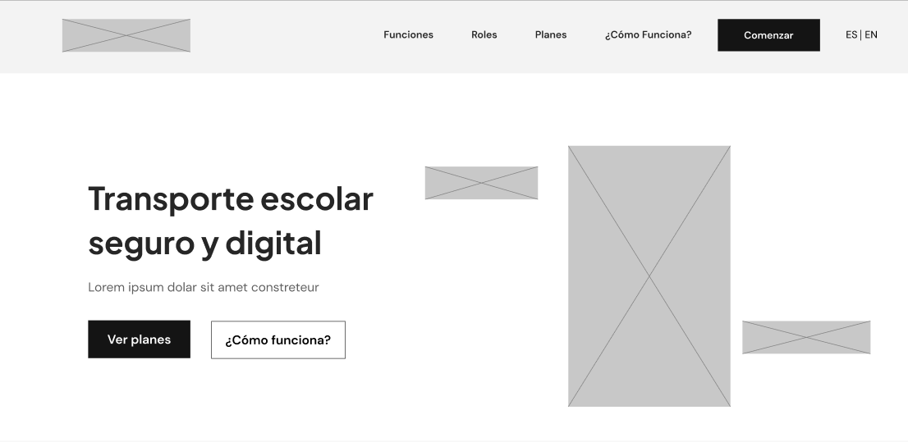

A continuación, se muestra la Sección de Características, donde se detallan los pilares y eficiencia que sustentan la plataforma KidTrack, utilizando iconos y textos breves para una lectura rápida.
 
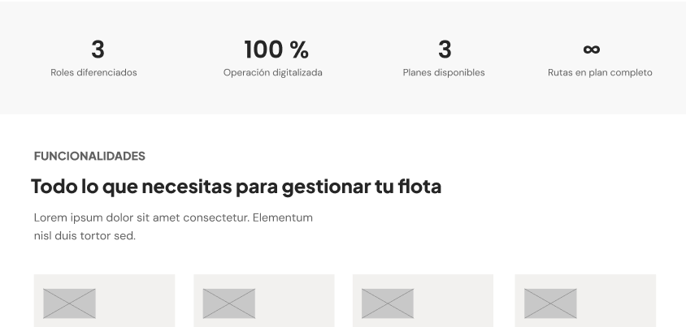

Se presenta la sección de Funcionalidades, la cual profundiza en las capacidades tecnológicas del sistema, como el monitoreo en tiempo real y las notificaciones automáticas.
 
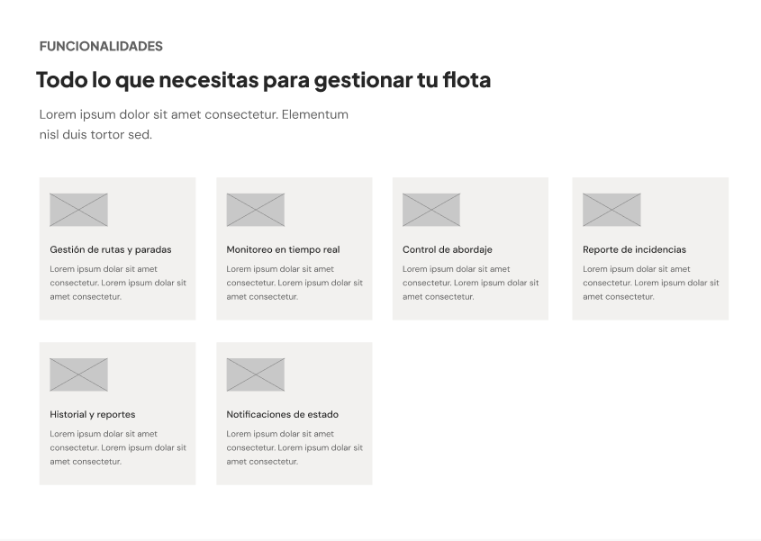

El siguiente frame corresponde a los Roles del Sistema, donde se segmentan los beneficios específicos para cada usuario objetivo: los padres de familia, enfocados en la tranquilidad y el seguimiento, y los conductores, enfocados en la gestión operativa de la ruta.
 
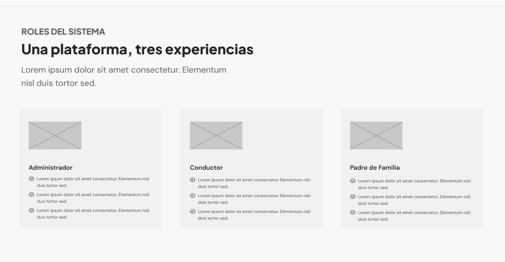

Se presenta la sección de Planes, donde se muestra la estructura de precios y niveles de servicio, diseñada de forma escaneable para facilitar la toma de decisiones.
 
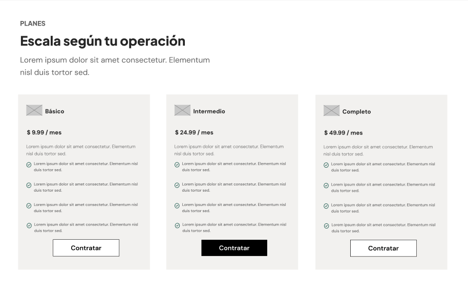

A continuación, se detalla el flujo de uso del sistema en la sección "¿Cómo funciona?". Este tutorial visual guía al nuevo usuario a través de los pasos necesarios para implementar la plataforma con éxito.
 
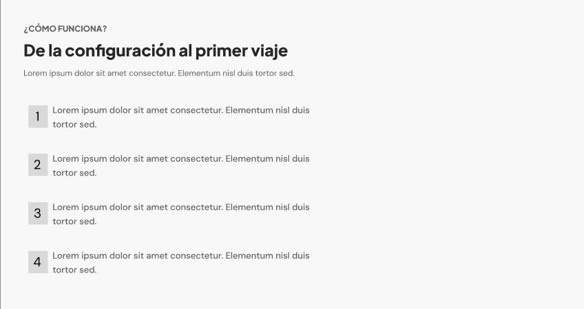

Finalmente, se presenta la sección de Footer, la cual incluye el cierre de la página con los créditos correspondientes al equipo de desarrollo de StackForge.
 
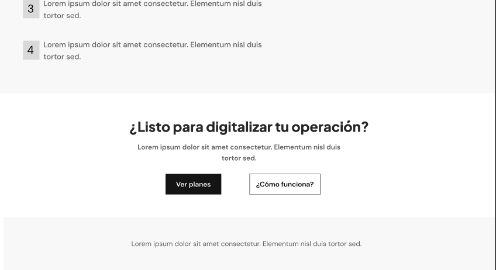

#### Versión Mobile Web Browser
 
A continuación, se presenta la adaptación responsiva de KidTrack para dispositivos móviles. En estas vistas se observa la reorganización de los elementos en una estructura vertical y el uso de componentes optimizados para la interacción táctil.
 
Pantalla Home y Menú Lateral (Sidebar):
Se muestra la adaptación del Hero Section y el funcionamiento del menú hamburguesa, el cual despliega una barra lateral para facilitar la navegación en pantallas pequeñas sin obstruir el contenido.
 
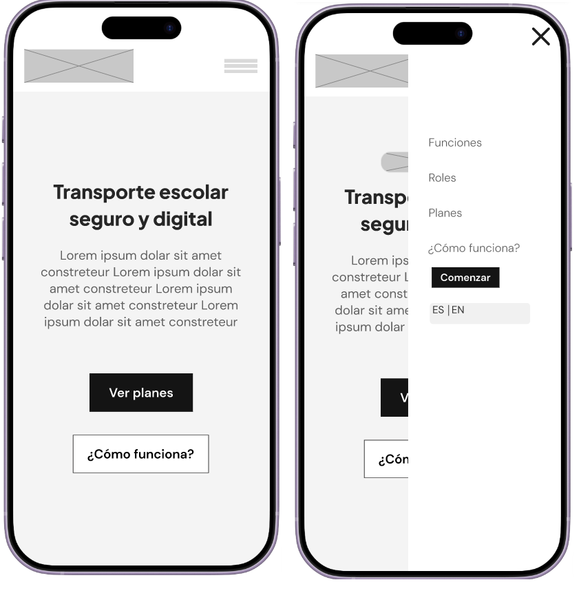

Secciones de Características y Funcionalidades en Móvil:
Los pilares de seguridad y las capacidades tecnológicas del sistema se reorganizan en una sola columna. Esto permite que los iconos y textos descriptivos mantengan un tamaño adecuado para la lectura táctil, evitando que el usuario deba realizar zoom para comprender las funciones de monitoreo y alertas.
 
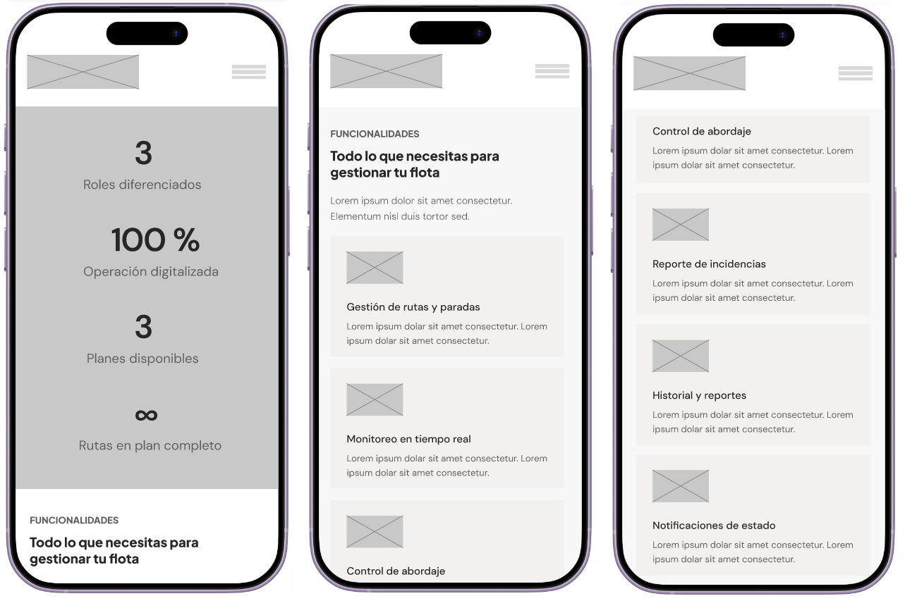

Sección de Roles del Sistema en Móvil:
Se adapta la segmentación de beneficios para padres y conductores mediante un flujo vertical. Cada rol se presenta de forma independiente para asegurar que el impacto visual de los beneficios específicos no se pierda en pantallas de dimensiones reducidas.
 
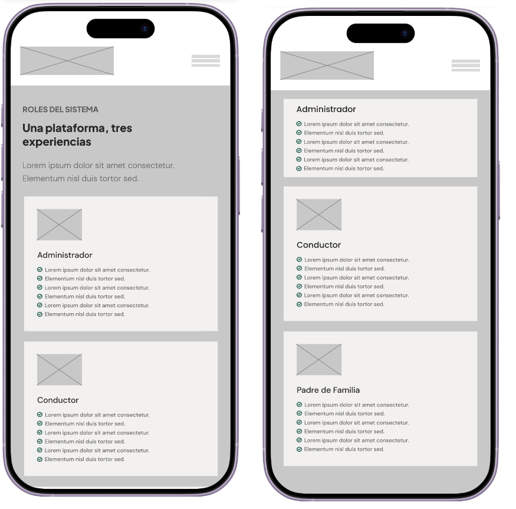

Planes, Tutorial y Footer Móvil:
La tabla de precios se transforma en tarjetas individuales desplazables de arriba hacia abajo, seguida del flujo paso a paso del tutorial. El cierre de página se optimiza para mostrar los créditos de StackForge de manera compacta al final del recorrido del usuario.
 
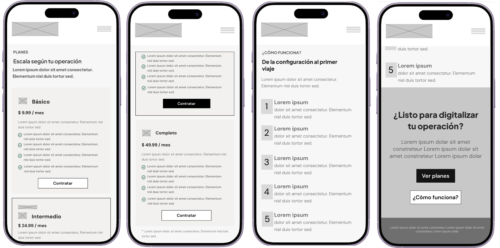

#### 4.3.2. Landing Page Mock-up

A continuación, se presentan los mock-ups de las principales secciones de la landing page. Cada imagen ilustra el diseño propuesto para las diferentes funcionalidades, flujos de navegación y elementos de interacción de la plataforma.
 
En esta primera sección se presenta la pantalla Home de la landing page, donde se observa el encabezado principal con la propuesta de valor y el acceso al sistema de internacionalización (i18n). Se aprecia un botón call-to-action principal diseñado para captar el interés de los padres de familia y conductores independientes.
 
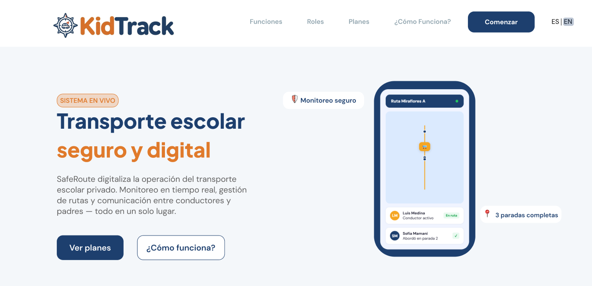

A continuación, se muestra la Sección de Características, donde se detallan los pilares y eficiencia que sustentan la plataforma KidTrack, utilizando iconos y textos breves para una lectura rápida.
 
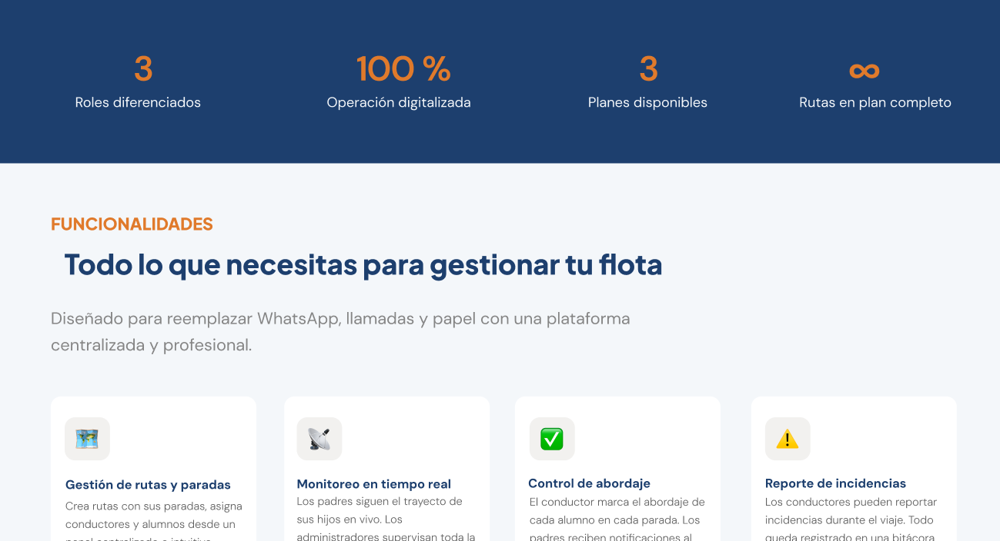

Se presenta la sección de Funcionalidades, la cual profundiza en las capacidades tecnológicas del sistema, como el monitoreo en tiempo real y las notificaciones automáticas.
 
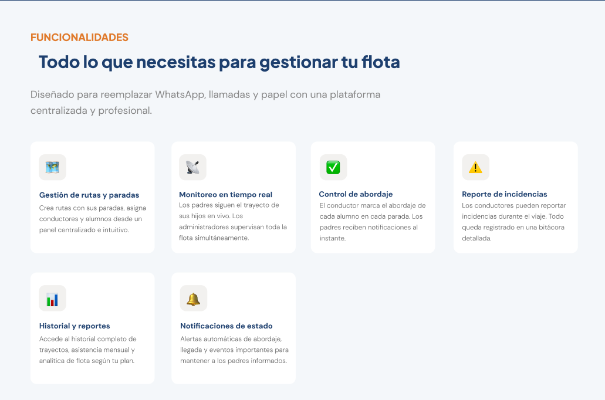

El siguiente frame corresponde a los Roles del Sistema, donde se segmentan los beneficios específicos para cada usuario objetivo: los padres de familia, enfocados en la tranquilidad y el seguimiento, y los conductores, enfocados en la gestión operativa de la ruta.
 
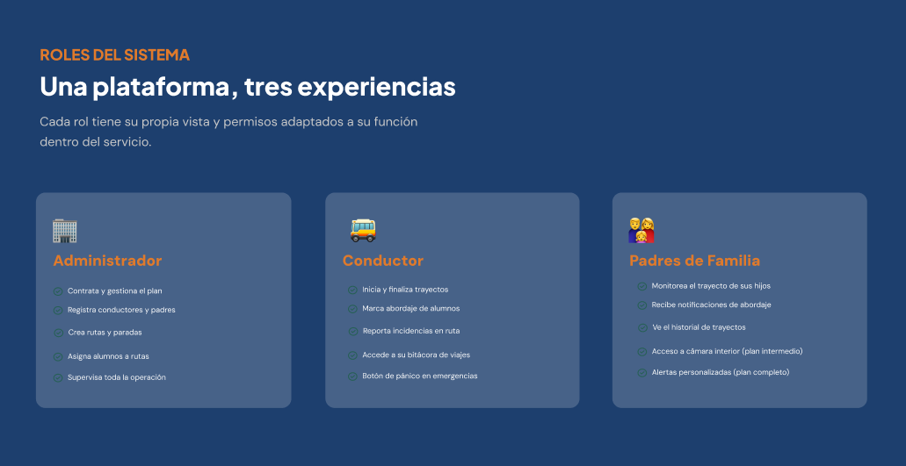

Se presenta la sección de Planes, donde se muestra la estructura de precios y niveles de servicio, diseñada de forma escaneable para facilitar la toma de decisiones comerciales.
 
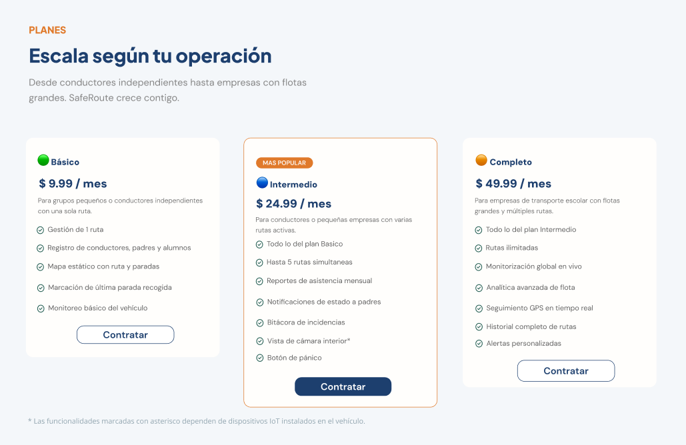

A continuación, se detalla el flujo de uso del sistema en la sección "¿Cómo funciona?". Este tutorial visual guía al nuevo usuario a través de los pasos necesarios para implementar la plataforma con éxito.
 
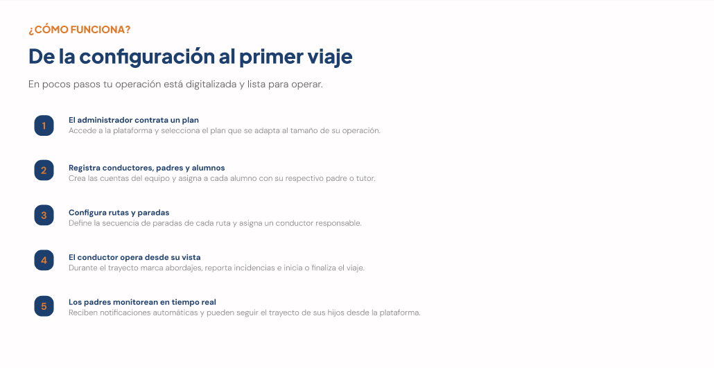

Finalmente, se presenta la sección de Footer, la cual incluye el cierre de la página con los créditos correspondientes al equipo de desarrollo de StackForge.
 
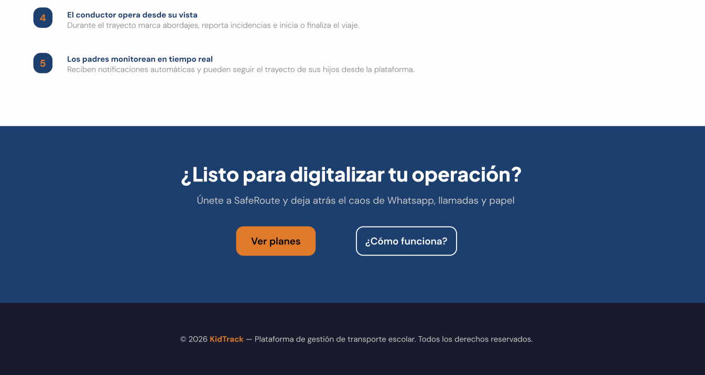

#### Versión Mobile Web Browser
 
A continuación, se presentan los mock-ups de la versión móvil de la aplicación. Cada imagen muestra la adaptación responsiva de las principales funcionalidades y secciones diseñadas para ofrecer una experiencia de usuario optimizada en dispositivos móviles.
 
Pantalla Home y Menú Lateral (Sidebar):
Se muestra la adaptación del Hero Section y el funcionamiento del menú hamburguesa, el cual despliega una barra lateral para facilitar la navegación en pantallas pequeñas sin obstruir el contenido.
 
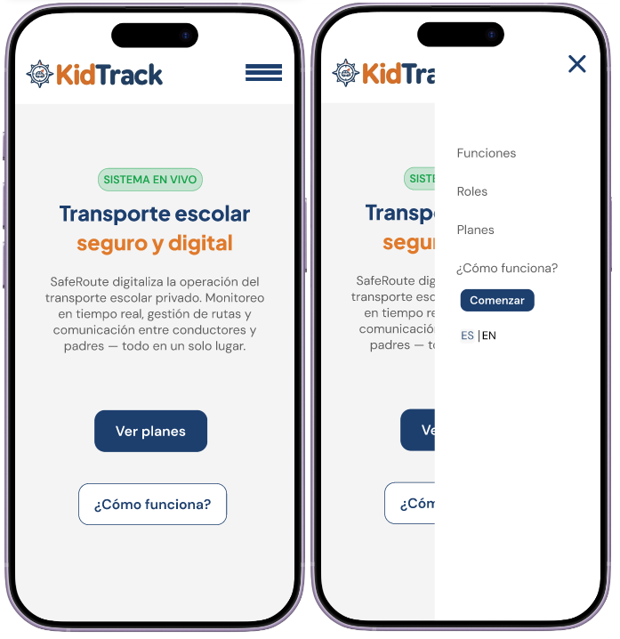

Secciones de Características y Funcionalidades en Móvil:
Los pilares de seguridad y las capacidades tecnológicas del sistema se reorganizan en una sola columna. Esto permite que los iconos y textos descriptivos mantengan un tamaño adecuado para la lectura táctil, evitando que el usuario deba realizar zoom para comprender las funciones de monitoreo y alertas.
 
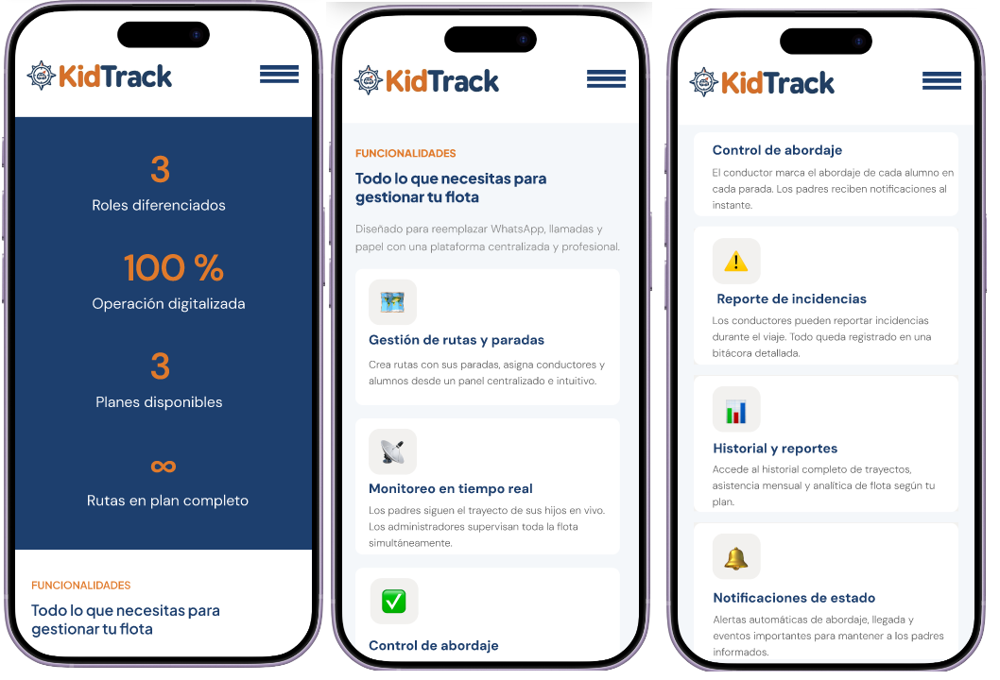

Sección de Roles del Sistema en Móvil:
Se adapta la segmentación de beneficios para padres y conductores mediante un flujo vertical. Cada rol se presenta de forma independiente para asegurar que el impacto visual de los beneficios específicos no se pierda en pantallas de dimensiones reducidas.
 
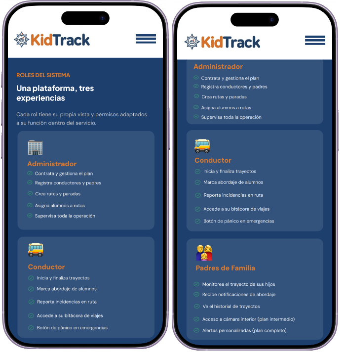

Planes, Tutorial y Footer Móvil:
La tabla de precios se transforma en tarjetas individuales desplazables de arriba hacia abajo, seguida del flujo paso a paso del tutorial. El cierre de página se optimiza para mostrar los botones de contacto y los créditos de StackForge de manera compacta y accesible al final del recorrido del usuario.
 
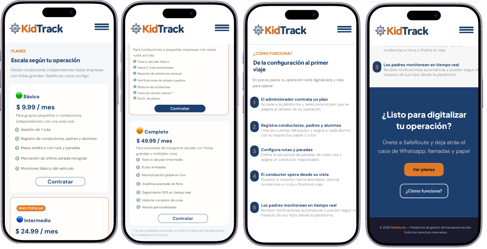

### 4.4. Web Applications UX/UI Design

### 4.4.1. Web Applications Wireframes

A continuación se muestran los wireframes que conforman la estructura visual de la aplicación web de KidTrack, pensada para reunir en un solo lugar la administración de la seguridad y la logística del transporte escolar.

#### Principios aplicados

- Jerarquía funcional clara: el recorrido de navegación pone primero las acciones más sensibles para la seguridad, por ejemplo entrar al mapa de seguimiento en vivo o activar las alertas de pánico.

- Consistencia y patrones de diseño: los formularios y las tablas de datos comparten el mismo lenguaje visual en toda la aplicación, de modo que cualquier usuario tarde poco en aprender a usarla.

- Accesibilidad en interfaces: se usaron contrastes altos y tipografía legible (Plus Jakarta Sans) para que la aplicación se pueda usar cómodamente tanto en celular como en computadora.

- Diseño adaptativo: al ser responsivo, el diseño funciona igual de bien en una estación de monitoreo de escritorio que en la tablet que usa el conductor durante la ruta.

#### Versión Desktop Wireframes - Acceso y Configuración (Universal)

##### Autenticación y Acceso

Registro de Cuenta
Pantalla de registro única en la que la persona elige su rol (Padre, Conductor o Administrador) y llena sus datos básicos. Es el primer paso para que cualquier tipo de usuario empiece a usar la plataforma.

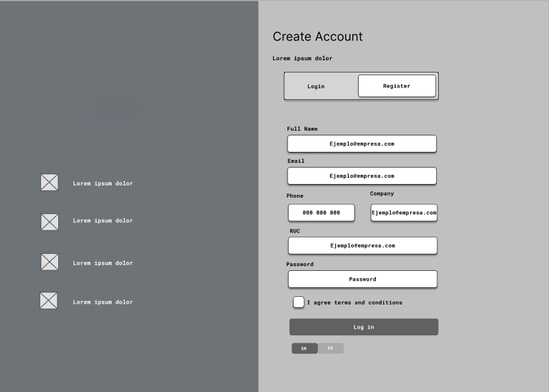

Inicio de Sesión (Login) Pantalla de acceso donde se ingresan las credenciales. Una vez validado el rol, el sistema envía automáticamente al usuario a su panel correspondiente.

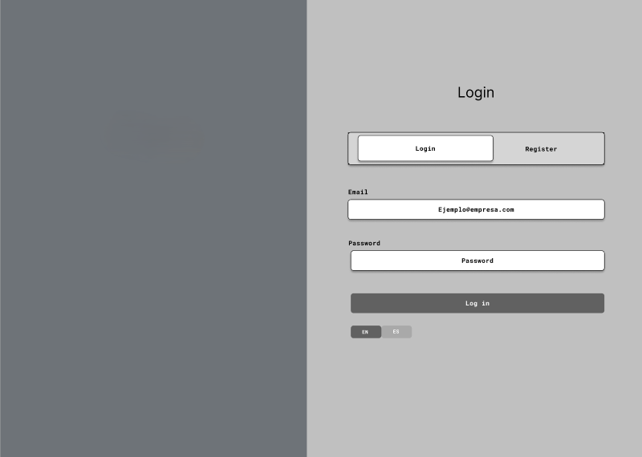

Cambio de Contraseña Flujo de seguridad para recuperar el acceso: primero se verifica la identidad con un código y solo después se habilita el cambio de credenciales, para asegurar que sea el dueño de la cuenta quien lo haga.

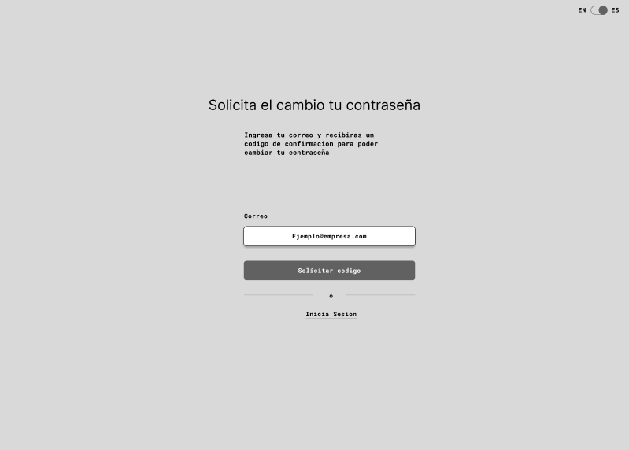
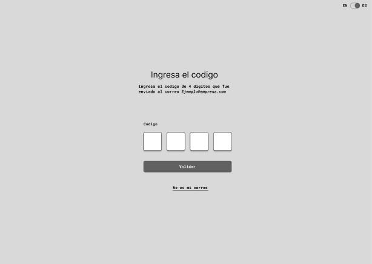
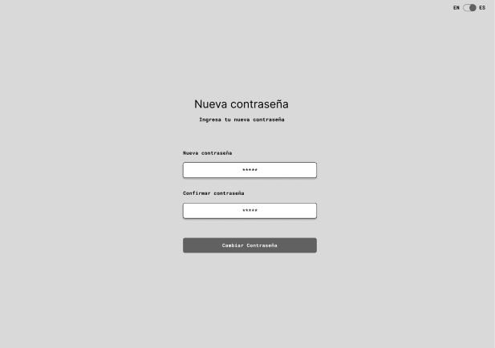

#### Versión Desktop Wireframes - Administradores

##### Configuración y Gestión Administrativa

Panel de Inicio y Navegación

Panel principal que reúne todos los módulos del sistema en una barra lateral, para moverse rápido entre rutas, alumnos y reportes.

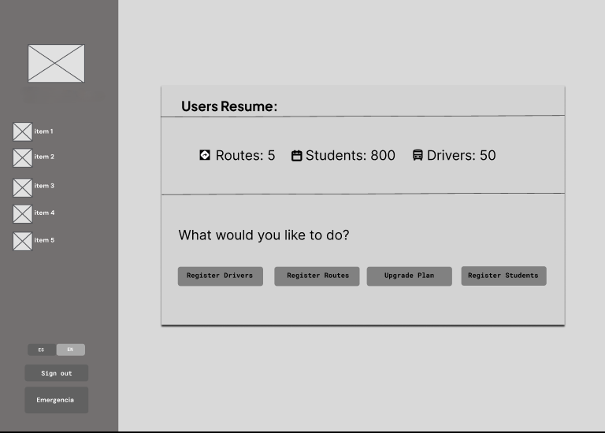

Asignación de Roles

Sección solo para el administrador, donde se configuran los permisos de cada usuario registrado para proteger la integridad de la información.

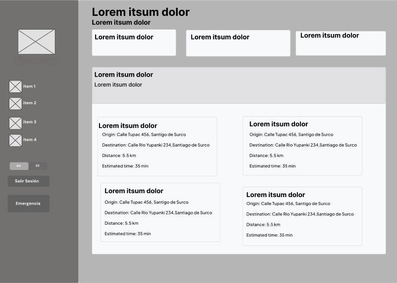

##### Gestión Comercial y Planes

Contratación de Planes

Pantalla comercial donde el dueño de la flota o la institución elige y contrata el plan que mejor se ajusta a su número de buses y alumnos.

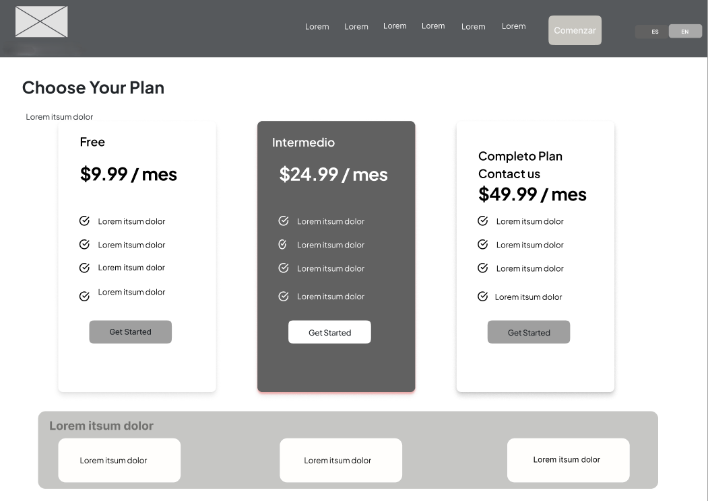


Consulta de Precios y Tarifas

Vista informativa con el detalle de costos y tarifas vigentes para operar el servicio de transporte escolar.


##### Gestión de Logística y Alumnos

Alta y Gestión de Alumnos

Vista conectada a la API desde donde se ve el listado completo de estudiantes, se registran nuevos alumnos y se actualiza la información de los ya existentes.


Registro de Conductores

Formulario para crear el perfil de un conductor, guardando sus datos personales, su licencia y un contacto de emergencia.


Registro de Padres

Formulario para registrar al padre de familia, con sus datos personales y el estudiante del que es apoderado.


Creación y Edición de Rutas

Herramienta con la que el administrador diseña el recorrido: traza la ruta, ubica las paradas y calcula los tiempos estimados de viaje.


#### Versión Desktop Wireframes - Conductores

##### Operación de Viaje

Inicio de Trayecto

Pantalla desde la que el conductor confirma que va a empezar el recorrido; al presionar "Iniciar Viaje" se activa el rastreo GPS que verán los padres.


Marcación de Abordaje

Listado interactivo de alumnos organizado por parada, donde el conductor marca con un toque quién subió al bus y el estado de asistencia se actualiza al instante.


Finalización de Ruta

Pantalla de cierre en la que el conductor da por terminado el viaje, confirmando que cada alumno bajó en su destino.


Bitácora de Viajes Histórica

Resumen diario de los viajes hechos, con las horas de inicio y fin y las incidencias registradas en cada turno.


##### Seguridad y Alertas

Reporte de Incidencias en Ruta

M�dulo para avisar de imprevistos —tráfico, accidentes, fallas mecánicas— que dispara una alerta automática hacia la central y hacia los padres.


Botón de Pánico

Botón de emergencia de un solo clic que manda de inmediato una alerta a los administradores junto con la ubicación exacta del vehículo.


#### Versión Desktop Wireframes - Padres de Familia

##### Monitoreo y Supervisión

Rastreo en Tiempo Real

Mapa interactivo donde el padre sigue el recorrido del bus y ve cuánto falta para que llegue a su parada.


Acceso a Cámara Interna

Función de video en vivo del interior del vehículo, pensada como una capa extra de tranquilidad sobre la seguridad del niño.


Alerta de Proximidad

Aviso visual que se activa cuando el bus se acerca al hogar (por ejemplo, a 500 metros), como señal de que ya es hora de salir hacia la parada.


Confirmación de Llegada

Notificación automática que le llega al padre cuando el vehículo llega bien al colegio o al destino final.


Historial de Asistencia

Calendario donde el padre revisa los días de asistencia, la hora de abordaje y las incidencias de viajes anteriores.


#### Versión Mobile Wireframes - Acceso y Configuración (Universal)

##### Autenticación y Acceso

Registro de Cuenta
Pantalla de registro única en la que la persona elige su rol (Padre, Conductor o Administrador) y llena sus datos básicos. Es el primer paso para que cualquier tipo de usuario empiece a usar la plataforma.


Inicio de Sesión (Login) Pantalla de acceso donde se ingresan las credenciales. Una vez validado el rol, el sistema envía automáticamente al usuario a su panel correspondiente.


Cambio de Contraseña Flujo de seguridad para recuperar el acceso: primero se verifica la identidad con un código y solo después se habilita el cambio de credenciales, para asegurar que sea el dueño de la cuenta quien lo haga.


#### Versión Mobile Wireframes - Administradores

##### Configuración y Gestión Administrativa

Panel de Inicio y Navegación

Panel principal que reúne todos los módulos del sistema en una barra lateral, para moverse rápido entre rutas, alumnos y reportes.


Asignación de Roles

Sección solo para el administrador, donde se configuran los permisos de cada usuario registrado para proteger la integridad de la información.


##### Gestión Comercial y Planes

Contratación de Planes

Pantalla comercial donde el dueño de la flota o la institución elige y contrata el plan que mejor se ajusta a su número de buses y alumnos.


Consulta de Precios y Tarifas

Vista informativa con el detalle de costos y tarifas vigentes para operar el servicio de transporte escolar.


##### Gestión de Logística y Alumnos

Alta y Gestión de Alumnos

Vista conectada a la API desde donde se ve el listado completo de estudiantes, se registran nuevos alumnos y se actualiza la información de los ya existentes.


Registro de Conductores

Formulario para crear el perfil de un conductor, guardando sus datos personales, su licencia y un contacto de emergencia.


Registro de Padres

Formulario para registrar al padre de familia, con sus datos personales y el estudiante del que es apoderado.


Creación y Edición de Rutas

Herramienta con la que el administrador diseña el recorrido: traza la ruta, ubica las paradas y calcula los tiempos estimados de viaje.


#### Versión Mobile Wireframes - Conductores

##### Operación de Viaje

Inicio de Trayecto

Pantalla desde la que el conductor confirma que va a empezar el recorrido; al presionar "Iniciar Viaje" se activa el rastreo GPS que verán los padres.


Marcación de Abordaje

Listado interactivo de alumnos organizado por parada, donde el conductor marca con un toque quién subió al bus y el estado de asistencia se actualiza al instante.


Finalización de Ruta

Pantalla de cierre en la que el conductor da por terminado el viaje, confirmando que cada alumno bajó en su destino.


Bitácora de Viajes Histórica

Resumen diario de los viajes hechos, con las horas de inicio y fin y las incidencias registradas en cada turno.


##### Seguridad y Alertas

Reporte de Incidencias en Ruta

M�dulo para avisar de imprevistos —tráfico, accidentes, fallas mecánicas— que dispara una alerta automática hacia la central y hacia los padres.


Botón de Pánico

Botón de emergencia de un solo clic que manda de inmediato una alerta a los administradores junto con la ubicación exacta del vehículo.


#### Versión Mobile Wireframes - Padres de Familia

##### Monitoreo y Supervisión

Rastreo en Tiempo Real

Mapa interactivo donde el padre sigue el recorrido del bus y ve cuánto falta para que llegue a su parada.


Acceso a Cámara Interna

Función de video en vivo del interior del vehículo, pensada como una capa extra de tranquilidad sobre la seguridad del niño.


Alerta de Proximidad

Aviso visual que se activa cuando el bus se acerca al hogar (por ejemplo, a 500 metros), como señal de que ya es hora de salir hacia la parada.


Confirmación de Llegada

Notificación automática que le llega al padre cuando el vehículo llega bien al colegio o al destino final.


Historial de Asistencia

Calendario donde el padre revisa los días de asistencia, la hora de abordaje y las incidencias de viajes anteriores.


#### 4.4.2. Web Applications Wireflow Diagrams

#### Task Flow 1: Administrar cuenta

Objetivo del usuario: Que el usuario pueda mantener al día los datos de su cuenta y su suscripción, para no perder el acceso ni los beneficios de la plataforma.

#### Pasos del Task Flow:

1. Entrar a "Registrar usuario" y crear una cuenta nueva.

2. Guardar los datos que acaba de llenar.

3. Entrar a la aplicación con esa cuenta desde "Ingresar con usuario".

4. Si no logra entrar, ir a la sección "Cambio de Contraseña".

5. Definir la nueva contraseña.

6. Volver a entrar con la cuenta y la nueva contraseña.

7. El sistema lo lleva a "Inicio" y despliega el menú lateral.

##### User Goal 1: Como suscriptor, quiero entrar a mi cuenta en la aplicación.

##### User Goal 2: Como suscriptor, quiero cambiar mi contraseña para que mi cuenta se mantenga segura.

#### Task Flow 2: Setup Logístico y Financiero del Servicio

Objetivo: Dejar lista la parte operativa y los niveles de acceso necesarios para administrar la unidad.

#### Pasos del Task Flow:

1. Elegir y confirmar la "Contratación del Plan" según el tamaño de su flota.

2. Entrar a "Asignación de Roles" para darle permisos de edición al equipo.

3. Cargar los datos del personal operativo en "Registro de Conductor".

4. Trazar los puntos de parada y los tiempos en "Creación de Rutas".

5. El sistema arma el balance de costos, visible en "Consulta de Precios".

##### User Goal 3: Como administrador, quiero dar de alta nuevos conductores y armarles sus rutas.

##### User Goal 4: Como administrador, quiero tener los roles y las rutas organizados en un solo lugar.

##### User Goal 5: Como administrador, quiero acceder a más funciones de la aplicación cambiándome a un plan superior.

#### A. Segmento: Conductores

#### Task Flow 3: Gestión de Abordaje y Control de Alumnos

Objetivo: Dejar registrado el inicio de la ruta y confirmar, con sincronización en la nube, que cada estudiante subió a la unidad.

#### Pasos del Task Flow:

1. El conductor entra al sistema y elige la ruta que tiene asignada desde su panel principal.

2. Presiona "Iniciar Trayecto", lo que activa la transmisión de sus coordenadas GPS.

3. El sistema hace una petición GET a la API para traer la lista de alumnos de esa ruta.

4. En cada parada, ubica al estudiante en la lista y toca "Marcación de Abordaje".

5. El sistema guarda la hora exacta (timestamp) y cambia el estado del pasajero a "En ruta".

6. Al llegar al colegio, el conductor toca "Finalización de Ruta".

##### User Goal 6: Como conductor, quiero saber en todo momento qué alumnos van en la ruta.

##### User Goal 7: Como conductor, quiero que mi servicio se vea más profesional y confiable.

### Task Flow 4: Seguridad Crítica e Incidencias en Ruta

Objetivo: Avisar sobre imprevistos en la ruta y activar de inmediato los protocolos de auxilio cuando hay una situación de riesgo.

### Pasos del Task Flow:

1. Mientras conduce, el conductor detecta un obstáculo o una emergencia.

2. Entra al módulo de seguridad del Dashboard.

3. Elige una categoría predefinida en "Reporte de Incidencias" para avisar de un retraso.

4. Si el peligro es inminente, mantiene presionado el "Botón de Pánico" por 2 segundos.

5. El sistema lanza una alerta roja al área de emergencias y notifica a los padres y al administrador.

6. Una vez resuelto, el conductor revisa lo ocurrido en su "Bitácora de Viajes".

##### User Goal 8: Como conductor, quiero poder avisar de una incidencia o del avance de la ruta mientras viajo.

##### User Goal 9: Como conductor, quiero contar con una forma inmediata de avisar una emergencia.

### B. Segmento: Padres de Familia

### Task Flow 5: Monitoreo Parental y Supervisión Visual

Objetivo: Que el padre pueda ver dónde está el vehículo escolar y cómo va todo dentro de él durante el trayecto.

### Pasos del Task Flow:

1. El padre inicia sesión y entra al seguimiento del bus de su hijo.

2. El sistema muestra el mapa con la "Ubicación en Tiempo Real" del vehículo.

3. El usuario activa el switch de "Acceso a la Cámara" para abrir la transmisión de video.

4. El sistema valida los permisos y despliega el video en vivo.

5. Cuando el bus entra al radio de 500 m, el sistema muestra la "Alerta de Proximidad".

#### User Goal 10: Como padre de familia, quiero conocer en tiempo real la ubicación y la situación del vehículo.

#### User Goal 11: Como padre de familia, quiero que me lleguen las notificaciones sin tener que estar preguntando.

### Task Flow 6: Auditoría de Asistencia y Verificación de Entrega

Objetivo: Comprobar que el servicio se cumplió y poder revisar el historial de seguridad del estudiante.

### Pasos del Task Flow:

1. Al padre le llega en pantalla la "Confirmación de Llegada" del bus a destino.

2. El sistema deja registrado el cierre del viaje en el perfil del alumno.

3. El usuario entra al módulo de "Historial de Asistencia".

4. Elige el rango de fechas para revisar los horarios de recogida y entrega.

5. El sistema arma un reporte visual con la puntualidad del servicio.

#### User Goal 12: Como padre de familia, quiero confirmar que mi hijo abordó el transporte y que quedó registrado.

#### 4.4.3. Web Applications Mock-ups

#### Versión Desktop Mockups - Acceso y Configuración (Universal)
 
##### Autenticación y Acceso
 
Registro de Cuenta
Pantalla de registro única en la que la persona elige su rol (Padre, Conductor o Administrador) y llena sus datos básicos. Es el primer paso para que cualquier tipo de usuario empiece a usar la plataforma.
 


Inicio de Sesión (Login) Pantalla de acceso donde se ingresan las credenciales. Una vez validado el rol, el sistema envía automáticamente al usuario a su panel correspondiente.
 


Cambio de Contraseña Flujo de seguridad para recuperar el acceso: primero se verifica la identidad con un código y solo después se habilita el cambio de credenciales, para asegurar que sea el dueño de la cuenta quien lo haga.
 


#### Versión Desktop Mockups - Administradores
 
##### Configuración y Gestión Administrativa
 
Panel de Inicio y Navegación
 
Panel principal que reúne todos los módulos del sistema en una barra lateral, para moverse rápido entre rutas, alumnos y reportes.
 


Asignación de Roles
 
Sección solo para el administrador, donde se configuran los permisos de cada usuario registrado para proteger la integridad de la información.
 


##### Gestión Comercial y Planes
 
Contratación de Planes
 
Pantalla comercial donde el dueño de la flota o la institución elige y contrata el plan que mejor se ajusta a su número de buses y alumnos.
 


Consulta de Precios y Tarifas
 
Vista informativa con el detalle de costos y tarifas vigentes para operar el servicio de transporte escolar.
 


##### Gestión de Logística y Alumnos
 
Alta y Gestión de Alumnos
 
Vista conectada a la API desde donde se ve el listado completo de estudiantes, se registran nuevos alumnos y se actualiza la información de los ya existentes.
 


Registro de Conductores
 
Formulario para crear el perfil de un conductor, guardando sus datos personales, su licencia y un contacto de emergencia.
 


Registro de Padres
 
Formulario para registrar al padre de familia, con sus datos personales y el estudiante del que es apoderado.
 


Creación y Edición de Rutas
 
Herramienta con la que el administrador diseña el recorrido: traza la ruta, ubica las paradas y calcula los tiempos estimados de viaje.
 


#### Versión Desktop Mockups - Conductores
 
##### Operación de Viaje
 
Inicio de Trayecto
 
Pantalla desde la que el conductor confirma que va a empezar el recorrido; al presionar "Iniciar Viaje" se activa el rastreo GPS que verán los padres.
 


Marcación de Abordaje
 
Listado interactivo de alumnos organizado por parada, donde el conductor marca con un toque quién subió al bus y el estado de asistencia se actualiza al instante.
 


Finalización de Ruta
 
Pantalla de cierre en la que el conductor da por terminado el viaje, confirmando que cada alumno bajó en su destino.
 


Bitácora de Viajes Histórica
 
Resumen diario de los viajes hechos, con las horas de inicio y fin y las incidencias registradas en cada turno.
 


##### Seguridad y Alertas
 
Reporte de Incidencias en Ruta
 
Módulo para avisar de imprevistos —tráfico, accidentes, fallas mecánicas— que dispara una alerta automática hacia la central y hacia los padres.
 

Botón de Pánico
 
Botón de emergencia de un solo clic que manda de inmediato una alerta a los administradores junto con la ubicación exacta del vehículo.
 


#### Versión Desktop Mockups - Padres de Familia
 
##### Monitoreo y Supervisión
 
Rastreo en Tiempo Real
 
Mapa interactivo donde el padre sigue el recorrido del bus y ve cuánto falta para que llegue a su parada.
 


Acceso a Cámara Interna
 
Función de video en vivo del interior del vehículo, pensada como una capa extra de tranquilidad sobre la seguridad del niño.
 


Alerta de Proximidad
 
Aviso visual que se activa cuando el bus se acerca al hogar (por ejemplo, a 500 metros), como señal de que ya es hora de salir hacia la parada.
 


Confirmación de Llegada
 
Notificación automática que le llega al padre cuando el vehículo llega bien al colegio o al destino final.
 


Historial de Asistencia
 
Calendario donde el padre revisa los días de asistencia, la hora de abordaje y las incidencias de viajes anteriores.
 


#### Versión Mobile Mockups - Acceso y Configuración (Universal)
 
##### Autenticación y Acceso
 
Registro de Cuenta
Pantalla de registro única en la que la persona elige su rol (Padre, Conductor o Administrador) y llena sus datos básicos. Es el primer paso para que cualquier tipo de usuario empiece a usar la plataforma.
 


Inicio de Sesión (Login) Pantalla de acceso donde se ingresan las credenciales. Una vez validado el rol, el sistema envía automáticamente al usuario a su panel correspondiente.
 


Cambio de Contraseña Flujo de seguridad para recuperar el acceso: primero se verifica la identidad con un código y solo después se habilita el cambio de credenciales, para asegurar que sea el dueño de la cuenta quien lo haga.
 


#### Versión Mobile Mockups - Administradores
 
##### Configuración y Gestión Administrativa
 
Panel de Inicio y Navegación
 
Panel principal que reúne todos los módulos del sistema en una barra lateral, para moverse rápido entre rutas, alumnos y reportes.
 


Asignación de Roles
 
Sección solo para el administrador, donde se configuran los permisos de cada usuario registrado para proteger la integridad de la información.
 


##### Gestión Comercial y Planes
 
Contratación de Planes
 
Pantalla comercial donde el dueño de la flota o la institución elige y contrata el plan que mejor se ajusta a su número de buses y alumnos.
 


Consulta de Precios y Tarifas
 
Vista informativa con el detalle de costos y tarifas vigentes para operar el servicio de transporte escolar.
 


##### Gestión de Logística y Alumnos
 
Alta y Gestión de Alumnos
 
Vista conectada a la API desde donde se ve el listado completo de estudiantes, se registran nuevos alumnos y se actualiza la información de los ya existentes.
 


Registro de Conductores
 
Formulario para crear el perfil de un conductor, guardando sus datos personales, su licencia y un contacto de emergencia.
 


Registro de Padres
 
Formulario para registrar al padre de familia, con sus datos personales y el estudiante del que es apoderado.
 


Creación y Edición de Rutas
 
Herramienta con la que el administrador diseña el recorrido: traza la ruta, ubica las paradas y calcula los tiempos estimados de viaje.
 


#### Versión Mobile Mockups - Conductores
 
##### Operación de Viaje
 
Inicio de Trayecto
 
Pantalla desde la que el conductor confirma que va a empezar el recorrido; al presionar "Iniciar Viaje" se activa el rastreo GPS que verán los padres.
 


Marcación de Abordaje
 
Listado interactivo de alumnos organizado por parada, donde el conductor marca con un toque quién subió al bus y el estado de asistencia se actualiza al instante.
 


Finalización de Ruta
 
Pantalla de cierre en la que el conductor da por terminado el viaje, confirmando que cada alumno bajó en su destino.
 


Bitácora de Viajes Histórica
 
Resumen diario de los viajes hechos, con las horas de inicio y fin y las incidencias registradas en cada turno.
 


##### Seguridad y Alertas
 
Reporte de Incidencias en Ruta
 
M�dulo para avisar de imprevistos —tráfico, accidentes, fallas mecánicas— que dispara una alerta automática hacia la central y hacia los padres.
 


Botón de Pánico
 
Botón de emergencia de un solo clic que manda de inmediato una alerta a los administradores junto con la ubicación exacta del vehículo.
 


#### Versión Mobile Mockups - Padres de Familia
 
##### Monitoreo y Supervisión
 
Rastreo en Tiempo Real
 
Mapa interactivo donde el padre sigue el recorrido del bus y ve cuánto falta para que llegue a su parada.
 


Acceso a Cámara Interna
 
Función de video en vivo del interior del vehículo, pensada como una capa extra de tranquilidad sobre la seguridad del niño.
 


Alerta de Proximidad
 
Aviso visual que se activa cuando el bus se acerca al hogar (por ejemplo, a 500 metros), como señal de que ya es hora de salir hacia la parada.
 


Confirmación de Llegada
 
Notificación automática que le llega al padre cuando el vehículo llega bien al colegio o al destino final.
 


Historial de Asistencia
 
Calendario donde el padre revisa los días de asistencia, la hora de abordaje y las incidencias de viajes anteriores.
 


#### 4.4.4. Web Applications User Flow Diagrams

### User Flows Desktop
 
#### Desktop User Flow 1:
 
Relacionado con User Goal 1:
Como suscriptor, quiero entrar a mi cuenta en la aplicación.
 
El usuario entra a la pantalla de login y coloca su correo y contraseña. Si los datos son válidos, el sistema lo valida y lo manda directo a "Inicio" con el menú lateral ya activo. Si todavía no tiene cuenta, puede ir a la sección de registro, llenar sus datos personales y guardar el nuevo usuario para después iniciar sesión con normalidad.
 


#### Desktop User Flow 2:
 
Relacionado con User Goal 2:
Como suscriptor, quiero cambiar mi contraseña para que mi cuenta se mantenga segura.
 
Desde la pantalla de login, el usuario elige "Cambio de Contraseña". Ahí el sistema le pide su correo registrado y la contraseña nueva; al confirmar, actualiza las credenciales y lo deja entrar de nuevo con la contraseña que acaba de definir. Así no pierde el acceso aunque se le haya olvidado la anterior.
 


#### Desktop User Flow 3:
 
Relacionado con User Goal 3:
Como administrador, quiero dar de alta nuevos conductores y armarles sus rutas.
 
Después de iniciar sesión, el administrador entra a "Registro de Conductor" y carga los datos del personal operativo. Luego pasa a "Creación de Rutas", donde marca los puntos de parada, calcula los tiempos estimados y le asigna la ruta al conductor que acaba de registrar. El sistema confirma que todo se guardó y actualiza el panel de gestión.
 


#### Desktop User Flow 4:
 
Relacionado con User Goal 4:
Como administrador, quiero tener los roles y las rutas organizados en un solo lugar.
 
Desde el panel principal, el administrador entra a "Asignación de Roles" y define, para cada miembro del equipo, si tiene permiso de edición o solo de lectura. Después puede revisar y reasignar rutas desde una vista centralizada, verificando que cada conductor tenga su ruta bien vinculada.
 


#### Desktop User Flow 5:
 
Relacionado con User Goal 5:
Como administrador, quiero acceder a más funciones de la aplicación cambiándome a un plan superior.
 
El administrador entra a "Contratación del Plan" y ve las opciones de suscripción según el tamaño de su flota. Al elegir una, pasa a la pasarela de pagos, ingresa sus datos financieros y confirma la contratación. Una vez que el pago se procesa, el sistema habilita los beneficios del nuevo plan y el administrador puede ver el balance de costos en "Consulta de Precios".
 


#### Desktop User Flow 6:
 
Relacionado con User Goal 6:
Como conductor, quiero saber en todo momento qué alumnos van en la ruta.
 
El conductor inicia sesión y, desde su panel, elige la ruta que tiene asignada. Presiona "Iniciar Trayecto" y con eso se activa la transmisión GPS. El sistema carga solo la lista de alumnos de esa ruta. En cada parada, ubica al estudiante y registra el abordaje con "Marcación de Abordaje". Al llegar al destino, cierra el trayecto presionando "Finalización de Ruta".
 


#### Desktop User Flow 7:
 
Relacionado con User Goal 7:
Como conductor, quiero que mi servicio se vea más profesional y confiable.
 
El conductor entra a su "Bitácora de Viajes" y ahí encuentra el historial completo de sus trayectos: horarios, estudiantes transportados e incidencias. Con esa información puede detectar patrones, mejorar su puntualidad y tener un registro formal de su desempeño frente al administrador.
 


#### Desktop User Flow 8:
 
Relacionado con User Goal 8:
Como conductor, quiero poder avisar de una incidencia o del avance de la ruta mientras viajo.
 
Mientras hace una ruta, el conductor detecta un imprevisto y entra al módulo de seguridad del Dashboard. Elige una categoría predefinida en "Reporte de Incidencias" (retraso, desvío, obstáculo, etc.) y envía el aviso. El sistema lo hace llegar al instante al administrador y a los padres afectados.
 


#### Desktop User Flow 9:
 
Relacionado con User Goal 9: Como conductor, quiero contar con una forma inmediata de avisar una emergencia.
 
Si durante la ruta se presenta un peligro inminente, el conductor mantiene presionado el "Botón de Pánico" por 2 segundos. Eso dispara automáticamente una alerta roja hacia los servicios de emergencia, el administrador y los padres de todos los alumnos que van a bordo. Una vez resuelto el incidente, el conductor puede revisar el evento en su Bitácora de Viajes.
 


#### Desktop User Flow 10:
 
Relacionado con User Goal 10:
Como padre de familia, quiero conocer en tiempo real la ubicación y la situación del vehículo.
 
El padre inicia sesión y entra al seguimiento del bus de su hijo. El sistema le muestra el mapa con la ubicación del vehículo en tiempo real, y puede activar "Acceso a la Cámara" para ver la transmisión en vivo del interior de la unidad. Cuando el bus está a 500 metros del destino, el sistema le manda automáticamente una "Alerta de Proximidad".
 


#### Desktop User Flow 11:
 
Relacionado con User Goal 11: Como padre de familia, quiero que me lleguen las notificaciones sin tener que estar preguntando.
 
El padre recibe notificaciones automáticas en distintos momentos del trayecto: cuando el bus arranca la ruta, cuando se acerca a su parada y cada vez que el conductor reporta una incidencia. Estas alertas le llegan solas, sin que tenga que estar revisando la aplicación todo el tiempo.
 


#### Desktop User Flow 12:
 
Relacionado con User Goal 12:
Como padre de familia, quiero confirmar que mi hijo abordó el transporte y que quedó registrado.
 
Cuando el conductor marca el abordaje del estudiante, al padre le aparece una "Confirmación de Llegada" con la hora exacta del registro. Ese evento queda guardado en el "Historial de Asistencia", donde el padre puede elegir un rango de fechas para revisar los horarios de recogida y entrega, y el sistema le arma un reporte visual con la puntualidad del servicio.
 

### User Flows Mobile
 
#### Mobile User Flow 1:
 
Relacionado con User Goal 1:
Como suscriptor, quiero entrar a mi cuenta en la aplicación.
 
El usuario entra a la pantalla de login y coloca su correo y contraseña. Si los datos son válidos, el sistema lo valida y lo manda directo a "Inicio" con el menú lateral ya activo. Si todavía no tiene cuenta, puede ir a la sección de registro, llenar sus datos personales y guardar el nuevo usuario para después iniciar sesión con normalidad.
 

#### Mobile User Flow 2:
 
Relacionado con User Goal 2:
Como suscriptor, quiero cambiar mi contraseña para que mi cuenta se mantenga segura.
 
Desde la pantalla de login, el usuario elige "Cambio de Contraseña". Ahí el sistema le pide su correo registrado y la contraseña nueva; al confirmar, actualiza las credenciales y lo deja entrar de nuevo con la contraseña que acaba de definir. Así no pierde el acceso aunque se le haya olvidado la anterior.
 

#### Mobile User Flow 3:
 
Relacionado con User Goal 3:
Como administrador, quiero dar de alta nuevos conductores y armarles sus rutas.
 
Después de iniciar sesión, el administrador entra a "Registro de Conductor" y carga los datos del personal operativo. Luego pasa a "Creación de Rutas", donde marca los puntos de parada, calcula los tiempos estimados y le asigna la ruta al conductor que acaba de registrar. El sistema confirma que todo se guardó y actualiza el panel de gestión.
 

#### Mobile User Flow 4:
 
Relacionado con User Goal 4:
Como administrador, quiero tener los roles y las rutas organizados en un solo lugar.
 
Desde el panel principal, el administrador entra a "Asignación de Roles" y define, para cada miembro del equipo, si tiene permiso de edición o solo de lectura. Después puede revisar y reasignar rutas desde una vista centralizada, verificando que cada conductor tenga su ruta bien vinculada.
 

#### Mobile User Flow 5:
 
Relacionado con User Goal 5:
Como administrador, quiero acceder a más funciones de la aplicación cambiándome a un plan superior.
 
El administrador entra a "Contratación del Plan" y ve las opciones de suscripción según el tamaño de su flota. Al elegir una, pasa a la pasarela de pagos, ingresa sus datos financieros y confirma la contratación. Una vez que el pago se procesa, el sistema habilita los beneficios del nuevo plan y el administrador puede ver el balance de costos en "Consulta de Precios".
 

#### Mobile User Flow 6:
 
Relacionado con User Goal 6:
Como conductor, quiero saber en todo momento qué alumnos van en la ruta.
 
El conductor inicia sesión y, desde su panel, elige la ruta que tiene asignada. Presiona "Iniciar Trayecto" y con eso se activa la transmisión GPS. El sistema carga solo la lista de alumnos de esa ruta. En cada parada, ubica al estudiante y registra el abordaje con "Marcación de Abordaje". Al llegar al destino, cierra el trayecto presionando "Finalización de Ruta".
 

#### Mobile User Flow 7:
 
Relacionado con User Goal 7:
Como conductor, quiero que mi servicio se vea más profesional y confiable.
 
El conductor entra a su "Bitácora de Viajes" y ahí encuentra el historial completo de sus trayectos: horarios, estudiantes transportados e incidencias. Con esa información puede detectar patrones, mejorar su puntualidad y tener un registro formal de su desempeño frente al administrador.
 

#### Mobile User Flow 8:
 
Relacionado con User Goal 8:
Como conductor, quiero poder avisar de una incidencia o del avance de la ruta mientras viajo.
 
Mientras hace una ruta, el conductor detecta un imprevisto y entra al módulo de seguridad del Dashboard. Elige una categoría predefinida en "Reporte de Incidencias" (retraso, desvío, obstáculo, etc.) y envía el aviso. El sistema lo hace llegar al instante al administrador y a los padres afectados.
 

#### Mobile User Flow 9:
 
Relacionado con User Goal 9:
Como conductor, quiero contar con una forma inmediata de avisar una emergencia.
 
Si durante la ruta se presenta un peligro inminente, el conductor mantiene presionado el "Botón de Pánico" por 2 segundos. Eso dispara automáticamente una alerta roja hacia los servicios de emergencia, el administrador y los padres de todos los alumnos que van a bordo. Una vez resuelto el incidente, el conductor puede revisar el evento en su Bitácora de Viajes.
 

#### Mobile User Flow 10:
 
Relacionado con User Goal 10:
Como padre de familia, quiero conocer en tiempo real la ubicación y la situación del vehículo.
 
El padre inicia sesión y entra al seguimiento del bus de su hijo. El sistema le muestra el mapa con la ubicación del vehículo en tiempo real, y puede activar "Acceso a la Cámara" para ver la transmisión en vivo del interior de la unidad. Cuando el bus está a 500 metros del destino, el sistema le manda automáticamente una "Alerta de Proximidad".
 

#### Mobile User Flow 11:
 
Relacionado con User Goal 11:
Como padre de familia, quiero que me lleguen las notificaciones sin tener que estar preguntando.
 
El padre recibe notificaciones automáticas en distintos momentos del trayecto: cuando el bus arranca la ruta, cuando se acerca a su parada y cada vez que el conductor reporta una incidencia. Estas alertas le llegan solas, sin que tenga que estar revisando la aplicación todo el tiempo.
 

#### Mobile User Flow 12:
 
Relacionado con User Goal 12:
Como padre de familia, quiero confirmar que mi hijo abordó el transporte y que quedó registrado.
 
Cuando el conductor marca el abordaje del estudiante, al padre le aparece una "Confirmación de Llegada" con la hora exacta del registro. Ese evento queda guardado en el "Historial de Asistencia", donde el padre puede elegir un rango de fechas para revisar los horarios de recogida y entrega, y el sistema le arma un reporte visual con la puntualidad del servicio.
 

### 4.5. Web Applications Prototyping

La interacción con la interfaz se rige por pilares de diseño clave. Por un lado, el contraste guía la atención hacia funciones vitales como el Botón de Pánico y los avisos de cercanía; por otro, la uniformidad visual se logra mediante la repetición en los paneles destinados a administradores, conductores y tutores. Asimismo, una correcta alineación fomenta una lectura fluida, mientras que la proximidad agrupa de manera lógica los datos de los estudiantes y sus estados de embarque. Todo esto converge en una experiencia inclusiva, práctica y fiel al propósito de brindar un transporte escolar seguro.

En cuanto a la arquitectura de información, KidTrack se estructura mediante un panel principal de navegación jerárquica, respaldado por flujos paso a paso para tareas críticas como el arranque de rutas, el registro de pasajeros y la notificación de eventualidades. Adicionalmente, cuenta con taxonomías intuitivas, divisiones por roles y herramientas de monitoreo en tiempo real que optimizan la dinámica de uso.

Asimismo, se integraron elementos responsivos como efectos visuales en botones (hover/active), validaciones instantáneas en formularios, respuestas operativas claras y esquemas de navegación personalizados para cada perfil (Administrador, Conductor o Padre de Familia). De este modo, se asegura que consultar datos o realizar gestiones sea un proceso fluido, seguro y pensado para la tranquilidad de toda la comunidad.

Más adelante, se presentan capturas de pantalla tomadas de un video demostrativo para las versiones de escritorio y móvil, donde se detallan los flujos interactivos principales implementados en los prototipos.

#### Web Applications Mobile:

[Mobile Prototype](https://1drv.ms/v/c/a3bda66c80e2095c/IQAHgwxCjWdTT7gZyM6kceTfAXgBPj865SIOo7kzbsRkavg?e=kFyB65)


#### Web Applications Desktop:

[Desktop Prototype](https://streamable.com/bcvzjg)
### 4.6. Domain-Driven Software Architecture

#### 4.6.1. Design-Level Event Storming

Plantilla de colores:


 
1. Unstructured Exploration
   
En este primer paso reunimos los eventos de dominio más importantes para la movilidad escolar, sin preocuparnos todavía por el orden en que ocurren. La idea es capturar los hitos de negocio que hacen posible la interacción segura entre padres, conductores y administradores. Estos eventos se agrupan en seis grandes bloques:
 
- Identidad y Gestión de Accesos (IAM): cubre la seguridad y el inicio de sesión de la plataforma, con eventos como Login, Authenticate User, la emisión de tokens JWT para mantener las sesiones seguras y el alta de administradores.
- Gestión de Suscripciones y Planes: regula el acceso comercial a las funciones de la plataforma, desde elegir un plan hasta procesar el pago con una pasarela externa y habilitar las funciones de gestión de rutas correspondientes al plan contratado (básico, intermedio o completo).
- Gestión de Stakeholders y Activos: administra los perfiles de las personas involucradas y cómo se relacionan entre sí — el registro de conductores, padres y estudiantes, la creación de grupos de transporte y la vinculación de cada hijo con su padre para poder darle seguimiento individual.
- Planificación de Flota y Rutas: define toda la logística antes de que el viaje empiece: la creación de la geocerca de la ruta (RouteGeofenceCreated), la elección de los puntos de parada (Pick Waypoints), la asignación de estudiantes a un vehículo y la fijación del horario de salida.
- Ejecución y Monitoreo de Viajes: es el núcleo operativo que corre en tiempo real, desde que el conductor da inicio al trayecto (TripStarted), pasando por el registro del estado de abordaje de cada estudiante (StudentStatus), hasta la consulta en vivo de la información de la ruta mientras dura el recorrido.
2. Timelines
   
En este paso ordenamos los eventos en el tiempo para ver cómo fluyen naturalmente los procesos del negocio. Las líneas de tiempo más relevantes son:
 
- Flujo de Incorporación y Suscripción: Registro de administrador → Creación de organización → Selección de plan de suscripción → Procesamiento de pago → Activación de cuotas de servicios.
- Gestión de Stakeholders y Activos: Registro de conductores y padres → Vinculación de estudiante a padre → Creación de grupos de transporte → Registro de vehículos → Asignación de conductor a vehículo.
- Planificación de Rutas Institucionales: Definición de geocerca de la ruta → Selección de puntos de parada (waypoints) → Asignación de estudiantes a la ruta → Establecimiento de horarios de salida → Finalización de la activación de ruta.
- Ejecución de Viajes y Monitoreo: Inicio de viaje por el conductor → Consulta de información de ruta → Registro de abordaje del estudiante → Notificación automática al padre → Seguimiento de progreso en tiempo real.
- Gestión de Comunicaciones e Incidentes: Detección de anomalía → Generación de alerta de pánico de alta prioridad → Despacho de alerta a administradores/padres → Difusión de mensajes de estado (broadcast) → Visualización en línea de tiempo.
- Cierre de Operación: Llegada al destino final → Confirmación de descenso total de estudiantes → Finalización de viaje → Archivamiento de datos de ejecución → Liberación de recursos de flota.
Estas líneas de tiempo dejan ver las dependencias en el tiempo y el orden en que ocurren las operaciones del sistema, garantizando que la información viaje correctamente desde la base de datos hasta la notificación que recibe el padre en su dispositivo.
 
3. Pain Points
   
En esta etapa identificamos los puntos de fricción, cuellos de botella y otros problemas que aparecen durante los procesos operativos y administrativos. Entre los pain points detectados están:
 
- Sincronización de Notificaciones: la alerta push que le llega al padre cuando el estudiante aborda el vehículo a veces se demora, lo que genera una incertidumbre que no debería existir.
- Gestión de Errores en Abordaje: si el conductor se equivoca al registrar manualmente el estado del estudiante (StudentStatus), el registro de asistencia queda mal.
- Validaciones de Seguridad: una emergencia real puede coincidir con una caída de conectividad o un error del sistema, bloqueando o impidiendo que se genere la alerta de pánico de alta prioridad.
- Asignación de Recursos: un error al vincular manualmente un conductor con su vehículo o ruta impide que el viaje arranque correctamente en la plataforma.
- Fricción en el Pago y Suscripción: si el procesamiento del pago se interrumpe, se deshabilitan las cuotas de rutas contratadas y se frena la operación diaria de la institución.
- Precisión de Geolocalización: la falta de precisión del GPS a veces hace que la ubicación de los checkpoints no sea del todo confiable.
Tener claros estos puntos críticos le permite al equipo de KidTrack priorizar mecanismos de redundancia y mejorar la experiencia de usuario, para que la comunicación entre el transporte y el hogar no falle.
 
4. Pivotal Points
   
Los puntos pivotales son los eventos que marcan un antes y un después en el ciclo de vida del servicio. Entre ellos están:
 
Activación de Suscripción: es el momento en que la cuenta pasa de un estado de configuración restringida a uno operativo, habilitando las cuotas de rutas y conductores que se necesitan para funcionar.
 
Finalización de Definición de Ruta: aquí termina la planificación técnica y la ruta ya puede asignarse a un vehículo y a un conductor.
 
Inicio de Viaje: activa el monitoreo en tiempo real y desde ese momento los padres pueden ver el progreso del transporte en su aplicación.
 
Registro de Abordaje (Student Boarded): es el evento pivotal en cuanto a comunicación, porque confirma que el estudiante está a salvo y dispara automáticamente la notificación push hacia su tutor legal.
 
Generación de Alerta de Pánico: cambia el estado del viaje de "Normal" a "Emergencia", lo que activa los protocolos de respuesta inmediata y le da prioridad a la comunicación dentro de la red de seguridad.
 
Completación de Viaje: cierra la responsabilidad operativa del conductor sobre los estudiantes y archiva el registro, dejando libres los recursos de la flota.
 
Estos puntos son claves para que la movilidad escolar funcione de principio a fin, porque garantizan que cada fase del proceso se cumpla antes de pasar a la siguiente.
 
5. Commands
   
Los comandos son las acciones o intenciones del usuario que disparan un evento en el sistema. Los principales que identificamos son:
 
- Gestión de Identidad y Acceso (IAM): Registrar administrador, iniciar sesión, autenticar usuario, asignar rol, revocar privilegios.
- Gestión de Suscripciones y Planes: Seleccionar plan, iniciar proceso de pago, activar funciones de gestión, actualizar cuotas de conductores, cancelar servicio.
- Gestión de Stakeholders y Activos: Registrar conductor, registrar padre, vincular estudiante a pariente, registrar vehículo, crear grupo de transporte, asignar miembros al grupo.
- Gestión de Flota y Rutas: Definir geocerca, seleccionar puntos de parada (waypoints), asignar estudiantes a ruta, asignar vehículo a ruta, establecer horario de salida, finalizar activación de ruta.
- Ejecución de Viajes y Monitoreo: Iniciar viaje, consultar información de ruta, registrar estado de abordaje del estudiante, reportar incidente (botón de pánico), finalizar viaje.
- Comunicación y Notificaciones: Preparar notificación push, despachar alerta a padres, publicar mensaje de difusión (broadcast), mostrar mensaje en línea de tiempo.
6. Policies
   
Las políticas automatizan la lógica de negocio y mantienen la coherencia del sistema frente a eventos críticos. Las más importantes son:
 
- Cuando el pago se procesa con éxito → se activa la suscripción y se habilitan automáticamente las cuotas de rutas y conductores.
- Cuando el conductor inicia un viaje → se avisa a todos los padres de esa ruta que ya pueden ver el monitoreo en tiempo real.
- Cuando se registra el abordaje de un estudiante → se envía de inmediato una notificación push al dispositivo del padre correspondiente.
- Cuando se reporta un incidente de pánico → se genera una alerta de alta prioridad que llega al instante a los administradores y a los padres del grupo.
- Cuando se publica un mensaje de difusión → aparece en la línea de tiempo de todos los miembros del grupo seleccionado.
- Cuando se confirma que todos los estudiantes bajaron → el viaje se marca como completado y se archivan los datos de su ejecución.
- Cuando falla el registro de un stakeholder → se le envía al administrador una notificación de error con el detalle de la validación.
7. Read Models
   
Para que el sistema sea transparente, identificamos estos modelos de lectura principales:
 
- Dashboard del Conductor: muestra en detalle la ruta asignada, la lista de estudiantes por recoger, los puntos de parada (waypoints) y el estado de abordaje en tiempo real.
- Panel de Monitoreo para Padres: deja ver en tiempo real dónde está el vehículo, el estado de seguridad del estudiante y la línea de tiempo de eventos del viaje.
- Vista de Gestión de Grupos: agrupa a los estudiantes por ruta, los vincula con sus padres y muestra el estado de asistencia del mes.
- Estado de la Flota: registra qué vehículos están activos, qué conductor tiene asignado cada uno y qué recursos hay disponibles para nuevas rutas.
- Historial de Incidentes: lleva el registro cronológico de las alertas de pánico, los mensajes de difusión enviados y cómo se resolvió cada evento de seguridad.
- Panel de Suscripción y Cuotas: reúne la información del plan activo, el estado de los pagos y el uso de las cuotas de rutas y conductores contratadas.
- Directorio de Stakeholders: reúne el perfil completo de cada usuario (padres, conductores y administradores) con su rol y sus privilegios de acceso.
8. External Systems
   
Las integraciones externas que identificamos para la solución son:
 
- Leaflet (Proveedor de Mapas): se usa para mostrar las rutas de forma interactiva, trazar las geocercas (geofencing) y manejar las coordenadas geográficas del monitoreo en tiempo real.
- Resend (Servicio de Email): envía las notificaciones transaccionales y los correos automáticos, como los mensajes de bienvenida, la confirmación de registro y las alertas administrativas.
- PayPal (Pasarela de Pago): procesa de forma segura los pagos para activar, renovar o cambiar el plan de suscripción de la institución.
- MySQL (Gestión de Base de Datos): es el motor de base de datos relacional donde se guarda y organiza toda la información de usuarios, rutas, vehículos y registros operativos.
9. Aggregates
   
A partir de los dominios operativos que identificamos, estos son los agregados:
 
User (Raíz): concentra la identidad del usuario — sus credenciales de acceso, el rol que tiene asignado (Administrador, Padre, Conductor) y los privilegios que le dan acceso al panel de control.
 
Organization (Raíz): maneja la configuración de la institución, sus miembros y la relación de la cuenta con los parámetros base del sistema institucional.
 
Subscription (Raíz): controla el ciclo de vida del plan contratado, apoyándose en PayPal para procesar el pago y así habilitar o restringir las cuotas de rutas y conductores disponibles.
 
Stakeholder (Raíz): agrupa la información de padres y conductores, y gestiona el vínculo clave entre el tutor (padre) y el estudiante que hace posible el flujo de notificaciones.
 
Vehicle (Raíz): registra las unidades de transporte, sus datos técnicos y los cambios de estado (activo/inactivo) dentro de la flota.
 
Route (Raíz): coordina la logística del recorrido: la geocerca, los paraderos (waypoints) elegidos y los estudiantes que quedan asignados de antemano a esa ruta.
 
Trip (Raíz): controla la ejecución del viaje en tiempo real, registrando cuándo arranca el trayecto, los cambios en el estado de abordaje de los estudiantes y el log de incidentes que se generan durante el recorrido.
 
10. Bounded Contexts
    
Los bounded contexts agrupan los agregados en dominios de negocio independientes, de forma que cada uno pueda evolucionar por su cuenta y el sistema sea más fácil de escalar:
 
- Identity & Access Management: se encarga de la seguridad perimetral — autenticar usuarios, crear organizaciones y asignar roles y privilegios a administradores, padres y conductores. Agregados: User, Organization.
- Subscription & Plan Management: administra el lado comercial del servicio, desde elegir el plan hasta procesar el pago con PayPal y activar las cuotas de rutas y conductores contratadas. Agregados: Subscription.
- Stakeholder & Asset Management: maneja los perfiles de las personas clave y los recursos físicos de la institución — el registro de conductores y padres, la vinculación entre cada padre y su hijo, y la gestión de la flota de vehículos. Agregados: Stakeholder, Vehicle.
- Route Planning & Execution: cubre toda la logística, desde la planificación técnica hasta la operación en tiempo real — la geocerca, los paraderos, el monitoreo del abordaje y la gestión de incidentes durante el trayecto. Agregados: Route, Trip.
- Notifications & Communication: es el puente de comunicación inmediata entre el transporte y el hogar; se encarga de las notificaciones push (como el estado de abordaje), las alertas de pánico y los mensajes de difusión general para mantener informados a padres y administradores.

#### 4.6.2. Software Architecture Context Diagram

El diagrama de contexto ubica a KidTrack como el sistema central, rodeado de sus tres tipos de usuario y de los sistemas externos con los que se conecta. El Administrador usa la plataforma para configurar rutas, registrar actores y administrar suscripciones; el Conductor entra para ejecutar sus viajes, registrar el abordaje de los estudiantes y lanzar alertas de pánico; y el Padre/Tutor monitorea en tiempo real la ruta de su hijo y recibe las notificaciones correspondientes. KidTrack se conecta con PayPal para procesar los pagos, con Leaflet + OpenRouteService para mostrar los mapas y calcular las rutas escolares, y con Resend como proveedor de correo transaccional para el envío de alertas y notificaciones.
 


#### 4.6.3. Software Architecture Container Diagrams

Aquí se detallan las principales unidades de despliegue del sistema. El diagrama muestra cómo KidTrack se divide en una Landing Page estática (HTML5, CSS3, JavaScript), una aplicación web interactiva del lado del cliente construida en Angular con Angular Material, una API backend modularizada hecha en Spring Boot y Java, un Shared Kernel como librería Java de tipos compartidos entre los distintos contextos, y un repositorio central de persistencia en MySQL.
 


#### 4.6.4. Software Architecture Components Diagrams

**FrontEnd**
 
- Single Page

La SPA se construyó con Angular, Angular Material y TypeScript, y está organizada en módulos según el bounded context. Cada módulo mantiene la misma estructura interna de cuatro capas: Model (los resources del dominio), Assembler (transforma lo que devuelve la API), API Service (consume el backend por HttpClient) y Store (el estado reactivo, con Angular Signals). La Navigation Bar del módulo Shared se encarga de moverse entre módulos, el HTTP Service centraliza todas las llamadas REST y el Map Service gestiona la integración con Leaflet.
 
- Trip Execution & Monitoring:

  Muestra el núcleo operativo del frontend en sus 4 capas: la Trip View procesa la ejecución del viaje en tiempo real, el Signal Store guarda el estado de los abordajes y los incidentes activos, y el Trip Service manda cada evento al Web Service, que a su vez dispara las notificaciones que correspondan.
  .png)

  Presentation trip:

  .png>)

- Route Planning & Execution:
  Detalla las 4 capas del módulo que se encarga de la logística previa al viaje en el cliente: la configuración visual de rutas y paraderos con coordenadas GPS, la asignación de vehículos y conductores y la definición de horarios, con el Route Signal Store sincronizando ese estado de configuración hacia el Web Service.
  .png>)

  Presentation Route:

  .png>)

- Stakeholder & Asset Management:
  Representa las 4 capas del módulo que administra, en el frontend, la información central del negocio: las vistas para crear y vincular perfiles de conductores, padres, estudiantes y vehículos, con un Signal Store que centraliza el estado de los grupos y las asignaciones por organización.
  .png>)

  Presentation stakeholder:

  .png>)
  - Notifications & Communication:
    Describe, en sus 4 capas, el módulo que comunica al sistema con el usuario: la Notifications View muestra alertas, confirmaciones de abordaje y anuncios en tiempo real, el Signal Store lleva la cuenta de lo no leído, y el Notification Service consulta periódicamente al Web Service para mantener todo actualizado.
    .png>)

  Presentation trip:

  .png>)

**Shared — Componentes compartidos del frontend**

El diagrama presenta componentes reutilizables de soporte para el frontend, como la navegación, la comunicación HTTP, los interceptores y la integración con mapas. Estos elementos se agrupan bajo la denominación Shared por su función técnica transversal.

En esta vista, Shared representa componentes técnicos compartidos y no implica que todos ellos formen parte de un Shared Kernel de dominio. Las reglas de negocio permanecen bajo la responsabilidad de los contextos correspondientes.
  

  Presentation shared:
  
  - Identity & Access Management:
    Desglosa el módulo de identidad del frontend en sus 4 capas internas: la Identity View se encarga de los formularios de login y registro, el Signal Store guarda el estado de sesión y el rol del usuario activo, y el IAM Service envía las peticiones de autenticación al Web Service, adjuntando y guardando el token JWT.
    .png>)

  Presentation IAM:

  .png>)

- Subscription & Plan Management:
  Muestra la arquitectura interna de 4 capas del módulo que maneja la monetización en el cliente: la Subscriptions View presenta los planes disponibles, el Signal Store mantiene el estado del plan activo y sus cuotas, y el Subscription Service se comunica con el Web Service para manejar todo el ciclo de vida del pago.
  .png>)

  Presentation subscription:

  .png>)

**BackEnd**
 
- Web Services:
  
  Este diagrama da la vista general del backend: muestra cómo el monolito de Spring Boot está organizado, a nivel lógico, en seis Bounded Contexts independientes más un Shared Kernel (el núcleo compartido de Value Objects), lo que deja bien separadas las responsabilidades de cada dominio.

- Trip Execution & Monitoring:
  Muestra el núcleo operativo del sistema en sus 4 capas: cómo se procesa la lógica en tiempo real durante el viaje, el registro del abordaje de cada estudiante, el log de incidentes y la emisión de los eventos de dominio internos que activan el contexto de Notificaciones.
  

- Route Planning & Execution:
  Detalla la arquitectura modular (Controller, Service, Domain, Repository) que se encarga de la logística previa al viaje: la definición de paraderos con coordenadas GPS de alta precisión, la asignación de vehículos y conductores, y la configuración de horarios y días de servicio de cada ruta.
  

- Stakeholder & Asset Management:
  Representa las capas internas del dominio que administra la información central del negocio: crear y vincular los perfiles de conductores, padres y estudiantes, y gestionar la flota de vehículos disponible por organización.
  

- Notifications & Communication:
  Describe el módulo de comunicación asíncrona en sus 4 capas: recibe los eventos internos que emite el contexto de Trip y usa su capa de infraestructura para enviar, a través de Resend, las alertas de pánico, las notificaciones de abordaje y los comunicados de difusión general.
  

- Shared — Componentes compartidos del backend:

El diagrama reúne componentes de soporte utilizados por distintos bounded contexts, organizados en interfaces, aplicación, dominio e infraestructura.

Para interpretar esta vista, el rótulo “Shared Kernel” del contenedor general debe entenderse como “Shared — componentes compartidos”. Su alcance gráfico incluye utilidades técnicas y, por tanto, es más amplio que el concepto de Shared Kernel de dominio.

En el presente diseño se reserva el término Shared Kernel para un conjunto mínimo de tipos de dominio que necesiten mantener el mismo significado y las mismas reglas entre contextos. Los middlewares, recursos REST, configuraciones y utilidades de persistencia se consideran soporte técnico compartido; su reutilización no los convierte en parte de ese núcleo de dominio.

Como regla de diseño, solo se incorporarán al núcleo los tipos cuya necesidad de compartir esté justificada. Sus cambios deberán coordinarse con los contextos consumidores. Las reglas de negocio y los repositorios específicos permanecerán en sus respectivos contextos, y el núcleo de dominio no deberá depender de componentes web ni de implementaciones de persistencia.

  .png>)

  - Identity & Access Management:
    Desglosa el módulo de identidad en sus 4 capas internas (API, Application, Domain, Infrastructure): cómo se maneja la autenticación de usuarios, la creación de cuentas y la asignación de roles de forma aislada, con Spring Security encargándose de emitir los tokens JWT en la capa de infraestructura.
    

- Subscription & Plan Management:
  Muestra la estructura interna de 4 capas del contexto de monetización: el flujo va desde el controlador REST hasta la infraestructura que se integra con PayPal para manejar el ciclo de vida de los planes y los pagos de suscripción.
  
  
### 4.7. Software Object-Oriented Design
#### 4.7.1. Class Diagrams
**FrontEnd**

Los diagramas presentan a App como el componente raíz que contiene los componentes de cada bounded context mediante relaciones de composición (composes). Las clases *Store administran el estado con Signal<T> y recurren a las clases *Api para realizar solicitudes HTTP. Por su parte, las clases *Assembler convierten las respuestas de la API, representadas mediante *Resource, en modelos propios del dominio.

- Trip Execution & Monitoring:

Este contexto reúne las pantallas destinadas a supervisar y gestionar los viajes durante su ejecución.

**Presentation & Domain:** App integra TripDashboard, encargado de iniciar y finalizar los viajes; AttendanceChecklist, que administra el estado de abordaje de los estudiantes; e IncidentForm, utilizado para registrar incidentes. La información presentada por estos componentes se obtiene de los modelos Trip, Attendance e Incident, de modo que las vistas representen el estado de la operación.

**Application & Infrastructure:** TripStore concentra los datos del viaje en curso, junto con sus asistencias e incidentes. Las operaciones se canalizan mediante TripApi, que expone métodos como startTrip() y updateBoardingStatus(). La conversión de los recursos se realiza con TripAssembler, AttendanceAssembler e IncidentAssembler.

- Fleet & Route Planning:

Este contexto proporciona las interfaces necesarias para organizar las rutas, los vehículos y las asignaciones del servicio.

**Presentation & Domain:** App incorpora RouteForm para registrar rutas, StopList para administrar paradas, VehicleList para consultar vehículos y AssignmentForm para asignar conductores y estudiantes. Estos componentes trabajan con las entidades Route, Stop, Vehicle y Assignment, manteniendo la información de las vistas vinculada al modelo del negocio.

**Application & Infrastructure:** FleetStore administra el estado de las rutas, paradas, vehículos y asignaciones. FleetApi se ocupa de las solicitudes HTTP, mientras que las clases Assembler adaptan los recursos recibidos a las entidades correspondientes; por ejemplo, convierten RouteResource en Route.

- Notifications & Communication:

Agrupa las funciones de consulta y envío de notificaciones, alertas y comunicados.

**Presentation & Domain:** App contiene NotificationList, que permite filtrar notificaciones y marcarlas como leídas; AlertPanel, orientado a las alertas activas y de pánico; y AnnouncementForm, destinado a elaborar comunicados. Estos componentes presentan la información a partir de los modelos Notification, Alert y Announcement.

**Application & Infrastructure:** NotificationsStore conserva el estado de las notificaciones, alertas y comunicados. Las solicitudes se ejecutan mediante NotificationsApi, con operaciones como dispatchNotification() y triggerAlert(). Los Assemblers convierten las respuestas obtenidas en los modelos de dominio utilizados por la aplicación.

- Stakeholder & Asset Management:

Incluye las vistas utilizadas para consultar y administrar a los participantes del servicio.

**Presentation & Domain:** App integra ParentList, DriverList, ChildList y StudentGroupList. Estos componentes permiten buscar registros mediante searchQuery, seleccionarlos y eliminarlos. Para mostrar la información de los participantes y sus agrupaciones, utilizan los modelos Parent, Driver, Child y StudentGroup.

**Application & Infrastructure:** StakeholderStore mantiene el estado de las listas mediante Signals. StakeholderApi realiza las operaciones CRUD con el backend, y las clases Assembler adaptan las respuestas a los modelos de dominio. Por ejemplo, ParentAssembler transforma los datos recibidos como ParentResource.

- Identity and Access Management:

Comprende las interfaces de autenticación y administración de los datos de la organización.

**Presentation & Domain:** App reúne AdminLoginForm y UserLoginForm para el inicio de sesión, AdminRegisterForm para el registro, y OrganizationForm y OrganizationProfile para la gestión de la organización. Estos componentes se comunican con IamStore y utilizan los modelos User y Organization para consultar y actualizar la información asociada a la sesión.

**Application & Infrastructure:** IamStore administra el estado mediante currentUserSignal y organizationSignal. Las acciones de acceso y creación de organizaciones se realizan a través de IamApi, con métodos como signIn() y createOrganization(). UserAssembler y OrganizationAssembler convierten UserResource y OrganizationResource en sus respectivos modelos de dominio.

- Subscription & Plan Management:

Ofrece las vistas para consultar los planes disponibles y administrar la suscripción de la organización.

**Presentation & Domain:** App incorpora PlanSelector, destinado a elegir un plan, y SubscriptionStatus, que presenta el estado de la suscripción. Ambos reciben información de los modelos Subscription y Plan para mostrar datos como la vigencia restante y los límites del servicio, sin utilizar directamente las estructuras de respuesta de la API.

**Application & Infrastructure:** SubscriptionStore conserva el estado en subscriptionSignal y plansSignal. Mediante SubscriptionApi consulta los planes con getAllPlans() y solicita cambios en la suscripción con upgradeSubscription() y cancelSubscription(). Los Assemblers correspondientes adaptan los recursos a los modelos empleados por la aplicación.

**BackEnd**

- Fleet & Route Planning:

Concentra las responsabilidades relacionadas con la organización logística del transporte y la distribución de sus recursos.

- Route Aggregate

Representa el recorrido y las condiciones de su programación mediante Value Objects como DepartureTime y ServiceDays. También incorpora la secuencia de paradas que componen la ruta, representadas por Stop.

- Vehicle Aggregate

Administra la información de capacidad y disponibilidad de cada vehículo destinado al servicio.

- Assignment Aggregate

Establece la relación entre un conductor, un grupo de estudiantes y una ruta para organizar su participación en un viaje específico.

- Trip Execution & Monitoring:

Agrupa la lógica necesaria para desarrollar los viajes y realizar su seguimiento.

- Trip Aggregate

Administra las etapas del viaje mediante operaciones como start() y complete(). Relaciona el recorrido con una ruta, un conductor y una organización, además de incorporar los registros de asistencia (Attendance) y los incidentes (Incident).

- TripLocation Aggregate

Gestiona los datos de ubicación del vehículo para permitir su seguimiento en tiempo real durante el viaje.

- Notifications & Communication:

Reúne la lógica de comunicación destinada a informar a los padres de familia sobre el servicio y sus alertas.

- Notification Aggregate

Administra los mensajes dirigidos a los apoderados, incluida su categoría y estado de entrega. Dentro de esta responsabilidad se consideran tanto las alertas como los comunicados.

- Stakeholder & Asset Management:

Representa a los participantes del servicio y las agrupaciones mediante las cuales se organizan dentro de la aplicación.

- Parent Aggregate

Modela al apoderado y su relación con los estudiantes bajo su responsabilidad. Permite incorporar o retirar hijos de esa relación.

- Driver Aggregate

Representa al conductor y reúne los datos asociados a su actividad, entre ellos la información de su licencia.

- StudentGroup Aggregate

Reúne las referencias de varios estudiantes en un grupo para facilitar su asignación dentro de la operación del transporte.

- Identity and Access Management (IAM):

Concentra la administración de las organizaciones, las cuentas de usuario y los roles de acceso.

- Organization Aggregate

Administra la creación y los cambios de estado de la organización mediante create(), suspend() y activate(). Su identificador, nombre y estado se representan mediante Value Objects.

- User Aggregate

Reúne las operaciones de registro, autenticación y modificación del rol de una cuenta mediante register(), authenticate() y changeRole(). La pertenencia del usuario a una organización se establece con el identificador compartido OrganizationId, mientras que datos de seguridad como la contraseña se representan mediante Value Objects como PasswordHash.

- Subscription & Plan Management:

Agrupa las reglas del modelo comercial relacionadas con los planes disponibles y las suscripciones de las organizaciones.

- Plan Aggregate

Define las condiciones económicas y los límites operativos del plan. Los Value Objects RouteQuota y DriverQuota representan las cuotas de rutas y conductores y permiten validar que se respete la capacidad contratada.

- Subscription Aggregate

Administra la vigencia y los cambios de estado de la suscripción mediante activate(), upgrade() y cancel(). Cada suscripción mantiene su relación con una organización y un plan a través de sus respectivos identificadores.

- Payment Aggregate

Administra los registros de pago asociados a las suscripciones del servicio.

**Shared — Componentes técnicos compartidos**

El diagrama de clases de Shared muestra elementos reutilizables para construir respuestas REST, transformar errores, manejar excepciones y configurar aspectos de infraestructura, como el acceso web, la persistencia y la localización de mensajes.

Shared se presenta aquí como un módulo de soporte técnico, no como un bounded context de negocio independiente. Por ello, su contenido no se limita a Value Objects ni debe identificarse en su totalidad como un Shared Kernel de dominio.

La inclusión de un tipo de dominio en el Shared Kernel requiere justificar que varios contextos necesitan compartir su significado y sus reglas. El diagrama de soporte técnico presentado a continuación no constituye, por sí solo, un inventario de esos tipos de dominio.

### 4.8. Database Design
**- Identity & Access Management (IAM)**

Este bounded context reúne las responsabilidades de identificación de usuarios y control de acceso a KidTrack. Las credenciales se almacenan en `users`, donde `organization_id` establece la organización a la que pertenece cada cuenta dentro del modelo multi-tenant. El catálogo `roles` define los roles disponibles, mientras que `user_roles` relaciona las cuentas con dichos roles mediante una asociación de muchos a muchos. Esta organización permite administrar los niveles de acceso mediante un esquema RBAC.

**Tabla: users**

| Atributo | Tipo |
|-----------------|--------------|
| id | BIGINT (PK) |
| organization_id | VARCHAR(64) |
| username | VARCHAR(50) |
| password | VARCHAR(120) |
| created_at | DATETIME(6) |
| updated_at | DATETIME(6) |

**Métodos (API REST)**

| Método | Descripción |
|-----------------------------|------------------------------------------|
| RegisterUser() | Registra un nuevo usuario en la plataforma. |
| AuthenticateUser() | Autentica al usuario con sus credenciales. |
| GetUserById() | Retorna los detalles de un usuario. |

---

**Tabla: roles**

| Atributo | Tipo |
|----------|-------------|
| id | BIGINT (PK) |
| name | ENUM |

**Métodos (API REST)**

| Método | Descripción |
|----------------|------------------------------------|
| GetAllRoles() | Retorna la lista de roles del sistema. |

---

**Tabla: user_roles**

| Atributo | Tipo |
|----------|-------------|
| user_id | BIGINT (PK, FK) |
| role_id | BIGINT (PK, FK) |

**Métodos (API REST)**

| Método | Descripción |
|----------------|------------------------------------|
| AssignRoleToUser() | Asigna un rol específico a un usuario. |

---

**- Subscription & Plan Management**

Este bounded context organiza la información comercial de los planes, las suscripciones y sus pagos. En `plans` se definen las categorías de servicio, sus límites operativos y el precio correspondiente. Cada registro de `subscriptions` relaciona una organización con el plan seleccionado e incorpora el estado y las fechas de vigencia de la suscripción. Por su parte, `payments` conserva los datos de las transacciones asociadas, como proveedor, moneda, importe, estado, identificador externo y motivo de fallo cuando corresponda.

**Tabla: plans**

| Atributo | Tipo |
|-------------|---------------|
| id | INT (PK) |
| plan_tier | VARCHAR(20) |
| max_routes | INT |
| max_drivers | INT |
| price | DECIMAL(10,2) |

**Métodos (API REST)**

| Método | Descripción |
|---------------------------|----------------------------------------------|
| GetAllPlans() | Retorna todos los planes disponibles. |
| GetPlanById() | Retorna el detalle de un plan. |

---

**Tabla: subscriptions**

| Atributo | Tipo |
|-----------------|-------------|
| id | CHAR(36) (PK) |
| organization_id | CHAR(36) (FK) |
| plan_id | INT (FK) |
| state | VARCHAR(20) |
| start_date | DATETIME |
| end_date | DATETIME |

**Métodos (API REST)**

| Método | Descripción |
|-------------------|----------------------------------------------|
| CreateSubscription() | Crea una nueva suscripción para una organización. |
| CancelSubscription() | Cancela la suscripción activa. |

---

**Tabla: payments**

| Atributo | Tipo |
|-----------------|-------------|
| id | VARCHAR(36) (PK) |
| amount | DECIMAL(12,2) |
| confirmed_at | DATETIME(6) |
| created_at | DATETIME(6) |
| currency | VARCHAR(3) |
| external_transaction_id | VARCHAR(255) |
| failure_reason | VARCHAR(500) |
| provider | ENUM |
| status | ENUM |
| subscription_id | VARCHAR(36) (FK) |

**Métodos (API REST)**

| Método | Descripción |
|-------------------|----------------------------------------------|
| ProcessPayment() | Procesa un nuevo pago para una suscripción. |
| GetPaymentStatus() | Consulta el estado de un pago. |

---

**- Fleet Management**

Este bounded context reúne los datos necesarios para organizar los recorridos del servicio de transporte. La tabla `routes` almacena las rutas de cada organización junto con el vehículo asociado, la hora de salida, los días de atención, el tipo de recorrido y su estado. Los paraderos y sus coordenadas se registran en `stops`, donde `stop_order` determina la posición de cada parada dentro de la ruta. Ambas tablas permiten consultar la planificación del recorrido y la secuencia de sus paraderos.

**Tabla: routes**

| Atributo | Tipo |
|-----------------|--------------|
| id | BIGINT (PK) |
| created_at | DATETIME(6) |
| updated_at | DATETIME(6) |
| departure_time | TIME |
| name | VARCHAR(255) |
| organization_id | VARCHAR(64) (FK) |
| route_state | ENUM |
| route_type | ENUM |
| service_days | VARCHAR(255) |
| vehicle_id | BIGINT (FK) |

**Métodos (API REST)**

| Método | Descripción |
|---------------------|----------------------------------------------|
| CreateRoute() | Crea una nueva ruta de transporte. |
| UpdateRoute() | Actualiza los datos de la ruta. |
| GetRoutesByOrgId() | Retorna las rutas de una organización. |

---

**Tabla: stops**

| Atributo | Tipo |
|------------|---------------|
| id | BIGINT (PK) |
| created_at | DATETIME(6) |
| updated_at | DATETIME(6) |
| latitude | DOUBLE |
| longitude | DOUBLE |
| name | VARCHAR(255) |
| stop_order | INT |
| route_id | BIGINT (FK) |

**Métodos (API REST)**

| Método | Descripción |
|------------------------------|----------------------------------------------|
| AddStopToRoute() | Agrega un paradero a la ruta. |
| GetStopsByRouteId() | Retorna la secuencia ordenada de paraderos de una ruta. |

---

**- Trip Execution & Monitoring**

Este bounded context concentra los registros generados durante la ejecución de los viajes. Cada recorrido realizado se almacena en `trips`, que lo relaciona con una organización, una ruta y un conductor. Los campos `trip_state`, `start_time` y `end_time` describen su estado y los momentos de inicio y finalización. La participación de los estudiantes se registra en `attendances` mediante su estado de abordaje, mientras que `incidents` conserva los sucesos reportados durante el traslado. Finalmente, `trip_locations` reúne las ubicaciones GPS del vehículo junto con su velocidad, dirección y momento de registro, permitiendo consultar la trayectoria reportada.

**Tabla: trips**

| Atributo | Tipo |
|-----------------|--------------|
| id | BIGINT (PK) |
| created_at | DATETIME(6) |
| updated_at | DATETIME(6) |
| driver_id | BIGINT |
| end_time | DATETIME(6) |
| organization_id | VARCHAR(64) (FK) |
| route_id | BIGINT (FK) |
| start_time | DATETIME(6) |
| trip_state | ENUM |

**Métodos (API REST)**

| Método | Descripción |
|---------------------------------|---------------------------------------------------|
| StartTrip() | Inicia el viaje. |
| CompleteTrip() | Completa el viaje. |
| DeleteTrip() | Elimina un viaje. |
| GetAllTrips() / GetTripById() | Consultas sobre viajes de una organización. |

---

**Tabla: attendances**

| Atributo | Tipo |
|----------------|--------------|
| id | BIGINT (PK) |
| created_at | DATETIME(6) |
| updated_at | DATETIME(6) |
| boarded_at | DATETIME(6) |
| boarding_state | ENUM |
| child_id | BIGINT |
| trip_id | BIGINT (FK) |

**Métodos (API REST)**

| Método | Descripción |
|------------------------------|-------------------------------------------------|
| UpdateBoardingStatus() | Actualiza el estado de abordaje del estudiante. |
| GetAttendancesByTrip() | Obtiene la lista de asistencia de un viaje. |

---

**Tabla: incidents**

| Atributo | Tipo |
|-------------|--------------|
| id | BIGINT (PK) |
| created_at | DATETIME(6) |
| updated_at | DATETIME(6) |
| description | VARCHAR(1000) |
| reported_at | DATETIME(6) |
| trip_id | BIGINT (FK) |

**Métodos (API REST)**

| Método | Descripción |
|--------------------|-----------------------------------------|
| ReportIncident() | Registra un incidente durante el viaje. |
| GetIncidentsByTrip() | Retorna los incidentes de un viaje. |

---

**Tabla: trip_locations**

| Atributo | Tipo |
|-------------|--------------|
| id | BIGINT (PK) |
| created_at | DATETIME(6) |
| updated_at | DATETIME(6) |
| heading | DOUBLE |
| latitude | DOUBLE |
| longitude | DOUBLE |
| recorded_at | DATETIME(6) |
| speed | DOUBLE |
| trip_id | BIGINT (FK) |

**Métodos (API REST)**

| Método | Descripción |
|--------------------|-----------------------------------------|
| SendLocation() | Envía la ubicación en tiempo real del vehículo. |
| GetLatestLocation() | Retorna la última ubicación reportada. |
| GetLocationHistory() | Retorna el historial de ubicaciones del viaje. |

---

**- Notifications & Communication**

Este bounded context organiza los mensajes que KidTrack dirige a sus usuarios. La tabla `notifications` conserva el contenido de cada notificación y las referencias a la organización, usuario, viaje o destinatario que correspondan. También incluye su categoría, estado y fecha de entrega, además de los datos necesarios para controlar los reintentos: cantidad realizada, límite permitido, último intento y siguiente intento programado. El registro de los motivos de fallo permite consultar lo ocurrido cuando una comunicación no se entrega correctamente.

**Tabla: notifications**

| Atributo | Tipo |
|-----------------|--------------|
| id | VARCHAR(36) (PK) |
| category | ENUM |
| delivered_at | DATETIME(6) |
| delivery_state | ENUM |
| failure_reason | VARCHAR(500) |
| last_attempt_at | DATETIME(6) |
| max_retries | INT |
| message | VARCHAR(1000) |
| next_retry_at | DATETIME(6) |
| recipient_id | VARCHAR(64) |
| retry_count | INT |
| organization_id | VARCHAR(64) (FK) |
| trip_id | VARCHAR(36) |
| user_id | VARCHAR(36) |

**Métodos (API REST)**

| Método | Descripción |
|------------------|----------------------------------------------------|
| SendNotification() | Envía una nueva notificación. |
| GetNotificationsByUser() | Retorna el historial de notificaciones de un usuario. |

---

**- Stakeholder Management**

Este bounded context reúne las relaciones operativas y los recursos utilizados en el transporte escolar. Los vehículos de cada organización se almacenan en `vehicles`, junto con su placa, modelo, capacidad y estado. La tabla `assignments` establece qué conductor tiene a su cargo una ruta determinada. A través de `assignment_children`, cada asignación se vincula con los estudiantes correspondientes, lo que permite identificar a los niños incluidos en el recorrido asignado.

**Tabla: assignments**

| Atributo | Tipo |
|-----------|--------------|
| id | BIGINT (PK) |
| created_at | DATETIME(6) |
| updated_at | DATETIME(6) |
| driver_id | BIGINT |
| route_id | BIGINT (FK) |

**Métodos (API REST)**

| Método | Descripción |
|-------------------------|-----------------------------------------------|
| CreateAssignment() | Crea una asignación de conductor a ruta. |

---

**Tabla: assignment_children**

| Atributo | Tipo |
|---------------|--------------|
| assignment_id | BIGINT (FK) |
| child_id | BIGINT |

**Métodos (API REST)**

| Método | Descripción |
|----------------|------------------------------------------------------|
| AddChilresourceAssignment() | Asocia un estudiante a una asignación de ruta. |
| RemoveChildFromAssignment() | Desvincula un estudiante de una asignación. |

---

**Tabla: vehicles**

| Atributo | Tipo |
|-----------------|--------------|
| id | BIGINT (PK) |
| created_at | DATETIME(6) |
| updated_at | DATETIME(6) |
| capacity | INT |
| model | VARCHAR(255) |
| organization_id | VARCHAR(64) |
| plate | VARCHAR(255) |
| status | ENUM |

**Métodos (API REST)**

| Método | Descripción |
|-------------------------------|------------------------------------------|
| RegisterVehicle() | Registra un nuevo vehículo. |
| GetVehiclesByOrganization() | Retorna los vehículos de una organización. |
#### 4.8.1. Database Diagrams
Esta sección detalla y analiza los esquemas de base de datos correspondientes a los bounded contexts de KidTrack, en estricta conformidad con el modelo relacional vigente y los endpoints del API REST desarrollados. En cada representación visual se exponen las entidades persistentes con sus respectivas tablas, atributos, tipados, claves primarias y foráneas, además de los vínculos cardinales que las conectan. Asimismo, evidencian de qué forma cada dominio preserva su autonomía funcional mientras se articula mediante identificadores transversales tales como `organization_id`, `route_id`, `trip_id`, `user_id` y demás claves de asociación.


**Identity and Access Management (IAM)**

El modelo de IAM articula la autenticación, las identidades de usuario y los mecanismos de autorización de la plataforma. La entidad `users` resguarda las credenciales y la información principal de acceso, vinculando cada perfil a su respectiva entidad corporativa a través de `organization_id`. El catálogo de privilegios y niveles de acceso se define en la tabla `roles`, mientras que la entidad asociativa `user_roles` establece una relación de varios a varios para conceder múltiples perfiles a un solo usuario. Este esquema garantiza un control de accesos flexible y una adecuada segmentación de permisos.


---

**Subscription**

El esquema de Subscription administra el modelo de negocio, la facturación y la vigencia del servicio. La entidad `plans` actúa como catálogo de tarifas, configurando el costo económico y las restricciones operativas asociadas a cada modalidad. Por su parte, `subscriptions` conecta a una organización con el plan contratado, dando seguimiento al estado del servicio y su periodo de validez. Finalmente, la tabla `payments` audita la facturación derivada de cada suscripción, capturando datos sobre la pasarela de pagos, el estado del cobro, la moneda, el importe total y las eventuales fallas detectadas en la transacción.


---

**Fleet**

El modelo de Fleet estructura la programación logística y la configuración previa de las rutas. La entidad `routes` registra los trayectos configurados para una organización, incluyendo atributos de estado, tipología, itinerario de salida, días operativos y la unidad asignada. La tabla `stops`, dependiente de `routes`, define cada paradero mediante geolocalización (coordenadas) y un orden secuencial dentro de la ruta. Gracias a esta arquitectura, es posible definir el recorrido global a partir de una sucesión ordenada de puntos de parada.


---

**Trip**

El esquema de Trip contempla el monitoreo y el desarrollo operativo en tiempo real de los recorridos planificados. La tabla `trips` consolida las ejecuciones diarias, asociando cada viaje con la organización, la ruta y el conductor designado. Alrededor de esta entidad gravitan `attendances`, que supervisa la subida de los estudiantes; `incidents`, encargada de registrar anomalías durante el trayecto; y `trip_locations`, que almacena la traza GPS transmitida durante el recorrido. Esta distribución facilita tanto el seguimiento en vivo como la auditoría e historial de cada operación.


---

**Notifications**

El modelo de Notifications gestiona los flujos de mensajería e interacciones salientes emitidas por el sistema. La entidad `notifications` conserva el historial de alertas despachadas a los usuarios, vinculándolas a una organización y, cuando aplique, a un viaje concreto. Adicionalmente, audita el estado de entrega, el tipo de notificación, la cantidad de reintentos, el historial de transmisiones y los posibles errores de entrega. Con esto, la plataforma garantiza la trazabilidad del envío y la gestión efectiva de reintentos ante fallos en la comunicación.


---

**Stakeholder**

El esquema de Stakeholder organiza el inventario de activos y la asignación de actores operativos. La tabla `vehicles` gestiona el parque automotor de cada organización, detallando capacidad de pasajeros, placa, modelo y disponibilidad. La entidad `assignments` conecta a un conductor con una ruta dada, delegando la responsabilidad de la operación. Por último, la tabla `assignment_children` asocia los estudiantes a una asignación en particular, funcionando como conector entre los conductores/rutas y los menores transportados.

## 

## Capítulo V: Product Implementation, Validation & Deployment

### 5.1. Software Configuration Management

La gestión de configuración de KidTrack establece cómo el equipo StackForge organiza sus herramientas, controla los cambios y prepara las versiones del producto. Estas convenciones permiten trabajar sobre el informe, la Landing Page, la aplicación web y los servicios RESTful manteniendo coherencia entre los requisitos y la implementación.

#### 5.1.1. Software Development Environment Configuration

El entorno de KidTrack contempla actividades de planificación, requisitos, diseño, programación, pruebas y publicación. Las versiones concretas de las herramientas se registrarán en los repositorios de software para que los integrantes utilicen un entorno compatible.

##### Project Management & Requirements Management

| Herramienta | Uso en KidTrack | Referencia |
| :--- | :--- | :--- |
| Trello | Organizar el Product Backlog mediante tarjetas con ID, descripción, criterios de aceptación y Story Points. El tablero se complementa con la tabla del informe. | [Trello](https://trello.com/) |
| Git y GitHub | Registrar modificaciones, mantener ramas y revisar propuestas de integración mediante Pull Requests. | [Git — descarga](https://git-scm.com/downloads), [GitHub](https://github.com/) |
| UXPressia | Elaborar las personas, mapas de empatía, journeys e Impact Maps vinculados con los requisitos del servicio. | [UXPressia](https://uxpressia.com/) |

##### Product UX/UI Design

| Herramienta | Uso en KidTrack | Referencia |
| :--- | :--- | :--- |
| Figma | Diseñar wireframes, mock-ups y prototipos de la Landing Page y la aplicación, considerando escritorio y dispositivos móviles. | [Figma](https://www.figma.com/) |
| Miro | Representar el Big Picture Event Storming del transporte escolar y sus eventos de negocio. | [Miro](https://miro.com/) |

##### Software Development & Testing

| Tecnología o herramienta | Propósito en el proyecto | Referencia |
| :--- | :--- | :--- |
| IntelliJ IDEA | Entorno propuesto para desarrollar y depurar los servicios Java. | [IntelliJ IDEA — descarga](https://www.jetbrains.com/idea/download/) |
| HTML5, CSS3 y JavaScript | Construir el contenido, la presentación y las interacciones de la Landing Page estática. | [MDN Web Docs](https://developer.mozilla.org/en-US/docs/Web) |
| Angular y TypeScript | Implementar la aplicación web y organizar sus componentes, servicios y rutas según las funciones de KidTrack. | [Angular](https://angular.dev/), [TypeScript](https://www.typescriptlang.org/) |
| Angular Material | Mantener componentes visuales coherentes con Material Design en la aplicación. | [Angular Material](https://material.angular.dev/) |
| Node.js y npm | Instalar dependencias y ejecutar los scripts de desarrollo y compilación del frontend. | [Node.js — descarga](https://nodejs.org/en/download) |
| Java y Spring Boot | Desarrollar la RESTful API para usuarios, rutas, viajes, asistencia y comunicación del servicio. | [JDK — descarga](https://jdk.java.net/), [Spring Boot](https://spring.io/projects/spring-boot) |
| Spring Data JPA y MySQL | Implementar la persistencia de las entidades del dominio en una base de datos relacional. | [Spring Data JPA](https://spring.io/projects/spring-data-jpa), [MySQL — descarga](https://dev.mysql.com/downloads/) |
| Leaflet | Representar las rutas, sus paradas y la ubicación disponible del viaje. | [Leaflet](https://leafletjs.com/) |
| Pruebas de Spring Boot y del frontend | Verificar reglas de negocio, servicios e interacciones relevantes mediante las herramientas declaradas en los manifiestos de cada repositorio. | [Pruebas en Spring Boot](https://docs.spring.io/spring-boot/reference/testing/index.html), [Pruebas en Angular](https://angular.dev/guide/testing) |

##### Software Documentation & Deployment

| Herramienta | Uso previsto | Referencia |
| :--- | :--- | :--- |
| Markdown en GitHub | Mantener el informe y las instrucciones de cada repositorio. | [Documentación de GitHub](https://docs.github.com/) |
| OpenAPI y Swagger UI | Describir los contratos de la API y permitir su consulta y prueba interactiva. Swagger UI documenta los servicios; no ejecuta ni hospeda el backend Java. | [Swagger UI](https://swagger.io/open-source/swagger-ui/) |
| GitHub Pages | Servicio propuesto para publicar la Landing Page estática. | [GitHub Pages](https://docs.github.com/en/pages) |
| Vercel | Alternativa propuesta para publicar la aplicación Angular; su uso debe confirmarse con el equipo. | [Vercel — documentación](https://vercel.com/docs) |
| Hosting compatible con Java y MySQL | Ejecutar el backend y proporcionar acceso a la base de datos MySQL. La selección y configuración del proveedor están previstas para el Sprint 3 y quedan fuera del alcance por el momento. | [Despliegue de Spring Boot](https://docs.spring.io/spring-boot/how-to/deployment/cloud.html) |

#### 5.1.2. Source Code Management

KidTrack utiliza Git para controlar versiones y GitHub para alojar los repositorios y revisar las contribuciones de StackForge. El informe conserva las decisiones y evidencias; los repositorios de software contienen el código, la configuración y las pruebas correspondientes a cada producto.

| Recurso | Ubicación |
| :--- | :--- |
| Organización | [StackForge](https://github.com/upc-pre-202620-1asi0729-7800-stackforge) |
| Informe | [kidtrack-report](https://github.com/upc-pre-202620-1asi0729-7800-stackforge/kidtrack-report) |
| Landing Page | [kidtrack-landingpage](https://github.com/upc-pre-202620-1asi0729-7800-stackforge/kidtrack-website.git)  |
| Frontend Web Application | [kidtrack-webapp](https://github.com/upc-pre-202620-1asi0729-7800-stackforge/kidtrack-webapp.git) |
| Backend Web Application | [kidtrack-platform](https://github.com/upc-pre-202620-1asi0729-7800-stackforge/kidtrack-platform.git) |

##### Flujo de ramas

El equipo aplicará GitFlow con las siguientes convenciones:

| Rama | Origen y destino | Propósito y ejemplo |
| :--- | :--- | :--- |
| `main` | Recibe versiones revisadas desde una release y correcciones urgentes. | Conservar las versiones estables de cada producto. |
| `develop` | Integra features y recibe las correcciones de releases y hotfixes. | Reunir el avance antes de preparar una versión estable. |
| `feature/<description>` | Se crea desde `develop` y vuelve a `develop` mediante un PR. | Una rama por funcionalidad o sección: `feature/student-management` o `feature/chapter-5-configuration-management`. |
| `release/<version>` | Se crea desde `develop`; al cerrarse se integra en `main` y sus ajustes regresan a `develop`. | Preparar una entrega, por ejemplo `release/0.1.0`, sin incorporar nuevas funcionalidades ajenas al cierre. |
| `hotfix/<version>-<description>` | Se crea desde `main`; su corrección se integra en `main` y `develop`, o en la release activa cuando corresponda. | Resolver un problema crítico de una versión publicada, por ejemplo `hotfix/0.1.1-login-validation`. |

Los nombres nuevos usarán palabras en inglés separadas por guiones y evitarán espacios. Las ramas existentes conservarán su nombre hasta terminar el trabajo para no interrumpir las contribuciones abiertas. En el informe, las features identifican capítulos o bloques; en el software, capacidades del producto.

Cada integrante comprobará sus cambios antes de abrir un Pull Request. La revisión verificará el alcance, los conflictos y la coherencia con los requisitos; se ejecutarán las comprobaciones aplicables al producto. La política del equipo es no realizar cambios directos en `main` y trabajar las funcionalidades fuera de `develop`. La protección automática de estas ramas y sus reglas de revisión deberá configurarse y evidenciarse; no se considera habilitada solamente por describirla en el informe.

##### Conventional Commits

Los mensajes se escribirán en inglés con el formato `type(scope): description`; el alcance es opcional. Se utilizarán `feat` para funcionalidades, `fix` para errores, `docs` para documentación, `style` para cambios de formato sin modificación de comportamiento, `refactor` para reorganización interna, `test` para pruebas, `build` para dependencias o compilación, `ci` para automatizaciones y `chore` para mantenimiento. Un cambio visual funcional no se clasifica automáticamente como `style`.

##### Versionado de entregas

Se adoptará Semantic Versioning con el formato `MAJOR.MINOR.PATCH`. Para una API estable, una modificación incompatible incrementa MAJOR; una funcionalidad compatible, MINOR; y una corrección compatible, PATCH. Durante el desarrollo inicial se pueden utilizar versiones `0.y.z`, dejando documentados los cambios de contrato. Una secuencia ilustrativa es `0.1.0`, `0.2.0` y `0.2.1`; estos valores no representan releases ya publicadas.

Cada repositorio tendrá su propio historial de versiones. Al cerrar una release se creará una etiqueta, por ejemplo `v0.1.0`, y una descripción de sus cambios. En el informe, las versiones identificarán revisiones de entregables y no se equipararán automáticamente a la versión de la API.

Referencias: [GitFlow](https://nvie.com/posts/a-successful-git-branching-model/), [Conventional Commits](https://www.conventionalcommits.org/en/v1.0.0/), [Semantic Versioning](https://semver.org/).

#### 5.1.3. Source Code Style Guide & Conventions

Los identificadores del código se redactarán en inglés y utilizarán términos consistentes con el Ubiquitous Language de KidTrack. Se distinguirá una `Route`, que define el recorrido, de un `Trip`, que representa su ejecución. Los comentarios explicarán decisiones o restricciones relevantes, sin repetir instrucciones evidentes. El informe y los criterios de aceptación podrán redactarse en español, mientras que los productos ofrecerán inglés por defecto y español latinoamericano según el alcance definido.

##### Landing Page: HTML, CSS y JavaScript

Se utilizará HTML semántico, una estructura de encabezados coherente y etiquetas accesibles en formularios. Las clases CSS usarán `kebab-case`, como `plan-card`, y los identificadores HTML seguirán una convención única, por ejemplo `registration-form`. Las variables y funciones JavaScript usarán `camelCase`, como `selectedLanguage` o `changeLanguage()`. Los archivos tendrán nombres descriptivos en `kebab-case` y extensiones `.html`, `.css` y `.js`.

Se evitará depender únicamente del color para comunicar estados. Los textos traducibles se separarán de la lógica para mantener consistencia entre idiomas.

Referencia: [Google HTML/CSS Style Guide](https://google.github.io/styleguide/htmlcssguide.html).

##### Frontend Web Application: Angular y TypeScript

El código se organizará por áreas funcionales del dominio, manteniendo próximas sus vistas, modelos y servicios. Se evitará concentrar todas las funcionalidades en un único componente. Se adoptará una convención homogénea de archivos dentro del repositorio, sin mezclar patrones por preferencia individual.

| Elemento | Convención | Ejemplo |
| :--- | :--- | :--- |
| Clases, componentes, servicios e interfaces | `PascalCase` | `TripMap`, `AttendanceService`, `Student` |
| Variables, propiedades y métodos | `camelCase` | `selectedTrip`, `attendanceService`, `loadStudents()` |
| Archivos y carpetas | `kebab-case` | `trip-map.ts`, `attendance-service.ts` |
| Constantes inmutables de configuración | `UPPER_SNAKE_CASE` cuando corresponda | `DEFAULT_LANGUAGE` |

El nombre de una clase de servicio comienza con mayúscula; su instancia o propiedad utiliza minúscula inicial. Las interfaces no necesitan un prefijo `I`. Se usarán tipos explícitos en los contratos y se evitará `any` cuando el modelo pueda definirse. Los servicios encapsularán el acceso HTTP y las vistas comunicarán los errores sin presentar operaciones fallidas como exitosas.

Referencias: [Angular Style Guide](https://angular.dev/style-guide), [Google TypeScript Style Guide](https://google.github.io/styleguide/tsguide.html).

##### Backend: Java y Spring Boot

Las clases e interfaces usarán `PascalCase`, los métodos y variables `camelCase`, las constantes `UPPER_SNAKE_CASE` y los paquetes nombres en minúsculas separados por puntos. La estructura distinguirá dominio, aplicación, infraestructura e interfaces, de acuerdo con la arquitectura adoptada. Los controladores traducirán las solicitudes HTTP; las reglas del servicio se mantendrán fuera de ellos cuando pertenezcan al dominio o a la aplicación.

Los recursos REST utilizarán nombres en inglés, normalmente sustantivos en plural y palabras separadas por guiones, como `/api/v1/trips` o `/api/v1/trips/{tripId}/location-updates`. Los códigos HTTP y los errores se documentarán en OpenAPI. Los permisos se comprobarán en el backend, sin depender de filtros o restricciones visuales del cliente.

Referencias: [Google Java Style Guide](https://google.github.io/styleguide/javaguide.html), [Spring Boot Reference](https://docs.spring.io/spring-boot/reference/index.html).

##### Criterios de aceptación

Cada escenario utilizará `Given`, `When` y `Then` para expresar contexto, acción y resultado observable. Se mantendrá la correspondencia con los IDs US/TS del informe. Los criterios no se escribirán como secuencias de clics ni dependerán de posiciones o colores de controles.

Referencia: [Gherkin Reference](https://cucumber.io/docs/gherkin/reference/).

#### 5.1.4. Software Deployment Configuration

El despliegue de KidTrack comprende tres productos: Landing Page estática, aplicación Angular y servicios Java. Las siguientes instrucciones describen la configuración prevista. Las direcciones públicas y capturas se incorporarán cuando cada publicación haya sido realizada y verificada.

##### Despliegue de Landing Page

Se propone GitHub Pages para alojar los archivos HTML, CSS, JavaScript y recursos estáticos.

1. Confirmar el repositorio de la Landing Page e integrar la versión revisada en `main`.
2. Comprobar `index.html`, las rutas relativas y la carga de imágenes, estilos y traducciones.
3. En `Settings > Pages`, seleccionar la publicación desde una rama y elegir `main` con la carpeta que contiene el sitio, o configurar un workflow de GitHub Actions si se requiere un proceso de construcción.
4. Esperar la finalización de la publicación y abrir la URL que informa GitHub Pages.
5. Verificar navegación, idiomas y enlaces de acceso desde escritorio y móvil. Registrar la URL y una captura del sitio accesible.

**URL pública:** 
[Landing page](https://github.com/upc-pre-202620-1asi0729-7800-stackforge/kidtrack-website.git).

##### Despliegue de Frontend Web Application

Se propone Vercel para la aplicación Angular. La plataforma y la cuenta de publicación deben confirmarse antes de registrar esta configuración como definitiva.

1. Verificar el repositorio del frontend, su versión de Node.js y los scripts declarados en `package.json`.
2. Instalar las dependencias con el archivo de bloqueo del proyecto y ejecutar la compilación de producción.
3. Vincular el repositorio con Vercel, seleccionar la raíz del proyecto y comprobar el comando de construcción y la carpeta real de salida definida por Angular. No se supondrá una ruta `dist` sin comprobar sus archivos.
4. Configurar la URL pública de la API mediante el mecanismo de configuración del frontend. Los valores incluidos en el navegador son públicos y no deben contener secretos del backend.
5. Para una aplicación renderizada en el cliente, configurar el fallback de navegación a `index.html` cuando corresponda y comprobar la recarga de rutas internas. Si se adopta SSR, utilizar una configuración compatible con esa modalidad.
6. Publicar la versión y verificar autenticación, solicitudes a la API, rutas internas y recursos estáticos.

**URL pública:** [Webapp](https://github.com/upc-pre-202620-1asi0729-7800-stackforge/kidtrack-webapp.git).

Referencia de configuración: [Vercel](https://vercel.com/docs).

##### Despliegue de Backend Services

El backend se desarrollará con Java y Spring Boot. Requiere un proveedor que ejecute la aplicación y una base de datos MySQL accesible. Swagger UI formará parte de su documentación; no será el proveedor de hosting.

1. Seleccionar el proveedor y confirmar compatibilidad con la versión de Java declarada en el proyecto. La selección está pendiente.
2. Crear o habilitar MySQL y configurar la conexión, usuario y contraseña mediante variables del entorno de ejecución.
3. Ejecutar las pruebas y empaquetar el servicio con Maven, utilizando el wrapper si existe. Un comando habitual es `./mvnw clean verify`; en Windows, `mvnw.cmd clean verify`.
4. Publicar el JAR ejecutable o la imagen de contenedor que adopte el equipo. Configurar el proceso de arranque, el perfil de ejecución, el puerto requerido por el proveedor y los secretos de autenticación.
5. Aplicar el mecanismo de creación o migración del esquema definido en el proyecto y verificar la conexión sin introducir credenciales de desarrollo en el despliegue.
6. Configurar HTTPS y los orígenes CORS autorizados para el frontend publicado. Verificar un endpoint público y otro protegido, además de una operación con persistencia.
7. Comprobar la especificación OpenAPI y Swagger UI en las rutas configuradas; registrar las URLs reales de la API y su documentación.

**Proveedor, URL de API y URL de documentación:** se registrarán después de su publicación en el Sprint 3. No disponibles en AV1 por encontrarse fuera de su alcance.

Referencia: [Despliegue de Spring Boot en la nube](https://docs.spring.io/spring-boot/how-to/deployment/cloud.html).

### 5.2. Landing Page, Services & Applications Implementation

#### 5.2.1. Sprint 1

El primer sprint se orienta a una versión inicial de la Landing Page que explique el propósito de KidTrack y permita conocer el servicio.

##### 5.2.1.1. Sprint Planning 1

| Sprint # | Sprint 1 |
| :--- | :--- |
| **Sprint Planning Background** | |
| Date | 2026-09-13 |
| Time | 9:00 PM |
| Location | Microsoft Teams, Google Meet y sesiones vía Discord |
| Prepared By | Ortega Quintana, Jose Zacarias |
| Attendees (to planning meeting) | Chamorro Salvador/De la Cruz De los Santos, Mathias Marcelo/Ramirez Ruiz, Nickolas/Ortega Quintana, Jose Zacarias/Su Caletti Eddo|
| Sprint 0 Review Summary | No aplica |
| Sprint 0 Retrospective Summary | No aplica  |
| **Sprint Goal & User Stories** | |
| Sprint 1 Goal | Nuestro enfoque es ofrecer una Landing Page pública que permita a los transportistas escolares y a los padres o apoderados interesados comprender la propuesta de KidTrack, comparar las condiciones de sus planes y conocer cómo comenzar a utilizar el servicio. Consideramos que esto les permitirá evaluar si la plataforma responde a sus necesidades y encontrar el siguiente paso para acceder a ella. Lo confirmaremos al finalizar el sprint mediante la validación satisfactoria de tres recorridos: consultar los beneficios correspondientes a su rol, comparar los planes publicados y continuar hacia el registro o inicio de sesión. |
| Sprint 1 Velocity | El alcance seleccionado comprende 21 Story Points. |
| Sum of Story Points | 21 Story Points, correspondientes a US23 (2), US24 (3), US25 (3), US26 (3), US27 (3), US33 (2) y TS5 (5)|

#### 5.2.1.2. Aspect Leaders and Collaborators

De acuerdo a la especialización de cada integrante en la esquematización del proyecto, se presenta la Leadership-and-Collaboration Matrix (LACX):<table>

| Team Member (Last Name, First Name) | GitHub Username | UX/UI Design (L/C) | Landing Page (L/C) | Documentation (L/C) |
| ----------------------------------- | --------------- | ------------------ | ------------------ | ------------------- |
| De La Cruz, Mathias Marcelo         | Dela050406      | C                  | L                  | C                   |
| Ortega Quintana, José Zacarías      | AgoxX61         | L                  | C                  | C                   |
| Su Caletti, Eddo                    | Asalreon520     | C                  | L                  | C                   |
| Ramirez Ruiz, Nickolas              | Bynickram02     | C                  | C                  | C                   |
| Chamorro Acero,Salvador Edward      | SALVA1704       | C                  | C                  | L                   |

##### 5.2.1.3. Sprint Backlog 1
El objetivo del Sprint 1 fue el desarrollo y despliegue de la Landing Page bilingüe (ES/EN) orientado a los segmentos objetivos: padres de familia y conductores.


**URL del Board:** [KidTrack - Sprint 1](https://trello.com/b/SUgGiFTd/kidtrack)

| Sprint #       | Sprint 1                |                      |                                              |                                                                                        |                        |                 |            |
| :------------- | :---------------------- | :------------------- | :------------------------------------------- | :------------------------------------------------------------------------------------- | :--------------------- | :-------------- | :--------- |
| **User Story** |                         | **Work-Item / Task** |                                              |                                                                                        |                        |                 |            |
| **Story Id**   | **Story Title**         | **Task Id**          | **Task Title**                               | **Task Description**                                                                   | **Estimation (Hours)** | **Assigned To** | **Status** |
| TS5 | Soporte i18n de la Landing Page | T01 | Configurar Vue-i18n | Configurar Vue-i18n dentro del proyecto. | 2 | Matias | Done |
|   |   | T02 | Crear diccionario en español | Definir los textos de la Landing Page en español. | 1 | Salvador | Done |
|   |   | T03 | Crear diccionario en inglés | Definir las traducciones de la Landing Page en inglés. | 2 | Salvador | Done |
|   |   | T04 | Persistir idioma seleccionado | Guardar la preferencia de idioma del visitante para conservarla al recargar la página. | 2 | Matias | Done |
|  |   | T05 | Definir traducción de respaldo en inglés | Usar la traducción en inglés cuando falte una clave en el idioma seleccionado. | 1 | Matias | Done |
| US23 | Visualización de Hero | T01 | Estructura base de la landing page | Configurar la estructura inicial de la landing page principal. | 1 | Nickolas | Done |
|   |   | T02 | Implementar sección hero | Incorporar la información principal de KidTrack y su propuesta de seguridad en el transporte escolar. | 2 | Nickolas | Done |
|   |   | T03 | Agregar botón de registro y página de recurso no encontrado | Dirigir al visitante al registro y mostrar una página con opción para volver al inicio ante una dirección inexistente. | 2 | Nickolas | Done |
| US24 | Navegación de Funciones | T01 | Estructurar sección de funcionalidades | Implementar la estructura inicial de la sección de funcionalidades. | 1 | Jose | Done |
|   |   | T02 | Implementar cards de funcionalidades | Incorporar cards explicando las capacidades de monitoreo y gestión de la plataforma. | 2 | Jose | Done |
|   |  | T03 | Implementar detalle ampliado | Permitir consultar la descripción completa con ratón, teclado o interacción táctil. | 2 | Jose | Done |
| US25 | Detalle de Roles | T01 | Estructurar sección de roles del sistema | Implementar la estructura inicial de la sección de roles. | 1 | Nickolas | Done |
|  |   | T02 | Implementar cards de roles | Incorporar cards con los beneficios y funciones de padre, conductor y administrador. | 2 | Nickolas | Done |
|   |   | T03 | Definir perfil inicial | Mostrar inicialmente la información del administrador al acceder a la sección. | 1 | Nickolas | Done |
| US26 | Consulta de Precios | T01 | Estructurar sección de planes | Implementar la estructura inicial de la sección de planes. | 1 | Edo | Done |
|   |   | T02 | Implementar cards de planes Básico, Intermedio y Completo | Agregar cards con la información de cada plan y un botón para seleccionarlo. | 3 | Edo | Done |
|   |  | T03 | Mostrar precios en dolares con descuento anual | Presentar los importes en soles peruanos y aplicar el 20 % de descuento a la modalidad anual. | 2 | Edo | Done |
|   |   | T04 | Marcar planes como Próximamente | Identificar los planes no disponibles e impedir iniciar su contratación. | 1 | Edo | Done |
| US27 | Selección de Idioma | T01 | Implementar botón de selección de idioma | Agregar el botón de cambio de idioma ES/EN en la interfaz. | 2 | Jose | Done |
| |   | T02 | Definir inglés como idioma predeterminado | Usar inglés en la primera visita sin preferencia guardada. | 1 | Jose | Done |
|   |   | T03 | Aplicar idioma de respaldo | Usar inglés cuando la preferencia guardada corresponda a un idioma no soportado. | 1 | Jose | Done |
| US33 | Diseño Adaptable e i18n | T01 | Aplicar tipografía y guía de estilos del modelo de negocio | Aplicar tipografías, colores y diseños, y comprobar que el responsive funciona correctamente. | 2 | Salvador | Done |
|  |   | T02 | Ajustar contenido traducido en móvil | Mantener legible el texto traducido que ocupa más espacio en pantallas pequeñas. | 2 | Salvador | Done |
|   |   | T03 | Adaptar navegación y tamaño de fuente | Conservar el idioma al cambiar la orientación y permitir leer el texto con fuente ampliada sin recortes. | 1 | Salvador | Done |

##### 5.2.1.4. Development Evidence for Sprint Review
**URL desplegada:** [Landing Page KidTrack](https://upc-pre-202620-1asi0729-7800-stackforge.github.io/kidtrack-website/)

Durante el Sprint 1, el equipo realizó commits principalmente sobre el repositorio del informe (kidtrack-report), abarcando la documentación de los capítulos I al V, incluyendo el diseño de producto, arquitectura de software, wireframes, mockups y la configuración del entorno de desarrollo.

| Repository       | Branch         | Commit Id | Commit Message                                                          | Committed By  | Date       |
| ---------------- | -------------- | --------- | ----------------------------------------------------------------------- | ------------- | ---------- |
| KidTrack-report  | develop        | fa1d064   | Initial commit                                                          | Bynickram02   | 2026-03-09 |
| KidTrack-report  | develop        | 8fb0e8e   | docs: add report skeleton                                               | Bynickram02   | 2026-07-09 |
| KidTrack-report  | develop        | 68020cf   | docs: add startup profile and team member profiles for chapter 1        | Bynickram02   | 2026-08-09 |
| KidTrack-report  | develop        | 63df1d7   | docs: complete sections 2.3 Needfinding, and 2.3.1. user persona        | Asalreon520   | 2026-08-09 |
| KidTrack-report  | develop        | 1c099f8   | docs: complete sections 2.3.2 to 2.5 including task matrix, journey maps, empathy maps, event storming, and ubiquitous language.                                    | Asalreon520      | 2026-08-09 |
| KidTrack-report  | develop        | 57695a1   | docs: complete chapter 4 documentation for KidTrack style guidelines and information architecture.| Asalreon520   | 2026-08-09 |
| KidTrack-report  | develop        | 369ad9c   | docs: add landing page wireframe                                     | Dela0405      | 2026-12-09 |
| KidTrack-report  | develop        | 3bd7c3a   | docs: add Web Applications Wireframes                               | Dela0405      | 2026-12-09 |
| KidTrack-report  | develop        | 0809bcd   | docs: add profile description                                      | Dela0405    | 2026-12-09 |
| KidTrack-report  | develop        | d5d0e9a   | docs: add KidTrack epics, technical stories and user stories with acceptance criteria                                     | Argox16      | 2026-12-09 |
| KidTrack-report  | develop        | bf6fa3ea  | docs: add Source Code Style Guide & Coding Conventions             | Argox16      | 2026-12-09 |
| KidTrack-report  | develop        | 0bd140de  | docs: add Source Code Style Guide & Coding Conventions             | Argox16      | 2026-12-09 |
| KidTrack-report  | develop        | c5f5b5bc  | docs: add 2.1.1 Análisis Competitivo             | SALVA1704    | 2026-13-09 |
| KidTrack-report  | develop        | 402aaa1c  | docs: add 2.1.2. Estrategias y tácticas frente a competidores             | SALVA1704    | 2026-13-09 |
| KidTrack-report  | develop        | f2368c77  | docs: add 2.2.1 Diseño de entrevistas             | SALVA1704    | 2026-13-09 |

#### 5.2.1.5. Execution Evidence for Sprint Review

Durante el Sprint 1, el equipo logró diseñar y desplegar la primera versión pública de la Landing Page de KidTrack, accesible en [Landing Page KidTrack](https://upc-pre-202620-1asi0729-7800-stackforge.github.io/kidtrack-website/).

La Landing Page presenta la propuesta de valor del producto, las funcionalidades principales, los roles del sistema, los planes de suscripción, informacion del flujo de uso y soporte de internacionalización (ES/EN). 
A continuación se presentan las capturas de las secciones implementadas:

**Sección Hero**

Se implementó en la sección principal el titulo "Transporte escolar seguro y digital", una ilustración del sistema en funcionamiento y dos botones de llamada a la acción: "Ver planes" y "¿Cómo funciona?".
El navbar incluye navegación a las secciones principales "Funciones", "Roles", "planes" ,"¿Cómo funciona?", "Comenzar" y el boton de cambio de idioma ES/EN.


---

**Sección Funcionalidades**

Se implementó el titulo "Todo lo que necesitas para gestionar tu flota" seguido por la presentacion de las seis funcionalidades principales de la plataforma mediante las siguientes tarjetas con íconos y descripciones: Gestión de rutas y paradas, Monitoreo en tiempo real, Control de abordaje, Reporte de incidencias, Historial y reportes, y Notificaciones de estado.


---

**Sección Roles del Sistema**

Se implementó el titulo "Una plataforma, tres experiencias", seguido por la presentacion de los 3 roles principales con los que trabajara la plataforma mediante las siguientes tarjetas con iconos y sus respectivas funciones:  Administrador, Conductor y Padre de Familia.


---

**Sección Planes**

Se implementó el titulo "Escala según tu operación", seguido por la presentacion de los tres planes de suscripción disponibles mediante tarjetas interactivas con sus respectivos botones de contratacion: Básico (9.99 dolares/mes), Intermedio (24.99 dolares/mes) y Completo (49.99 dolares/mes).


---

**Sección ¿Cómo funciona?**

Se implementó el titulo "De la configuración al primer viaje", seguido por 5 pasos que resumen el flujo completo de uso de la plataforma: desde la la seleccion de algun plan hasta el monitoreo en tiempo real por parte de los padres.


---

**Sección Footer**

Al final de la landing page se implementó el footer con el titutlo "¿Listo para digitalizar tu operación?" seguido de dos botones: "Adquirir plan" e "Iniciar sesión"

#### 5.2.1.6. Services Documentation Evidence for Sprint Review

Durante el Sprint 1, el equipo se enfocó en el diseño y despliegue de la Landing Page de KidTrack, así como en la documentación de la arquitectura base del sistema bajo el enfoque Domain-Driven Design (DDD). En consecuencia, no se implementaron ni desplegaron servicios web (Web Services / RESTful API) durante este sprint.

| Recurso      | Acción implementada   | Método HTTP | URL / Endpoint | Link de repositorio                                                             |
| ------------ | --------------------- | ----------- | -------------- | ------------------------------------------------------------------------------- |
| Landing Page | Visualización inicial | GET         |                | https://github.com/upc-pre-202620-1asi0729-7800-stackforge/kidtrack-website |

#### 5.2.1.7. Software Deployment Evidence for Sprint Review

Durante el Sprint 1 se realizó el despliegue de la Landing Page de KidTrack
utilizando GitHub Pages como plataforma de hosting estático.

1. Se activó GitHub Pages en el repositorio `kidtrack-website`, configurando
   la rama `main` como fuente de publicación.

   

2. Se verificó la accesibilidad pública de la Landing Page.
   **URL:**

https://upc-pre-202620-1asi0729-7800-stackforge.github.io/kidtrack-website/#features


#### 5.2.1.8. Team Collaboration Insights during Sprint
## Report:

## Landing Page:

### 5.2.2. Sprint 2
##### 5.2.2.1. Sprint Planning 2
El Sprint 2 propone ampliar la experiencia de KidTrack mediante una primera versión navegable del frontend para administradores, conductores y apoderados, junto con mejoras informativas de la Landing Page. Mientras no se disponga de los servicios backend, los flujos de la aplicación utilizarán datos de prueba identificados como tales.
.
| Sprint # | Sprint 2 |
| :--- | :--- |
| **Sprint Planning Background** | |
| Date | 2026-09-27 |
| Time |  07:00 PM |
| Location |  Microsoft Teams, Discord |
| Prepared By | Ortega Quintana, Jose Zacarias |
| Attendees (to planning meeting) | Todo el equipo |
| Sprint 1 Review Summary | El incremento reportado del Sprint 1 corresponde a la Landing Page pública de KidTrack. La selección informada comprende US23, US24, US25, US26, US27, US33 y TS5, con una suma de 21 Story Points. La retroalimentación del entregable identificó la necesidad de alinear los identificadores del Sprint Backlog con el Product Backlog, diferenciar capacidad estimada de puntos seleccionados y aportar evidencia de los recorridos definidos en el Sprint Goal. Los 21 puntos seleccionados no se consideran automáticamente velocidad observada sin verificar la aceptación de las historias. |
| Sprint 1 Retrospective Summary | A partir de la revisión del entregable, se proponen como mejoras para el siguiente sprint mantener una única correspondencia de IDs entre historias y tareas, identificar las dependencias de backend antes de comprometer funcionalidades y registrar resultados verificables de las pruebas. Asimismo, se concluyó que el uso de ramas feature permitió reducir conflictos de integración y mejorar el trabajo colaborativo. |
| **Sprint Goal & User Stories** | |
| Sprint 2 Goal | Nuestro enfoque es permitir que administradores, conductores y apoderados evalúen los flujos iniciales de organización y seguimiento del transporte escolar en el frontend de KidTrack, además de facilitar que los visitantes resuelvan dudas sobre el servicio en la Landing Page. Consideramos que esto permitirá detectar dificultades de navegación y comprensión antes de integrar el backend. Lo confirmaremos al finalizar el sprint mediante la ejecución documentada de tres recorridos con datos de prueba: un administrador completa el formulario de un estudiante y consulta una ruta con sus paradas; un conductor accede a un viaje asignado y visualiza su cambio de estado mediante una simulación de inicio; y un apoderado consulta en el mapa una ubicación de prueba del vehículo. Cada recorrido deberá alcanzar el resultado esperado sin enlaces rotos ni errores que impidan completarlo. Asimismo, se comprobará el acceso HTTPS a la Landing Page y se evaluará la interfaz de suscripción al newsletter, diferenciando la validación del formulario de la suscripción efectiva, que requerirá un servicio operativo. |
| Sprint 2 Velocity | La velocidad observada al cierre del Sprint 2 fue de 86 Story Points, correspondientes a las historias completadas con todos sus criterios de aceptación. Este valor representa el resultado del sprint, no una estimación histórica disponible al momento de planificarlo. |
| Sum of Story Points | 86 Story Points, correspondientes a US35, US30, TS6, TS2, US1, US2, US4, US3, US5, US6, US10, US11, US17, US19, US14, US12, US21, US22 y US13. |

##### 5.2.2.2. Aspect Leaders and Collaborators
De acuerdo a la especialización de cada integrante en la esquematización del proyecto, se presenta la Leadership-and-Collaboration Matrix (LACX):<table>

| Team Member (Last Name, First Name) | GitHub Username | UX/UI Design (L/C) | Landing Page (L/C) | Documentation (L/C) |FrontEnd (L/C) |
| ----------------------------------- | --------------- | ------------------ | ------------------ | ------------------- |------------------- |
| De La Cruz, Mathias Marcelo         | Dela050406      | C                  | L                  | C                   |L                   |
| Ortega Quintana, José Zacarías      | AgoxX61         | L                  | C                  | C                   |C                   |
| Su Caletti, Eddo                    | Asalreon520     | C                  | L                  | C                   |C                   |
| Ramirez Ruiz, Nickolas              | Bynickram02     | C                  | C                  | C                   |C                   |
| Chamorro Acero,Salvador Edward      | SALVA1704       | C                  | C                  | L                   |C                   |

##### 5.2.2.3. Sprint Backlog 2
| Sprint #       | Sprint 2                |                      |                                              |                                                                                        |                        |                 |            |
| :------------- | :---------------------- | :------------------- | :------------------------------------------- | :------------------------------------------------------------------------------------- | :--------------------- | :-------------- | :--------- |
| **User Story** |                         | **Work-Item / Task** |                                              |                                                                                        |                        |                 |            |
| **Story Id**   | **Story Title**         | **Task Id**          | **Task Title**                               | **Task Description**                                                                   | **Estimation (Hours)** | **Assigned To** | **Status** |
| TS2 | Integración Leaflet Maps | T01 | Integrar Leaflet en el proyecto | Instalar y configurar Leaflet con su capa base de mapa en las vistas de seguimiento. | 2 | Matias | Done |
|  |  | T02 | Representar rutas y paradas en el mapa | Dibujar el recorrido y los marcadores de las paradas a partir de coordenadas válidas. | 3 | Matias | Done |
|  |  | T03 | Actualizar marcador y manejar falla del mapa base | Reflejar nuevas ubicaciones del vehículo e informar cuando el proveedor de teselas no responda. | 2 | Matias | Done |
| TS6 | Implementación HTTPS/SSL | T01 | Configurar certificado SSL | Instalar un certificado válido en el sitio publicado. | 2 | Matias | Done |
|  |  | T02 | Configurar redirección de HTTP a HTTPS | Redirigir automáticamente las visitas HTTP a su dirección HTTPS. | 1 | Matias | Done |
|  |  | T03 | Forzar HTTPS en formularios | Asegurar que los formularios con datos sensibles solo transmitan por HTTPS. | 1 | Matias | Done |
| US1 | Contratar Plan | T01 | Implementar vista de selección de planes | Permitir al administrador elegir el plan de su organización. | 2 | Nickolas | Done |
|  |  | T02 | Integrar confirmación de pago | Confirmar el pago y aplicar los límites del plan contratado. | 3 | Nickolas | Done |
|  |  | T03 | Manejar cancelación y pago rechazado | Mantener el plan actual cuando se cancele la contratación o se rechace el pago. | 3 | Nickolas | Done |
| US2 | Registro de Conductores | T01 | Crear modelo y API de conductores | Implementar la entidad Conductor con sus operaciones de registro y consulta. | 3 | Nickolas | Done |
|  |  | T02 | Implementar formulario de registro de conductor | Crear la vista con los datos del conductor y validación de campos obligatorios. | 3 | Nickolas | Done |
|  |  | T03 | Validar DNI único y verificación de licencia | Rechazar DNI duplicados y registrar el estado Verificado al aprobar la licencia. | 2 | Nickolas | Done |
| US3 | Registro de Padres | T01 | Crear modelo y API de padres | Implementar la entidad Padre con registro y envío de invitación de acceso. | 3 | Nickolas | Done |
|  | Registro de Padres | T02 | Implementar formulario de registro de padres | Crear la vista de registro con validación del formato de correo. | 2 | Nickolas | Done |
|  | Registro de Padres | T03 | Vincular padre con estudiante | Asociar al padre con su hijo para habilitar el seguimiento autorizado. | 2 | Nickolas | Done |
| US4 | Alta de Alumnos | T01 | Crear modelo y API de estudiantes | Implementar la entidad Estudiante con sus operaciones de alta y consulta. | 3 | Nickolas | Done |
|  |  | T02 | Implementar formulario de alta de alumnos | Crear la vista de registro e identificar los datos obligatorios faltantes. | 2 | Nickolas | Done |
|  |  | T03 | Cargar fotografía y generar carné digital | Guardar una fotografía válida y mostrarla en el carné digital del estudiante. | 3 | Nickolas | Done |
| US5 | Creación de Rutas | T01 | Crear modelo y API de rutas y paradas | Implementar las entidades Ruta y Parada con sus operaciones de creación y consulta. | 3 | Jose | Done |
|  |  | T02 | Implementar vista de creación de rutas | Crear la interfaz para definir origen, destino y paradas sobre el mapa. | 3 | Jose | Done |
|  |  | T03 | Calcular recorrido y duración estimada | Obtener el trazado, el tiempo estimado y un orden sugerido de paradas; informar si no hay trayecto. | 3 | Jose | Done |
| US6 | Asignación de Conductores a Rutas | T01 | Crear API de asignación conductor-ruta | Registrar la asignación de un conductor disponible a una ruta. | 2 | Jose | Done |
|  |  | T02 | Validar conflictos de horario | Impedir asignaciones incompatibles en el mismo horario e informar la falta de disponibilidad. | 2 | Jose | Done |
|  |  | T03 | Implementar vista de asignación y aviso | Crear la interfaz de asignación y notificar al conductor asignado. | 2 | Jose | Done |
| US10 | Inicio de Trayecto | T01 | Crear endpoint de inicio de viaje | Cambiar el viaje asignado al estado En camino. | 2 | Edo | Done |
|  |  | T02 | Implementar botón de inicio de viaje | Crear la interfaz del conductor para confirmar el inicio. | 2 | Edo | Done |
|  |  | T03 | Enviar coordenadas y manejar falta de conexión | Iniciar el envío de ubicación e informar cuando no se pueda confirmar el inicio. | 3 | Edo | Done |
| US11 | Marcación de Abordaje | T01 | Registrar abordaje de estudiantes | Guardar la asistencia del viaje y generar el aviso al padre. | 2 | Edo | Done |
|  |  | T02 | Implementar escaneo de código QR | Leer el QR del estudiante asignado sin duplicar asistencias. | 3 | Edo | Done |
|  |  | T03 | Validar estudiante por parada | Rechazar abordajes de estudiantes que no corresponden a la parada. | 2 | Edo | Done |
| US12 | Reporte de Incidencias | T01 | Implementar formulario de incidencias | Crear la vista para que el conductor registre retrasos y averías. | 2 | Edo | Done |
|  |  | T02 | Actualizar hora estimada de llegada | Recalcular la llegada que consultan los padres tras un retraso. | 3 | Edo | Done |
| |  | T03 | Notificar a central y permitir ubicación manual | Enviar el aviso de avería y permitir indicar dónde ocurrió sin GPS. | 2 | Edo | Done |
| US13 | Botón de Pánico | T01 | Implementar interfaz de alerta SOS | Activar tras mantener presionado 3 segundos y permitir cancelar en 2 segundos. | 3 | Edo | Done |
|  |  | T02 | Enviar alerta con ubicación y hora | Registrar y enviar la alerta con la ubicación disponible. | 3 | Edo | Done |
|  |  | T03 | Manejar alerta sin ubicación GPS | Enviar la identificación del conductor y la hora indicando que la ubicación no está disponible. | 2 | Edo | Done |
| US14 | Finalización de Viaje | T01 | Crear endpoint de cierre de viaje | Cerrar el viaje y detener el envío de ubicación. | 2 | Jose | Done |
|  |  | T02 | Validar estudiantes a bordo | Impedir el cierre mientras haya estudiantes pendientes de entrega. | 2 | Jose | Done |
|  |  | T03 | Manejar rechazo del servidor y reintento | Informar que el viaje no se cerró y permitir volver a intentarlo. | 2 | Jose | Done |
| US17 | Rastreo en Tiempo Real | T01 | Implementar vista de seguimiento | Crear la pantalla del padre con el mapa del viaje activo. | 3 | Salvador | Done |
|  |  | T02 | Actualizar marcador del vehículo | Representar las posiciones recibidas durante el viaje. | 3 | Salvador | Done |
|  |  | T03 | Mostrar distancia a la parada y estado finalizado | Calcular los kilómetros a la parada e indicar cuando el servicio concluyó. | 2 | Salvador | Done |
| US19 | Confirmación de Llegada | T01 | Registrar entrega individual del estudiante | Guardar la confirmación del conductor en viajes de ida y de retorno. | 2 | Salvador | Done |
| | | T02 | Enviar aviso Hijo entregado | Notificar al padre la llegada de su hijo. | 2 | Salvador | Done |
|  |  | T03 | Generar alerta de demora | Alertar cuando el retraso supere veinte minutos respecto a la llegada estimada. | 3 | Salvador | Done |
| US21 | Historial de Asistencia | T01 | Implementar consulta mensual de asistencia | Mostrar los días y estados de asistencia del estudiante. | 3 | Salvador | Done |
|  |  | T02 | Registrar justificación de ausencias | Marcar una ausencia como Justificado tras el registro del padre. | 2 | Salvador | Done |
|  |  | T03 | Manejar periodos sin datos | Informar cuando el mes consultado aún no tiene registros. | 1 | Salvador | Done |
| US22 | Perfil del Estudiante | T01 | Implementar formulario de información médica | Guardar alergias y precauciones visibles para el conductor asignado. | 3 | Salvador | Done |
|  |  | T02 | Actualizar fotografía del estudiante | Reflejar la nueva imagen en las vistas autorizadas. | 2 | Salvador | Done |
|  |  | T03 | Validar campos obligatorios | Informar el campo faltante y conservar los datos previos. | 2 | Salvador | Done |
| US30 | Suscripción al Newsletter | T01 | Implementar formulario de suscripción | Registrar el correo válido con el consentimiento del visitante. | 2 | Matias | Done |
|  |  | T02 | Enviar mensaje de bienvenida | Enviar el correo tras confirmar la suscripción. | 2 | Matias | Done |
|  |  | T03 | Evitar suscripciones duplicadas | Informar cuando el correo ya esté suscrito. | 1 | Matias | Done |
| US35 | Verificación de SSL | T01 | Verificar conexión HTTPS | Comprobar que el sitio use un certificado válido. | 1 | Matias | Done |
|  |  | T02 | Verificar envío de formularios por HTTPS | Comprobar que las solicitudes de los formularios se transmitan de forma segura. | 1 | Matias | Done |
|  |  | T03 | Comprobar advertencia por certificado inválido | Verificar que el navegador informe del problema antes de continuar. | 1 | Matias | Done |

##### 5.2.2.4. Development Evidence for Sprint Review

| Repository       | Branch         | Commit Id | Commit Message                                                          | Committed By  | Date       |
| ---------------- | -------------- | --------- | ----------------------------------------------------------------------- | ------------- | ---------- |
| - | -        | -   | -                                                        | -  | - |

##### 5.2.2.5. Execution Evidence for Sprint Review

Durante el Sprint 2, el equipo logró diseñar y desplegar la primera versión pública del FrontEnd de KidTrack:

##### 5.2.2.6. Services Documentation Evidence for Sprint Review

Durante el Sprint 2, el equipo se enfocó en el diseño y despliegue del FrontEnd de KidTrack. 

| Endpoint      | Acción implementada   | URL | Método HTTP    | Sintaxis de llamada | Parametros | Response |
| ------------- | --------------------  | --- | -------------- | --------------------|-------------|-------- |
|               |                       |     |                |                     |             |         |

##### 5.2.2.7. Software Deployment Evidence for Sprint Review
##### 5.2.2.8. Team Collaboration Insights during Sprint

### 5.4 Video About-the-Product

## Conclusiones
- El problema planteado existe, ya que en las entrevistas se obutvo que todo se coordina por WhatsApp y llamadas, por lo que los padres no saben dónde está el vehículo ni reciben avisos a tiempo de los retrasos, y los conductores atienden muchos mensajes mientras trabajan.
- La Landing Page explica efectivamente qué es KidTrack, como funciona, sus funciones principales, qué hace cada rol y los diferentes planes, por lo que ya existe una herramienta real que presenta el servicio a padres y transportistas.
- El FrontEnd cumple con las funciones mas importantes definidas pero aun no existe una conexion con un backend por lo que la aplicacion no funciona a su 100% y no es posible validar las hipotesis definidas, ya que se necesitan de experiencias de usuarios reales.
## Recomendaciones
- Integrar en el Sprint 3 la autenticación JWT y el backend propuesto con DDD, documentarla con Swagger y desplegarla .
- Analizar la posibilidad de actualizar o corregir tipografia tanto en el FrontEnd como en la Landing Page.
## Video About-the-Team

## Bibliografía
- Ministerio de Educación. (2023). _Resultados del Censo Educativo 2022_. ESCALE. Recuperado el 9 de abril de 2026, de https://escale.minedu.gob.pe/documents/10156/9345030/PPT_Censo_Educativo_2023_final.pdf
- Superintendencia de Transporte Terrestre de Personas, Carga y Mercancías. (2024). _Sutran (MTC) sensibilizó a más de 47 000 escolares sobre seguridad vial_. Gob.pe. Recuperado el 9 de abril de 2026, de https://www.gob.pe/institucion/sutran/noticias/1255228-sutran-mtc-sensibilizo-a-mas-de-47-000-escolares-sobre-seguridad-vial-en-lo-que-va-del-2025

## Anexos
